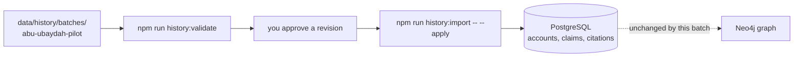

# Batch: Abu Ubaydah ibn al-Jarrah, Siyar entry 1

The pilot batch for [data quality and references](../../../../docs/data-quality-references.md).
It preserves al-Dhahabi's complete entry on Abu Ubaydah ibn al-Jarrah and extracts
25 claims from it. Nothing here is imported until you approve this revision.

- Batch definition: [batch.json](batch.json)
- Source pages: [accounts/abu-ubaydah-ibn-al-jarrah/](accounts/abu-ubaydah-ibn-al-jarrah/), 19 files, one per printed page

## What was read

Entry 1 of *سير أعلام النبلاء*, Risalah third edition (1405/1985), volume 1
edited by Hussein Asad under Shuayb al-Arnaut, read on Shamela. The entry runs
from printed page 5 to page 23, reader ids 1431 to 1449.

Both end pages are shared. Page 5 opens with the volume title and the basmala,
so the stored page starts at the entry's own first line. Page 23 continues into
entry 2 on Talha ibn Ubaydallah, so the stored page stops at the last line about
Abu Ubaydah and its notes stop before Talha's bibliography.

Each page keeps the author's text and the edition's footnotes separately, and
every paragraph carries an anchor such as `9-p7` that citations point at.

## Review status

Every claim is recorded as Not reviewed. Confidence is the editorial reading of
how the source states it, not a verdict you have given.

| Confidence | Claims |
| --- | --- |
| Well attested | 11 |
| Likely | 12 |
| Disputed | 2 |

## Findings that need your decision

1. **The full name in the app is shorter than the source.** The app holds
   `عامر بن عبد الله بن الجراح الفهري القرشي`. The entry gives the chain up to
   Adnan and adds `المكي`. The longer form is recorded as a claim; the profile
   value is unchanged until you decide.
2. **The Ten Promised Paradise title is not supported by this entry.** The text
   says the Prophet testified to him with paradise and named him the trustee of
   this nation, but the phrase used for that title never appears here. Talha's
   entry, immediately after, does use it. The title stays as it is; a different
   source is needed to keep it.
3. **Two death years compete.** Al-Fallas and others give 18 AH at age 58; Ibn
   Aidh alone reports 17 AH. Both are recorded as attributed, disputed claims,
   and the profile's death year stays unset.
4. **The migration to Abyssinia is contested in the text itself.** Ibn Ishaq and
   al-Waqidi report it; al-Dhahabi doubts he stayed long. Recorded as one
   disputed claim carrying both.
5. **His father is named only as the man he killed at Badr.** No person record
   exists for al-Jarrah, and this batch does not create one.

## What import would change

One source edition, one source account of 19 pages, 25 claims and their
citations. No person, title, battle or event row is edited, and no graph node or
relationship is created, so the graph layout does not need recomputing. The one
relationship claim, that he was a companion of the Prophet, records evidence for
an edge that already exists.

The transmission chains in the text mention many narrators. None of them becomes
a person or an edge.

## To approve

Approval permits publication. It does not say the content was checked: every
claim here stays Not reviewed, and readers see that status beside it. Approving
an unreviewed batch is the expected case, since evidence has to be visible
before anyone can review it.

Approval is recorded in `batch.json` against the revision
`npm run history:validate` prints for this directory. Any later edit to the
files changes that revision and needs approving again.

This batch was approved for publication on 2026-09-09 with all 25 claims Not
reviewed. The findings above remain open decisions.
