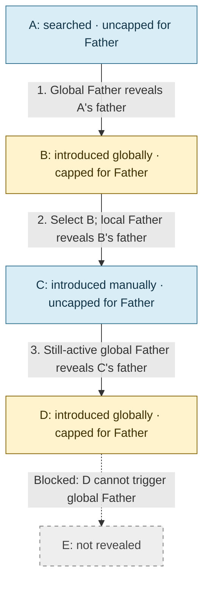

# Cap global relationship filters at one provenance-scoped hop

A relationship filter applied to the entire exploration both shows existing connections of its type between visible subjects and introduces one hop of new subjects for anyone visible who lacks theirs — for example, turning on Father reveals Muhammad's father and, independently, each of his visible wives' fathers. Left uncapped, a subject introduced this way would itself qualify to trigger the same filter, cascading through the entire dataset's paternal lines rather than stopping at one hop.

The cap is by provenance, not by counting: a subject introduced by filter F can never again trigger F's automatic introduction, for the lifetime of that exploration, including independent search or revelation and removal followed by reintroduction. Start over clears this history. The cap applies per relationship type, not globally — a subject introduced by Wives remains fully eligible to trigger Father. The cap only restricts the automatic global path; selecting a capped subject and using its own expansion choices (including full-depth Paternal lineage) is unrestricted, and an active global filter can pick up one hop from manually revealed subjects that have never acquired its cap. Manually revealing an already-capped subject does not clear the cap.

Considered and rejected: resetting the cap each time the filter is retriggered (off/on), which would let repeated toggling walk arbitrarily deep across the whole visible set. Rejected because the product already offers two dedicated ways to go deep — per-subject expansion for one branch, and Show full graph for everything — and a deepenable global filter blurs into "show me the whole cluster," undermining the exploration as a deliberate, bounded workspace.

## Capped and uncapped, with an example

A cap answers one question: **may this subject automatically introduce another
subject through this particular global filter?** It does not say whether the
subject is visible, selected, clickable, or manually expandable.

| State for global Father | Meaning |
| --- | --- |
| Uncapped | This subject has never been introduced by global Father during this exploration. If the filter is on, the subject can introduce its recorded father. |
| Capped | Global Father introduced this subject earlier in this exploration. It cannot automatically introduce its own father through that same global filter. |

Consider an illustrative recorded chain A → father B → father C → father D →
father E. These letters describe a test scenario, not additional historical
claims. Begin with A added by search and none of the other subjects present.

Arrows show revelation steps, not stored relationship directions. B → C requires
an explicit local action: global Father cannot make that step from capped B.

1. Turn on **global Father**. A is uncapped, so it introduces B. B becomes
   capped for Father. A remains uncapped: triggering a filter does not itself
   impose a cap.
2. Stop there automatically. B cannot introduce C through global Father, so
   the filter does not cascade through the whole chain.
3. Turn global Father off and on. This does not clear B's cap or reveal C.
4. Select B and use its **local Father** choice. This manually reveals C;
   B's cap does not restrict that action.
5. If global Father is still on, C can introduce D, provided C has never been
   introduced by global Father before. D becomes capped, so E is not revealed.
   One manual expansion can therefore be followed by one automatic step.

The cap is separate for each relationship type. A subject introduced by global
Wives is capped for Wives, but remains uncapped for Father unless global Father
also introduced it earlier. A cap does not hide an otherwise permitted
connection between subjects already present.

Searching for B later, or removing and reintroducing B, does not clear its
Father cap. Start over begins a new exploration and clears cap history. There
is no next-global-hop button; use local expansion or lineage actions to go
further deliberately.

These are agreed design rules. Implementation compliance is still pending the
[docs-first exploration review](../graph-exploration-review.md).
