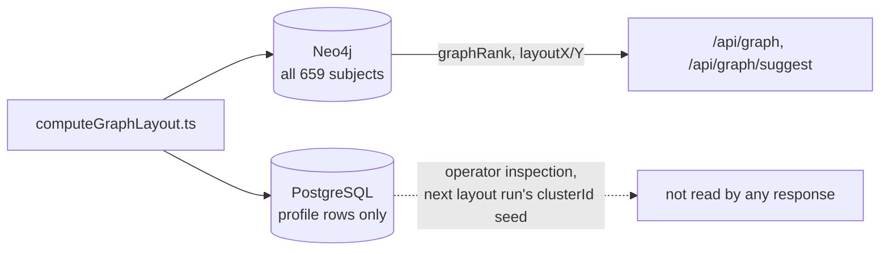

# Persist offline-computed subject properties to Neo4j

Every property computed offline over the graph and **read back by a response**
is written to Neo4j, on every subject it applies to. PostgreSQL may keep its
own copy for operator inspection, but Neo4j is the source responses read.

Neo4j is the only store with complete subject coverage. PostgreSQL holds
profile rows, and a [graph-only person](../../CONTEXT.md) has none -- 276 of
576 people at the time of writing. A derived property persisted only to
PostgreSQL therefore does not exist for them, and any feature reading it treats
those subjects as unranked or unplaced rather than as ordinary subjects.

Three properties reached this conclusion separately. `layoutX`/`layoutY` were
PostgreSQL-only until [graph layout](../graph-layout.md) moved them,
`nasabRank` until [graph-only people
search](../graph-only-people-search.md) did the same, and `graphRank` until
[subject search](../graph-subject-search.md), which also deleted
`nasabRank` outright once `graphRank` covered every kind. Each time the gap
surfaced as a feature quietly excluding graph-only subjects rather than as an
error. Recording the rule is meant to stop the fourth property from repeating it.

`clusterId` is the deliberate exception that shows where the boundary sits. It
is computed offline and persisted, but no response returns it: its only
consumer is the layout's own next run, which seeds cluster centres from it. A
property nothing reads back cannot exclude anyone, so it stays PostgreSQL-only.
The test is whether a response reads the property, not whether it was computed
offline.

The cost is duplication: two stores hold the same derived scalar, and a
compute-and-persist script has to write both and validate both. That is
accepted deliberately. The alternative -- creating PostgreSQL rows purely so
derived data has somewhere to live -- would invent profile records for people
about whom nothing is recorded, which
[ADR 0005](0005-use-a-precomputed-global-graph-map.md) already rejected for
coordinates.

This governs derived properties only. Authored data keeps its existing
direction: PostgreSQL is authoritative for titles, battles and events, which
are projected into Neo4j by the sync scripts, while person nodes are authored
in the graph seed.
