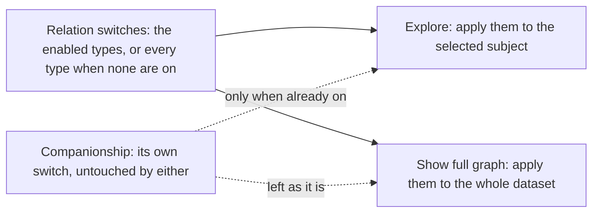

# Filter switches choose the relationship vocabulary

The relation switches in the Filters panel do two jobs. As global filters they
decide which connections are drawn across the exploration, which
[ADR 0001](0001-separate-expansion-from-connection-visibility.md) and
[ADR 0003](0003-cap-global-relationship-filters.md) describe. They are also the
list of relationship types the reader has said they care about, and two actions
now read them that way: **Explore** and **Show full graph**.

**Explore** expands the selected subject along the enabled types only. Turning
on Wives and nothing else and pressing Explore on the Prophet reveals his wives,
not his father, his uncles, and every battle he fought.

An empty switch set is not a restriction. Global filters start off, so treating
"none enabled" as "nothing to explore" would hide the panel's main action on
arrival and leave a reader with no way in. With nothing switched on, Explore
covers every type except companionship, and each switch the reader turns on
narrows it from there.

**Show full graph** turns the enabled set on as it reveals the dataset. Without
that, the whole graph arrives as subjects with no connections drawn between
them, since a connection needs either a contribution that revealed it or its
matching global filter.

Companionship is the exception both actions share, as
[the exploration rules](../graph-exploration-review.md) require: it joins
Explore only when its own switch is already on, and Show full graph leaves that
switch wherever the reader put it. One companion edge per pair times several
hundred companions would otherwise bury whatever the reader was looking at.

Opening a graph installs Explore's set for its subject without the reader
pressing it, alongside both lineage actions (rule 11 of
[the exploration rules](../graph-exploration-review.md)). The switches
still govern what Explore covers when the reader presses it later, and
companionship stays outside the seeded set exactly as it stays outside Explore.

Neither action changes a switch. Explore writes local expansions for the
selected subject; Show full graph writes the filters the reader can already see
in the panel. Both remain undoable with browser Back.

Considered and rejected: Explore expanding every relation on record, independent
of the switches. It reads as the more obvious meaning of "all", but it makes the
panel a lie. A reader who has switched Battles off still gets battles, and the
one control that should let them work through a subject a relation at a time
instead floods the view. The rules already settled the companionship half of
this, and applying the same principle to every type is what makes the switches
trustworthy.

This supersedes the local-versus-global independence in rule 1 of the
exploration rules as it applies to Explore. Rule 1 still governs the switches
themselves: a relationship choice in the Selected subject scope expands only
that subject and never touches the global filters.
