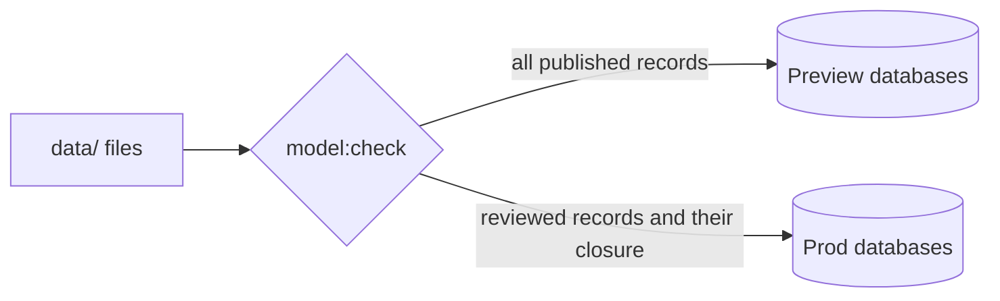

# Files are the authority, and prod holds only reviewed records

This supersedes the layout in ADR 0010 and keeps its authority rule: files under
`data/` can rebuild Namaq, and PostgreSQL and Neo4j are projections that are never
edited. The files are now organised by the work's own structure: page text per
witness, one file per Unit (a hadith, a tarjama, a commentary entry), and separate
folders for agents and identifications, traditions, review records and inference
records. The `data/catalog/` modules, the seeds and the old batches are archived
read-only at a `pre-model` tag and never projected.

Two environments are built from the same files. Preview holds every published
record and shows it with its status, reviewed or not. Prod holds a record only if
a review record exists for its current revision, together with the closure that
review covers. Prod's database therefore never contains an unreviewed record, and
`graph:layout` runs on each environment's own graph, so prod ranks are computed
over reviewed edges only.

We considered filtering at read time with one shared database, which is one query
bug away from showing unreviewed text on the public site. We also considered
keeping a separate store per environment edited by hand, which brings back the
drift between files and rows that ADR 0010 set out to end.

Consequences: a review is recorded once and reaches prod on the next projection.
Editing a reviewed record removes it from prod until it is reviewed again. A
change set is a pull request listing record ids, and `model:publish` makes its
records visible on preview. The detail is in
[the data-model plan](../plans/data-model/plan.md), sections 2.10 to 2.12.
