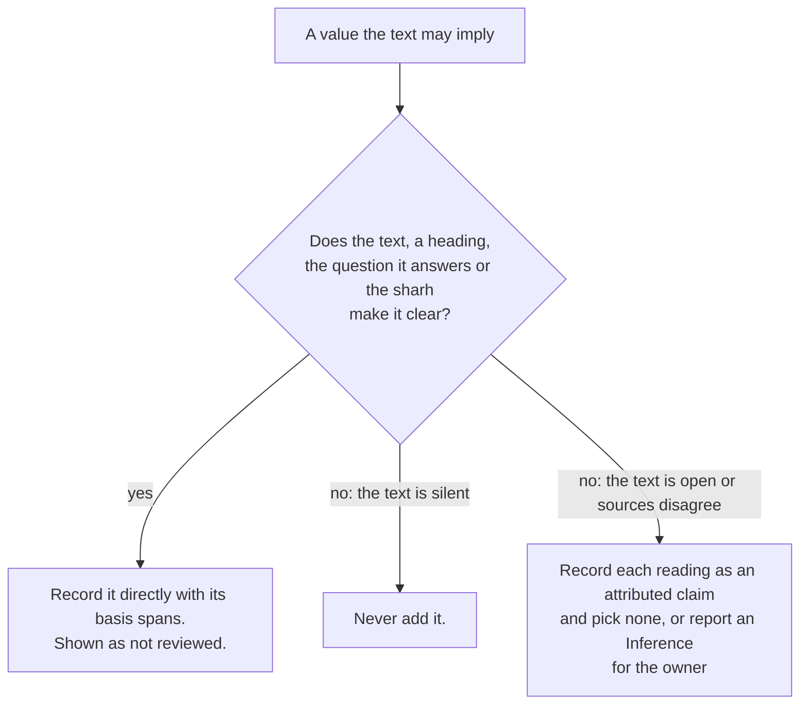

# Read the text, and stop where it is unclear

A rule in this project guards against a mistake. It is not a reason to stop
reading. Where the text, its chapter headings or its sharh make a reading clear,
an agent records that reading directly, with the spans that make it clear, and the
value shows as not yet reviewed like any other. An agent stops only where the text
is unclear or contradicts itself, where a change would alter the schema, or where
an action is irreversible or reaches outside the repository.

What counts as clear, with the hadith of Jibril as the example:

- A bare `قَالَ` that answers a question inside one scene belongs to the other
  party. The question turn and the chapter heading («سُؤَالِ جِبْرِيلَ النَّبِيَّ ﷺ…
  وَبَيَانِ النَّبِيِّ ﷺ لَهُ») are its basis. It is recorded as the speaker of the
  turn, with `speakerBasis`, and needs no approval.
- The «قَالَ» that follows a narrator's name belongs to the narrator, and a nested
  story's opening «قَالَ» belongs to the person relaying it.
- A commentator's statement that one report is another's («وَقَدْ أَخْرَجَهُ مُسْلِمٌ
  مِنْ حَدِيثِ عُمَرَ…») makes both one event. It is recorded as an `EventLink`
  attributed to that commentary, with the sentence as its basis.

The Inference file stays for what the text does not present: a participation that
is never stated, or a date placement between two events. Those need the owner's
approval, and an agent never writes it.

Every extraction must also be complete. The scenes, notes and fields of an entry
must rebuild its text word for word, and a test checks it. Nothing is trimmed to
make a reading fit, and a gap is shown as a gap.

We considered keeping every implied speaker as an Inference. It put a reading that
any reader of the hadith shares behind a per-turn approval, and the page showed
«speaker not stated» beside the Prophet's own answers. We also considered letting
agents infer freely. That would let them add knowledge the text does not present,
which the project has no expertise to review.

Consequences: plan sections 2.5a and 2.13 narrow the inference path to what the text
does not present, and `AGENTS.md` carries the rule for agents. The code follows: `Turn` gains
`speakerBasis`, `model:check` asks for it on a turn whose speaker the text does
not print, and the Jibril fixtures set it. Until then the fixtures name those
speakers without a basis. Whether the Siyar parsing targets the span-based model
or the catalog is a separate decision, still open.
