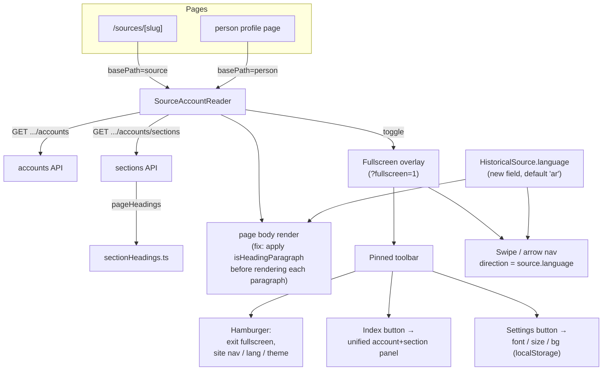

# Book reader — design handover

This is a handover for whoever implements the reader redesign next: what was
decided, why, and which files it touches. No code was written while producing
it. The decision behind it is [ADR 0016](adr/0016-a-reader-that-owns-the-whole-screen.md);
this doc is the implementation detail underneath it.

## Current state

`SourceAccountReader.tsx` (`src/components/people/SourceAccountReader.tsx`)
already reads one source page at a time, with book and page kept in the URL
(`?book=&page=`), shared between `/sources/[slug]` and person profiles via a
`basePath` prop. `SourceContents.tsx` (`src/components/sources/`) is a
separate collapsible table of contents — volumes, entries, sections — shown
outside reading mode. Both call into `src/lib/history/sourceAccounts.ts` and
`src/lib/history/sectionHeadings.ts` through a matching pair of API routes
under `src/app/api/sources/[slug]/accounts/...` and
`src/app/api/people/[slug]/accounts/...`.

The bracket bug traces to a gap between those two heading-aware paths.
`pageHeadings()` in `sectionHeadings.ts` (lines 16–23) already detects a
paragraph that is nothing but `[bracketed text]` and strips it — but only the
section-index API route calls it. The reader's own body render goes through a
separate `paragraphs()` helper (`SourceAccountReader.tsx`, lines 47–52) that
splits on blank lines and renders every paragraph as-is, heading or not. That
is why `[إسلام ضماد:]` prints literally at
`/sources/siyar-alam-al-nubala-risalah?book=cmubfb1gv0003078tmiuxqbvu&page=130`
— a missing render case, not bad data.

Nothing else this feature touches exists yet: no working auth (a `User`
model sits unused — no NextAuth, no session, no login UI), no bookmarks, no
reading-progress tracking, and no `language` or direction field anywhere on
`HistoricalSource` (`prisma/schema.prisma`, lines 117–139).

## What's changing

**Heading rendering.** The body render gets the same heading detection the
section index already has, so a bracketed paragraph becomes a styled heading
— brackets stripped — instead of literal text.

**Fullscreen.** An in-app immersive layout, not the browser's Fullscreen API:
`NavBar` and `Footer` hide, tracked by a URL flag (`?fullscreen=1`) alongside
the existing `?book=&page=`, so a shared or reloaded link reopens straight
into it at the right page.

**Toolbar.** A thin bar, always visible in fullscreen, holding three things:
a hamburger (borrowing the pattern and look of `GraphCanvas.tsx`'s own
hamburger) for exiting fullscreen and reaching site nav / language / theme —
the things opened rarely — and dedicated icon buttons for the index and for
settings, since those are used constantly while reading and shouldn't sit a
click deeper inside a menu.

**Navigation.** Swipe (and, on desktop, arrow keys) turns pages, in whichever
direction matches how the source's own script turns — read from the new
`language` field, not from the site's UI language. Phone gets swipe and
on-screen buttons only: no arrow keys, and no tap-to-turn edge zones, which
are too easy to trigger by accident while selecting text or tapping a
footnote.

**Pagination.** One `SourceAccountPage` row stays one reader page, always.
A larger font makes that page's card scroll internally instead of spilling
into a different page — the page number a citation points at never moves.

**Settings.** Font (Amiri, today's default, plus one alternative — a
Naskh-style or plain sans-serif pick, left to whoever implements this since
nothing beyond Amiri is wired up in `globals.css` yet), size in four discrete
steps (S/M/L/XL), and background as a small preset set (Light/Dark/Sepia)
rather than a free color picker. All three save to `localStorage`, per
device, independent of the site's own `next-themes` toggle.

**Index.** One panel, its own icon button, replacing the two `<select>`s at
`SourceAccountReader.tsx` lines 145–188. It has two tiers, and both already
exist in the data: pick an account — the same `accounts` list as today,
which already means "this book's chapters" on a source page and "this
person's chapters across works" on a person page, because a `SourceAccount`
is one subject's entry within one work — then pick a section within it, from
today's `sections` list. Fullscreen hides the surrounding page a reader would
otherwise use to reach another volume, so this panel needs both tiers, not
just the current account's sections.

**Data model.** `HistoricalSource` gains `language String @default("ar")`.
The reader's hardcoded `dir="rtl" lang="ar"` (`SourceAccountReader.tsx`,
lines 196 and 207) and the new swipe/arrow direction both read from it
instead.

## Component map

## Files to touch

- `src/components/people/SourceAccountReader.tsx` — the main rework:
  heading-aware paragraph rendering, fullscreen state, toolbar, settings
  wiring, swipe/keyboard navigation.
- `src/lib/history/sectionHeadings.ts` — reuse `pageHeadings()` for inline
  body rendering; today it's only called for the section index.
- New components: the unified index panel, the settings panel, the
  hamburger menu (can borrow styling from `src/components/graph/GraphCanvas.tsx`).
- `prisma/schema.prisma` — add `HistoricalSource.language`, plus a migration.
- `src/app/globals.css` — add the second font's `@font-face`/token next to
  the existing `--font-amiri`.

## Deferred

Bookmarks and reading-progress sync both wait on profiles, which don't exist
yet; the `localStorage` settings added here are a separate, local-only
concern and won't conflict with that later. Google/Apple/passkey login is out
of scope entirely — there's no auth system in the app to attach it to yet.
