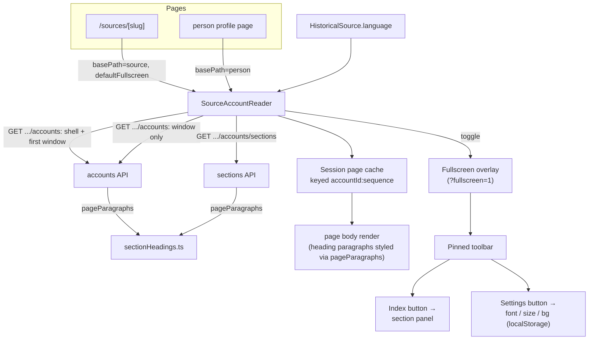

# Book reader — design handover

Status: **implemented**. This merges what were two documents — the original
redesign handover and the page-prefetch/fullscreen-default follow-up — into
one. The decision behind the fullscreen layout is
[ADR 0016](adr/0016-a-reader-that-owns-the-whole-screen.md). Treat
`SourceAccountReader.tsx` itself as current for line numbers and structure.

## What shipped

`SourceAccountReader.tsx` (`src/components/people/SourceAccountReader.tsx`)
reads one source page at a time, with book and page kept in the URL
(`?book=&page=`), shared between `/sources/[slug]` and person profiles via a
`basePath` prop. `SourceContents.tsx` (`src/components/sources/`) is a
separate collapsible table of contents — volumes, entries, sections — shown
outside reading mode. Both call into `src/lib/history/sourceAccounts.ts` and
`src/lib/history/sectionHeadings.ts` through a matching pair of API routes
under `src/app/api/sources/[slug]/accounts/...` and
`src/app/api/people/[slug]/accounts/...`.

**Heading rendering.** `pageParagraphs()` in `sectionHeadings.ts` is the one
place that detects a paragraph that is nothing but `[bracketed text]` (or a
Shamela numbered-entry title) and marks it as a heading; both the section
index and the reader's own body render call it, so a bracketed paragraph
renders as a styled heading with the brackets stripped, not as literal text.

**Fullscreen.** An in-app immersive layout, not the browser's Fullscreen API:
`NavBar` and `Footer` hide, tracked by a URL flag (`?fullscreen=1`) alongside
the existing `?book=&page=`, so a shared or reloaded link reopens straight
into it at the right page. `/sources/[slug]` opens fullscreen by default
(`defaultFullscreen` prop, computed as `param === '1' || (param !== '0' &&
defaultFullscreen)`); person-profile embeds
(`src/app/people/[slug]/page.tsx`) stay inline. Exiting on a source page
writes `fullscreen=0` and shows the inline view; `?fullscreen=1` still forces
fullscreen anywhere.

**Toolbar.** A thin bar, visible in fullscreen, with icon buttons for the
index, reading settings, and exiting fullscreen.

**Index.** One panel, its own icon button, replacing the old pair of
`<select>`s. It picks a section within the current account from the
`sections` list.

**Settings.** Font (Amiri or a system sans), size in four discrete steps
(S/M/L/XL), and background as a preset set (Light/Dark/Sepia). All three save
to `localStorage` under `namaq-reader-settings`, per device, independent of
the site's own `next-themes` toggle.

**Page prefetch.** The reader loads pages in windows of 5 around the current
page (2 behind, current, 2 ahead), keyed by `${accountId}:${sequence}` in a
session-lifetime cache cleared on book change; turning or swiping inside the
window shows the next page with no network wait. Reaching a page within 1 of
the window's edge fetches the next window in that direction in the
background; a jump (section index, URL, book change) starts a fresh window
at the target. The window clamps to `1..pageCount` at the ends and omits a
missing page rather than failing the whole window. The initial `GET
.../accounts` call returns the shell (`accounts`, `account`, `pageNumbers`)
plus the first window in one round trip; window-only calls
(`accountId + sequence` range, `readPages`/`pagesPayload` in
`src/lib/history/sourceAccounts.ts`) return page bodies only, capped at 9
pages per request. Out of scope: eviction, and prefetching across books.

**Data model.** `HistoricalSource.language` (`prisma/schema.prisma`) holds
the source's language, defaulting to `"ar"`; the reader reads `dir`/`lang`
from `account.source.language` instead of hardcoding Arabic.

## Component map

```mermaid
flowchart TD
    subgraph Pages
        SP["/sources/[slug]"]
        PP["person profile page"]
    end

    SP -->|basePath=source, defaultFullscreen| SAR[SourceAccountReader]
    PP -->|basePath=person| SAR

    SAR -->|GET .../accounts: shell + first window| API1[accounts API]
    SAR -->|GET .../accounts: window only| API1
    SAR -->|GET .../accounts/sections| API2[sections API]
    API1 & API2 -->|pageParagraphs| SH[sectionHeadings.ts]

    SAR --> CACHE["Session page cache
keyed accountId:sequence"]
    CACHE --> BODY["page body render
(heading paragraphs styled via pageParagraphs)"]

    SAR -->|toggle| FS["Fullscreen overlay
(?fullscreen=1)"]
    FS --> BAR["Pinned toolbar"]
    BAR --> IDX["Index button →
section panel"]
    BAR --> SET["Settings button →
font / size / bg (localStorage)"]

    HS["HistoricalSource.language"] --> SAR
```

## Deferred

Bookmarks and reading-progress sync both wait on accounts/profiles, which
don't exist yet ([user-accounts.md](plans/user-accounts.md)); the
`localStorage` settings here are a separate, local-only concern and won't
conflict with that later. Cache eviction and cross-book prefetch are also
deferred.
