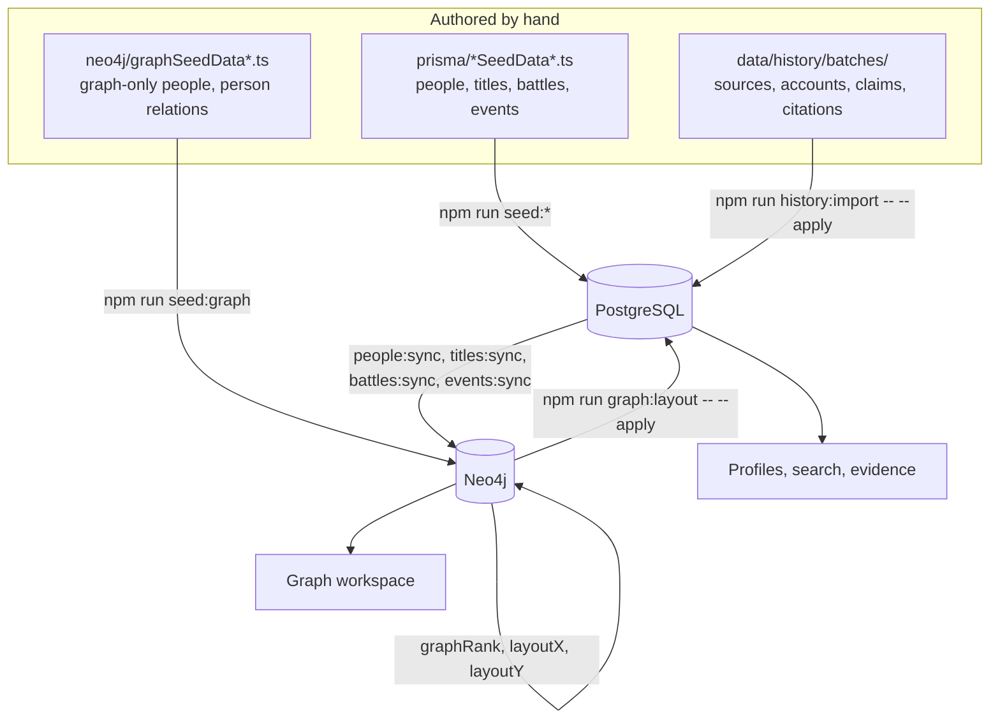
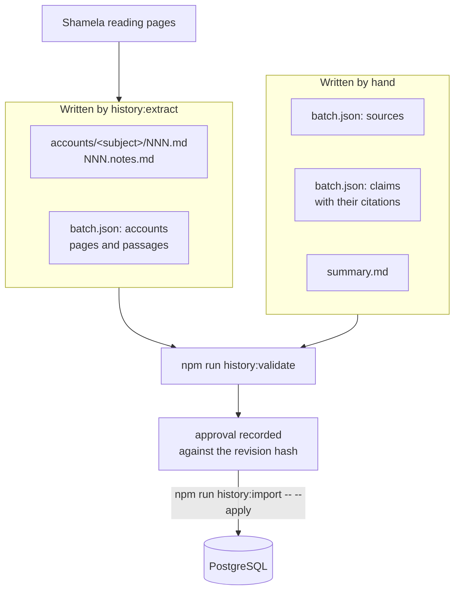

# How data reaches the app

Historical data currently has three hand-authored paths.

**Seed files** under `prisma/` hold the subjects themselves: people, titles,
battles, events, and the Qur'an tables. **History batches** under
`data/history/` hold the evidence about those subjects: source editions, the
complete source accounts, claims and their citations
([data quality and references](data-quality-references.md)). **Graph seed files** under
`neo4j/` hold graph-only people and person-to-person relationships.

The first two write into PostgreSQL. Most shared graph data is then derived from
PostgreSQL, while the graph seeds write their records directly to Neo4j. The
layout is computed from the graph and written back to both. Removing this split
authority is proposed in the
[authoritative data workflow](authoritative-data-workflow-plan.md).

## Seed files to PostgreSQL

Each subject kind has a data file and a script that loads it.

| Data | Script | Wired in |
| --- | --- | --- |
| People | `npm run seed:people` | `personSeedData3` through `personSeedData15` |
| Titles | `npm run seed:titles` | `titleSeedData` |
| Battles | `npm run seed:battles` | `battleSeedData` |
| Events | `npm run seed:events` | `eventSeedData` |

Seeds upsert by slug, so re-running one updates the rows it owns rather than
duplicating them.

### Two paths are dormant

`prisma/personSeedData.ts` is **not imported** by `prisma/personSeed.ts`. It
holds the earliest people, the Prophet and the Companions among them, which were
loaded once and have since been edited in the database directly. Editing that
file changes nothing until it is wired back in, and wiring it back in would
write its contents over whatever the database now holds.

Battle participations are **not seeded at all**. The block that loads them in
`prisma/personSeed.ts` is commented out, and the data it reads lives in the
dormant file above. Participation rows in PostgreSQL came from an earlier run
and nothing maintains them now.

Neither is a bug to fix in passing. Both mean a canonical edit to an affected
subject needs a deliberate writer, and that the file and the database can
disagree without anything noticing.

## History batches to PostgreSQL

A batch lives in `data/history/batches/<batch>/`:

| Path | Holds |
| --- | --- |
| `batch.json` | Sources, accounts and claims |
| `accounts/<subject>/NNN.md` | One printed page of the work's own text |
| `accounts/<subject>/NNN.notes.md` | That page's editorial footnotes |
| `summary.md` | The review summary, linking to the files above |

The page files carry the author's text and the editor's notes separately so each
stays attributable to whoever wrote it. Together with `batch.json` they hash to a
revision, which is what approval is recorded against.

### What batch.json holds

Six record types, defined in `src/lib/history/batchSchema.ts`. Rows below name
the required fields; every record also accepts optional bibliographic and
locator fields.

| Record | Identifies | Required fields |
| --- | --- | --- |
| Source | One edition of one work | `slug`, `title` |
| Account | One subject's entry in one source | `sourceSlug`, `subjectKind`, `subjectSlug`, `extractionUrl`, `accessedAt`, `pages` |
| Page | One printed page of an account | `sequence`, `bodyFile` |
| Passage | One paragraph a citation can target | `anchor`, `excerpt` |
| Claim | One assertion about a subject | `key`, `subjectKind`, `subjectSlug`, `assertion`, `citations` |
| Citation | Where a claim is supported | `sourceSlug`, `extractionUrl`, `excerptArabic`, `accessedAt` |

A source is the work and edition, not the site hosting it, so two editions of the
same book are two sources. A claim carries `field` when it supports a recorded
profile value, or `relationshipType` with a related subject when it supports an
edge; a claim with neither is a biographical statement. A citation's
`passageAnchor` must name a passage some page in the batch declares, which is
what makes a citation link land on the cited text.

### Extraction

`npm run history:extract` reads Shamela's reading pages and writes one account
into an existing batch. It takes `--book`, `--from`, `--to`, `--out`,
`--subject-slug` and `--source-slug`, and optionally `--subject-kind`,
`--start-anchor`, `--end-anchor`, `--notes-end-marker` and `--accessed-at`.

From each page it takes the work's text out of the `.nass` element as anchored
paragraphs, splits at the horizontal rule so the edition's footnotes land in the
notes file, and reads the printed page number from the document title. The first
and last pages of an entry are the only ones shared with a neighbouring entry, so
the anchor options trim the body at either end and `--notes-end-marker` trims the
notes, which run together in one block and cannot be cut by anchor.

The extractor stops at the account. Sources, claims, citations, confidence and
review status are authored by hand, and the batch must already exist with a
source whose slug matches, so extraction cannot start a batch from nothing.

### Validate, approve, import

`npm run history:validate` checks that every citation names a declared source,
carries a working extraction link and an Arabic excerpt, and points at a passage
some page declares. It reports every problem it finds rather than stopping at the
first.

`npm run history:import` dry-runs, and `-- --apply` writes, but only when the
files still hash to the revision recorded as approved. Any edit after approval
changes the hash and needs approving again. Approval permits publication and says
nothing about whether the content was checked, which is what each claim's review
status records ([review independent of visibility](adr/0008-separate-review-from-visibility.md)).

Writes upsert on an authoring key, so a partly failed import can be retried
without duplicating anything.

Files are the source of truth here. The database holds a copy: change the files
and re-import, never edit the evidence tables directly.

## PostgreSQL to Neo4j

The sync scripts are one-way and non-destructive. They `MERGE` by slug, update
the properties PostgreSQL owns, and never delete a node, a relationship, or a
graph-only property. Each runs as a report first and writes only with `--apply`.

- `npm run people:sync` — shared person identity fields
  ([details](canonical-people-pipeline.md))
- `npm run titles:sync` — `:Title` nodes and `HOLDS_TITLE`
- `npm run battles:sync` — `:Battle` nodes and `PARTICIPATED_IN`, carrying each
  participant's status
- `npm run events:sync` — `:Event` nodes, `INVOLVED_IN`, and `PART_OF` to a
  linked battle
- `npm run people:sync-companions` — `COMPANION_OF` edges to the Prophet

Evidence does not sync. Claims and citations stay in PostgreSQL and no citation
becomes a node or an edge.

## Layout

`npm run graph:layout -- --apply` computes prominence, community and position
over the whole unified graph and writes them to both stores. Any change to graph
structure shifts them, so run it after seeding new subjects or relationships.
Importing evidence alone does not change graph structure and does not require it.

## Applying a canonical change today

A change to a person's own fields, a participation, or an event goes through
whichever path is live for it.

1. Author the change in the seed file that owns the subject, so the file records
   what is true even where the seed no longer runs.
2. Apply it. An active file needs its seed script. A subject in the dormant file
   needs a targeted write, because running the seed is not an option.
3. Sync the affected kind to Neo4j, then re-run the layout if graph structure
   changed.
4. If evidence supports the change, it belongs in a history batch, and the batch
   is what a reader sees as the reason.
