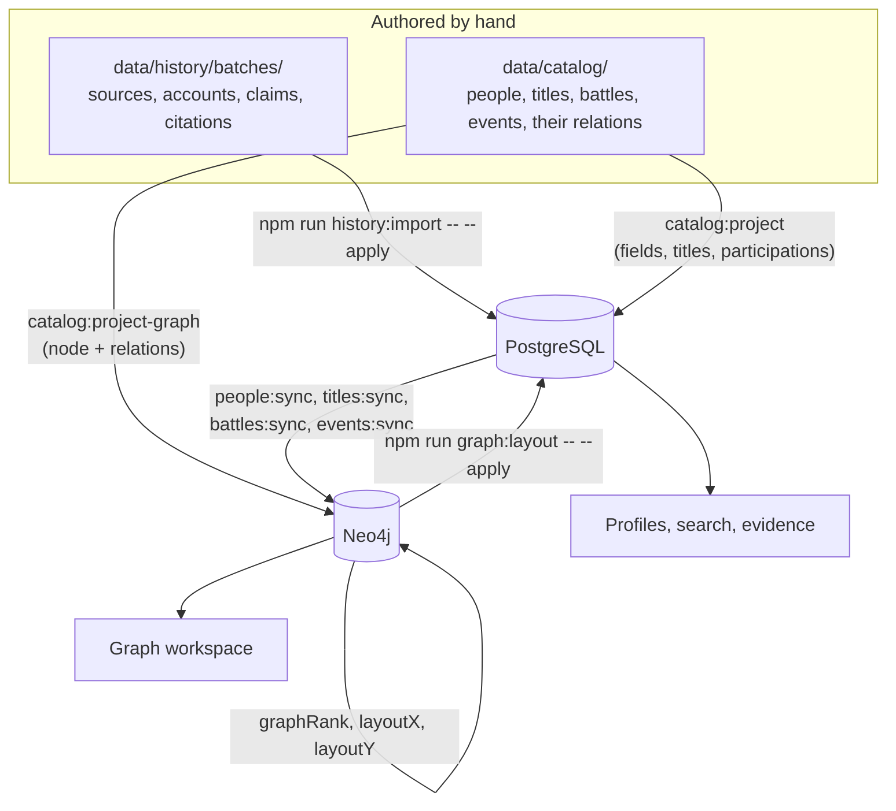
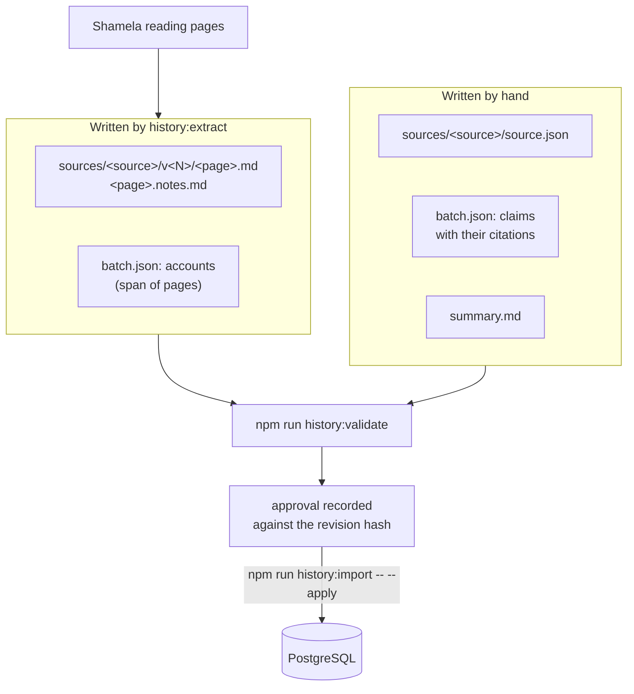

# How data reaches the app

Historical data has two hand-authored paths today; two more are retired.

**The catalog** under `data/catalog/` holds every subject — people, titles,
battles, events, utterances — declaratively, with each field's evidence
cited or marked `legacy-unreviewed`. **History batches** under
`data/history/` hold the evidence about those subjects: source editions, the
complete source accounts, claims and their citations. **Seed files** under
`prisma/` once held the subjects themselves by hand, unevidenced; every one
of them (people, titles, battles, events, and the Qur'an surah/ayah tables)
is migrated into the catalog and deleted, leaving `prisma/` with nothing but
`schema.prisma` and its migrations. **Graph seed files** under `neo4j/` once
held a fourth path: graph-only people and person-to-person relationships.
Both retired paths are gone outright, not stubbed — see
[The graph seeds are retired](#the-graph-seeds-are-retired) below.

The first two write into PostgreSQL. A catalog-owned person's Neo4j node and
relations come from the catalog directly: `catalog:project-graph` merges the
node whether or not the person has a PostgreSQL row, and writes every relation
the catalog declares. The layout is computed from the graph and written back
to both. The split authority this used to describe — profiles, titles,
battles and events declared in `prisma/*SeedData*.ts` — is gone: no
`prisma/` file authors any of them any more; see
[Removing split authority](#removing-split-authority) below.

```mermaid
flowchart TB
  subgraph authoring["Authored by hand"]
    batches["data/history/batches/<br/>sources, accounts, claims, citations"]
    catalog["data/catalog/<br/>people, titles, battles, events, their relations"]
  end

  batches -->|"npm run history:import -- --apply"| pg
  catalog -->|"catalog:project<br/>(fields, titles, participations)"| pg[("PostgreSQL")]
  catalog -->|"catalog:project-graph<br/>(node + relations)"| neo

  pg -->|"people:sync, titles:sync,<br/>battles:sync, events:sync"| neo[("Neo4j")]
  neo -->|"npm run graph:layout -- --apply"| pg
  neo -->|"graphRank, layoutX, layoutY"| neo

  pg --> app["Profiles, search, evidence"]
  neo --> workspace["Graph workspace"]
```

## The catalog to PostgreSQL

Every subject kind — people, titles, battles, events — is created or updated
by `catalog:project` from `data/catalog/`, the way it always did for a
subject no seed declared (see "The files decide, subject by subject" below)
— that is now everyone, since no seed file exists any more.

Battle participations were never seeded through a script at all: the data a
seed would have read is what `data/catalog/battles/*.ts`'s participants now
carry, promoted to a cited claim or left `legacy-unreviewed`.

### The files decide, subject by subject

`catalog:project` and `catalog:project-graph` make the stores match the
catalog for every subject: values are overwritten, and a title, Qur'an link,
participation or relation a store holds and the catalog does not is removed.
This was additive rather than total for as long as a seed file still
described a given subject — the seed was that subject's author until its
entry was deleted — but no seed file describes anyone any more, so every
subject is total now.

### Three subjects were the first to leave the seeds entirely

Abu Ubaydah ibn al-Jarrah, Talhah ibn Ubaydullah and al-Zubayr ibn al-Awwam
were the first people authored in the catalog instead of a seed, Qur'an links
included, before any `prisma/personSeedData*.ts` migration started: their
catalog module was total, not additive, from the day it was written.
`catalog:project` creates their PostgreSQL row outright, and `people:sync`
mirrors it to Neo4j — the same total authorship every person now has, seed
files having caught up rather than these three being an exception any more.

### Titles have no seed of their own

A title has no existence apart from the people who hold it, so there is no
`prisma/titleSeedData.ts` and no `data/catalog/titles.ts` either: a person
module's `CatalogTitleAssignment` (`title`, `name`, `nameTransliterated`,
`claims`) carries the display name right alongside the assignment.
`catalog:project` upserts the `Title` row the first time it sees a slug —
the same operation whether the row already exists or not, so a typo just
becomes a new row rather than a rejected reference. What still catches a
typo: `catalog:validate` rejects two people who declare the same title slug
with a different `name` or `nameTransliterated`, since a title's spelling
cannot legitimately differ depending on who holds it.

### Graph-only catalog people

A catalog person can carry `hasProfile: false`: someone the sources only name
inside a lineage, with nothing to fill a profile page. `catalog:project` skips
them, since it only creates a PostgreSQL row when `hasProfile` is true.
`catalog:project-graph` does not skip them — it merges every catalog-owned
person's Neo4j node directly from the catalog (`slug`, `name`, `fullName`,
`nameTransliterated`), profile or not, before writing relations. So a
`hasProfile: false` person gets a node and cited relations with no PostgreSQL
row at all, and without `people:sync` ever touching them.

The nasab from Hashim ibn Abd Manaf down to Adnan
(`data/catalog/people/hashim-ibn-abd-manaf.ts` and the ancestors it chains to)
is authored this way, each on the one `prophet/lineage` citation that names the
whole chain. Adnan has no father to cite a `SON` relation to, so his module
carries the `FATHER` side of the edge to his own son instead.

### The graph seeds are retired

`neo4j/graphSeedData2.ts` through `graphSeedData14.ts` held every graph-only
person and person-to-person relationship the app has — nasab chains, in-laws,
milk kinship, pact-brotherhoods, the lot, across every companion's family tree,
not only the handful this doc used to call out by name. All of it is deleted.
Every node those files created and every relationship they declared is now a
catalog module or a relation on one, `catalog:project-graph`'s node-merge and
relation-write standing in for what `npm run seed:graph` used to do.
`neo4j/graphSeedData.ts`, `neo4j/graphSeed.ts` and `scripts/people/
activeSeedData.ts` are deleted outright along with it — nothing reads a
graph-seed file any more, including the live integrity test in
`src/lib/graphIntegrity.live.test.ts`, which now compares Neo4j against
`catalogRelations()` alone. `neo4j/seedRelations.ts` stays: despite the name,
`findSeedRelationDrift` and `parseSeedRelations` are generic Cypher-parsing
and drift-comparison helpers with no seed data of their own, and
`catalog:project-graph` still uses them to compare the catalog against what's
deployed.

Where a batch already cites the specific link (the Prophet's own line, on
`prophet/lineage`; a handful of others with their own citations), the module
cites it. Everywhere else — the overwhelming majority, every other companion's
ancestor chain and in-law edge, carried unchanged from the seed's own uncited
values — it carries `legacyUnreviewed`, same as any other value a retired seed
held with no batch behind it. A person with no relation of their own (only ever
the target of someone else's, e.g. a childless ancestor at the top of a branch)
still gets a bare module restating that same relation from their own side, so
their node has an author too — `data/catalog/people/khansa-ibn-sinan.ts` is one
of many examples.

Many of these people already had real PostgreSQL rows besides — leftover from
before the seed files that declared them went dormant — which the catalog
neither relies on nor disturbs; `catalog:project` still won't create a row for
`hasProfile: false` where one doesn't already exist.

**One duplicate surfaced and was fixed in the process**: `graphSeedData3.ts`
had created a second, bare Neo4j node (`zaid-ibn-amr`) for the same person as
the already-catalogued `zayd-ibn-amr-ibn-nufayl`, each separately declared as
Sa'id ibn Zayd's father. The one piece of real information the duplicate held
(his edge to his own father) moved onto the correct module; the duplicate node
itself, left with no relationships once its stale edges were dropped, was
deleted from Neo4j directly.

## History batches to PostgreSQL

The source text and a batch's own evidence are two separate authored trees
now ([source-page-store.md](plans/source-page-store.md);
[ADR 0018](adr/0018-a-page-belongs-to-the-edition.md)):

| Path | Holds |
| --- | --- |
| `data/history/sources/<source>/source.json` | The edition, once: title, editor, digital host, and every volume's `number` and printed-page extent |
| `data/history/sources/<source>/v<N>/<printedPage>.md` | One printed page of the work's own text, referenced by every batch whose entry touches it |
| `data/history/sources/<source>/v<N>/<printedPage>.notes.md` | That page's editorial footnotes |
| `data/history/batches/<batch>/batch.json` | Accounts (spans of pages) and claims with their citations |
| `data/history/batches/<batch>/summary.md` | The review summary |

A batch no longer carries page text or its own copy of the source's
bibliographic fields — it names a page by volume and printed page, and
`loadBatch` reads the manifest and the pages a batch's accounts actually
name. `batchRevision` hashes only the batch's own content (its accounts and
claims), not the store: a page is published on its own, independent of any
batch that cites it.

### What batch.json holds

Four record types, defined in `src/lib/history/batchSchema.ts`. Rows below
name the required fields; every record also accepts optional bibliographic
and locator fields.

| Record | Identifies | Required fields |
| --- | --- | --- |
| Account | One subject's entry in one source | `sourceSlug`, `subjectKind`, `subjectSlug`, `extractionUrl`, `accessedAt`, `pages` |
| Page | One printed page the account's run covers | `sequence`, `printedPage` |
| Claim | One assertion about a subject | `key`, `subjectKind`, `subjectSlug`, `assertion`, `citations` |
| Citation | Where a claim is supported | `sourceSlug`, `extractionUrl`, `excerptArabic`, `accessedAt` |

A claim carries `field` when it supports a recorded profile value, or
`relationshipType` with a related subject when it supports an edge; a claim
with neither is a biographical statement. A citation's `passageAnchor` names
`<volume>/<printedPage>-p<n>`, the *n*th paragraph of that store page —
derived from the page's own paragraph order, never declared. An account
whose entry crosses a volume names the volume per page (`23-p9` in Talhah's
case became `4/23-p17` once the anchor carried its real volume); every other
page takes its account's own `volumeNumber`.

### Known gap: undetected partial pages

A store page can silently hold only one entry's half of a printed page that
carries two. This happens because the store was originally seeded out of
each batch's own account pages rather than from the printed page itself, so
a page sitting between two entries kept only whichever entry's batch created
it. `history:validate` does not catch this — it range-checks that an anchor
names a paragraph that exists, not that the stored page is the complete
printed page, so a page missing its neighbour's half validates clean.

Seven such pages surfaced in the batches landed 2026-10-01 — five held only
half their text (`v4/320`, `v4/321`, `v4/324`, `v4/330`, `v4/334`) and two
were absent from the store entirely (`v4/322`, `v4/323`) — each found only
because the entry being extracted happened to touch it, not by any
systematic check. A sweep of the whole store for pages that are a strict
prefix of their Shamela original, to find the rest, is still owed.

### Extraction

`npm run history:extract` reads Shamela's reading pages and writes one
account's page run into the store, then adds the account to an existing
batch. It takes `--book`, `--from`, `--to`, `--out`, `--subject-slug`,
`--source-slug` and `--volume`, and optionally `--subject-kind`,
`--start-anchor`, `--end-anchor`, `--notes-start-marker`, `--notes-end-marker`
and `--accessed-at`.

From each page it takes the work's text out of the `.nass` element as anchored
paragraphs, splits at the horizontal rule so the edition's footnotes land in the
notes file, and reads the printed page number from the document title. The first
and last pages of an entry are the only ones shared with a neighbouring entry, so
the anchor options trim the body at either end and the notes markers trim the
notes, which run together in one block and cannot be cut by anchor:
`--notes-start-marker` drops a preceding entry's notes, `--notes-end-marker` a
following one's. If the store already holds a page (another entry claimed it
first), the extractor leaves it alone and logs that the two need merging by
hand rather than overwriting one entry's text with the other's.

The extractor stops at the account. The source manifest, claims, citations,
confidence and review status are authored by hand, and the batch must already
exist with an account whose `sourceSlug` matches, so extraction cannot start
a batch from nothing.

```mermaid
flowchart TB
  shamela["Shamela reading pages"]
  subgraph extracted["Written by history:extract"]
    md["sources/&lt;source&gt;/v&lt;N&gt;/&lt;page&gt;.md<br/>&lt;page&gt;.notes.md"]
    accounts["batch.json: accounts<br/>(span of pages)"]
  end
  subgraph byhand["Written by hand"]
    manifest["sources/&lt;source&gt;/source.json"]
    claims["batch.json: claims<br/>with their citations"]
    summary["summary.md"]
  end

  shamela --> extracted
  extracted --> validate["npm run history:validate"]
  byhand --> validate
  validate --> approval["approval recorded<br/>against the revision hash"]
  approval -->|"npm run history:import -- --apply"| pg[("PostgreSQL")]
```

### Validate, approve, import

`npm run history:validate` checks that every citation names a declared source,
carries a working extraction link and an Arabic excerpt, and points at a passage
some page declares. It reports every problem it finds rather than stopping at the
first.

`npm run history:import` dry-runs, and `-- --apply` writes, but only when the
files still hash to the revision recorded as approved. Any edit after approval
changes the hash and needs approving again. Approval permits publication and says
nothing about whether the content was checked, which is what each claim's review
status records ([review independent of visibility](adr/0008-separate-review-from-visibility.md)).

Writes upsert on an authoring key, so a partly failed import can be retried
without duplicating anything.

Files are the source of truth here. The database holds a copy: change the files
and re-import, never edit the evidence tables directly.

### Authoring a claim

A claim is authored only when it backs a value the model holds today: a
profile field, a title assignment, a participation, an event link, or a
person relation. `npm run history:validate` rejects a claim naming neither a
field nor a relationship, since the complete entry is already stored page by
page with anchored paragraphs — a claim backing nothing is a second copy of
text, not evidence a reader can check a value against. A statement the model
has no shape for stays in the pages until the model grows one.

One citation record represents one meaningful selection from one source
account, not one page or extracted paragraph. Join sentence fragments split
by pagination, layout or footnotes, and use a page range when the selection
crosses printed pages; mark an omitted interval with an ellipsis. Prefer the
shortest complete sentence or self-contained clause that proves the value,
never stopping mid-word or mid-phrase, and omit repetition or material that
adds no support. Keep separate citations for independent or competing
evidence. Profile citations link to the corresponding page in Namaq's own
source reader; the reader page links to the digital host after the editor's
footnotes, so repeating the host link beside every citation adds nothing.

Competing accounts are kept as separate attributed claims only where the
model holds the value they compete over, such as two reported death years. A
disagreement about something the app does not record stays in the source
pages. Preserve complete transmission chains in the source text, but do not
create graph nodes or edges for people mentioned only as narrators.

### Review status

Each claim carries one of three review statuses: Not reviewed, In review, or
Reviewed. Legacy information with no review record starts Not reviewed.
Recorded data stays public regardless of its status — review status is not a
visibility gate ([review independent of visibility](adr/0008-separate-review-from-visibility.md)).

Publishing and reviewing are two separate actions and neither implies the
other. Approving for publication (the previous section) records the current
revision in the batch's approval block and permits import; it says nothing
about whether anyone read the content. Marking reviewed sets a claim's
review status, one claim at a time, after comparing the assertion against
the passage it cites — only an explicit instruction to "mark this batch as
reviewed" does this, via `npm run history:review -- <batch dir>` (dry run)
and `-- --apply`. Reading the batch, discussing corrections, or approving and
importing it does not imply that instruction. A published batch whose claims
are all Not reviewed is an honest state.

### Where the existing seed data stands

The people, battle and event seeds under `prisma/` and `neo4j/` were
extracted from Siyar A'lam al-Nubala' by an earlier agent, without citations,
passage anchors or edition metadata. They are mostly correct and evidentially
worthless: the values are probably what the book says, and nothing in the
repository shows where. That makes them a checklist, not a source — an agent
authoring a catalog entry reads the seed to learn which subjects exist and
which fields a subject is claimed to have, then looks for each of them in
the source.

A value carried into the catalog that no batch supports yet is marked
`legacy-unreviewed`: in use, with its evidence owed, which is a normal state
and not a defect. A batch covering a subject visits every legacy value on it
and resolves each one of three ways: promoted to a cited claim, left legacy
because the entry is silent, or flagged as a contradiction in `summary.md` —
two extractions from one book disagreeing means one misread, so it is
reported rather than silently overwritten. `npm run catalog:ledger` lists
every value whose evidence is owed; `-- --batch <dir>` narrows it to the
subjects a batch speaks about.

### Companion scope

الصحابة are the only subjects in scope; التابعون and later generations wait
until the app carries what the Companions already give it — the data model,
graph usage, profile, search, timeline, and battle visualisation — because
every generation added multiplies whatever the model still gets wrong.

This boundary is Ibn Hajar's, not al-Dhahabi's. In تقريب التهذيب الصحابة are
tabaqa 1 and كبار التابعين tabaqa 2, cut by whom a narrator actually met. The
Siyar's الطبقة الأولى is a death cohort instead, so it runs through the
Companions and on into the senior Tabi'un while still calling itself the
first tabaqa. Following the book's own order therefore walks out of scope
twice, and the Companion entries are not one contiguous run:

| Shamela page | section | entries | in scope |
| --- | --- | --- | --- |
| 1431 | الطبقة الأولى — الصحابة (v1) | 97 | yes |
| 1985 | تابع: الصحابة (v2) | 61 | yes |
| 2300 | فصل في بقية كبراء الصحابة | 65 | yes |
| 2614 | تابع: الصحابة (v3) | 38 | yes |
| 2806 | ومن بقايا صغار الصحابة | 6 | yes |
| 2849 | ومن صغار الصحابة | 54 | yes |
| 3084 | كبار التابعين | 45 | mostly — see below |
| 3158 | تابع: الطبقة الأولى - الصحابة (v4) | 35 | yes |
| 3263 | بقية الطبقة الأولى من كبراء التابعين | 71 | no |

About 356 entries are in scope and 116 outside it before contested cases are
taken in; الطبقة الثانية opens at page 3440 and ends the first tabaqa.

**The skip is by person, not by block, and a contested صحبة is taken in
rather than left out** — نزداد خيراً بمعرفة الرجال. The two costs are not
equal: including someone another work places outside the Companions costs a
subject whose status is recorded honestly (the batch's `summary.md` states
who holds what); excluding a real Companion costs a silent hole — nothing
downstream points at a subject that was never authored.

The 3084 run is where this bites, and al-Dhahabi supplies part of the signal
himself. He heads a stretch of it وممن أدرك زمان النبوة at page 3112, and
several entries on both sides of that heading are counted صحابة elsewhere —
محمود بن لبيد before it, ربيعة بن عباد, أبو أمامة بن سهل بن حنيف, محمود بن
الربيع and يوسف بن عبد الله بن سلام after it. How far the heading governs is
not something the table of contents settles; the pages have to be read. The
rest of that run — كعب الأحبار, زياد بن أبيه, المختار, عبيد الله بن زياد —
is nobody's contested Companion and stays out.

Settling a contest properly wants الإصابة, which sorts its entries by exactly
this question and is why تمييز الصحابة is in its title. It is not extracted,
so until it is, record the contest rather than resolve it.

Which generation a person belongs to is a fact about the person, not about
the section that supplied their entry, so it does not belong in the
extraction order where it currently sits. Modelling it as a cited value, the
way تقريب التهذيب carries a tabaqa per narrator, is open and not decided.

### Eligible historical works

Use historical works as evidence: البداية والنهاية, الكامل في التاريخ,
المنتظم في تاريخ الملوك والأمم, تاريخ الخلفاء, تهذيب الكمال في أسماء الرجال,
حلية الأولياء وطبقات الأصفياء, and سير أعلام النبلاء. For Companions, four
more are eligible: the three صحابة dictionaries الإصابة في تمييز الصحابة,
الاستيعاب في معرفة الأصحاب and أسد الغابة في معرفة الصحابة, and the early
الطبقات الكبرى لابن سعد. The Risalah editors cite all four throughout their
footnotes, which is the practical way into them: where a note sends you, that
book has something the Siyar left out. Distinguish the work and consulted
edition from the website hosting it.

Eligible is not in use: no fact needs all eleven, and every batch today draws
on سير أعلام النبلاء alone. A second book enters by becoming a source account
with its own extracted pages, anchors and citations, never by being consulted
behind a Siyar citation.

Extraction host: Shamela (`shamela.ws`), verified to retain editorial
footnotes. A source is the work and edition, not the site hosting it — check
a book's edition card before merging records on publisher alone; two
printings of the same title can differ.

## PostgreSQL to Neo4j

The sync scripts are one-way and non-destructive. They `MERGE` by slug, update
the properties PostgreSQL owns, and never delete a node, a relationship, or a
graph-only property. Each runs as a report first and writes only with `--apply`.

- `npm run people:sync` — shared person identity fields. PostgreSQL
  `Person.slug` is the canonical identity for a person with a profile page,
  and Neo4j `:Person.slug` is the same identity in the relationship graph.
  The non-mutating report distinguishes profiles missing from Neo4j, property
  mismatches (`name`, `fullName`, or `nameTransliterated` differing for the
  same slug), and graph-only people — valid people such as ancestors with no
  profile page yet, reported but never treated as errors or removed. `npm run
  people:validate` runs the same checks in strict mode, failing CI on a
  missing graph node, a conflicting shared field, or invalid slug/name data.
  A `null` optional profile property is not used to clear an existing Neo4j
  value, so importing incomplete profile data cannot erase graph enrichment.
  The pipeline does not create PostgreSQL profiles for graph-only people,
  resolve renamed slugs, or decide which historical spelling is correct —
  those are editorial decisions to review before automating.
- `npm run titles:sync` — `:Title` nodes and `HOLDS_TITLE`
- `npm run battles:sync` — `:Battle` nodes and the roster relations
  `PARTICIPATED_IN` and `ABSENT_FROM`, carrying each participant's status and
  summary ([the model](battle-participation-model.md))
- `npm run events:sync` — `:Event` nodes, `INVOLVED_IN`, and `PART_OF` to a
  linked battle
- `npm run people:sync-companions` — `COMPANION_OF` edges to the Prophet

Evidence does not sync. Claims and citations stay in PostgreSQL and no citation
becomes a node or an edge.

## Layout

`npm run graph:layout -- --apply` computes prominence, community and position
over the whole unified graph and writes them to both stores. Any change to graph
structure shifts them, so run it after seeding new subjects or relationships.
Importing evidence alone does not change graph structure and does not require it.

## Applying a canonical change today

A change to a person's own fields, a title, a participation, a battle, or an
event goes through the catalog, the only path there is now.

1. Author the change in the subject's `data/catalog/` module (or a new one),
   citing a batch claim where evidence supports it and `legacy-unreviewed`
   otherwise.
2. Run `catalog:validate`, then `catalog:project` and `catalog:project-graph`
   as dry runs before `--apply`, to see exactly what will be written.
3. Sync the affected kind to Neo4j if the change didn't already reach it via
   `catalog:project-graph`, then re-run the layout if graph structure changed.
4. If evidence supports the change, it belongs in a history batch, and the batch
   is what a reader sees as the reason.

## Removing split authority

[ADR 0010](adr/0010-author-historical-data-under-data.md) makes `data/` the
only authoring source for historical subjects, relationships, and evidence —
seed code, PostgreSQL, Neo4j and layout values are derived projections, never
independent facts. `data/catalog/` holds every person, title, battle and
event as declarative TypeScript modules (`kind`, `slug`, and per-field
`claims` or the `legacy-unreviewed` marker — see "The files decide, subject
by subject" above), validated by `npm run catalog:validate` and written to
the stores by `catalog:project` / `catalog:project-graph`. `npm run
catalog:ledger` reports every value whose evidence is still owed.

What the ADR calls for and this doesn't yet do:

- **Explicit tombstones** ([ADR 0012](adr/0012-require-explicit-catalog-tombstones.md)).
  Deleting a
  catalog module today is an omission, not a recorded, approved removal — there
  is no `data/catalog/tombstones/` mechanism, so `catalog:project` cannot yet
  tell an accidental omission from an intended deletion.
- **A hashed batch-review workflow spanning evidence and catalog.** Every seed
  path is retired now (see [The graph seeds are retired](#the-graph-seeds-are-retired)
  above and "Three subjects were the first to leave the seeds entirely"
  above), each field carried as `legacy-unreviewed` where no batch has cited
  it yet. Every subject is catalog-owned outright.
- **One evidence role per citation** ([ADR 0011](adr/0011-classify-the-role-of-cited-evidence.md):
  direct evidence, transmitted report, synthesis, or editorial analysis) —
  decided, not built.
- Person-to-person relationships were already written straight to Neo4j from
  the catalog, with no PostgreSQL relation table ever in the picture. What
  still ran through PostgreSQL was the *node* a relation's endpoint needed:
  before it could exist in Neo4j, `catalog:project` had to write it to
  PostgreSQL first and `people:sync` mirror it across. `catalog:project-graph`
  now merges a catalog-owned person's node directly (see
  [Graph-only catalog people](#graph-only-catalog-people) above), so that
  detour is closed for anyone the catalog owns, `hasProfile` or not.

None of this blocks today's workflow: a subject with a catalog module already
behaves as this ADR describes; a subject still in the seeds is unaffected
until its seed entry is deleted.
