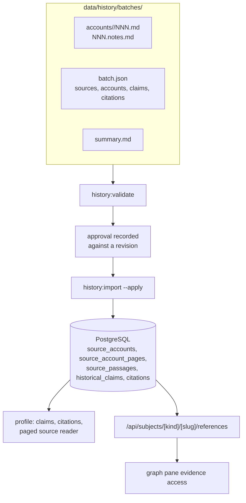

# Data quality and references

Status: implemented. The schema, authoring format, validator, importer, APIs
and UI are built, and the Abu Ubaydah pilot is imported and serving. Its
approval is stale against the current files and is awaiting re-approval. See
"Implementation status" below.

## Agreed scope

Revisit the existing Companion entries in the established book ordering to add
evidence and extract more information. The user superseded the proposed next batch
of 10 new people with smaller, fuller passes over the same entries. Start with
Abu Ubaydah ibn al-Jarrah as the agreed single-entry pilot, using Shamela's
annotated Risalah edition and checking a scan where wording or notes are uncertain.
Audit full names, title assignments
and identity/duplicates first, but read the whole entry to capture richer material
in this pass. Preserve the complete entry and its notes in addition to extracted
structured information. Keep each book's account separately attributable so later
accounts of the same person can be added without replacing or blending the earlier
text. Later batches contain one to three people depending on entry length.
Include relationships and events needed for these biographies; broader expansion
remains deferred. Existing seed comments report completion of the Companion
section's earlier extraction; that does not establish complete evidence coverage.

Use historical works as evidence, including the user's named works: البداية
والنهاية, الكامل في التاريخ, المنتظم في تاريخ الملوك والأمم, تاريخ الخلفاء,
تهذيب الكمال في أسماء الرجال, حلية الأولياء وطبقات الأصفياء, and سير أعلام
النبلاء. Distinguish the work and consulted edition from the website hosting it.
These are eligible sources, not a requirement to consult all seven for every fact.

Citations must support individual facts, relationships, and biography paragraphs,
with a collected reference list for each subject. Preserve exact extraction URLs
and available locators. Profiles contain the complete evidence display: citations beside facts, numbered
paragraph footnotes, and a collected reference list. For subjects with profiles,
the graph pane does not list citations; it may direct readers to the profile's
references only when evidence exists. Subjects without profiles show a compact,
expandable References section for name, full name and titles where applicable,
including review status. Subjects without evidence show References not yet added.
No book reader is added to the graph pane.

The agent prepares proposed changes, source passages and links, identity checks,
and unresolved disagreements. The user approves each batch before database
synchronization. All recorded data should be public with its review status shown;
review status is not a visibility gate. The user confirmed that approval to import
remains a separate required step, including for incompletely verified information.

Review uses a high-level Markdown summary linking to the specific data files.
The summary does not repeat the full batch contents. Keep historical records,
citations and review summaries in a dedicated directory in this repository,
separate from application code. Import scripts validate and apply data; the
application continues reading the databases. Both structured records and complete
source text are versioned in files and imported into PostgreSQL; files are the
authoring source and database copies are not edited independently. Use Markdown
for source pages and structured files for metadata, facts and citation targets,
with one authoritative file copy of the full text. Proposed directory: `data/history/`.
Publishing and reviewing are two separate actions and neither implies the other.
Approving for publication records the current revision in the batch's approval
block and is what permits the import; it asserts that the batch may be published,
not that anyone has read it. Marking reviewed sets a claim's review status, one
claim at a time, after comparing the assertion against the passage it cites. A
published batch whose claims are all Not reviewed is an honest state, and the
approval note says which of the two happened.

Approval is explicit in the review conversation and recorded against the fixed
batch revision. The revision covers `batch.json` and the account pages and notes,
not `summary.md`: the summary is written for the reviewer, and rewording it
invalidates nothing about the evidence. Edits after approval require reapproval. A separate data repository
is deferred until independent contributors, permissions or releases justify it.

Support citations for every historical subject type, including graph-only people,
titles, battles and events. Research remains limited to the agreed scope.
Subjects without profiles receive citations attached directly to their identities;
profiles may be added later and reuse the same evidence.

The source text is the book, and the app structures a selection from it. Account
pages are authoritative: they are never edited or removed to reflect a change in
what the app models, and removing a claim removes a selection, never the passage
it selected from.

A claim is authored only when it backs a value the model holds today, meaning a
profile field, a title assignment, a participation, an event link or a person
relation. `npm run history:validate` rejects a claim naming neither a field nor a
relationship. The reasoning is that the complete entry is already stored page by
page with anchored paragraphs, so a claim that backs nothing is a second copy of
text rather than something a reader can check a recorded value against. A
statement the model has no shape for stays in the pages until the model grows one.

Competing accounts are kept as separate attributed claims only where the model
holds the value they compete over, such as two reported years of death. A
disagreement about something the app does not record stays in the source pages.

Each claim has a review status: Not reviewed, In review or Reviewed. Disagreement
is independent of review status. Legacy information without review records starts
as Not reviewed. Subject summaries may aggregate claim review counts without
implying that review establishes historical certainty.

One explicit passage in an eligible historical work is sufficient for an ordinary
claim. Ambiguous identity, inferred relationships and conflicting accounts need
further checking. Present competing evidence for the user's decision; repeated
reports across books do not automatically count as independent corroboration.

Preserve competing dates, identities and interpretations as attributed claims.
Leave unknown structured values unset rather than manufacture certainty. Selecting
or changing a preferred profile value requires explicit batch review. Preserve
complete transmission chains in source accounts, but do not automatically create
graph nodes or relationships for people mentioned only as narrators. Structured
connections in this phase cover biographical relationships and events.

New citations record work/edition, exact extraction URL, entry or section
identifier, available volume/page, a short supporting Arabic excerpt and access
date. A claim may have several citations. A missing printed page is acceptable
when the digital source provides none; missing exact extraction links are not.
Verify a version retaining editorial footnotes before full extraction. The
Islamweb page alone has not been established as sufficient for that purpose.

Source check: [Shamela volume 1, page 5](https://shamela.ws/book/10906/1431)
contains Abu Ubaydah's opening text and a starred bibliography absent from the
inspected Islamweb transcription. Its [edition card](https://shamela.ws/index.php/book/10906)
identifies the Risalah third edition, 1405/1985, with Hussein Asad editing volume
1 under Shuayb al-Arnaut's supervision. This differs from the user's supplied
Islamweb publication year; do not merge edition records on publisher alone.
Shamela is the agreed extraction host for the pilot; full-entry and scan comparison
remain to be performed. Preserve historical author text, editorial notes and host
additions distinctly. Full entry storage supersedes the earlier proposal to retain only short
excerpts and a small biography example; pinpoint excerpts still support claims.

Display complete source accounts on profiles in this phase, in their original
Arabic even when the interface language is English. Interface labels remain
bilingual. Provide book selection and pagination on profiles. Book selection
changes only the source account; structured profile facts retain citations across
consulted books and explicit disagreements. Each reader page corresponds to a
printed page. Previous/next controls and a page selector navigate within the
account. Preserve selected book and page in the URL; citation links open the
correct selection directly. Do not add book-reading controls or extra biography
content to the selected graph pane.

Terminology: [CONTEXT.md](../CONTEXT.md#historical-evidence).
Rationale: [citations independent of profiles](adr/0009-citations-independent-of-profiles.md)
and [review independent of visibility](adr/0008-separate-review-from-visibility.md).

## Where the existing seed data stands

The people, battle and event seeds under `prisma/` and `neo4j/` were extracted
from Siyar A'lam al-Nubala' by an earlier agent, without citations, passage
anchors or edition metadata. They are therefore mostly correct and evidentially
worthless: the values are probably what the book says, and nothing in the
repository shows where.

That makes them a checklist rather than a source. An agent authoring a catalog
entry reads the seed to learn which subjects exist and which fields a subject is
claimed to have, then looks for each of them in the source. The seed says where
to look; the source says what is true.

A value carried into the catalog that no batch supports yet is marked
`legacy-unreviewed`. It is in use and its evidence is owed, which is a normal
state and not a defect. A batch covering a subject visits every legacy value on
it and resolves each one of three ways: promoted to a cited claim, left legacy
because the entry is silent, or flagged as a contradiction. A contradiction
between a seed value and the entry means one of the two extractions misread the
same book, so it is reported rather than silently overwritten.

Because provenance sits on every catalog value, the set of values awaiting
evidence is directly countable. Reporting it after each batch turns the backlog
into a measurable thing: what has been resolved, what is still owed, and which
subject a future batch should cover to clear the most.

## Implementation status

| Step | State |
| --- | --- |
| Evidence schema and migration | Applied. `HistoricalClaim`, `Citation`, `SourceAccount`, `SourceAccountPage`, `SourcePassage`, `ReviewBatch`; `ClaimReviewStatus` is now Not reviewed / In review / Reviewed |
| File authoring and validation | `data/history/batches/`, `src/lib/history/`, `npm run history:validate` / `history:import` / `history:extract` |
| Pilot import | Imported and serving: 17 claims, 32 citations. Approval is stale against the current files |
| Evidence and account APIs | `/api/subjects/[kind]/[slug]/references`, `/api/people/[slug]/accounts`; review-status filtering removed |
| Profile reading and graph access | `SourceAccountReader`, `ClaimEvidence`, `SubjectEvidenceAccess` |
| Tests and documentation | Colocated tests throughout; README and `AGENTS.md` updated |

The database held no claim, source or citation row before this work, so the
legacy tables were replaced rather than migrated, and no review history was lost.
`PersonClaim` and `RelationshipClaim` are gone; relationship evidence is a
`HistoricalClaim` carrying a relationship type and a related subject.

## Inspected baseline

- `prisma/schema.prisma`: HistoricalSource, PersonClaim and RelationshipClaim
  provide bibliography, volume/page, confidence and review status. URLs belong
  to sources; claims lack extraction URLs and paragraph targets. Person claims
  require a profile row; relationship claims cover person-to-person edges.
- `prisma/personSeed.ts` and `prisma/personSeedData*.ts`: repository-authored
  person batches are upserted into PostgreSQL. Some evidence remains in comments.
  The seed does not import structured claims or enforce editorial approval.
- `scripts/people/syncCanonicalPeople.ts`: synchronizes shared person identity
  fields to Neo4j, not citations or all historical relationships. See
  [canonical pipeline](canonical-people-pipeline.md).
- `src/components/common/ClaimEvidence.tsx` and
  `src/app/people/[slug]/page.tsx`: profiles already display published evidence
  as separate lists. Links use the source URL; paragraph footnotes are absent.
- `src/app/api/people/[slug]/route.ts` and
  `src/app/api/relationship-claims/route.ts`: published evidence queries.
- `src/components/graph/GraphCanvas.tsx` and
  `src/app/api/people/[slug]/preview/route.ts`: selected pane has no evidence;
  preview selects name and titles.
- `README.md`: provenance roadmap is stale and needs correction during delivery.
- `scripts/people/activeSeedData.ts`: discovers active batches through seed import
  statements; moving data also requires updating this validation path.

The user confirmed that evidence has not yet been added for existing data. The
database itself has not been comprehensively audited.
On 2026-09-09 the public `/api/people/muawiyah-ibn-abi-sufyan` response included
the person's full name and Companion title with `claims: []`. This confirms that
visible person data does not require published evidence. An empty public claims
array cannot distinguish absent evidence from evidence excluded by the API filter.

## Acceptance and validation to preserve

| Agreed outcome | Completion check | Validation |
| --- | --- | --- |
| Bounded enrichment before expansion | Existing entries are revisited in small batches, beginning with names and titles and capturing further material from the whole entry | Compare entry coverage and proposed claims against the source and existing slugs |
| Precise evidence | Each proposed fact, relationship and paragraph identifies supporting source locations | Automated citation-target and required-link validation; human source comparison |
| Profile evidence | All citations are accessible on profiles; profile-backed graph subjects do not repeat citation lists | Component/API tests; visual Arabic/English, RTL, light/dark, keyboard and mobile checks |
| Graph evidence access | Profile-backed subjects link to available profile evidence; graph-only subjects expose compact name/title citations; absent evidence is stated truthfully | Tests for all three cases, review status, and transition when a subject gains a profile |
| Visible review status | Recorded data remains public regardless of review status; its status is visible | API and component tests across statuses and uncited legacy records |
| Import approval | Only the exact user-approved batch revision is applied, independently of claim review status | Reject unapproved and changed-after-approval revisions; accept approved unreviewed claims |
| All subject types | Evidence can be attached to people, titles, battles and events, including subjects without profiles | Attachment and retrieval tests for each subject type and graph-only people |
| Evidence threshold | Ordinary claims have explicit support; ambiguity and conflicts are flagged for review | Human source comparison and batch validation of required evidence |
| Ambiguous values | Competing claims retain attribution; unknown values stay unset; preferred-value changes are reviewed explicitly | Import tests for conflicting dates/identities and human review of canonical changes |
| Transmission chains | Complete chains remain in source text without automatically creating narrator graph nodes or edges | Pilot source comparison and import test proving narrator-only mentions leave graph structure unchanged |
| Repository authoring | Data and import code are separate; Markdown summaries link to the reviewed files | Validate migrated batch discovery, references and repeatable imports |
| Complete entry preservation | Pilot preserves all entry pages and notes, with edition and exact source locations, alongside extracted facts | Compare page sequence and note markers against the source; test storage and citation links |
| Separate book accounts | Additional source accounts can coexist for the same subject without overwriting text or attribution | Import and retrieval tests with two accounts for one subject |
| Profile source reader | Complete Arabic accounts use printed-page pagination, URL-addressable book/page selection and bilingual controls; book selection does not change structured facts | Component tests for navigation, refresh, Back/Forward, direct citations and empty/single-source cases; visual RTL/mobile checks |
| Consistent stores | Approved shared person data agrees across PostgreSQL and Neo4j | Canonical dry run and people validation; integration verification |

## Implementation sequence

All new paths below are proposals. Existing paths have been inspected. The precise
Prisma table names are implementation choices, not settled domain terminology.

1. **Define the data format and persistence boundary.** Extend
   `prisma/schema.prisma` and add a migration under `prisma/migrations/`.
   Represent citations independently of profile rows, keyed to subject kind and
   slug or a specific relationship. Keep assertions separate from their many
   citations. Represent source accounts, printed pages, attributable notes and
   stable passage identifiers. Use separate edition records when bibliographic
   details differ; account identity must include the edition. Keep evidence in
   PostgreSQL without creating citation nodes or edges in the historical graph.
   Extend `src/types/provenance.ts` and `src/types/person.ts` accordingly.
   Default previously unreviewed data to Not reviewed; do not fabricate citations.
   Inspect actual evidence counts before migration rather than infer them from
   empty public responses. If existing records contradict the expected empty
   baseline, preserve them and inspect their review history before mapping status.

2. **Create bounded file authoring and validation.** Proposed `data/history/`
   contains source metadata, structured records, Markdown source pages and short
   batch review summaries. Proposed `scripts/history/validateBatch.ts` validates
   identities, citation targets, required provenance, page/note integrity and
   review status. Proposed `scripts/history/importBatch.ts` supplies a dry run and
   explicit application of a specific approved revision. Reuse existing seed and
   canonical validation where possible; update `prisma/personSeed.ts`,
   `neo4j/graphSeed.ts`, `neo4j/graphSeedData.ts` and
   `scripts/people/activeSeedData.ts` when their data moves. Avoid leaving legacy
   seeds able to overwrite newly curated values. Migrate existing historical
   datasets without changing their facts as part of the directory move; historical
   corrections appear separately in reviewed batches. Keep unrelated Quran seeds
   outside this migration.

3. **Import the pilot and synchronize changed subjects.** Preserve the complete
   Abu Ubaydah account in the agreed edition, beginning at printed page 5. Determine
   its final page from the source; do not assume that one webpage is the entry.
   Check body text, notes, page boundaries and extraction completeness. Produce
   structured claims and proposed historical changes linked to exact passages.
   Obtain batch approval before applying. Apply PostgreSQL records transactionally
   where possible, then use the canonical people/title/battle/event pipelines for
   shared graph data. Person-person relationship writes require inspecting and
   adapting the graph seed path; `people:sync` alone does not cover them.

4. **Expose evidence and paged accounts.** Update
   `src/app/api/people/[slug]/route.ts`,
   `src/app/api/relationship-claims/route.ts` and
   `src/app/api/people/[slug]/preview/route.ts`. Remove review-status visibility
   filtering while keeping import approval separate. Proposed
   `src/app/api/subjects/[kind]/[slug]/references/route.ts` supports graph-only
   subjects. Proposed `src/app/api/people/[slug]/accounts/route.ts` serves account
   metadata and the requested printed page rather than every account's full text
   on every profile load. Reject unknown subjects and invalid account/page pairs
   with clear responses. Evidence absence and fetch failure are different states.

5. **Build profile reading and graph access.** Extend
   `src/app/people/[slug]/page.tsx` and
   `src/components/common/ClaimEvidence.tsx`; proposed
   `src/components/people/SourceAccountReader.tsx` handles book/edition selection,
   printed page navigation, notes and URL restoration. Stable passage targets make
   citation links land on the cited text. Render Markdown safely without executing
   embedded HTML or code. Selecting another book resets to that account's first
   page; structured facts remain unchanged. Extend
   `src/components/graph/GraphCanvas.tsx` for the three agreed evidence cases,
   preserving its lightweight preview path. Use `Button.tsx`, `Badge.tsx`, existing
   icons and `src/components/language/translations.ts`; preserve RTL, keyboard use,
   dark/light themes and responsive layout. Source Arabic is not translated.

6. **Validate and document.** Add colocated validator/importer, API and component
   tests tied to the acceptance table. Include duplicate imports, broken targets,
   multiple citations and editions, missing evidence, graph-only subjects, source
   switching without fact switching, note navigation and stale page responses.
   Use the reactive navigation mock pattern for URL-based components. Correct
   README's stale provenance description and document implemented features only
   after verification. Add concise data-reading guidance to `AGENTS.md` so agents
   open relevant batches/pages rather than reading all source text.

Required repository checks for implementation: `npm run lint`, `npx tsc --noEmit`,
and `npm test`; colocate new tests. Graph structure changes also require a layout
dry run, diff review and application, per `AGENTS.md`. Citation-only changes do
not by themselves justify altering graph structure. This planning turn changes
documents only. Before opening the planning PR, `git diff --check`,
`npm run lint`, `npx tsc --noEmit` and `npm test` passed after generating the
worktree's Prisma client. Implementation must rerun these checks for its changes.

## Operational requirements

Verify the worktree `.env` symlink before project commands. Test migrations and
imports against a disposable database before applying to shared data. A worktree's
shared `.env` does not provide database isolation. Snapshot affected shared records
before approved writes. PostgreSQL and Neo4j do not share a transaction: report
partial failure explicitly, retain the exact batch revision and allow safe retry
without duplicate subjects, claims, citations or accounts. Validate store agreement
after retry. Any new graph structure requires layout dry run, diff review and
application; source-account imports alone do not. Deploy additive schema changes
before code that reads them; preserve old evidence until migration is verified.

## Open issues and deferred work

No editorial blockers remain. Obtain final shared-understanding confirmation
before implementation. Per-batch approval remains required before imports.

Nonblocking implementation assumptions: proposed paths and schema names may be
adjusted to existing conventions; page selection defaults to the account's first
page; one available source is shown without redundant switching controls. A page
shared by two entries preserves only this subject's entry segment and its notes,
with the printed page number retained. Validate these choices with the pilot.

Verification prerequisites: establish the full pilot entry boundary, check scan
agreement where uncertain, and inspect database evidence before migration. These
are agent research/integration work, not questions for the user to look up.

Deferred: separate data repository, translations of complete accounts, broader
historical expansion beyond this enrichment pass, and a separate editorial app.

After people data is stable, consider ayat revealed about particular people before
hadith narrator relationships. This is a preferred future sequence, not committed
implementation scope. For hadith work, the user suggested al-Nawawi's Forty Hadith
or Sahih al-Bukhari as possible starting collections; neither has been selected.
Preserved transmission chains do not authorize adding that graph feature now.
