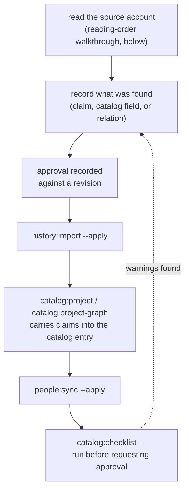

# Extraction checklist

This is the checklist an agent follows end to end when reading a source entry
into a batch: what to look for while reading, where each thing goes, and how
to verify nothing was missed before requesting approval. `AGENTS.md` points
here; this document carries the detail AGENTS.md only summarizes.

**Every batch runs this**, not just a subject's first reading. Existing
batches published before this checklist existed are not being swept
retroactively — that is a separate, deliberately scoped pass the user
triggers, not something to run unprompted against old batches.



## Why this exists

Two real gaps shipped before this checklist did:

- **`volumeNumber` missing on ten batches** — each one passed
  `history:validate` cleanly (the field is schema-valid whether present or
  not), but the reader filed every one of them under "entries with no
  assigned volume" instead of the book's own contents, since nothing
  infers a volume from the printed page number. Fixed in
  [PR #100](https://github.com/msskzx/namaq/pull/100).
- **Hamzah ibn Abd al-Muttalib's nasab** — his profile's graph pane showed
  only a `PATERNAL_UNCLE` tie to the Prophet, no `SON`/`FATHER` edge to his
  own father, unlike his brothers. The seed simply never declared it, and
  nothing caught the omission because nothing was checking for it. Fixed in
  [PR #106](https://github.com/msskzx/namaq/pull/106).

Both were structurally valid and both were wrong. That is exactly the gap
this checklist and `catalog:checklist` close: neither `history:validate` nor
`catalog:validate` can tell "the source doesn't say this" apart from
"nobody looked."

## The reading-order walkthrough

Read the account once, checklist in hand, and write each item down as you
see it — the same way a human reader would, rather than scanning back over
the text nine separate times. The order below is the order these things
typically appear in a سير أعلام النبلاء-style entry; a different source may
order them differently, but the same seven things are worth watching for.

Most entries are terse, so most of the seven items usually come back
absent — that's a normal outcome, not a failure, but confirming it by
close-reading four wives-sized haystacks a batch turns out empty is slow.
Before the close read, grep the account's pages for each item's own
trigger words (`تزوج`, `امرأة`, `زوج` for wives; `أخو`, `أخت`, `شقيق` for
siblings; a physical-description phrase pattern like `كان طويلا`/`أسمر`
for appearance) — a clean miss across every page is enough to mark
`notInSource` without re-reading line by line, and a hit is where the
close read earns its time.

Two of the nine things a batch is responsible for are not "may or may not
be in the source" — they always apply to whatever *was* extracted, so they
have no absent state:

- **Source text and its detail** — printed page(s), edition/volume, the
  extraction URL, `accessedAt`. See "Source text detail" below.
- **Claims** — every asserted value needs a citation; see
  [AGENTS.md](../AGENTS.md)'s Historical evidence data section and
  `history:validate`'s enforcement (below).

The other seven are content the source may or may not state. For each, if
the entry is read fully and the source is silent, that is a legitimate
outcome — record it as such (see "Recording what was found") rather than
leaving it unchecked.

### 1. Nasab (النسب) — usually the opening line

The entry almost always opens with the full patronymic chain: `فلان بن فلان
بن فلان...`. This is `fullName` (the chain as the source states it, however
long) **and** the `SON`/`DAUGHTER` relation to the person's own father, if
that father is already a person in the catalog/graph. Don't stop at
recording the name string — check whether the immediate father is a known
slug, and if so, declare the relation too. A `fullName` field with no
matching `FATHER`/`SON` edge is half the job: see Hamzah's fix above for
exactly this failure mode.

### 2. Kunya (الكنية) — usually right after the nasab

`أبو فلان` / `أم فلانة`, sometimes more than one (`أَبُو عُمَارَةَ، وَأَبُو
يَعْلَى`). Goes on `fields.kunya`.

### 3. Appearance (الصفة الجسدية) — near the opening, when given

Physical description: `كَانَ طَوِيْلاً أَسْمَرَ`, `شَدِيْدَ الأُدْمَة،
كَبِيْرَ اللِّحْيَة`. Not every entry has one. Goes on `fields.appearance`.

### 4. Manaqeb / virtues (المناقب) — scattered throughout, often as reported sayings

Unlike the first three, this is rarely one paragraph — it accumulates
across the entry as quoted حديث, remarks from the Prophet or other
companions, and notable deeds. Goes on `fields.virtues` (the catalog field
is named `virtues`, not `manaqeb` — the checklist uses the Arabic term
because that's how an agent will recognize it while reading).

### 5. Wives (الزوجات) — wherever marriage is mentioned

A `HUSBAND`/`WIFE` relation, recorded only when the **subject's own account
page** states it — checking the wife's own entry too (when she has one) is
a good cross-reference if it's already in scope, but is not a blocking
requirement; it would create ordering dependencies between batches that
aren't worth the coupling.

### 6. Brothers / sisters (الإخوة والأخوات) — wherever lineage or shared events surface them

`BROTHER`/`SISTER` for a **confirmed full sibling** (same mother stated
explicitly, not just the same father), `HALF_BROTHER`/`HALF_SISTER` when
the source is clear they share only the father. **Sharing a father is not
enough for `BROTHER`/`SISTER`** — see the note on Abd al-Muttalib's
children below.

Scope this to what the subject's own entry (or another source already in
scope for this batch) surfaces — **not** a proactive sweep of every
possible sibling pairing. A full-family reconciliation (e.g. working out
every one of Abd al-Muttalib's 13 children's sibling ties to each other) is
its own project, scoped separately, not something every single-subject
batch is expected to produce. As of this writing, 12 of Abd al-Muttalib's
13 children with profiles have no sibling edge to each other at all
(`BROTHER`/`SISTER`/`HALF_BROTHER`/`HALF_SISTER` are all defined relation
types in `src/lib/relationship/categories.ts` but unused for this family) —
a known gap, not something a routine batch needs to fix.

### 7. Source text detail (always required, no absent state)

- Printed page number(s) per page (`printedPage`).
- The volume this account/page is bound in (`volumeNumber`) — **required
  whenever the source is multi-volume**, per its declared `volumes` list in
  `batch.json`'s `sources[]`. This is the exact field that went missing on
  ten batches; see "Why this exists" above. `history:validate` checks that
  a declared `volumeNumber` matches a real volume, but does **not** check
  that one was declared at all — that gap is why `catalog:checklist`
  exists.
- `extractionUrl` and `accessedAt` on every account and citation.

## Recording what was found

| Checklist item | Where it goes | Type |
|---|---|---|
| Nasab (fullName) | `fields.fullName` on the catalog entry, cited from a claim with `field: "fullName"` | `Cited<string>` |
| Nasab (father edge) | `relations[]`, `{ type: 'SON'\|'DAUGHTER', inverse: 'FATHER'\|'MOTHER', to: '<father-slug>' }` | `CatalogRelation` |
| Kunya | `fields.kunya`, claim `field: "kunya"` | `Cited<string>` |
| Appearance | `fields.appearance`, claim `field: "appearance"` | `Cited<string>` |
| Manaqeb | `fields.virtues`, claim `field: "virtues"` | `Cited<string>` |
| Wives | `relations[]`, `{ type: 'HUSBAND'\|'WIFE', to: '<spouse-slug>' }` | `CatalogRelation` |
| Siblings | `relations[]`, `{ type: 'BROTHER'\|'SISTER'\|'HALF_BROTHER'\|'HALF_SISTER', to: '<sibling-slug>' }` | `CatalogRelation` |
| Source text detail | `batch.json`'s `account.volumeNumber` / `page.printedPage` / `extractionUrl` / `accessedAt` | schema-required |
| Claims | `batch.json`'s `claims[]`, one citation per claim minimum | schema-required |

A claim alone is not the end state — the value has to be carried from the
approved claim into the person's `data/catalog/people/<slug>.ts` entry
(via `catalog:project --apply`) or declared directly as a relation there.
`catalog:checklist` checks the **catalog entry**, not the batch, precisely
because a claim that never makes it into the catalog file still leaves a
broken profile.

### Confirming absence

If the entry is read in full and one of the seven content items genuinely
is not there, mark it on the account in `batch.json`:

```json
{
  "sourceSlug": "siyar-alam-al-nubala-risalah",
  "subjectSlug": "example-slug",
  "notInSource": ["wives", "manaqeb"]
}
```

`notInSource` is enum-validated by `history:validate` against exactly the
seven content items (`fullName`, `kunya`, `appearance`, `manaqeb`, `nasab`,
`wives`, `siblings`) — a typo fails validation loudly rather than silently
passing as "checked." This is what lets `catalog:checklist` distinguish
"checked, genuinely absent" from "nobody checked."

## Verification — run before requesting approval

```bash
npm run catalog:checklist -- <person-slug>
```

Reports each of the seven content items as one of three states:

- ✅ found and authored in the catalog entry
- ⚪ confirmed absent (some account declared it in `notInSource`)
- ⚠️ neither — unchecked, needs attention before approval

A batch is not ready for approval while its subject has ⚠️ items that the
source actually could have answered. Don't request approval with
unexplained warnings; either author the value, or mark it `notInSource` and
re-run.

This is a subject-level check across **every** batch that has ever read
that subject (a follow-up batch adding one claim to an already-established
subject inherits whatever earlier batches found or marked absent) — it is
not scoped to only the batch currently being authored.

## Everything already enforced elsewhere

The items below fail loudly at `history:validate` or `catalog:validate` time
regardless of this checklist — restated here as a one-line pointer, not in
full, so this document doesn't drift out of sync with the actual schema:

- Page sequence gaps/duplicates, missing page files, empty page files —
  `history:validate` (`src/lib/history/batchSchema.ts`).
- A claim naming neither a `field` nor a `relationshipType` ("orphan
  claims") — `history:validate`.
- A relationship claim with only some of
  `relationshipType`/`relatedSubjectKind`/`relatedSubjectSlug` set —
  `history:validate`.
- A citation whose `passageAnchor` doesn't resolve to a declared passage,
  or duplicate anchors — `history:validate`.
- `volumeNumber` (when declared) not matching a volume the source declares
  — `history:validate`. (Declaring one at all is this checklist's job, not
  the validator's — see item 7 above.)
- `history:validate` also prints a non-blocking reminder line for any
  PERSON account with zero `notInSource` items — it can't know whether
  `catalog:checklist` was actually run, only that nothing was marked
  absent, so it nudges rather than fails. A genuinely thorough entry
  quiets it the normal way: by marking whatever really is absent.
- Relation reciprocity (`RECIPROCAL_INVERSES`), an ambiguous `inverse` left
  unset when more than one reciprocal exists, a relation target that isn't
  a known person — `catalog:validate` (`src/lib/catalog/validateCatalog.ts`
  equivalent).
- A battle participation status not valid for its relation type (e.g.
  `ABSENT_EXCUSED` on a `PARTICIPATED_IN` relation) — `catalog:validate`.
- Every cited value needing a non-empty `claims` provenance, resolvable
  against an **approved** batch's claim keys — `catalog:validate`.
- A carried-forward, uncited seed value must be marked
  `legacy-unreviewed`, never invented a citation — see AGENTS.md's
  Historical evidence data section (convention, not a script check).
- A batch covering a subject must visit every legacy value on that subject
  — `npm run catalog:ledger -- --batch <dir>` **reports** what's owed, but
  does not block anything; visiting it is still on the agent.

## Other precedent to know about before extracting family relations

These are conventions established in `neo4j/graphSeedData*.ts` comments,
worth knowing so a new agent doesn't reinvent or accidentally violate them:

- **Bidirectional edges are the convention.** A `FATHER`/`SON` (or any
  relation) pair declared only in one direction is a bug, not a stylistic
  choice — this exact asymmetry recurred across several of the Prophet's
  wives/daughters entries (Aisha, Hafsa, Khadijah) before being patched.
  `catalog:project-graph` writes the reciprocal automatically from a
  catalog relation's `inverse`, but a raw seed edge pair has no such
  safety net — check both directions exist if you're ever touching seed
  data directly.
- **Allies (حلفاء) are not linked into their host clan's blood tree.** A
  companion who is a حليف of a clan (rather than born into it) gets his
  own ancestor chain, kept standalone — do not connect it with `SON`/
  `FATHER` edges into the clan he's allied with just because he's
  associated with them.
- **Deep pre-Islamic ancestor chains are deliberately truncated** at a
  clear tribal/clan-eponym point, with the remaining generations folded
  as plain text into `fullName` rather than modeled as individual graph
  nodes. Don't feel obligated to create a node for every ancestor a nasab
  chain names — follow the existing truncation depth for that lineage if
  one is already established.
