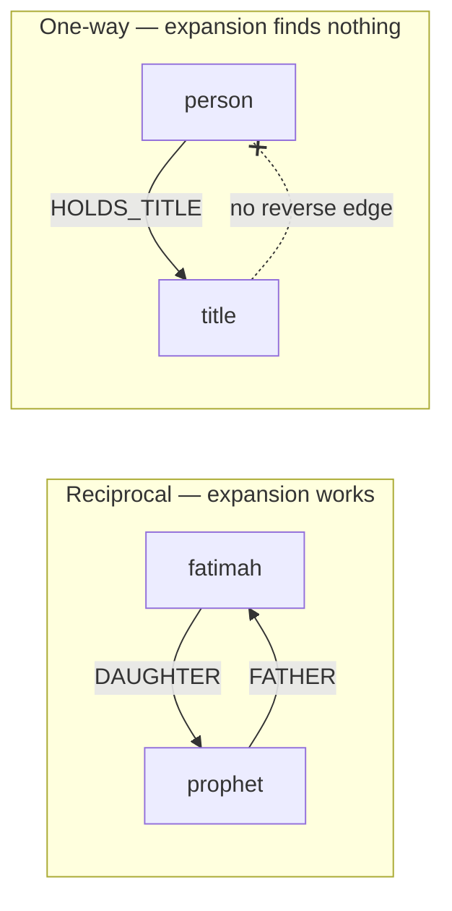

# Expansion controls

Status: designed, no open questions. Ready for implementation on its own branch
off `main` after [#37](https://github.com/msskzx/namaq/pull/37) merges. Part of
the data fix has already been applied to production; see
[Data fixes](#data-fixes).

Sibling of [historical subjects are searchable](graph-subject-search-plan.md),
whose "Out of scope" note raised this.

## Objective

Expanding a subject reveals what it is actually connected to, in one tier of
controls instead of three, and a relation switched on in the Filters panel
fetches what it needs rather than un-hiding data that was never loaded.

## The bug: expansion assumes reciprocity

Expanding a person by **Titles** returns nothing, though `/api/graph` returns
the Title node and its `HOLDS_TITLE` edge in the same response.
`matchExpansionNeighbors` (`src/lib/relationship/expansion.ts:20`) matches one
direction only:

```ts
if (edge.type === relation && edge.target === subject) {
  neighbors.add(edge.source);
}
```

It finds edges *arriving at* the subject and returns their source. Family
relations satisfy this because the seed stores both directions -- expanding
`prophet-muhammad` by `FATHER` finds `X -FATHER-> prophet-muhammad` and returns
`X`. Cross-kind relations do not: the person is always the source.



Counted on the live graph, every cross-kind relation is one-way, and no Title,
Battle or Event node has any outgoing edge back to a Person:

| Relation | Direction | Edges |
| --- | --- | --- |
| `HOLDS_TITLE` | Person → Title | 328 |
| `PARTICIPATED_IN` | Person → Battle | 100 |
| `INVOLVED_IN` | Person → Event | 47 |
| `PART_OF` | Event → Battle | 9 |

So the defect is wider than titles: **battles, events, and the event-to-battle
link fail the same way.** Only titles were noticed because titles are the one
non-person kind on by default. `directRelationCounts` calls the same matcher,
so a person's Titles count is always 0 -- which is why "All direct relations"
does not merely skip titles, it never offers them. `buildExploration`'s
`globalFilters` path calls it too, so revealing by relation type is broken in
the same way as expanding.

## Agreed decisions

1. **Match both directions for one-way relations, incoming only for reciprocal
   ones.** The rule is a statement about storage, not grammar. Both directions
   are needed rather than merely the outgoing one because any kind can now be a
   root: expanding a Person by `HOLDS_TITLE` wants the title, expanding a Title
   by `HOLDS_TITLE` wants its holders. This is unambiguous precisely because
   these relations have no reciprocal edge to double-count.

2. **A blanket undirected match is rejected.** `A -FATHER-> B` names the
   source's *role* toward the target; `A -HOLDS_TITLE-> B` names the source's
   *action*. Matching family relations both ways would return a person's
   children under "Father", which `expansion.test.ts:39` already pins.

3. **Reverse edges in the sync scripts are rejected for cross-kind relations.**
   `ACCOMPANIED_BY` earned its place because companionship is a real reciprocal
   relationship. "Held by" is not: inventing it adds 484 edges and a filter
   toggle each, to avoid one branch in one function.

4. **Reciprocity becomes a checked property for the relations that should have
   it.** The static test at `neo4j/graphSeedData.test.ts` -- which covered only
   `FATHER`/`MOTHER`/`SON`/`DAUGHTER` -- extends to every reciprocal type.

   **Amended during implementation.** The plan said to grow `INVERSE_PAIR` into
   that map. Doing so would have been a silent UI regression: `INVERSE_PAIR`
   feeds `governingRelationType`, and `GraphCanvas`'s `ALL_RELATION_TYPES`
   keeps only types that govern themselves, so every type added as a key
   disappears from the Filters panel -- `FATHER` and `SON` would collapse into
   one switch. The reciprocity map is therefore a separate export,
   `RECIPROCAL_INVERSES`, and `INVERSE_PAIR` is untouched.

   Inverses are not written automatically: a `FATHER` edge's inverse is `SON`
   or `DAUGHTER` depending on the child, which the query text does not encode.
   The test accepts any listed inverse for that reason.

5. **The middle tier of expansion controls is deleted.** `ExpansionControls`
   renders three tiers today: All direct relations, one button per relation
   type grouped into immediateFamily/extendedFamily/marriage/other, then the
   three lineage actions. The middle tier goes, leaving four buttons. The
   Filters panel already offers per-relation control, and three tiers of
   relation controls is the complaint this plan started from.

6. **"All direct relations" respects the active filters.**
   `expandAllDirectRelations` (`src/components/graph/GraphCanvas.tsx:396`)
   expands every relation with a non-zero count, ignoring the hide-list. Since
   `COMPANION_OF` is excluded by default, a fresh visit currently fetches ~253
   companion nodes that the renderer then hides.

7. **Switching a relation on fetches it, via `filter`.** Decisions 5 and 6
   together would otherwise create a dead control: with no per-relation
   expansion button left, and All direct relations no longer over-fetching,
   switching `COMPANION_OF` back on would un-hide data nothing had loaded. The
   machinery to avoid this already exists -- `?filter=` reaches `globalFilters`
   via `parseExplorationInput`, `buildExploration` reveals every neighbor of
   that type across all visible subjects, and `useExplorationGraph` then
   fetches whatever became visible, looping until nothing new appears.

8. **`relation` is deleted, and one param survives.** The Filters panel writes
   `filter` instead. The `relation` param, the `NO_EXCLUDED_RELATIONS`
   sentinel, and the `excludedRelations` branch of `filterVisibleGraph` all go;
   `filterVisibleGraph` keeps its `showCompanionTitle` and `personSearchSlugs`
   handling. The two-layer split is what produced this bug, and once the middle
   tier is gone there is no reason a user should distinguish "revealed but
   hidden" from "not revealed".

   The cost is accepted deliberately: hiding a relation now unfetches it, so
   switching it back on costs a round trip where it used to be instant.

9. **Old `?relation=` links are not translated.** Nothing in the repo generates
   them -- every one in existence came from a user clicking a toggle. A
   faithful mapping would mean carrying the `NO_EXCLUDED_RELATIONS` sentinel
   logic into the new param indefinitely, since an absent `relation` means
   `DEFAULT_EXCLUDED_RELATIONS` rather than "nothing hidden". Old links fall
   back to defaults.

10. **The live graph is checked, not only the seed.** The static test guards
    what the seed declares; nothing guarded what the graph actually contains,
    which is why four wrong edges survived. A live check reports drift in both
    directions -- person-to-person edges the graph holds that the seed never
    declared, and edges the seed declares that the graph lacks -- excluding the
    relation types the sync scripts legitimately own (`COMPANION_OF`,
    `ACCOMPANIED_BY`, `HOLDS_TITLE`, `PARTICIPATED_IN`, `INVOLVED_IN`,
    `PART_OF`). The two checks catch different failures: one guards what is
    declared, the other what is deployed.

## Data fixes

Two defects, found while diagnosing the above, with different causes.

**Four inverted edges, live only -- deleted 2026-09-08.** The graph contained
`al-hasan-ibn-ali -FATHER-> ali-ibn-abi-talib`, the same for al-Husayn, and two
`-MOTHER-> fatimah-bint-muhammad`. Under the convention the seed itself uses
(`A -FATHER-> B` means A is B's father, proved by the seeded
`ali -FATHER-> al-hasan` beside `al-hasan -SON-> ali`), these read "al-Hasan is
Ali's father" and "al-Hasan is Fatimah's mother". `graphSeedData.ts:153`
declares the correct edges and never these. Their effect was visible: expanding
Ali by **Father** returned his own sons, since the matcher reads edges arriving
at the subject.

They were deleted under a guard that refused to run unless the match set was
exactly those four. Person-to-person edges went from 1017 to 1013. What wrote
them is unknown -- provenance properties do not settle it, since only 563 of
1707 non-title edges carry `reviewStatus` at all.

**Twenty-three missing inverses, in the seed.** First measured as eleven, which
counted only the eight relation types the first pass looked at. Checked against
every reciprocal type, the seed was missing 23 -- 11 `WIFE`, 3
`PATERNAL_UNCLE`, 3 `PATERNAL_COUSIN`, 2 `FATHER_IN_LAW`, 2 `SON_IN_LAW` and 2
`GRANDSON`.

**Every one of them points at `prophet-muhammad`.** This is not scattered
data-entry drift: relations were authored pointing *at* him and the reciprocal
from him was never written. The effect is that expanding *toward* the Prophet
works while expanding *from* his relations back to him does not -- from
Khadijah, Husband reaches nobody; from al-Hasan, Grandfather reaches nobody;
from Abu Bakr, Son-in-law reaches nobody.

All 23 inverses resolve unambiguously. There is no sex field on Person, so the
gendered choice was derived from the relation types each person already appears
as the source of, which left nothing unresolved. The queries sit immediately
after their forward edge in `neo4j/graphSeedData.ts` so the pairing is visible
in review.

## Implementation sequence

Each phase its own commit. Invoke the `write-comments` and `unslop` skills when
writing the code and the prose.

### Phase one: the matcher

`matchExpansionNeighbors` gains the one-way set and matches both directions for
it. `directRelationCounts` and `buildExploration`'s `globalFilters` path both
benefit without changing. Titles, battles and events become expandable in both
directions.

### Phase two: seed reciprocity

Add `RECIPROCAL_INVERSES` to `src/lib/relationship/categories.ts`, extend
`neo4j/graphSeedData.test.ts` to every reciprocal type, and add the 23 inverse
queries the extended test then demands.

### Phase three: one relation param

The Filters panel writes `filter`. `relation`, `NO_EXCLUDED_RELATIONS` and the
`excludedRelations` branch of `filterVisibleGraph` are deleted, along with
`toggleRelation`/`toggleAllRelations`/`toggleGroupRelations`' exclude-list
arithmetic and `toggleKind`'s group-sync, all of which invert. Note that
`DEFAULT_EXCLUDED_RELATIONS` becomes a default *include* set: every relation
type except `COMPANION_OF`, `PARTICIPATED_IN`, `INVOLVED_IN` and `PART_OF`.

### Phase four: the live drift check

`src/lib/graphIntegrity.live.test.ts` gains the both-directions comparison from
decision 10. It needs credentials, so it skips without them, as the rest of
that file does.

**This check fails after phase two until `npm run seed:graph` is re-run** --
the eleven `HUSBAND` edges will be declared but not yet deployed. That is the
check working: re-running the seed is the operator step it is asking for.

### Phase five: four buttons

Delete the middle tier from `ExpansionControls`, plus
`src/lib/relationship/expansionGroups.ts`, its test, and the `expansionGroups`
blocks in both language files. `directRelationCounts` stays --
`hasEligibleDirectRelations` still needs it to decide whether to show the All
direct relations button. `expandAllDirectRelations` reads the active filter set
rather than all of `RELATION_ORDER`.

## Acceptance criteria

1. Expanding a person by Titles reveals the titles they hold, and the count on
   the control is non-zero.
2. Expanding a Title reveals its holders; the same holds for a Battle by
   `PARTICIPATED_IN` and an Event by `INVOLVED_IN` and `PART_OF`.
3. Expanding a person by Father still returns only their father --
   `expansion.test.ts:39` unchanged and passing.
4. `neo4j/graphSeedData.test.ts` fails before the 23 inverse queries are added
   and passes after; expanding any wife of the Prophet by Husband reaches him,
   and `INVERSE_PAIR` is unchanged, so the Filters panel still lists `FATHER`
   and `SON` separately.
5. A fresh `/graphs` visit does not fetch `COMPANION_OF`.
6. Switching `COMPANION_OF` on in the Filters panel fetches and renders the
   companions.
7. `relation` and `NO_EXCLUDED_RELATIONS` appear nowhere in `src/`.
8. `ExpansionControls` renders four buttons for a person, one for a non-person
   subject, and `expansionGroups.ts` no longer exists.
9. The live check reports zero drift in both directions once the seed is
   re-run, and would have failed on the four deleted edges.

## Out of scope

The graph UI on mobile, still undesigned -- search, filter and navbar are
unscrollable on a phone. Includes a loading indicator while nodes are fetched,
and `GraphSearch.tsx`'s TODO about the spinner belonging in the dropdown.

## Operator steps

`npm run seed:graph` after phase two, to deploy the 23 inverse edges.
`graphRank` and the layout need no recomputation: every new edge joins a pair
that was already adjacent, and `buildGraphAdjacency` dedups with a Set.

*Run 2026-09-08:* applied. The live graph holds 1570 reciprocal person-to-person
edges with **zero** one-sided among them, and the expansions the gaps had
killed now resolve -- Khadijah by Husband, al-Hasan by Grandfather, Abu Bakr by
Son-in-law and Ali by Paternal cousin all reach the Prophet.
