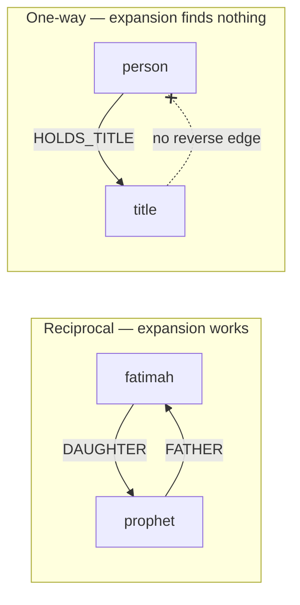

# Expansion controls

Status: diagnosis complete, design open. The bug below is confirmed against
live data and its fix is proposed but not agreed. The control-surface changes
in [Reducing the controls](#reducing-the-controls) are the observations that
opened this plan, not decisions.

Sibling of [historical subjects are searchable](graph-subject-search-plan.md),
whose "Out of scope" note raised both halves of this.

## The bug: expansion assumes reciprocity

Expanding a person by **Titles** returns nothing, though `/api/graph` returns
the Title node and its `HOLDS_TITLE` edge in the same response. The observation
that opened this was that with the title kind enabled in both cases, "Show full
graph" renders titles and "All direct relations" does not.

`matchExpansionNeighbors` (`src/lib/relationship/expansion.ts:20`) matches one
direction only:

```ts
if (edge.type === relation && edge.target === subject) {
  neighbors.add(edge.source);
}
```

It finds edges *arriving at* the subject and returns their source. Family
relations satisfy this because the seed stores both directions -- expanding
`prophet-muhammad` by `FATHER` finds `X -FATHER-> prophet-muhammad` and
returns `X`. Cross-kind relations do not: the person is always the source.



Counted on the live graph, every cross-kind relation is stored one-way, and no
Title, Battle or Event node has any outgoing edge back to a Person:

| Relation | Direction | Edges |
| --- | --- | --- |
| `HOLDS_TITLE` | Person → Title | 328 |
| `PARTICIPATED_IN` | Person → Battle | 100 |
| `INVOLVED_IN` | Person → Event | 47 |
| `PART_OF` | Event → Battle | 9 |

So the defect is wider than titles: **battles, events, and the event-to-battle
link fail the same way.** Only titles were noticed because titles are the one
non-person kind on by default (`DEFAULT_KINDS`).

Two consequences follow from the same line. `directRelationCounts` calls the
same matcher, so a person's Titles count is always 0 -- which is why "All
direct relations" does not merely skip titles, it never offers them, and the
per-relation button never appears either.

Second, the two conventions genuinely differ and a blanket undirected match
would be wrong. `A -FATHER-> B` names the *source's role toward the target*
(the Prophet is Fatimah's father), so expansion has to read it incoming.
`A -HOLDS_TITLE-> B` names the source's *action*, so expansion has to read it
outgoing. `expansion.test.ts:39` already pins the first case ("does not confuse
a reciprocal `DAUGHTER` edge with a `FATHER` request") and would fail under a
blanket change.

### Proposed fix

Match outgoing edges for the cross-kind relations only, incoming for the rest.
One set of four relation types, one branch in `matchExpansionNeighbors`.

Two alternatives, both rejected:

- **Match both directions for every type.** Breaks the family semantics above
  and the test that pins them.
- **Write reverse edges in the sync scripts**, the way `COMPANION_OF` has
  `ACCOMPANIED_BY`. Symmetric with existing practice and it would need no
  client change, but it invents inverse relation names the domain does not use
  (`HELD_BY`, `HAD_PARTICIPANT`), adds 484 edges, and gives each a filter
  toggle to suppress. `graphRank` would be unaffected -- `buildGraphAdjacency`
  dedups with a Set -- so the argument is entirely about surface area.

### A related data gap, not fixed here

Reciprocity is a seed convention, not a constraint. Live counts: 456 parent
edges (`FATHER` 430, `MOTHER` 26) against 452 child edges (`SON` 407,
`DAUGHTER` 45). The mismatch means a handful of family pairs are stored one-way
and are invisible to expansion from one side, silently. Worth an integrity
check in `src/lib/graphIntegrity.live.test.ts` rather than a code change.

## Reducing the controls

Carried forward from the interview that produced the search plan. These are
observations awaiting decisions, not agreed work.

- Reduce to four buttons: **All direct relations**, **Ancestors**, **Paternal
  lineage**, **Descendants**, dropping Companion Of as an expansion.
- **All direct relations should respect the active relation filters rather than
  overriding them.** `expandAllDirectRelations`
  (`src/components/graph/GraphCanvas.tsx:396`) expands every relation with a
  non-zero count, ignoring `excludedRelations`. Since `COMPANION_OF` is
  excluded by default, a fresh visit expands roughly 250 companion nodes that
  the render layer then hides -- which is also what the first bullet is
  reacting to.

## What this unblocks

The search plan records criteria 2 and 3 as blocked on this. Reading the code,
they are less blocked than assumed: `useExplorationGraph` pushes roots straight
into `buildExploration` as `{kind: 'search'}` provenance, bypassing
`matchExpansionNeighbors` entirely. A battle selected from search becomes a
root, so it should render. What stays broken is expanding *from* that battle,
or reaching a title by expanding the person who holds it. Worth re-checking
those two criteria directly rather than waiting on this plan.

## Open questions

1. Fix the matcher, or write reverse edges? The recommendation above is the
   matcher, but the sync-script route has precedent in `ACCOMPANIED_BY`.
2. Does dropping Companion Of as an expansion mean removing the button only, or
   also dropping `COMPANION_OF` from the default exclusion list once it can no
   longer be expanded by accident?
3. Should "All direct relations" filter by `excludedRelations` (the render-layer
   hide-list) or by something narrower? They are separate layers today and
   conflating them may surprise in the other direction.
