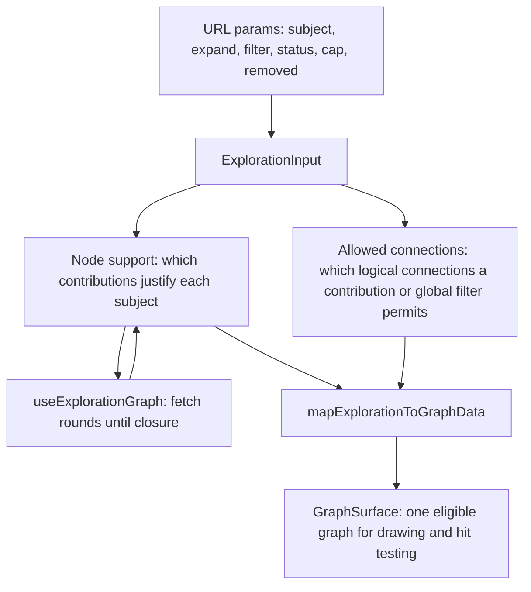

# Exploration implementation plan

Status: implemented in five phases, one commit each, on top of the audited
commit and a merge with main. The [exploration rules](graph-exploration-review-plan.md)
are confirmed; this document records the audit they were built from, the build
order, and what still needs a live check.

Two decisions were settled during the work. Main had shipped global relation
filters that default on; the confirmed rules win, so filters start off and the
opening family comes from the root's own expansions. Main's blanket hiding of
companionship edges is gone, since a connection no contribution revealed is
already hidden.

## Before starting

- Read `AGENTS.md` and the confirmed review plan. That plan supersedes conflicting
  descriptions in the older exploration, search, and reset documents.
- Audited application commit: `53baccd`. The audit table below quotes line numbers
  from that commit.
- Each worktree needs its own `.env` symlink to the main checkout's file, and
  `npx prisma generate` before `npm test` passes; without either, the live graph
  integrity test and the layout script test fail for setup reasons, not code ones.
- Apply `unslop` to prose, `ponytail` to implementation choices, and
  `write-comments` before writing code comments. Reuse existing modules and the
  installed Font Awesome icons.

## Baseline and result

Measured on this branch after linking `.env` and generating the Prisma client.

| Check | At the audit | After phase five |
| --- | --- | --- |
| `npm test` | 46 files, 343 tests | 50 files, 421 tests |
| `npx tsc --noEmit` | clean | clean |
| `npm run lint` | one warning at GraphSurface.tsx:128 | clean |

Passing tests at the audit did not show compliance: several encoded the older
model and were rewritten rather than extended.

## Audit findings

| Confirmed requirement | Current evidence | Required change |
| --- | --- | --- |
| Explicit local/global scope, local by default | `GraphCanvas.tsx:378–404` infers scope from whether a subject is selected; `:453–468` mutates a separate whole-view edge exclusion set. | One explicit scope control. Local controls disabled without a selection. Scope is fixed when the action is taken. |
| Local contributions own their connections; extra cross-connections need a global filter | `exploration.ts:85–90` keeps every edge between visible subjects; `graphFilter.ts:41–51` then subtracts globally excluded raw labels. | Derive allowed connections from the contributions themselves. A global filter being off must not hide a connection a local contribution revealed. |
| Lifetime caps and restoration | `exploration.ts:15–19` stores only roots, expansions, and global filters; `:61–82` recomputes provenance from the current snapshot each time. | Persist cap history in state and the URL. Searching a previously introduced subject must not let it trigger the same filter again. |
| Independent branch retention and collapse | `exploration.ts:55–59` adds expansion neighbors but never the anchor; `exploration.test.ts:52–64` passes Aisha in as a search root, which hides that gap. | An active contribution supports its own anchor. Collapse removes a branch's contributions while preserving independently supported subjects. |
| Lineage and direct overlap | `lineageExpansion.ts:17–48` flattens a lineage action into ordinary per-hop actions and loses which action produced them. | Keep the originating contribution identity while reusing the traversal. |
| Remove and Keep only selected | Neither `ExplorationInput` nor `urlState.ts:11–15` has removal or branch fields; `useExplorationGraph.ts:73–77` promotes every full-graph node to a root. | Add removal state and branch actions. Show full graph must respect removals. |
| Minimal initial and reset family | `GraphCanvas.tsx:434–440` expands all direct relations on a fresh visit; `:667–673` resets to Muhammad alone. | Share one initializer between fresh visit and Start over: WIFE, SON, DAUGHTER, GRANDSON, GRANDDAUGHTER as local contributions on the target subject. Do not infer grandchildren from two parent hops. |
| Companionship stays manual | `GraphCanvas.tsx:396–404` expands every counted relation; `:459–468` includes companionship in bulk and group toggles. | Bulk and group operations leave companionship in whatever state it is in. All direct relations respects the dedicated toggle. Start over resets it off. |
| Companion toggle covers both directions | `categories.ts:82` pairs ACCOMPANIED_BY with COMPANION_OF for visibility, but `expansion.ts:33–47` treats both as reciprocal and reads them incoming only. | Reuse the pairing for companion expansion and counts. Do not make family matching undirected as a side effect. |
| Disabled-kind search needs manual enablement | `GraphSearch.tsx:97–107` silently enables the searched kind and the companion title; `:110` uses `router.replace`. | Explain the disabled kind and require the user to enable it. Use history-pushing navigation for exploration changes. |
| Battle status filtering | `prisma/schema.prisma:239` defines the status enum, `relationship/status.ts` colors it, and no filter panel offers status choices. | OR filtering over participation records with an explicit unrecorded option, keeping independently supported people. |
| Failure preserves the graph | `useExplorationGraph.ts:119–123` keeps previous SWR data, but `GraphSurface.tsx:131` swaps the whole canvas for an error message. Six fetch rounds is the only stopping condition. | Keep the last successful graph, show a non-blocking error with retry, and replace the round limit with a real completion condition. |
| Hidden hover targets disappear | `GraphSurface.tsx:57–89` prunes the node and link pools, `:180–186` paints pointer areas with no membership guard, and `cooldownTicks={0}` means no simulation frames run after a data change. | Reproduce before fixing. A stale hit-test canvas is a hypothesis, not a diagnosis. |
| Shared button with optional icon | There is no exported shared button under `src`; `ExpansionControls.tsx:69` defines a private one. `src/components/common/` holds Badge, ErrorMessage, FactCard, and similar. | Add `src/components/common/Button.tsx` with optional icon and native button props, and adopt it for graph actions. |

Verified data and behavior worth preserving:

- `neo4j/graphSeedData.ts:157–160` records direct GRANDSON and GRANDFATHER pairs
  between Muhammad and al-Hasan and al-Husayn, so rule 11 needs no new genealogy.
  Production database coverage was not checked.
- The recorded statuses are DIED, INJURED, CAPTURED, WAS_CAPTURED, ABSENT_EXCUSED,
  and MARTYRED. There is no KILLED value. An empty status array means status not
  recorded.
- `connections.ts:18–60` collapses reciprocal role pairs into one logical
  connection, including ACCOMPANIED_BY with COMPANION_OF. Reuse it rather than
  re-deriving inverses.
- `filterVisibleGraph` has exactly one caller, `GraphCanvas.tsx:272`, on the
  embedded (non-search) path. Replacing the exclusion layer is contained, but it
  still changes what profile-page graphs render.
- Existing lineage traversal handles full depth and cycles. Fixed node positions,
  camera actions, bilingual strings, and theme support are already in place.

## Target state model



Today membership and connections are computed in two places that disagree:
`buildExploration` admits every edge between visible subjects, and
`filterVisibleGraph` later subtracts excluded labels. The plan collapses them
into one derivation, so a hidden connection is one that no contribution allows
rather than one a second pass removed.

Proposed shape, extending the existing interface rather than replacing it:

```ts
export interface ExplorationInput {
  roots: SubjectId[];
  expansions: ExpansionAction[];
  globalFilters: RelationType[];
  statuses: ParticipationStatus[] | null;
  caps: Array<{ subject: SubjectId; relation: RelationType }>;
  removed: SubjectId[];
}
```

`statuses` distinguishes absent (all statuses, the default on first enablement)
from an explicitly empty selection. `caps` is history, so it only grows within an
exploration and is cleared by Start over. `removed` is a veto that search or a
local expansion can lift without touching `caps`.

## Implementation sequence

### 1. Extend exploration state and its URL codec

Files: `src/lib/relationship/exploration.ts`, `urlState.ts`, and their colocated
tests.

- Add the fields above, keeping transitions pure and state serializable.
- Give every active contribution support for its own anchor, so collapsing one
  branch cannot delete a subject another branch supports.
- Record a cap only for an actual global introduction. Being the source of an
  introduction does not cap the source.
- Add transitions for search-root removal, collapse branch, explicit removal,
  Keep only selected, and Start over. Keep only resets global filters to off,
  keeps the selected subject's local choices, discards other branches, and
  preserves caps. Start over clears caps and removals and installs the default
  family.
- Round-trip every field through the URL for refresh, sharing, and Back/Forward.
  Keep the legacy `relation` parameter readable, and document any restoration it
  cannot express instead of claiming an exact round trip.

Tests: cap persistence across search, toggle off and on, removal and
reintroduction; anchor retention on collapse; Keep only discarding contributions;
codec round trips including absent versus empty status choices.

### 2. Derive membership and connections from contributions

Files: `exploration.ts`, `expansion.ts`, `lineageExpansion.ts`,
`renderExploration.ts`, `status.ts`.

- Compute node support and allowed connections in one pass. A local action
  reveals its subject's matching relations; a global filter permits matching
  connections between existing subjects and one capped hop of introductions.
- Decide connection eligibility on logical connections from `connections.ts`, so
  a reciprocal pair is allowed when either side's role was contributed. Companion
  matching must cover both recorded directions without making family roles
  undirected.
- Preserve the originating contribution on lineage expansions rather than
  flattening them into anonymous hops.
- Apply kind and participation-status eligibility before a subject is introduced.
  Status matching is OR across the enabled statuses for that participation, with
  a separate unrecorded choice. Dropping a non-matching participation edge must
  not drop a person another branch supports.
- Apply removals on every path, including Show full graph.
- Stop automatic traversal on a finite set of visited subject and filter pairs,
  so repeated toggling cannot advance a cap.

Tests: the wife and father-in-law scenario with global Father off and on; a
person in two battles with different statuses; direct and lineage overlap
collapsed in both orders; removal under an active global filter.

### 3. Integrate fetching, restoration, and failure

Files: `src/components/graph/useExplorationGraph.ts` and its test.

- Reuse the existing `/api/graph` neighborhood and lineage responses. Change API
  queries only if a regression proves evidence is missing.
- Replace `MAX_FILTER_FETCH_ROUNDS` with a real closure condition: keep fetching
  while newly supported subjects appear, and report an explicit recoverable
  failure otherwise. Six rounds silently truncating is the current behavior.
- Ignore responses that arrive after the state has moved on.
- Expose retry, loading, and empty outcomes while keeping the last successful
  graph on screen. `GraphSurface.tsx:131` must stop replacing the canvas on error.

Tests: pending, empty, failed, retried, and stale-response cases, plus full-depth
completion without truncation.

### 4. Wire controls and initial behavior

Files: `GraphCanvas.tsx`, `ExpansionControls.tsx`, `RelationFilterPanel.tsx`,
`GraphSearch.tsx`, `src/components/language/translations.ts`.

- Add the explicit Selected subject and Entire exploration switch, local by
  default, with local controls disabled when nothing is selected.
- Replace the separate excluded-label layer with the one scoped model, keeping
  the embedded profile graph working through the same semantics.
- Exclude companionship from bulk and group toggles, including their all-on and
  all-off indicators, and let its dedicated switch drive both directions.
- Add status controls when battles are enabled, initialized to all statuses and
  preserved across later kind toggles until Start over.
- Explain disabled kinds in search results instead of enabling them silently.
- Add Collapse branch, Remove from exploration, and Keep only selected. Fresh
  visit and Start over share the default family initializer.
- Add the shared button and use it for graph actions, with Arabic and English
  labels, light and dark themes, RTL direction, and accessible names.

Tests: follow the reactive `next/navigation` mock pattern in
`GraphSearch.test.tsx` for anything reading search params.

### 5. Hidden hover targets

What the code shows, without a live reproduction:

- Hidden subjects and connections never reach the renderer. `GraphCanvas`
  passes only the derived membership, and `GraphSurface`'s node and link pools
  delete anything the incoming data dropped, so a hidden object is not in the
  data force-graph hit-tests against.
- force-graph paints its pointer-area canvas before the visible canvas in the
  same frame, and only on a frame where `needsRedraw` was set. The hit area
  used to be drawn from dimensions the visible pass wrote on the node object,
  so on the first frame after a data change it painted from whatever the
  previous frame left, and a node revealed by that change had no hit area at
  all. `nodeBox` now measures the node in both passes, which removes that
  dependency.
- `cooldownTicks={0}` means the engine never runs, so with force-graph's
  `autoPauseRedraw` the shadow canvas refreshes only on those `needsRedraw`
  frames, throttled to 800ms. That is the remaining suspect for a hit area
  outliving the object it belonged to.

What is not established: whether the reported behavior is this ordering
problem, the throttled shadow refresh, or a stale tooltip that force-graph
clears only on the next pointer move. Reproduce it in a browser before
choosing any further fix: hover a subject or edge, hide it, then move the
pointer back over where it was, and repeat after filter changes, collapse,
removal, Keep only selected, and status changes. A mocked renderer cannot
prove the real hit-test canvas was cleared.

## Acceptance and validation

The full acceptance matrix is in the confirmed review plan; each phase covers its
own rows before the next one starts. Priority regressions:

1. Muhammad with local Wives and Father-in-law shows the neighbors without
   wife-to-father edges. Global Father adds those edges and one capped hop of
   missing fathers. An independent local Father still works with global Father off.
2. A searched A introduces B globally. B stays capped across search, toggling,
   removal and reintroduction, refresh, and sharing. Manual B to C still works,
   and a still-active global Father may introduce D from uncapped C.
3. Collapse and removal across nested branches, shared nodes, cycles, and
   direct/lineage overlap in both orders. Explicit removal blocks global filters
   and Show full graph until manual restoration.
4. Fresh visit and Start over family defaults, companionship surviving bulk
   toggles in both states, battle search while battles are off, status OR and
   unrecorded cases, Keep only resetting global filters, and Back/Forward.
5. Loading, empty, failed, retried, and stale responses, with the existing graph
   still usable during a failure.
6. Browser checks for hidden hover targets, camera stability, phone and desktop,
   Arabic and English, light and dark, and keyboard use of the shared buttons.

Required before calling any phase finished: `npm run lint`, `npx tsc --noEmit`,
`npm test`. Tests live beside the code. Update the README's implemented section
only after the behavior is verified.

## Data and rollout

No schema migration or historical data change is expected. Preserve the existing
PostgreSQL and Neo4j synchronization and the fixed node positions. If missing
records turn up, use the canonical pipelines. Any graph structure change needs a
layout dry run, review, then `--apply`, per `AGENTS.md`. Never seed or recompute
layout merely to implement client exploration state.
