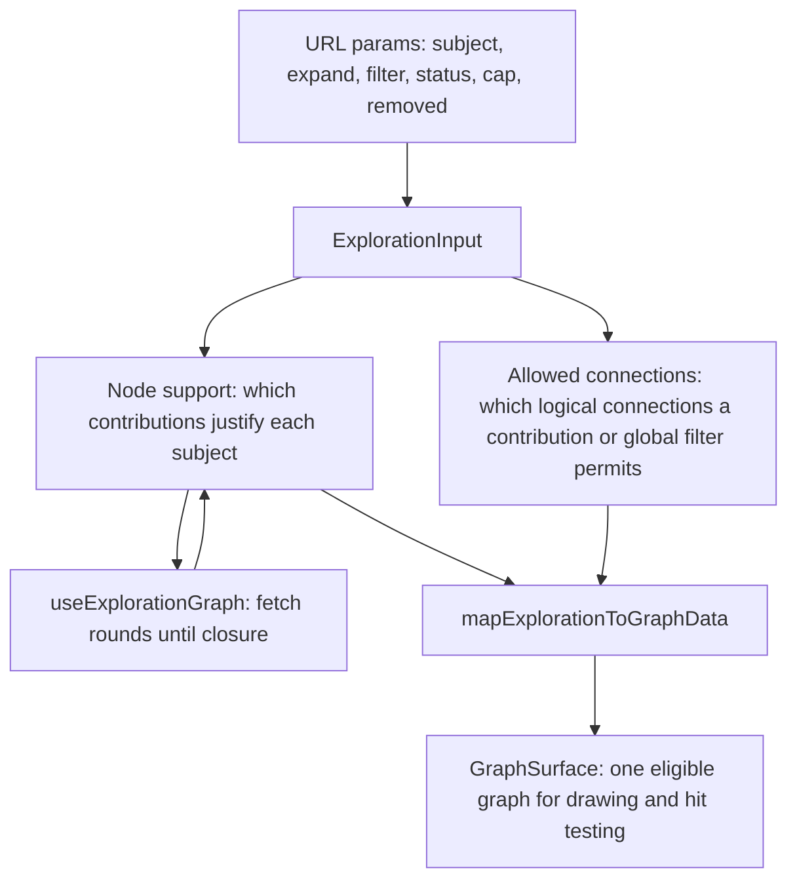

# Graph exploration

Status: **implemented**, in five phases on top of the rules below. This
merges what were three separate documents from the discovery interview,
the confirmed rules, and the implementation audit into one: the interview's
back-and-forth ("round one" through "round seven") is dropped as superseded
scaffolding, and what follows is the settled spec plus how it was built.

## Confirmed rules

1. Support separate local (selected subject) and global relationship filtering.
   Local choices reveal the selected subject's matching direct connections.
   Global relationship filters start off in exploration. Additional connections
   between existing subjects require the matching global filter, unless already
   supported by an active local contribution. Changing selection does not move
   or reinterpret earlier contributions. Local controls are the default in
   exploration. An explicit Selected subject / Entire graph switch chooses
   scope. With no subject selected, local controls are disabled; the UI never
   silently switches to global.
2. Filter state governs which nodes and relationships are shown. Search,
   expansion, and ordinary reset actions respect the current on/off choices
   rather than enabling excluded filters. Start over restores all filter
   defaults; Keep only selected resets global filters to their defaults (off)
   while retaining the selected subject's local choices. Defaults also apply
   when there is no saved or user-chosen state. Only connections allowed by
   the filters are visible; contribution retention still applies, subject to
   filter eligibility.
3. Companionship starts off. One manual toggle handles both recorded directions
   (`COMPANION_OF` and `ACCOMPANIED_BY`). When off, searches and other actions
   respect that exclusion; when on, companion relationships are eligible to
   appear. Explore, ordinary reset actions, and group or bulk relationship
   on/off toggles do not change this toggle. Bulk actions exclude companionship
   in both directions, preserving its current state whether on or off.
   Start over restores all filter defaults, including companionship off,
   while clearing exploration contributions and cap history. Explore includes
   companions when their filter has been manually enabled and excludes them
   when it is off; the action never changes filter state.
4. A subject introduced by global filter F retains its cap for F throughout
   that exploration, including later independent search/revelation, removal
   and reintroduction, and filter off/on. Manual subject expansions remain
   unrestricted. There is no next-global-hop action; repeated toggling cannot
   advance the same filter. A still-active global filter can act on manually
   revealed subjects that have never acquired its cap. Start over clears the
   cap history.
5. Removing a searched starting point removes only its search contribution.
   Another active contribution can retain the subject. Its own active
   expansions remain until explicitly collapsed.
6. Battle filters include participation-status filters, including injured.
   Battle node type starts off and is enabled manually. On first enablement
   all statuses are included, including status not recorded. Multiple selected
   statuses match with OR semantics (for example injured or captured);
   subsequent actions respect the user's status choices.
7. Battle status applies to each person's participation in a particular battle.
   A nonmatching participation connection is hidden. The person remains if
   independently supported by another eligible contribution, such as a family
   relationship; otherwise the person is removed from the visible exploration.
8. Collapse branch removes the selected subject's outward exploration
   contributions, including subsequent expansions belonging to that branch,
   while retaining the selected subject. Subjects independently supported by
   another branch or search remain. This is distinct from switching off one
   relationship contribution.
9. Remove from exploration (renamed **Hide node** in the interface) hides the
   selected subject and all its incident connections and collapses its
   branch. Independently supported descendants remain. Active global filters
   cannot immediately reintroduce the explicitly removed subject; explicitly
   searching it restores its eligibility. Both removal actions affect
   exploration state, not historical data, and browser Back can undo them.
10. Keep only selected subject and direct relations (renamed **Keep only this
    node**) replaces the visible exploration with that subject and its
    filter-eligible direct neighbors, removing all other subjects and
    connections. Reset global filters to their defaults (all off), rather
    than temporarily suspending them. Preserve the selected subject's local
    choices. Discard other exploration contributions so they cannot restore
    subjects outside this direct neighborhood.
11. Opening a graph installs, for its subject and without the reader pressing
    anything, every direct relation the subject has, and its line in both
    directions. One rule covers both the workspace and an embedded profile
    graph. A fresh visit and Start over on the workspace open on Prophet
    Muhammad; a person's profile opens on that person. Neither line is capped.
    Companionship stays off, as its own switch governs it (ADR 0007). Battles
    and every global relationship filter start off too, and restored URLs
    continue to represent saved exploration state.
12. Hidden nodes and relationships must not respond to hover or display hover
    content.
13. Buttons support optional icons through a shared component
    (`src/components/common/Button.tsx`), per the UI rule in `AGENTS.md`.
14. Search may show a result whose node type is disabled, with an explanation.
    Adding it requires the user to manually enable that type; search does not
    silently change node-type filters.
15. Expansions expose loading and retry states, preserve the existing graph on
    failure, and never silently truncate results. Empty results are shown
    explicitly without removing the existing exploration.
16. Direct and lineage contributions are independent. Collapsing one preserves
    subjects supported by the other, consistent with the retention rules.

Later revisions: [ADR 0007](adr/0007-filters-choose-the-relationship-vocabulary.md)
settles what Explore (previously All direct relations) applies and what Show
full graph turns on. The Paternal lineage button is withdrawn from the panel
while its future is decided; the action itself still restores from a saved
URL. Rule 1's scope choice is one slider carrying both scopes rather than two
buttons, and rule 6's status choices sit inside the battles group, under the
participation relation they qualify. Node kinds join the same panel, above
the slider, since they are not a scoped choice.

Rule 1 revises the scope model in [ADR 0004](adr/0004-merge-overview-into-exploration.md).
Rule 2 revises [ADR 0001](adr/0001-separate-expansion-from-connection-visibility.md)'s
unconditional connection visibility. Terms remain in [CONTEXT.md](../CONTEXT.md).

## Acceptance criteria

| Rule | Acceptance criterion |
| --- | --- |
| Selected scope | With Muhammad and his wives present, select Aisha and enable Father: that action introduces only Aisha's father. |
| Global scope | Global filters start off. Enabling global Father permits father connections between existing subjects. It also introduces missing fathers with the one-hop cap; toggling does not advance the cap. |
| Contribution removal | Collapse Muhammad's Wives contribution while Aisha has an independent Parents expansion: retain Aisha and her parents. |
| Connection visibility | Connections between retained subjects appear only when allowed by current filters, including inverse-pair presentation. |
| Filter preservation | Search, Explore, and ordinary resets preserve on/off filter choices; companionship starts off. Start over restores defaults. |
| Start over | After companionship is manually enabled and other filters changed, Start over restores every filter default, including companionship off, clears previous contributions and cap history, and reveals Muhammad with every direct relation and his line in both directions. |
| Bulk and group toggles | With companionship off, group/all-on leaves it off; with companionship on, group/all-off leaves it on. Both recorded directions retain the same state. |
| Companion expansion | Explore includes companions only when their filter is enabled, without changing that state. |
| Companion directions | The dedicated toggle handles both COMPANION_OF and ACCOMPANIED_BY under the chosen subject/global scope. |
| Persistent cap | Searching or removing/reintroducing a Father-introduced subject does not make it trigger global Father; manual expansion still works. Start over clears history. |
| Search contribution removal | Removing a searched subject preserves it if another contribution supports it, including its own active expansion. |
| Battle participation status | Battle node type defaults off. Manually enabling it initially includes all statuses and unrecorded status. Selecting injured and captured matches either. |
| Battle retention | A nonmatching participation connection disappears, while its person remains if another eligible contribution supports them. Status in one battle does not determine status in another. |
| Collapse branch | In Muhammad → Aisha → Abu Bakr, collapsing Aisha's branch keeps Aisha and removes Abu Bakr unless independently supported. |
| Remove from exploration | Removing Aisha hides her and all incident connections, collapses her branch, retains independently supported descendants, and blocks immediate global-filter reintroduction. Explicit search can restore her. |
| Keep only selected | Retain the selected subject and its eligible direct neighbors; reset global filters to defaults (off), preserve selected-local choices, discard other subjects and contributions. |
| Fresh view | Show the subject with every direct relation it has, seeded as its own expansions; companionship, battles, and global relationship filters off. The workspace's subject is Muhammad, a profile's is that profile's person. |
| Hidden hover targets | After filtering, collapsing, removal, or Keep only selected, hidden nodes and edges produce no hover highlight or tooltip. |
| Default control scope | Exploration opens with local controls; global controls are entered deliberately rather than used by default. |
| Removal restoration | Refresh/shared links preserve removals; search or explicit local expansion restores a removed subject; Start over clears removals; Show full graph respects them. |
| Disabled-kind search | Results explain disabled kinds and require manual enablement before adding a subject. |
| Loading and failure | Loading is visible; failure offers retry and retains the graph; empty results are explicit; full-depth results are not silently truncated. |
| Direct/lineage overlap | Collapsing either contribution preserves subjects still supported by the other. |

## How it was built

Built in five phases on top of the confirmed rules above, one commit each,
audited against application commit `53baccd`:

Node support and allowed connections are computed in one pass (`exploration.ts`,
`expansion.ts`, `lineageExpansion.ts`), replacing the earlier two-pass model
where `buildExploration` admitted every edge between visible subjects and
`filterVisibleGraph` subtracted excluded labels afterward — a hidden
connection is now one no contribution allows, not one a second pass removed.

`ExplorationInput` (`src/lib/relationship/exploration.ts`) carries `roots`,
`expansions`, `globalFilters`, `statuses`, `caps`, and `removed`, all
round-tripped through the URL (`urlState.ts`) for refresh, sharing, and
Back/Forward.

Key files: `src/lib/relationship/exploration.ts`, `expansion.ts`,
`lineageExpansion.ts`, `renderExploration.ts`, `status.ts`,
`src/components/graph/useExplorationGraph.ts`, `GraphCanvas.tsx`,
`ExpansionControls.tsx`, `RelationFilterPanel.tsx`, `GraphSearch.tsx`,
`GraphSurface.tsx`, and `src/components/common/Button.tsx` (added for the
shared icon-capable button graph actions now use).

Baseline at the audit versus after phase five:

| Check | At the audit | After phase five |
| --- | --- | --- |
| `npm test` | 46 files, 343 tests | 50 files, 421 tests |
| `npx tsc --noEmit` | clean | clean |
| `npm run lint` | one warning at GraphSurface.tsx:128 | clean |

Data and rollout: no schema migration or historical data change was needed.
PostgreSQL/Neo4j synchronization and fixed node positions are unchanged; any
graph structure change still needs a layout dry run, review, then `--apply`,
per `AGENTS.md`.
