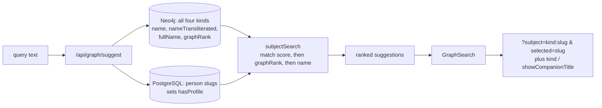

# Historical subjects are searchable

Status: implemented, phases one to six. The recomputation has run; the two
steps that remain must wait until this is deployed, since they remove data the
live code still reads -- see
[Data and operational consequences](#data-and-operational-consequences). One dependency is recorded under [Open issues](#open-issues); it
gates end-to-end verification of criteria 2 and 3, not the work itself.

Follows on from [graph-only people are
searchable](graph-only-people-search-plan.md), whose "Out of scope" note left
non-person kinds findable only if the current exploration had already loaded
them.

## Objective

Every [historical subject](../CONTEXT.md) -- person, title, battle, or event --
is findable by name from a blank exploration, ranked in one list, and revealed
by selecting it. Today only people are: `/api/people/suggest` covers people,
while `GraphSearch.tsx`'s client-side `matchGraphNodes` matches non-person
kinds against whatever the current view has already fetched. A title, battle,
or event that is not already on screen cannot be found at all.

The same work corrects a live regression. Since PR #35 merged,
`/api/people/suggest` returns graph-only people to the `/people` directory,
where `PeopleSearch.tsx` renders an unconditional Profile button
(`src/components/people/PeopleSearch.tsx:103`) that 404s for them, and filters
the PostgreSQL-backed list by a name that has no row.



## Agreed decisions

1. **A separate endpoint, not a widened one.** `/api/graph/suggest` covers all
   four kinds. `GraphSearch` calls it alone and `matchGraphNodes` is deleted,
   along with the now-dead `nodes` prop at its three render sites.
   `/api/people/suggest` returns to people with PostgreSQL profiles only. The
   two searches answer different questions: the directory searches profiles,
   the workspace searches the graph.

2. **Shared through a library function, not an internal HTTP call.** Both
   routes call one exported function. A route handler fetching another handler
   in the same app needs an absolute origin URL that differs per environment,
   serializes twice, and loses end-to-end types, for no isolation benefit.
   Both remain real routes; only what sits behind them is shared.

3. **Subject vocabulary throughout.** `src/lib/personSearch.ts` becomes
   `src/lib/subjectSearch.ts`: `SubjectSearchCandidate`, `rankSubjectSearch`,
   `filterAndRankSubjects`, `normalizeSubjectSearch`. One normalizer serves
   every kind, including its Latin spelling-equivalence table -- those
   spellings appear inside battle and event names too. `fullName` becomes an
   optional field that non-person candidates leave null.

4. **Non-person results become exploration roots.** Selecting any suggestion
   appends `subject=<kind>:<slug>` and sets `selected=<slug>`, identically for
   all four kinds. The exploration model already permits this:
   `parseSubjectParam` accepts every kind (`src/lib/relationship/urlState.ts:17`),
   `buildRouteFetchParams` routes any subject into `relationSubjects`, and the
   graph route matches by kind and slug across labels
   (`src/app/api/graph/route.ts:264`).

5. **Selecting a hidden kind reveals it.** `DEFAULT_KINDS` is
   `['person', 'title']` and `useExplorationGraph.ts:49` drops any fetched node
   whose kind is not included, so a battle root would otherwise be discarded in
   silence. Selecting a suggestion of a hidden kind adds that kind to the
   active set. Searching a battle by name is a sufficient statement of intent.

6. **The Companion title node is not a special case.** It ranks normally;
   selecting it sets `showCompanionTitle=1`, the same rule as decision 5
   applied to the one node with its own visibility flag. Ranking only breaks
   ties among subjects that already matched the query text, so it cannot
   surface unless the query matches its name.

7. **Neo4j is the candidate source for all four kinds.** The syncs already
   write `name` and `nameTransliterated` onto Title, Battle and Event nodes;
   people additionally carry `fullName`. One PostgreSQL query over person slugs
   sets `hasProfile`. Two queries, one candidate source.

8. **One ranking signal: `graphRank`.** Match score first, then `graphRank`,
   then name. `graphRank` is PageRank over the unified graph
   (`src/lib/graphRank.ts:1`), the only prominence signal defined across kinds.

9. **`nasabRank` and `titleCount` are removed as signals.** `graphRank`
   subsumes both -- `HOLDS_TITLE` edges already feed it, so a title count is a
   second vote for titles. The `/people` listing order
   (`src/app/api/people/route.ts:37`) and the workspace side list
   (`src/components/graph/GraphCanvas.tsx:331`) are repointed at `graphRank`.
   Measured on the live data, the two orderings correlate at Spearman 0.924,
   but the first page of `/people` changes substantially: senior companions
   rise (Umar 61st to 2nd, Abu Ubayda 143rd to 6th) and lineage-only figures
   fall (Abu Talib 4th to 18th). This is a deliberate product change and takes
   its own commit.

10. **`graphRank` is persisted to Neo4j.** `computeGraphLayout.ts` writes
    `layoutX/layoutY` to Neo4j but `graphRank`/`clusterId` only to PostgreSQL,
    so the 276 graph-only people have no `graphRank` at all. It is written to
    Neo4j alongside the coordinates. See
    [ADR 0006](adr/0006-persist-offline-computed-properties-to-neo4j.md).

11. **`hasProfile` and `kind` are explicit on every result.** The current
    convention that an absent `hasProfile` means "has a profile" is the kind of
    implicit rule that let the old `matchGraphNodes` comment go stale.

12. **No per-kind slot reservation.** One merged list capped at 10, no
    guarantee that each matching kind appears. Match score sorts before
    `graphRank`, so an exact battle-name match already outranks a
    contains-match on any person, and battle and event names are distinct from
    personal names. Revisit if the data grows well beyond its current size.

13. **No search index.** The whole searchable set is 659 subjects (576 people,
    40 titles, 26 battles, 17 events). Loading candidates and ranking them in
    memory, as the current endpoint does, stays appropriate at this size. This
    is a considered choice, not an omission.

14. **The graph route reads `graphRank` from Neo4j.** `attachNeo4jLayout`
    already matches every node on `(type, slug)` in one batched query; it
    returns `graphRank` alongside the coordinates, and `attachPostgresRanks` is
    deleted. Without this, decision 9's repointing of the side list would sort
    all 276 graph-only people last, since they have no PostgreSQL row -- the
    same defect `nasabRank` has today. One source also retires the hazard the
    route currently documents at `src/app/api/graph/route.ts:53`, where
    PostgreSQL rank enrichment has to be kept from overriding Neo4j
    coordinates.

15. **`clusterId` is no longer served.** Nothing has ever read it from the
    payload, and `src/lib/graphLod.ts`, the level-of-detail feature it was
    shaped for, is imported by nothing. It remains computed and persisted: it
    is a live input to the offline layout, which seeds cluster centres from it
    (`src/lib/graphLayout.ts:70`). This is not the `nasabRank` case, and it
    argues nothing about `src/lib/graphCluster.ts`.

## Implementation sequence

Phases are ordered by dependency. Phase one is first because `main` currently
ships the regression. Each phase is its own commit. Invoke the `write-comments`
and `unslop` skills when writing the code and the prose.

### Phase one: restore the people directory

`src/app/api/people/suggest/route.ts` drops its Neo4j branch and returns
PostgreSQL people only. Every result then has a profile, so
`PeopleSearch.tsx` needs no `hasProfile` guard.

### Phase two: persist `graphRank` to Neo4j

`scripts/graph/computeGraphLayout.ts` writes `graphRank` to Neo4j in the same
batched statement as `layoutX/layoutY` (line 58), with the existing
matched-count validation. `clusterId` stays PostgreSQL-only per decision 15.
Rerun `npm run graph:layout -- --apply`. Prerequisite for phase three's side
list and phase four's ranking of graph-only people.

### Phase three: remove `nasabRank` and `titleCount`

Its own commit, reviewed for the reordering rather than the refactor.

- Serve `graphRank` from `attachNeo4jLayout` and delete `attachPostgresRanks`
  (`src/app/api/graph/route.ts:53`); drop `clusterId` from the response and
  from `src/types/graph.ts`. This lands with or before the repointing below,
  which reads `graphRank` off the payload.
- Repoint `src/app/api/people/route.ts:37` and
  `src/components/graph/GraphCanvas.tsx:331` at `graphRank`.
- Move `computePageRank`, `rankByScore` and `CentralityAlgorithm` out of
  `src/lib/nasabRank.ts` into `src/lib/pageRank.ts` (proposed new path);
  `src/lib/graphRank.ts:14` imports from there.
- Delete `computeNasabRanks.ts`, the `people:rank` and `people:rank:validate`
  scripts, `docs/nasab-rank-pipeline.md`, and the `nasabRank` handling in
  `src/app/api/graph/route.ts` and `src/types/graph.ts`.
- Prisma migration dropping `nasabRank` and `nasabRankComputedAt` from Person.
- Remove the orphaned `p.nasabRank` property from Neo4j person nodes.

### Phase four: the endpoint

`src/lib/subjectSearch.ts` (renamed from `personSearch.ts`) and
`src/app/api/graph/suggest/route.ts` (proposed new path), per decisions 2, 3,
7, 8, 11.

### Phase five: the client

`src/components/graph/GraphSearch.tsx` fetches one endpoint, loses
`matchGraphNodes` and its `nodes` prop, and gains root-adding for every kind,
hidden-kind enabling, and the `showCompanionTitle` case. Remove the prop at
`GraphCanvas.tsx` lines 841, 932 and 950.

### Phase six: documentation

ADR 0006, and the "Relationship graph" section of `README.md`.
`CONTEXT.md` is already updated with **Historical subject**.

## Acceptance criteria

1. With no `subject` params in the URL, typing a battle name in the workspace
   returns that battle among the suggestions.
2. Selecting it appends `subject=battle:<slug>` and `selected=<slug>`, and the
   node renders.
3. If `battle` was not among the active kinds, selecting it also adds
   `kind=battle` alongside the previously active kinds.
4. Selecting the Companion title sets `showCompanionTitle=1`.
5. A graph-only person is findable by their `fullName` -- the full nasab string
   -- which the current endpoint discards at
   `src/app/api/people/suggest/route.ts:44`.
6. `/api/people/suggest` returns only people with a PostgreSQL row; every
   returned slug resolves at `/people/<slug>`.
7. Every `/api/graph/suggest` result carries an explicit `kind` and
   `hasProfile`, for all four kinds.
8. Results order by match score, then `graphRank`, then name. `nasabRank` and
   `titleCount` appear nowhere in `src/` or `scripts/`.
9. `npm run graph:layout -- --apply` writes `graphRank` and `clusterId` to
   Neo4j for every subject, and its matched-count check passes.
10. The unsearched `/people` listing is ordered by `graphRank`.
11. `/api/graph` returns a non-null `graphRank` for a graph-only person, and
    the workspace side list orders them by it rather than placing them last.
12. `/api/graph` no longer returns `clusterId`, and `attachPostgresRanks` no
    longer exists.

## Validation

- **Unit** (`src/lib/subjectSearch.test.ts`, renamed from
  `personSearch.test.ts`): ranking across kinds; the normalizer applied to
  battle and event names; a null `fullName` on non-person candidates; ordering
  by `graphRank` with ties broken by name. Covers criteria 7 and 8.
- **Route** (`src/app/api/graph/suggest/route.test.ts`, proposed, mirroring the
  existing people-suggest test): all four kinds returned; explicit `kind` and
  `hasProfile`; `fullName` present for a graph-only person; degradation when
  Neo4j is unreachable. Covers criteria 5 and 7.
- **Route** (`src/app/api/people/suggest/route.test.ts`): assert graph-only
  people are absent. Covers criterion 6.
- **Component** (`src/components/graph/GraphSearch.test.tsx`): selecting a
  non-person suggestion writes `subject=`; hidden-kind enabling; the
  `showCompanionTitle` case. Covers criteria 1 to 4. **`GraphSearch.test.tsx:140`
  ("selecting a non-person node sets ?selected=<slug>, not ?subject=") encodes
  the behavior decision 4 replaces and must be inverted, not extended.**
- **Route** (`src/app/api/graph/route.test.ts`): a graph-only person carries
  `graphRank` in the response; `clusterId` is absent. Covers criteria 11 and 12.
- **Script** (`scripts/graph/computeGraphLayout.test.ts` seam): the exported
  writer covers the Neo4j `graphRank` write, following the existing
  dry-run/`--apply`/exported-writer shape. Covers criterion 9.
- `src/lib/relationship/urlState.test.ts:87` already covers a non-person
  subject; no change needed.
- **Repository checks**: `npx tsc --noEmit`, `npm run lint`, `npx vitest run`
  (647 tests at time of writing, plus a pre-existing `useImperativeHandle`
  lint warning in `GraphSurface.tsx` that is not introduced here).
- **Manual**: criteria 1 to 4 in a real browser. Mobile verification is blocked
  on the graph-UI plan; see Open issues.

## Data and operational consequences

Three operator steps, and **step 1 is the only one that may run before this
work is deployed.** Steps 2 and 3 remove data the currently deployed code still
reads -- `/api/people`'s `orderBy`, `/api/graph`'s person select, and
`/api/people/suggest`'s Neo4j query all name `nasabRank` until this lands.
Dropping the column under the old code makes the directory listing throw.

1. **Recomputation.** `npm run graph:layout -- --apply`. Safe at any time: it
   only adds `graphRank` to Neo4j, which no deployed code reads yet. Until it
   runs, `graphRank` is absent there, so `/api/graph` returns null for every
   subject and both the side list and the suggestion ranking fall back to their
   name tie-breaker. Nothing errors; the ordering is simply flat.

   *Run 2026-09-08:* 659/659 subjects carry `graphRank` and `layoutX`/`layoutY`
   in Neo4j (576 people, 40 titles, 26 battles, 17 events), and 383 PostgreSQL
   rows were updated. The matched-count check passed.

2. **Migration**, after deploy. `npx prisma migrate deploy` applies
   `20260908000000_drop_person_nasab_rank`. Dropping `nasabRank` and
   `nasabRankComputedAt` is irreversible: the pipeline that produced them is
   deleted in the same change.
3. **Neo4j cleanup**, after deploy. `p.nasabRank`, written to all 576 person
   nodes by PR #35, is orphaned:

   ```cypher
   MATCH (p:Person) WHERE p.nasabRank IS NOT NULL REMOVE p.nasabRank
   ```

Two consequences that need no action:

- **Ordering change**: the `/people` first page changes visibly. See decision 9.
- **No index or pagination work** at 659 subjects. See decision 13.

## Out of scope

Two sibling plans, neither yet designed. Both were raised in the interview that
produced this plan and are recorded here so the observations are not lost.

**Expansion controls.** Reduce to four buttons -- All direct relations,
Ancestors, Paternal lineage, Descendants -- dropping Companion Of as an
expansion. "All direct relations" should respect the active relation filters
rather than overriding them. Includes the bug where titles are returned by the
API but not rendered; the observation to start from is that with the title kind
enabled in both cases, "Show full graph" renders titles and "All direct
relations" does not.

**Graph UI on mobile.** Search, filter and navbar are unscrollable on a phone,
making the workspace unusable there. Includes a loading indicator while nodes
are being fetched, and the existing `GraphSearch.tsx` TODO about the spinner
belonging in the dropdown rather than the input.

Also unchanged here: the embedded profile mini-graph's "View profile"
dead-end for a graph-only ancestor; `clusterId` and `src/lib/graphLod.ts`,
still computed or present but unused; and data enrichment (missing
`nameTransliterated` on graph-only people), which awaits a separate pass over
Siyar A'lam an-Nubala.

## Open issues

**Dependency, not a blocker.** Criteria 2 and 3 cannot be verified end to end
while an already-included kind fails to render (the titles bug above). The
expansion-controls plan should land first. If its cause turns out to sit in the
`kind` pipeline rather than the `relation` pipeline, decision 5's implementation
may need more than adding the kind, though no decision here would change.

**Nonblocking, recommended but not agreed.** `src/lib/graphLod.ts` and its test
are imported by nothing, and `scripts/graph/computeGraphLayout.ts:16` carries a
stale comment reference to them. Deleting both fits phase three's character.
Raised after the interview closed, so it is a proposal, not a decision.

**Assumption, since confirmed.** Every Title, Battle and Event node carries the
`name` needed for matching. Live counts after the recomputation: 40/40 titles,
26/26 battles, 17/17 events and 576/576 people carry both `name` and
`graphRank`. A spot check of `malik-ibn-thalabah`, a graph-only person, returns
`graphRank` 38 and a full nasab string, so criteria 5 and 11 have real data
behind them.
