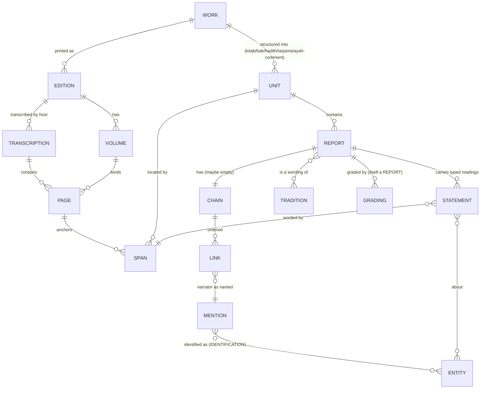
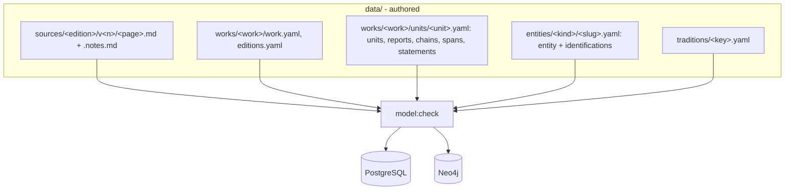

# Plan A: a data model built for the hadith standard

Status: proposal. Inputs: `00-evidence.md`, lesson 0004, ADRs 0008-0020, `prisma/schema.prisma`, `src/lib/catalog/types.ts`, `src/lib/history/batchSchema.ts`, the al-Zubayr batch, the Abu Ubaydah catalog module, `sources/siyar-alam-al-nubala-risalah/v4/5.md`.

Method: designed top-down from Sahih al-Bukhari, then tarajem, history and tafsir are shown as narrower cases of the same structures. The method held. One place it overreaches is called out in section 8 (tarajem identity work is not a hadith problem and gets its own record type).

## 1. Principles, and what the model refuses to hold

| # | Principle | Consequence |
|---|---|---|
| P1 | A text exists once: in the transcribed source page. | No `excerptArabic`, no `assertion`, no catalog value text. Every displayed Arabic string is *resolved* from a span at build time. |
| P2 | Every statement the app shows is an **attribution**: *work W, at span S, reports that speaker X said/did Y, heard by mode M from Z*. | The app never asserts a fact in its own voice. A "death year 18 AH" is a typed reading of a span, labelled with whose report it is. |
| P3 | A span's identity is anchored text, not a position. | Repaginating or re-splitting a page cannot re-point a citation; it either still resolves to the same characters or fails loudly. |
| P4 | People are global entities; how a book names them is a per-work **mention**. Identification of a mention with an entity is itself an attributed or authored, reviewable act. | Narrators can become nodes without inventing identities. |
| P5 | Our own contribution is limited to closed vocabularies: types, identifications, normalised numbers. Each carries who authored it and a review state. | No free prose by us in data. Notes for reviewers live in `summary.md`, never in a store. |
| P6 | Editions are distinct witnesses. Same publisher is not same edition; a printing/year/editor/host transcription is part of the identity. | Shamela's bare Sira volumes and vowelled volumes 4-5 are separate *transcriptions* of one edition and are flagged as such. |
| P7 | Files under `data/` are the authority; PostgreSQL and Neo4j are rebuilt from them, never edited (ADR 0010 kept). | Projection is a pure function. |
| P8 | Review is per record and does not hide data (ADR 0008 kept); publication is per record, not per batch hash. | Editing one record lapses only that record. |
| P9 | The Qur'an's text comes only from `Ayah`. A book quoting an ayah gets an `AyahRef`, and the span text is kept as the book printed it but never displayed as "the Qur'an". | |

The model **refuses** to hold:

- any Arabic string that is not either a resolved span of a transcribed page or a name in a closed vocabulary (titles, battle names) itself backed by a span;
- a value composed from several spans into one string (no `…` stitching; a list of spans is a list);
- paraphrase, translation or summary as data (English UI glosses are UI strings, separately labelled "Namaq's translation", optional, and never in the evidence path);
- a grade, verdict or identification without a source span or an authored-and-reviewed record saying who made it;
- a narrator, event or relation inferred by us that no span or identification supports;
- an edition identified only by publisher.

## 2. The model

### 2.1 Overview



### 2.2 Text layer: works, editions, transcriptions, pages, spans

| Record | Key | Fields | Notes |
|---|---|---|---|
| `Work` | `work:siyar` | title (span of the title page or authored name), author entity, genre (`tarajem`, `sira`, `hadith-collection`, `tafsir`, `history`) | One per composed book. |
| `Edition` | `ed:siyar-risalah-1405` | work, publisher, place, year, editors[], printing, volume count, numbering scheme | Two printings with different pagination are two editions. |
| `Volume` | `ed:siyar-risalah-1405/v5` | edition, ordinal (edition's own), label as printed (`الجزء ٢` stays a label), page range | Ends the `"1"` vs `"السيرة 1"` vs `4/` split: one ordinal, label is display only. |
| `Transcription` | `tr:shamela-10906` | edition, host, base URL, vowelled (bool), has footnotes (bool), fetched-at | A host's copy of an edition. Sira v1-2 vs v4-5 vowelling is a property here, per volume range. |
| `Page` | `ed:siyar-risalah-1405/v5/p41` | volume, printed page number, host page id, text file, notes file, `textHash` | File stays `data/history/sources/<edition>/v<vol>/<page>.md`. Paragraphs are a rendering detail, not addresses. |
| `Span` | content-addressed, see below | page start, page end, `quote` (anchor), `prefix`, `suffix`, `hash` | The only way anything points at text. |

**Span identity.** A span is stored as a W3C-style *TextQuoteSelector* over the normalised text of a page range of one edition:

```json
{ "edition": "ed:siyar-risalah-1405",
  "from": "v4/p41", "to": "v4/p41",
  "exact": "الزُّبَيْرُ بنُ العَوَّامِ بنِ خُوَيْلِدِ",
  "prefix": "٣ - ", "suffix": " بنِ أَسَدِ" ,
  "id": "sp:3f9a1c" }
```

- `exact` is the stored anchor, but it is *not* a display copy: the build re-finds it in the page text and fails if it is missing, ambiguous after prefix/suffix, or differs by one character. Display text is always the page's text at the found position.
- Normalisation for matching is fixed and versioned in one module: collapse whitespace, drop footnote markers `(١)`, keep every haraka. It is used by both the verifier and the reader (removes the duplicate in `verifyExcerpts.ts` and `sectionHeadings.ts`).
- `id` is a **minted** stable id (`sp:` + ULID), never a content hash. The selector is a field; `anchorHash` = hash(edition, exact) is a separate field. Mentions, identifications and publication revisions key on the minted id. A re-anchor (new prefix/suffix, new page after repagination, new normalisation version) that resolves to the same `exact` keeps the id, the publication and the review. Only a change to `exact` lapses the records that name the span.
- Footnote markers are dropped before matching and before any derivation (`words-to-number` runs on the normalised text; pinned by a test on `لَهُ سِتَّ (٢) عَشْرَةَ سَنَةً` -> 16).
- Honorifics: the page text is shown as printed (`-صَلَّى اللَّهُ عَلَيْهِ وَسَلَّمَ-` stays). The normalisation maps the host-inserted ligature `ﷺ` and the spelled formula to one token *for matching only*; display never substitutes one for the other. A Transcription records whether its host inserts ligatures.
- An unresolvable span blocks the build (`model:check` fails); at runtime there is no such state.
- A span is contiguous (ADR 0020 generalised). Discontiguous evidence is several spans on one statement.
- A span may cross pages (`from` != `to`); the matcher reads the joined text with page-break markers removed.

Rejected: character offsets (see 7.2).

### 2.3 Structure layer: units

A `Unit` is a node of the work's own structure, with the work's own numbering:

| `unitType` | Example key | Own number |
|---|---|---|
| `kitab`, `bab` | `work:bukhari/kitab:3/bab:10` | as printed (`كتاب العلم`, `باب ...`) |
| `hadith` | `work:bukhari/h:6018` | edition's number scheme recorded on `Edition.numbering` (Fath al-Bari / Sultaniyya / al-Bugha differ) |
| `tarjama` | `work:siyar/t:v4-3` | entry number as printed (`٣`) and volume |
| `ayah-comment` | `work:tabari/ayah:2:255/c:4` | ayah ref + order in the book |
| `chapter` (sira) | `work:siyar-sira/ch:hijra` | heading span |

`Unit.title` is a span. `Unit.numbers` is a map `{scheme: value}` so one hadith carries `fath: 6018`, `sultaniyya: 6018`, `atraf: [...]`. Every Unit has `extent`: start span and end span. Contents lists (ADR 0019) are derived from Units.

### 2.4 Speaker layer: mentions, entities, identifications

| Record | Key | Fields |
|---|---|---|
| `Entity` | `p:az-zubayr-ibn-al-awwam` | kind (`person`, `group`, `place`, `event`, `battle`), slug, display name **as a span ref** (the name in a chosen tarjama heading) |
| `Mention` | minted `m:` id | span (the name as written in the chain or text), role in context (`narrator`, `subject`, `speaker`, `addressee`, `mentioned`) |
| `Identification` | minted `id:` id | mention, entity, basis (`explicit-in-text`, `editor-footnote`, `other-work`, `namaq-authored`), evidence spans[], stance (`asserted`, `disputed`, `rejected`), authoredBy, reviewStatus |

One global narrator entity per person (P4). The mention keeps the book's exact form (`حَدَّثَنَا سُفْيَانُ` stays `سُفْيَانُ`); deciding it is Ibn Uyaynah rather than al-Thawri is an Identification with its basis. Multiple competing identifications of one mention are allowed. When identifications compete and each has a source basis, all are `disputed`; the graph draws one dashed edge per candidate, marked disputed, and the profile lists every candidate with its source. `asserted` is only for an uncontested identification. Namaq never picks a winner.

**Every entity reference goes through a Mention.** `Statement.about[]` and an entity-valued `Statement.object` hold Mention ids, never entity ids. The entity is reached only through an Identification. Basis `explicit-in-text` covers the cheap cases (the tarjama heading names its own subject; `ابْنُ عَبَّاسٍ` in the chain). The Mention must be in the same Unit, or in a cited span of the same Report.

**Display names.** An entity's display name is the text of one chosen Mention (`Entity.displayMention`), a cited span. An entity with no transcribed mention renders as `غير مسمى في المصادر المنقولة` / "not yet named in a transcribed source", never a slug. English transliterations are UI strings, labelled as Namaq's.

**Named things in vocabularies** (battles, titles, events) are Entities like persons: each work's spelling is a Mention, linked by Identification. Cross-work identity of an event (Siyar's `بَدْر` and Ibn Hisham's `غَزْوَةُ بَدْرٍ الكُبْرَى`) is an Identification with a basis.

### 2.5 Transmission layer: reports, chains, links

A `Report` is one transmitted item inside a Unit: a hadith, a narration in a tarjama (`قَالَ الوَاقِدِيُّ: ...`), a tafsir comment, or al-Dhahabi's own statement (author voice, empty chain).


| Record | Fields |
|---|---|
| `Report` | key, unit, `voice` (`transmitted`, `author`, `editor-footnote`, `reported-anonymous`), `chainState` (`complete`, `deferred`), `isnadSpan`, `matnSpans[]` (contiguous each; multiple only when the book interrupts the matn), `origin` (the final speaker Mention, or for `reported-anonymous` an `unnamed-group` Mention whose span is the word itself: `آخَرُونَ`, `قِيْلَ`, `بَعْضُ أَهْلِ العَرَبِيَّةِ`), `kind` (`marfu`, `mawquf`, `maqtu`, `author-statement`, `athar`), `muallaq` (bool), `tahwil` (bool), `ordinal` within unit |
| `Chain` | report, ordered `links[]`, `branches[]` for tahwil (`ح`) |
| `Link` | position, `mention`, `mode` (closed vocab, below), `modeSpans[]` (the formula as printed; a list because `سَمِعْتُ ... يَقُولُ` is discontiguous), `gapBefore` (`none`, `muallaq-dropped`, `mubham`, `sentence-gap`) |

`mode` vocabulary, each always backed by `modeSpan`: `haddathana`, `haddathani`, `akhbarana`, `akhbarani`, `anbaana`, `sami'tu`, `qala`, `an` (عنعنة), `anna`, `kataba-ilayya`, `qara'tu-ala`, `quri'a-ala`, `wijadah`, `qala-li`, `dhakara`, `balaghani`, `yudhkaru`, `ruwiya`, `unspecified`. Each code carries a derived class, `jazm` or `tamrid`, so `وَقَالَ اللَّيْثُ` (qala, jazm) and `وَيُذْكَرُ عَنْ` (yudhkaru, tamrid) never collapse. Every projected edge carries the mode code, the class and the `modeSpans` ids.

`muallaq` is valid only on reports in a Work of genre `hadith-collection`. A chain-less view in tafsir or tarajem (`وَقَالَ آخَرُونَ`, Siyar's `وَقِيْلَ`) is `voice: reported-anonymous`; `attributedTo` derives "unnamed, as reported in <work>", never the author.

**The work's own riwayah.** `Edition.riwayah` is a Chain of Mentions with spans from the edition's introduction or colophon (for al-Bukhari: al-Firabri, then the line the edition follows, e.g. al-Yunini's collation). Its first `حَدَّثَنَا` belongs to al-Bukhari; the riwayah sits above it. A marginal riwayah variant is a footnote span joined to the main-text span by a `Collation` record with `variant.riwayah` = the siglum span. The vocabulary names the printed formula; it does not judge it (whether `an` from a mudallis is connected is a grading, i.e. another report).

**Muallaq.** `muallaq: true`, first link carries `gapBefore: muallaq-dropped`, mode taken from the formula (`وَقَالَ`, `وَيُذْكَرُ`). The model never fills the dropped links; a connected chain elsewhere is joined through the Tradition layer.

### 2.6 Tradition layer: reports vs wordings

`Tradition` groups reports that scholars treat as one hadith across chapters and books. It is an **authored grouping** with evidence: a `Membership` record (report, tradition, basis: `same-origin-and-matn`, `editor-takhrij` with the footnote span, `atraf-index`, `namaq-authored`), with review state. The matn wording is never merged: each report's matnSpans are its wording; a diff view is computed. Bukhari's repetition of a hadith in ten chapters is ten Reports, ten Units, one Tradition.

### 2.7 Statement layer: typed readings

A `Statement` is the only bridge from text to a profile value or a graph edge.

| Field | Meaning |
|---|---|
| `key` | stable, e.g. `zubayr/full-name@siyar` |
| `report` | the report whose wording carries it (author-voice for al-Dhahabi's own line) |
| `spans[]` | each contiguous; the display text is these spans, shown as separate quotes |
| `about[]` | Mention ids (resolved to entities only through Identifications) |
| `predicate` | closed vocabulary: `name.full`, `name.kunya`, `name.laqab`, `born.year`, `died.year`, `died.place`, `appearance`, `virtue`, `relation.son-of`, `relation.married`, `participated`, `absent-from`, `status-at`, `title`, `quran.revealed-about`, `tafsir.meaning-of`, `grading` |
| `object` | typed: Mention id, `{hijri: 18}`, ayah ref, title ref; or `null` when the span itself is the value (names, appearance, virtues) |
| `normalisation` | for typed objects, how the reading was made: `literal` (digits in text), `words-to-number` (`سَنَةَ ثَمَانِ عَشْرَةَ` -> 18), `editor` (from a footnote span) |
| `attributedTo` | derived: the report's origin speaker plus chain, never typed by hand |
| `authoredBy`, `reviewStatus`, `published` | per record |

Competing reports are simply two Statements with the same `about`+`predicate` and different objects. The profile shows all of them, ordered by the work's own preference when a span states it (`وَالأَوَّلُ أَصَحُّ` becomes a `preference` Statement pointing at the preferred one, itself sourced). `confidence` is removed; a judgement is a report or nothing.

### 2.8 Grading

A grading is a Report (author voice or transmitted) whose Statement has predicate `grading`, object the term **as quoted** (a span: `صحيح`, `حسن`, `ثِقَةٌ`, `صَدُوقٌ`, `على شرطهما` ...), target = a report, a tradition, or a narrator Mention (jarh wa ta'dil). Bukhari's own claim is `Work.authorClaim` with a span of the title or introduction and an explicit `scope: musnad-marfu`; it does not cover muallaqat, tarajim al-abwab or mawquf athar. No report ever shows a grade field unless a `grading` Statement targets that report; the work banner shows the authorClaim text with its scope.

## 3. Worked examples

### 3.1 Siyar: al-Zubayr's full name (from `az-zubayr-ibn-al-awwam/batch.json`)

Today: `assertion` (unvowelled, ends `القرشي الأسدي`), `excerptArabic` (vowelled, contains `* (ع)`), catalog value (a third text). After:

```yaml
unit:  { key: work:siyar/t:v4-3, type: tarjama, numbers: {printed: "٣"}, volume: v4, title: sp:zb-title }
report: { key: r:siyar/v4-3/0, unit: work:siyar/t:v4-3, voice: author, chain: [], origin: entity:al-dhahabi }
span sp:zb-nasab:
  edition: ed:siyar-risalah-1405, from: v4/p41, to: v4/p41
  exact: "الزُّبَيْرُ بنُ العَوَّامِ بنِ خُوَيْلِدِ بنِ أَسَدِ بنِ عَبْدِ العُزَّى"
  prefix: "٣ - "
span sp:zb-nasab-2:
  exact: "ابْنِ قُصَيِّ بنِ كِلاَبِ بنِ مُرَّةَ بنِ كَعْبِ بنِ لُؤَيِّ بنِ غَالِبٍ"
  prefix: "* (ع) "          # across the paragraph break; whitespace collapsed
mention m:zb-head: { span: sp:zb-name, role: subject }        # exact: "الزُّبَيْرُ"
identification: { mention: m:zb-head, entity: p:az-zubayr-ibn-al-awwam, basis: explicit-in-text, stance: asserted }
mention m:zb-father: { span: sp:zb-awwam, role: mentioned }  # exact: "العَوَّامِ", prefix "الزُّبَيْرُ بنُ "
identification: { mention: m:zb-father, entity: p:al-awwam-ibn-khuwaylid, basis: explicit-in-text,
                  evidence: [sp:zb-nasab], stance: asserted, reviewStatus: not-reviewed }
statement:
  key: zubayr/full-name@siyar
  report: r:siyar/v4-3/0
  about: [m:zb-head]
  predicate: name.full
  spans: [sp:zb-nasab, sp:zb-nasab-2]   # two contiguous spans; the * (ع) sigla between them is not part of the name
  object: null
statement:
  key: zubayr/son-of@siyar
  predicate: relation.son-of
  spans: [sp:zb-nasab]
  about: [m:zb-head]
  object: m:zb-father
```

The same page, a few lines on, has a transmitted report. It is a separate Report, never folded into the author's:

```yaml
report: { key: r:siyar/v4-3/7, voice: transmitted, chainState: deferred,   # until phase 5
          origin: m:zb-urwah }                     # exact: "عُرْوَةَ"
# span: "وَرَوَى: اللَّيْثُ، عَنْ أَبِي الأَسْوَدِ، عَنْ عُرْوَةَ، قَالَ: أَسْلَمَ الزُّبَيْرُ ابْنُ ثَمَانِ سِنِيْنَ"
statement: { predicate: islam.age, object: {years: 8, normalisation: words-to-number}, about: [m:zb-in-urwah] }
# versus al-Dhahabi's own "أَسْلَمَ وَهُوَ حَدَثٌ، لَهُ سِتَّ (٢) عَشْرَةَ سَنَةً" -> author voice, 16
```

Two ages, two speakers, both shown.

The profile renders "al-Dhahabi, Siyar 4/41:" followed by the two spans as printed. Nothing to drift.

### 3.2 Bukhari: one tradition, two chains (invented but realistic)

Unit `work:bukhari/kitab:al-adab/bab:man-kana-yu'minu/h:6018` (illustrative numbering). Text:

> حَدَّثَنَا قُتَيْبَةُ بْنُ سَعِيدٍ، حَدَّثَنَا أَبُو الأَحْوَصِ، عَنْ أَبِي حَصِينٍ، عَنْ أَبِي صَالِحٍ، عَنْ أَبِي هُرَيْرَةَ، قَالَ: قَالَ رَسُولُ اللَّهِ ﷺ: «مَنْ كَانَ يُؤْمِنُ بِاللَّهِ وَالْيَوْمِ الآخِرِ فَلاَ يُؤْذِ جَارَهُ»

Elsewhere, `kitab:al-riqaq/h:6475`:

> حَدَّثَنَا عَبْدُ اللَّهِ بْنُ يُوسُفَ، أَخْبَرَنَا اللَّيْثُ، قَالَ: حَدَّثَنِي سَعِيدٌ الْمَقْبُرِيُّ، عَنْ أَبِي شُرَيْحٍ الْعَدَوِيِّ، قَالَ: ... «مَنْ كَانَ يُؤْمِنُ بِاللَّهِ وَالْيَوْمِ الآخِرِ فَلْيُكْرِمْ جَارَهُ»

| Link | 6018 mention | mode (span) | 6475 mention | mode (span) |
|---|---|---|---|---|
| 1 | قُتَيْبَةُ بْنُ سَعِيدٍ | haddathana `حَدَّثَنَا` | عَبْدُ اللَّهِ بْنُ يُوسُفَ | haddathana |
| 2 | أَبُو الأَحْوَصِ | haddathana | اللَّيْثُ | akhbarana `أَخْبَرَنَا` |
| 3 | أَبُو حَصِينٍ | an `عَنْ` | سَعِيدٌ الْمَقْبُرِيُّ | haddathani `حَدَّثَنِي` |
| 4 | أَبُو صَالِحٍ | an | أَبُو شُرَيْحٍ الْعَدَوِيُّ | an |
| 5 | أَبُو هُرَيْرَةَ | an | — | — |
| origin | رَسُولُ اللَّهِ ﷺ via `قَالَ` | | رَسُولُ اللَّهِ ﷺ | |

- Two Reports, two Chains, two matn wordings (`فَلاَ يُؤْذِ` vs `فَلْيُكْرِمْ`), each its own span. Neither is copied.
- `Identification` for `أَبُو حَصِينٍ` -> `p:abu-hasin-uthman-ibn-asim`, basis `other-work`, evidence span from Tahdhib al-Kamal once transcribed; until then `namaq-authored`, `not-reviewed`, and visible (ADR 0008) with an "identified by Namaq, not reviewed" label on the edge.
- Tradition `t:iman-wa-jar` has memberships for both with basis `namaq-authored` and is labelled as a Namaq grouping. Whether these are one hadith (they come from different companions) is exactly why grouping is a reviewable act, not a merge.
- A muallaq variant, e.g. `وَقَالَ اللَّيْثُ: ...` at the head of a bab: Report with `muallaq: true`, link 1 = اللَّيْثُ, `gapBefore: muallaq-dropped`, `mode: qala`.

### 3.3 Tafsir quoting Ibn Abbas

Al-Tabari on 2:255, a report like:

> حَدَّثَنِي مُحَمَّدُ بْنُ سَعْدٍ، قَالَ: حَدَّثَنِي أَبِي، ... عَنِ ابْنِ عَبَّاسٍ: ﴿وَسِعَ كُرْسِيُّهُ السَّمَاوَاتِ وَالأَرْضَ﴾ قَالَ: كُرْسِيُّهُ عِلْمُهُ

```yaml
unit: { key: work:tabari/ayah:2:255/c:4, type: ayah-comment, ayahRef: "2:255" }
report: { voice: transmitted, origin: m:ibn-abbas, kind: mawquf, chain: [محمد بن سعد/haddathani, أبي/haddathani, ..., ابن عباس/an] }
span sp:quoted-ayah: { exact: "وَسِعَ كُرْسِيُّهُ السَّمَاوَاتِ وَالأَرْضَ" }    # role: quotation-of-ayah
statement:
  predicate: tafsir.meaning-of
  about: [m:tabari-ibn-abbas]      # the chain's own mention; Identification basis explicit-in-text
  spans: [sp:kursi-ilm]          # exact: "كُرْسِيُّهُ عِلْمُهُ"
  object: { ayah: "2:255", word: "كُرْسِيُّهُ" }
```

`sp:quoted-ayah` gets an `AyahRef` and is shown as a link to `Ayah` 2:255, rendered from the `Ayah` table. The span is retained only to locate the comment. The `عوفي` chain (sons of Atiyyah) gets ordinary identifications, so the known weakness of that isnad can later attach as a sourced grading.

### 3.4 Tarjama with a disputed identification

Siyar, entry for `أَبُو كَبْشَةَ مَوْلَى رَسُولِ اللهِ ﷺ` (pattern: al-Dhahabi reports names disputed: `اسْمُهُ سُلَيْمٌ، وَقِيْلَ: ...`). Model:

- One Unit (tarjama), one Entity `p:abu-kabshah-mawla`.
- Each name variant is a separate Statement `name.full` with its own span (`سُلَيْمٌ`; the `وَقِيْلَ` alternative), both published, attributed to al-Dhahabi; the `وَقِيْلَ` span's lead word is kept in the span so the reader sees it is the minority report.
- The `وَقِيْلَ` alternative is a `reported-anonymous` Report with origin `unnamed-group` (span `قِيْلَ`), so it is not attributed to al-Dhahabi.
- Where the dispute is *who the entry is* (one book says the companion, another a tabi'i of the same name), the heading Mention gets two `Identification`s, both `disputed`, each with basis `other-work` and its span. The graph draws two dashed disputed edges; the profile shows both. Namaq picks neither.
- A contested Companion (AGENTS.md) is not dropped: `status.sahabi` Statement from the work that holds it, a contrary Statement from the one that denies it.

## 4. Extraction

### 4.1 What an extractor may write

| May write | May not write |
|---|---|
| Page files, exactly as the host transcription (one fetch script; no hand typing) | Any Arabic outside a page file except a span's `exact`/`prefix`/`suffix` |
| Spans (selector JSON) | Joined or ellipsis spans |
| Units, Reports, Chains, Links with mode from vocabulary | A link not printed in the isnad (no filling muallaq gaps) |
| Statements with predicate/object from vocabulary | `confidence`, free `assertion`, summaries |
| Identifications with a basis | An identification without basis, or with `asserted` over an existing reviewed one |
| Tradition memberships with basis | Merging two reports' wordings |
| Reviewer notes in the change's `summary.md` | Notes in records |

Agents produce selectors by copying from the page file via a tool (`namaq span <page> "<text>"`) that returns the selector or an error; they never type Arabic into a record.

### 4.2 Mechanical checks (`npm run model:check`, one command, runs in CI)

1. Every span resolves exactly once in its edition's text (normalisation module v-N).
2. Every span's `exact` equals the resolved text byte-for-byte after normalisation; haraka count equal.
3. Mention spans lie inside their report's isnad span; matn spans inside the unit's extent; each Link's `modeSpans` lie between the previous mention and the next one. An `author`-voice report whose span opens with `رَوَى`, `قَالَ <name>`, `حَدَّثَ`, `عَنْ`, `قِيْلَ` or `وَقَالَ آخَرُونَ` fails.
4. Chain ordering matches text order of mentions.
5. Vocabulary closure: predicate, mode, kind, basis, unitType.
6. Typed objects re-derivable: `words-to-number` normalisation is recomputed from the span and must agree.
7. Every published Statement's report and spans are published; every entity reference is a Mention with at least one Identification; every graph edge comes from a published Statement whose Mentions have Identifications (disputed ones drawn as disputed); no report carries a grade unless a `grading` Statement targets it.
8. Ayah quotations carry an AyahRef and the referenced `Ayah` exists; no field in any store holds Qur'an text except `Ayah`.
9. Volume ordinal agrees with the page's host id range (ADR 0011 check kept).
10. Projection idempotence: project twice, diff is empty.

### 4.3 What a person reviews

- That a span *is* the value (the name, the year, the virtue) and that the speaker is right (the ~65/300 meaning changes in the evidence were speaker and scope errors, which no check finds).
- Every `namaq-authored` Identification and Tradition membership.
- Every `normalisation: editor`.

### 4.4 Unit of approval

The **record**, with publication per record: `published: {revision: <hash of this record's fields and the exact text of the spans it names>, by, at}`. Editing a record, or a change in a named span's `exact`, lapses only that record; a re-anchor does not. Only the owner publishes: `npm run model:publish -- <change set>`, run on the owner's explicit instruction, writes per-record revisions for every record in a PR's diff; agents never set `published`. Unreviewed records are shown with their status in every genre unless the owner decides otherwise (Q2). Review status (`not-reviewed`, `reviewed`, `contested`) stays separate (ADR 0008); "mark reviewed" still needs the owner's explicit instruction.

### 4.5 Disagreement and variants

| Kind | Stored as |
|---|---|
| Two reports in one work disagree (death 17 vs 18) | Two Statements, one `preference` Statement if the author states one |
| Two works disagree | Two Statements from two works; nothing chooses |
| Two editions differ in wording | Two Pages, two spans; a `Collation` record (span A, span B, `variant` type) is optional and authored |
| Two transcriptions of one edition differ (vowelled vs bare) | Prefer the higher-fidelity transcription per volume range in `Transcription`; the other is not loaded |
| Two extractors disagree on a span or identification | Both records exist; one `published`, the other `contested`; resolved in review |

## 5. Storage and projection



| Store | Holds | Authored? |
|---|---|---|
| `data/history/sources/...` | page text and notes, unchanged layout | fetched, never edited by hand |
| `data/works/<work>/units/*.yaml` (supersedes ADR 0010's `batches/` layout; ADR 0023) | one file per Unit (a tarjama, a hadith, an ayah comment), holding its reports, chains, spans and statements | yes |
| `data/entities/*` | entities and identifications | yes |
| PostgreSQL | `Work`, `Edition`, `Volume`, `Page`, `Span` (with resolved text cached), `Unit`, `Report`, `Link`, `Mention`, `Entity`, `Identification`, `Statement`, `Tradition`, `Membership`; `Ayah` unchanged | derived |
| Neo4j | nodes: Entity (person, battle, event); edges: relation Statements (`SON_OF`, `MARRIED`, `PARTICIPATED_IN`, `ABSENT_FROM`) and `NARRATED_FROM {mode, report, work}` from adjacent links with asserted identifications; Report nodes optional | derived |
| Profile values | computed from Statements; plus `LegacyValue` rows shown as "no source yet" | derived, never authored |
| `data/archive/pre-model/` | frozen excerpts, assertions and catalog values at the migration tag | read-only, never projected |
| Graph layout (`graph:layout`) | unchanged process, `NARRATED_FROM` excluded from centrality by default | derived |

Derived, never authored: resolved span text, `attributedTo`, profile fields, graph edges, contents lists, volume labels, narrator-to-narrator edges, tradition diff views.

## 6. Migration

### 6.1 Mapping

| Today | Becomes | Fate |
|---|---|---|
| Page store `v4/41.md` | Page, unchanged files | kept |
| Anchor `4/41-p3` | Span selector, computed once from excerpt within paragraph | dropped after conversion |
| `citation.excerptArabic` | Span `exact` (if it resolves) | archived under `data/archive/pre-model/`, never displayed |
| `citation.volume`, `pageReference` | Volume ordinal, Page | label kept only as display |
| `citation.extractionUrl` | derived from Transcription + host id | dropped |
| `claim.assertion` | nothing | archived, not projected |
| `claim.confidence` | `preference` Statements where sourced; else nothing | dropped |
| `claim.field` / relation | Statement predicate | kept, renamed |
| `claim.reviewStatus` | Statement reviewStatus | kept |
| batch `approval` hash | per-record `published` | replaced |
| `SourceAccount` | Unit (`tarjama`/`chapter`) | kept, renamed |
| Catalog `fields.*.value` text | nothing; value = spans of its Statement | dropped |
| Catalog typed values (`deathYearHijri`, `sex`) | Statement `object` with normalisation | kept |
| Catalog participations, titles, relations | Statements | kept |
| `CatalogVirtue` (ADR 0020) | Statement `virtue`, one per span | kept in spirit |
| `Utterance` (ADR 0015) | Report with origin speaker | merged |
| `legacy-unreviewed` | `LegacyValue` records (value, field, origin file); shown under a "no source yet" label (ADR 0008, AGENTS.md) until promoted or retired by the owner | kept and displayed |
| Citations whose excerpt does not resolve | `LegacyValue` with the archived excerpt, same label | kept and displayed until fixed |
| Seeds `prisma/personSeedData*.ts`, `neo4j/*Seed*` | checklist feed for `LegacyValue` | retired after phase 4 |
| `HistoricalClaim`, `Citation`, `SourcePassage` tables | `Statement`, `Span` | dropped |

### 6.2 Phases

| Phase | Work | Acceptance |
|---|---|---|
| 0 Decide | Owner answers section 9; ADR 0021 "a span is a quote selector", ADR 0022 "every value is an attributed statement", ADR 0023 "authoring layout under data/works and data/entities" (supersedes 0010's layout, keeps its authority rule); rewrite the AGENTS.md ellipsis rule (several spans instead); apply the ADR 0020 virtue migration to the database first | ADRs merged, AGENTS.md updated, 0020 migration applied |
| 1 Text core | Normalisation module (one copy), Span type, resolver, `namaq span` tool, `model:check` steps 1-2, 9 | All 1,354 v4-5 citations converted to spans or listed as failing with reason; zero silent conversions |
| 2 Statements for Siyar | Convert claims+catalog to Unit/Report/Statement files with voice decided per report (author; transmitted with `chainState: deferred` and a named origin; reported-anonymous); Mentions and Identifications for every entity reference. The extractor decides voice, the owner reviews per record, check 3 catches the mechanical cases; profile reads Statements | Every profile value of the 105 batches renders from spans; diff report of values whose displayed text changes, reviewed by owner; `catalog:validate` replaced |
| 3 Records publish | Per-record publication; retire batch approval | Editing one statement lapses only it (test) |
| 4 Projection | Tag the pre-migration commit `pre-model`. New Prisma tables and Neo4j labels **beside** the old ones for one release, with a per-profile old-vs-new diff report; drop old tables only after | Rebuild from empty matches; unresolved-citation list empty or each item retired by the owner; diff report reviewed; graph edge counts equal minus documented removals |
| 5 Chains | Reports with chains for Siyar's own isnads (`قَالَ ابْنُ سَعْدٍ: أَخْبَرَنَا ...`), mentions, identifications, `NARRATED_FROM` behind a UI toggle; AGENTS.md narrator rule rewritten | 20 tarajem fully chained and reviewed |
| 6 Hadith pilot | Bukhari, one edition, one transcription, Kitab al-Ilm | All chains pass checks 3-4; 10 traditions with memberships reviewed |
| 7 Tafsir pilot | One tafsir, one surah | Ayah refs pass check 8 |

### 6.3 Risks

| Risk | Mitigation |
|---|---|
| Quote anchors ambiguous on formulaic text (`حَدَّثَنَا`) | prefix/suffix required when `exact` < 12 letters; check 1 fails on ambiguity |
| Host re-transcribes a page | page `textHash`; refetch breaks spans loudly, a re-anchor tool proposes new selectors for review |
| Volume of hand work for chains | see 6.4; pilot first, then decide scope |
| Way back | `pre-model` tag, dual tables for a release, archive files; rollback = redeploy the tag and re-run the old projection |
| Build time and size | ~5k pages; resolution is one pass per page with spans grouped by page, cached by page hash + normalisation version; Span table with cached text estimated under 200 MB for Siyar plus Bukhari |
| Owner fatigue reviewing identifications | identifications unpublished until reviewed; graph shows only published |
| Displayed names change (vowelled now) | phase 2 diff reviewed once |

### 6.4 Costs and review budget

| Item | Records | Human decisions |
|---|---|---|
| Plain Siyar value today | claim + citation (2) | 1 |
| Plain Siyar value here | Report (often shared) + 1-2 Spans + Statement + 1-3 Mentions + 1-3 Identifications, about 6 | voice decision + identifications (mostly `explicit-in-text`, reviewed in bulk) |
| One Bukhari report, 5 links | unit, report, 2 isnad/matn spans, 5 mentions, 5 mode spans, 5 identifications, 1-2 memberships, about 20 | about 5 identifications |
| Kitab al-Ilm pilot (~75 reports) | ~1.5k | ~375 identification links, est. ~120 distinct |
| All of Bukhari (~7.5k reports incl. repeats) | ~150k | ~37k identification links, est. ~2k distinct narrators; `namaq-authored` until Tahdhib is transcribed |

Identifications are reviewed **per distinct (mention text, neighbouring narrator) pair**, not per link: one decision covers every link with the same form and the same teacher or student, and the tool fans it out. Agents propose; the owner reviews. Full Bukhari stays out of scope until the pilot measures minutes per decision.

### 6.5 Tests

Colocated Vitest per check: span resolution (including the `* (ع)` paragraph-break prefix and `سِتَّ (٢) عَشْرَةَ` -> 16), re-anchor keeps ids and publication, opener-word voice check, mode class derivation, `NARRATED_FROM` projection (one edge per adjacent identified link, disputed edges marked, mode carried), profile resolution from Statements and LegacyValue, no grade without a grading Statement.

### 6.6 Qur'an text

`Ayah` is the only Qur'an text; its mushaf edition (rasm, vowelling, riwayah such as Hafs) is named in an ADR. Qur'an quotations anywhere, Siyar included, are found by a matcher over normalised text against `Ayah`, proposed as `AyahRef` on the span, and confirmed by a reviewer.

## 7. Alternatives rejected

1. **Keep copy-and-check** (today plus a better verifier). Rejected: the evidence shows checks pass wrong inputs and copies drift (414/727 values, 25 dead `assertion` PRs). Removing the copy removes the class of bug.
2. **Character offsets for spans.** Simple and exact, but any re-fetch, whitespace fix or footnote-marker change silently re-points every later span on the page, the same failure as paragraph indexes. Quote anchors fail loudly instead.
3. **Paragraph anchors kept** (`4/41-p3` + sub-offsets). Rejected for the same reason; paragraphing is the host's, not the book's.
4. **Narrators per work** (each book's narrators separate, no global entity). Avoids identification errors but makes the isnad graph useless across books and duplicates companions. Instead: per-work Mentions plus a reviewed Identification gives both.
5. **Claims as free text with a field tag** (today's `assertion`). Rejected: it is our words. Typed Statements with span-valued objects hold the source's words only.
6. **One merged "hadith" record per tradition with variant wordings as diffs.** Rejected: merging by our judgement loses which book said what; Tradition is a grouping over unmerged Reports.
7. **TEI-XML markup inline in the page files.** Very expressive, but edits the source text files and makes every annotation a change to the book; standoff spans keep pages pristine.
8. **Approve by batch hash.** Rejected: one typo lapses 40 records (evidence: 3 stale approvals).
9. **Content-hash ids for spans and mentions** (the first draft). Rejected after review: a one-haraka change in a prefix or a normalisation bump cascades through mention, identification and publication keys. Minted ids plus a separate `anchorHash` keep identity while the quoted text is unchanged.
10. **Entity ids directly in Statement objects.** Cheaper, but each is an unrecorded identification by us. Rejected for Mention + Identification everywhere.
11. **Hide `legacy-unreviewed` values until sourced.** Cleaner, but breaks ADR 0008 and blanks seed-backed people overnight. Rejected; shown with a "no source yet" label.
12. **Pick one `asserted` identification in a dispute.** Rejected: choosing is our opinion.
13. **Single mode code without a jazm/tamrid class.** Rejected: loses the difference between `وَقَالَ` and `وَيُذْكَرُ` in every derived edge.

## 8. Stress tests

| Scenario | Fits | Strains |
|---|---|---|
| Another Sira work (Ibn Hisham) | New Work/Edition; its Ibn Ishaq chains are Reports; same events get Statements from two works side by side | Event identity across works ("the same battle") needs Identification for events too, not only persons; dates in mixed calendars need a richer object type |
| Bukhari | Designed for it: chains, modes, muallaq, tahwil, numbering schemes, traditions | Tahwil branches as `branches[]` is clumsy for complex convergences; `NARRATED_FROM` edges per link explode the graph (est. 7k hadith x 5 links), so the graph must filter by tradition; numbering schemes need a mapping table, not just a map per unit |
| Tafsir | Ayah-comment units, mawquf reports, AyahRef | Long comments with no chain mixing the author's voice and quoted reports need report boundaries inside one paragraph; that is span work, but reviewers will find it slow |
| Tarajem (Tahdhib, Isabah) | Tarjama units, names as spans, identifications | The jarh wa ta'dil verdicts (`ثقة`, `صدوق`) are gradings of a *person*, not a report; grading target must allow Entity. Also the method strains here: identity resolution across tarajem is the core work and is not modelled by hadith structures; `Identification` carries it, and will be the biggest review load |
| Hadith-standard self-check | No text but the page; every displayed word resolves; speaker always derived | A wrong Identification still mislabels a narrator. The model makes it visible and reviewable, not impossible |

## 9. Open questions for the owner

1. Which Bukhari edition and transcription is the reference (Sultaniyya via Shamela?), and which numbering scheme is primary for display?
2. May a Statement be shown before review (ADR 0008 says yes)? For hadith, do you want unreviewed identifications and gradings hidden instead, breaking ADR 0008 for that genre?
3. Are Namaq-authored Tradition groupings acceptable at all, or only groupings backed by a printed takhrij or atraf work?
4. Should narrator edges (`NARRATED_FROM`) be in the main graph or a separate isnad view?
5. Sira volumes 1-2 exist only unvowelled on Shamela: accept the bare transcription with a fidelity flag, or block those volumes until a vowelled source is found (which would add a second host, against the "Shamela only" rule)?
6. English: drop translated values entirely, or keep optional UI translations explicitly labelled as Namaq's?
7. Which mushaf edition is the `Ayah` table's text?
8. Is full Bukhari (~37k identification links, ~2k distinct narrators) in scope before Tahdhib al-Kamal is transcribed, or only pilots?
9. Does Shamela-only extend to Bukhari and tafsir, given host-inserted honorifics and uneven vowelling?

## 10. Changes from review

| Review item | Response |
|---|---|
| D1 unbased entity references | Fixed: `about[]`/`object` hold Mention ids; entities reached only via Identification; check 7 enforces (2.4, 2.7, 3.1, 4.2). |
| D2 span-hash cascade | Fixed: minted ids, separate `anchorHash`; a re-anchor with the same `exact` keeps publication (2.2, 4.4). |
| D3 phase 2 voice | Fixed: voice decided per report in phase 2, `chainState: deferred`, named origin; opener-word check (3.1, 4.2, 6.2). |
| D4 mode flattening | Fixed: `qala-li`, `dhakara`, `balaghani`, `yudhkaru`, `ruwiya`; jazm/tamrid class; `modeSpans[]`; edges carry both (2.5). |
| D5 grade via authorClaim | Fixed: `authorClaim.scope`; no grade without a targeting Statement (2.8, check 7). |
| D6 anonymous opinions | Fixed: `voice: reported-anonymous` with an `unnamed-group` Mention; `muallaq` only in hadith collections (2.5, 3.4). |
| D7 riwayah of the work | Fixed: `Edition.riwayah` chain; marginal variants as Collation with siglum (2.5). |
| D8 non-span display | Fixed: honorific rule, display name = chosen Mention, "not yet named" fallback, vocabulary names as Entities via Mentions (2.2, 2.4). Citation labels such as "Siyar 4/41" remain UI chrome derived from Work/Volume/Page records; they assert nothing about history. |
| D9 legacy hidden | Fixed: LegacyValue shown under "no source yet" (6.1). |
| D10 no way back | Fixed: `pre-model` tag, dual tables for a release, archive under `data/archive/pre-model/`, phase 4 blocked on the unresolved list (5, 6.2, 6.3). |
| D11 uniqueness vs dispute | Fixed: competing sourced identifications all `disputed`; marked edges (2.4, 3.4). |
| D12 footnote markers in numbers | Fixed: derivation on normalised text, pinned test (2.2, 6.5). |
| ADR 0010 layout | Fixed: ADR 0023 in phase 0. |
| Who publishes | Fixed: owner-run `model:publish` per change set (4.4). |
| Identifications unpublished until reviewed (risk row) | Fixed: removed; unreviewed is visible with a label (ADR 0008). |
| AGENTS.md ellipsis rule | Fixed: rewritten in phase 0. |
| 3.1 prefix not run against the file | Fixed: prefix `* (ع) ` across the paragraph break. |
| ADR 0020 migration ordering | Fixed: applied in phase 0. |
| Shamela checks for Bukhari/Tabari | Fixed: Transcription records vowelling and ligature insertion; Q9. |
| Costs | Fixed: 6.4. |
| Grading target Entity | Fixed: a grading may target a narrator Mention (2.8). |
| Event identity across works | Fixed: events and battles are Entities via Mentions (2.4). |
| Data size, build time | Fixed: 6.3. |
| Test plan | Fixed: 6.5. |
| Qur'an quotations outside tafsir; Ayah edition | Fixed: 6.6, Q7. |
| Unresolvable span at runtime | Fixed: blocks the build (2.2). |

No review item was rejected.
