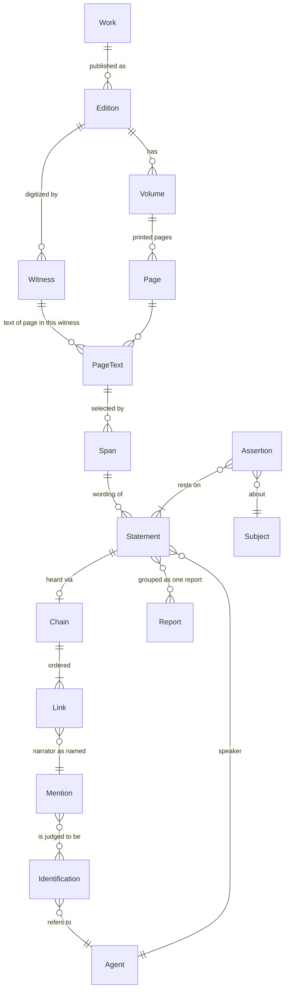
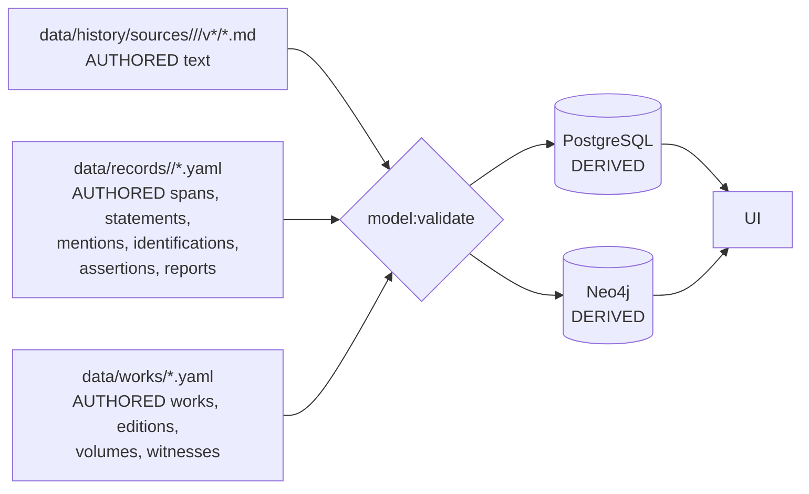

# Plan B: from today's model to a model of attributed spans

Method: start from today's stores, change the least that makes every displayed value traceable to exact source text, keep what works, then extend to hadith, tafsir and tarajem. Facts referenced from [00-evidence.md](00-evidence.md) and [lesson 0004](../../lessons/lessons/0004-what-the-model-holds.html).

**Verdict up front.** The page store, the catalog-as-authority rule (ADR 0010), batches as the unit of work, and one-way projection survive. Three things cannot be patched and must be replaced:

1. **Copied text** (`excerptArabic`, `assertion`, catalog strings). Replaced by span references: the page store is the only place Arabic text is written.
2. **Paragraph-index anchors** (`4/41-p1`). Replaced by quote selectors, with the index kept only as a derived cache.
3. **Claims as free-text assertions with a pointer from the catalog.** Replaced by typed assertions that rest on an *attributed statement*: who said it, inside whose book, by what chain.

Hadith forces a fourth replacement that history alone did not: speakers and narrators become entities, and *which person a name in a chain refers to* becomes its own reviewable record (an identification), separate from the text.

---

## 1. Principles, and what the model refuses to hold

| # | Principle | Mechanical consequence |
|---|---|---|
| P1 | Text is written once, in the witness page file. | No schema has a free Arabic text field outside `data/history/sources/**`. A displayed Arabic string is always `render(span)`. |
| P2 | Every displayed fact names its span and its speaker. | An assertion without a statement fails validation (sole exception: the migration-only `LEGACY` state, §2.6); a statement without a span fails. |
| P3 | Say how it was heard. | A statement carries its chain: the author's frame plus each transmission link with its mode word *as printed* (حَدَّثَنَا، أَخْبَرَنَا، عَنْ، قَالَ، بَلَغَنِي). The mode is a span, the label is derived. |
| P4 | Editions are not merged by publisher. | `Edition` is its own record (publisher, editors, printing); a `Witness` (a digitization) sits below it. Today only Shamela witnesses are admitted (AGENTS.md); the model allows more without building on that (Q3). |
| P5 | Our words are labels, not content, and when we must write, the UI says so. | Project-authored strings are closed vocabularies, UI translations, and `Gloss` records (English names, transliterations, labels such as "grouped by Namaq"). A `Gloss` is never Arabic, never shown as a quote, and always rendered with a "Namaq's rendering" mark. |
| P9 | Approval covers the evidence as displayed. | A record's `contentHash` includes the resolved rendered text and witness id of every span it depends on; a page or witness change lapses exactly the records whose display moved. |
| P10 | The Prophet's ﷺ words get a stricter gate. | A statement whose final speaker is identified as the Prophet ﷺ needs: a complete chain record (gaps explicit), two independent reviews, no default speaker, no `LEGACY` state, and every honorific as printed (never added). |
| P6 | Identification is a judgment and is recorded as one. | "This أبو هريرة is Abu Hurayrah al-Dawsi" is an `Identification` with basis spans and a reviewer, never an implicit slug in a chain. |
| P7 | Review status is per record and never hides data (ADR 0008 kept). | Content hash per record, not per batch. |
| P8 | Qur'an text in the app's own Qur'an views comes from `Ayah` only; a book's quotation stays the book's. | A span on a quoted ayah renders the book's span inside the book's text, with a link to the `Ayah` row beside it. A difference (partial quote, spelling, another qira'a) is shown as a flagged difference and never substituted. |

**Refused outright:** free-text `assertion`; summaries the source did not write ("stitched" participations); ellipsis-joined quotes presented as one quote (a multi-part value is a list of spans, each rendered whole, displayed with a visible break); unvowelled re-typings; a confidence the source does not state (`ESTABLISHED/LIKELY` dropped — a source's own grading such as "صحيح" or "فيه ضعف" is a statement with a speaker); a person node for a name nobody has identified; any value from the dormant seeds.

---

## 2. The model

### 2.1 Overview



### 2.2 Works, editions, witnesses, pages

| Entity | Key | Fields | Notes |
|---|---|---|---|
| `Work` | `slug` (`siyar-alam-al-nubala`, `sahih-al-bukhari`) | `author: AgentRef`, `genre: TARJAMA\|SIRA\|HADITH\|TAFSIR\|HISTORY`, `titleSpan?` | The author is an Agent, so al-Dhahabi can be a speaker. |
| `Edition` | `slug` (`siyar-risalah-1405-arnaut`) | `work`, `publisher`, `editors[]`, `printing` (year/number), `volumeScheme` | Two printings of al-Risalah with different pagination are two editions. |
| `Volume` | `(edition, number)` | `label` as printed (`السيرة ١`), `printedPageRange` | Ends today's double numbering: the label is data, the number is the key. |
| `Witness` | `slug` (`shamela-10906`) | `edition`, `host`, `urlPattern`, `vowelled: bool`, `hasFootnotes: bool`, `accessedAt` | Shamela vols 1-2 bare vs 4-5 vowelled becomes a witness property per volume range, visible to validators. |
| `Page` | `(edition, volume, printedPage)` | `hostIds{witness: id}` | Unchanged identity from ADR 0018. |
| `PageText` | `(page, witness)` | file `data/history/sources/<edition>/<witness>/v<vol>/<page>.md` + `.notes.md`, `sha256` | Kept from today; only path gains the witness. The one authored text store. |

### 2.3 Spans: identity that survives re-splitting

A span is a **quote selector**, not a position:

```ts
type Span = {
  id: string;            // stable, minted once: "sp_7f3c1a"
  edition: string;       // siyar-risalah
  volume: number;        // 4
  pageFrom: string;      // "41"
  pageTo?: string;       // for a sentence crossing a page turn
  exact: string;         // the selected text, as normalized-for-match (see below)
  prefix?: string;       // up to 32 chars before, only when `exact` is not unique on the page range
  suffix?: string;
  layer: 'MAIN' | 'NOTES';  // editor's footnotes are their own layer
};
```

- **Match rule** (one function, `matchSpan`, shared by validator, reader and projection): compare on a *match form* that removes only footnote markers and collapses whitespace; diacritics, hamza and punctuation are significant. The rule lives in one module, ending today's duplication between `verifyExcerpts.ts` and `sectionHeadings.ts`.
- **Render rule:** the displayed text is cut from `PageText`, never from `exact`. `exact` is a locator, not content — if they disagree, validation fails. `render` is a closed, tested list of deletions: footnote markers (`*`, `(١)`) only, and paragraph breaks inside the span become a single space. Everything else is shown verbatim, including sigla such as `(ع)`; a span that should not show a siglum ends before it. Test: `render(span) == pageSlice minus listed markers`, for every span on every validate.
- **Mentions anchor to their statement.** A short selector (a narrator name in a chain, a name in a «رَوَى عَنْهُ» list) is stored as `{parent: SpanRef, exact, occurrence}` inside its parent span, which is itself quote-anchored to the page. This keeps short selectors unique within a small window.
- **Re-anchoring:** `span:reanchor` proposes a new selector only when the old *rendered* text appears verbatim exactly once in the new page text. Every other case lapses the dependent records (P9) and lists them for review. No tool re-points a span by similarity.
- **Derived cache:** `{paragraphIndex, charStart, charEnd, pageSha}` is computed by `span:resolve` and written to PostgreSQL. A re-split page changes the cache, not the span. A change to page *text* that breaks the match is a validation error naming every span it orphaned, which is exactly the signal today's anchors hide.
- A span must be one contiguous run (ADR 0020 rule generalised). A page-crossing span is still contiguous in reading order across the page turn, footnote layer excluded.
- `exact` duplicates page text. That is the one allowed copy, and it is machine-checked on every validate, which is why it is tolerable where `excerptArabic` was not: nothing displays it.

### 2.4 Agents, mentions, identifications

| Entity | Key | Fields |
|---|---|---|
| `Agent` | `slug` (global, one per real person; `abu-hurayrah`) | `kind: PERSON\|GROUP\|ANONYMOUS`; no Arabic name text (names are spans); English name is a `Gloss` |
| `Mention` | `id` | `span` (the name only, not its mode word: `الحُمَيْدِيُّ عَبْدُ اللَّهِ بْنُ الزُّبَيْرِ`), `role: SPEAKER\|NARRATOR\|SUBJECT\|REFERENT` |
| `Identification` | `id` | `mention`, `agent`, `basis: {span, role}[]`, `status: PROPOSED\|REVIEWED\|DISPUTED\|REJECTED`, `reviewers[]` |
| `Gloss` | `(target, lang, kind)` | `text` (English/transliteration), `kind: NAME\|LABEL`; shown with the "Namaq's rendering" mark |

**Admissible basis roles:** `EDITOR_NOTE` (a NOTES-layer span), `RIJAL_ENTRY` (a span in a rijal/tarajem work), `SAME_WORK_EXPLICIT` (the work itself disambiguates: `يَعْنِي ابْنَ عُيَيْنَةَ`, or the entry heading for the entry's own subject). The mention's own span is never a basis. A mention with no admissible basis stays unidentified: valid, shown as text (`عَنْ رَجُلٍ`, `سُفْيَانُ`), never a node. Until a rijal work is ingested (Q1), most isnad narrators in the Siyar stay unidentified; that is the honest state.

**Reuse within a work:** a `ChainSegmentIdentification` keys on `(work, ordered mention texts of a contiguous segment)` — e.g. `الحُمَيْدِيُّ → سُفْيَانُ` in Bukhari — and carries one basis. It applies to every identical segment in that work; the validator lists each application, and a reviewer approves the segment once plus a sample, rather than every copy blind. A segment that differs in one letter does not match.

Utterance's `speakerName` (ADR 0015) maps to a Mention with no Identification.

### 2.5 Statements, chains, reports

```ts
type Statement = {
  id: string;
  span: SpanRef;                 // the matn / the words attributed
  speaker: Speaker;
  frame: SpanRef[];              // the author's own words around it ("قال ابن سعد", "وروى")
  chain?: Chain;                 // ordered from the compiler outward to the speaker
  enclosedBy?: StatementRef;     // see "chain vs enclosure" below
  insertions?: { span: SpanRef; by: MentionRef | 'UNKNOWN' }[]; // idraj, "وَأَحْسِبُهُ قَالَ"
  role: 'AUTHOR_REPORT'|'AUTHOR_SYNTHESIS'|'TRANSMITTED'|'EDITOR_ANALYSIS'; // ADR 0011, reviewed
};
type Speaker =
  | { mention: MentionRef }                         // named in the text
  | { author: true; basis: SpanRef };               // author's voice, justified by a frame span
                                                    // (entry heading, "قُلْتُ", a preceding "قَالَ")
type Chain = { elements: (Link | Gap)[] };
type Link = {
  narrator: MentionRef;
  mode: SpanRef[];               // ordered contiguous parts: ["أَنَّ", "قَالَ"]; never overlaps the mention
  modeKey: string;               // derived 1:1 from printed lemma + person/number: "haddatha/1pl", "akhbara/1sg",
                                 // "samia/3sg", "anna", "anba'a/1pl", "kataba-ilayya", "nawala/1sg", "qala/3sg", "an"
};
type Gap = { kind: 'GAP'; marker?: SpanRef[] };     // "وَقَالَ" (ta'liq), "بَلَغَنِي", "وَرُوِيَ عَنْ", a mursal's missing link
type Report = { id; members: StatementRef[]; basis: { span: SpanRef; role: 'EDITOR_NOTE'|'SAME_WORK_EXPLICIT'|'TAKHRIJ_ENTRY' }[] | 'NAMAQ' };
```

- **modeKey is one-to-one with what was printed.** Any coarser grouping (for a filter: "direct hearing") is a documented derived view, never projected onto an edge in place of the key; edges carry `modeKey` and `modeSpanIds`. An unmapped printed form is a validation error that adds a row to the table (with an ADR-referenced doc), not an `OTHER` bucket.
- **Gaps.** A chain beginning with the compiler's `وَقَالَ فُلَانٌ` (no link from the compiler to فلان) starts with a `Gap`; a mursal ends `Link(Sa'id) → Gap → speaker`. Position decides: a `قَالَ` *after* a link's narrator inside the chain is part of that link's mode; a `وَقَالَ` opening the chain with no preceding `حَدَّثَنَا` is a ta'liq gap marker. Gap length is never inferred. No projected edge crosses a Gap.
- **Chain vs enclosure.** `chain` holds links the text prints as transmission (`حدثنا/عن`). `enclosedBy` holds a quotation of a *book or author* without a transmission (`قَالَ ابْنُ سَعْدٍ` in the Siyar): al-Dhahabi → (enclosure) Ibn Sa'd's statement → its own chain if printed.
- **Speaker of an unmarked Siyar sentence** is decided per statement, never by default: `author` with a basis span (the entry is his voice from its heading until a quotation begins), reviewed each time. Sentences like `وَكَانَ ... يَقُولُ` get the named speaker.
- **Report grouping** with basis `'NAMAQ'` is allowed but shown in the UI as "grouped by Namaq" (a Gloss label), never as the source's grouping.
- **Hadith text as printed:** ﷺ, `صَلَّى اللهُ عَلَيْهِ وَسَلَّمَ`, `رَضِيَ اللَّهُ عَنْهُ` are page text and shown only where printed. The matn span is bounded by the source's quotation marks where they exist; narrator interjections inside them are `insertions`.
- **Anonymous speakers** (`قَالَ بَعْضُهُمْ`, `وَقِيلَ`): speaker is a Mention with no Identification; the UI says "an unnamed view reported by al-Tabari", never "al-Tabari's view".

- **Report vs wording:** a *wording* is one Statement (one chain, one span). A *Report* groups wordings judged to be the same khabar/hadith. Grouping is a judgment, so it carries its basis and reviewer and can be disputed. Variants are never merged into one text; the reader shows each wording against its chain.
- **Chain branching** (تحويل ح, two shaykhs in one isnad) is two Statements sharing the same `span` and the common tail of links.

### 2.6 Assertions: what the app shows

```ts
type Assertion = {
  id: string;
  subject: SubjectRef;          // agent | event | battle | ayah
  predicate: Predicate;         // closed vocab: fullName, kunya, appearance, virtue, PARTICIPATED_IN, ABSENT_FROM, CHILD_OF, DIED_IN_YEAR, EXPLAINS_AYAH ...
  value: { spans: SpanRef[] }   // text-valued: rendered from spans
       | { object: SubjectRef } // relation-valued
       | { parsed: number; spans: SpanRef[] }      // year 36 from "سَنَةَ سِتٍّ وَثَلاَثِيْنَ": machine-checked by the number parser
       | { classified: string; spans: SpanRef[] }; // KILLED from "اسْتُشْهِدَ": reviewed, span always shown beside it
  restsOn: StatementRef[];      // ≥1 for every status except LEGACY
  status: 'LEGACY'|'PROPOSED'|'REVIEWED'|'DISPUTED'|'REJECTED';
  contentHash: string;          // hash(record) + hash(rendered text and witness of every span reached through restsOn and value)
};
```

The catalog value *is* the assertion. There is no second string to keep in step. `parsed` is mechanical; `classified` is our reading and the UI always shows its span next to it.

`LEGACY` is the one explicit exception to P2: a migration-only state for today's `legacy-unreviewed` values, `restsOn: []`, shown with a mark, never newly created, and forbidden on any assertion about a Prophetic statement (P10). The validator counts them; phase 6 ends when the count is zero or each remaining one is deleted.

**contentHash (P9)** is computed by `model:hash` from the record plus, for each span it reaches, `sha256(render(span))` and the witness id. Changing a page, re-splitting it so a cut changes, or switching an edition's primary witness lapses exactly those records; `model:validate` prints them as "published text moved".

---

## 3. Worked examples

### 3.1 Siyar: al-Zubayr's full name (real, from `az-zubayr-ibn-al-awwam/batch.json`)

Today: `zubayr/full-name`, assertion unvowelled and typed separately, citation `4/41-p1`, volume label `"1"`.

```yaml
span: sp_zub_name
  edition: siyar-risalah   volume: 4   pageFrom: "41"   layer: MAIN
  exact: "الزُّبَيْرُ بنُ العَوَّامِ بنِ خُوَيْلِدِ بنِ أَسَدِ بنِ عَبْدِ العُزَّى * (ع) ابْنِ قُصَيِّ بنِ كِلاَبِ بنِ مُرَّةَ بنِ كَعْبِ بنِ لُؤَيِّ بنِ غَالِبٍ"
span: sp_zub_heading   # the entry heading "٣ - الزُّبَيْرُ ..." start, used as the author-voice basis
statement: st_zub_name
  span: sp_zub_name
  speaker: { author: true, basis: sp_zub_heading }   # al-Dhahabi's own heading; reviewed per statement
  role: AUTHOR_REPORT
assertion: as_zub_fullname
  subject: agent:az-zubayr-ibn-al-awwam
  predicate: fullName
  value: { spans: [sp_zub_name] }
  restsOn: [st_zub_name]
```

Rendered: the page text from `الزُّبَيْرُ` to `غَالِبٍ`, vowelled; the render rule deletes only the footnote marker `*` and joins the paragraph break with one space; the siglum `(ع)` stays where al-Dhahabi printed it. The entry number `٣ -` is outside the span by its selector, so nothing needs to record its removal. The `القرشي الأسدي` that today's assertion appended appears nowhere on that span, so it is not shown. If it is wanted, it needs its own span.

### 3.2 Bukhari: one hadith, two chains (invented, realistic)

Page text (Bukhari, edition `bukhari-tawq-1422`, vol 1 p 6), as printed:

> حَدَّثَنَا الحُمَيْدِيُّ عَبْدُ اللَّهِ بْنُ الزُّبَيْرِ، قَالَ: حَدَّثَنَا سُفْيَانُ، قَالَ: حَدَّثَنَا يَحْيَى بْنُ سَعِيدٍ الأَنْصَارِيُّ، قَالَ: أَخْبَرَنِي مُحَمَّدُ بْنُ إِبْرَاهِيمَ التَّيْمِيُّ، أَنَّهُ سَمِعَ عَلْقَمَةَ بْنَ وَقَّاصٍ اللَّيْثِيَّ، يَقُولُ: سَمِعْتُ عُمَرَ بْنَ الخَطَّابِ رَضِيَ اللَّهُ عَنْهُ عَلَى المِنْبَرِ قَالَ: سَمِعْتُ رَسُولَ اللَّهِ صَلَّى اللهُ عَلَيْهِ وَسَلَّمَ يَقُولُ: «إِنَّمَا الأَعْمَالُ بِالنِّيَّاتِ...»

And later (vol 1 p 21, invented second wording):

> حَدَّثَنَا عَبْدُ اللَّهِ بْنُ مَسْلَمَةَ، قَالَ: أَخْبَرَنَا مَالِكٌ، عَنْ يَحْيَى بْنِ سَعِيدٍ، عَنْ مُحَمَّدِ بْنِ إِبْرَاهِيمَ، عَنْ عَلْقَمَةَ بْنِ وَقَّاصٍ، عَنْ عُمَرَ، أَنَّ رَسُولَ اللَّهِ صَلَّى اللهُ عَلَيْهِ وَسَلَّمَ قَالَ: «الأَعْمَالُ بِالنِّيَّةِ...»

| Statement | Chain elements (mode parts → narrator mention; modeKey) | Matn span |
|---|---|---|
| st_b1 | [حَدَّثَنَا]→الحُمَيْدِيُّ عَبْدُ اللَّهِ بْنُ الزُّبَيْرِ (haddatha/1pl) · [قَالَ، حَدَّثَنَا]→سُفْيَانُ (haddatha/1pl) · [قَالَ، حَدَّثَنَا]→يَحْيَى بْنُ سَعِيدٍ الأَنْصَارِيُّ (haddatha/1pl) · [قَالَ، أَخْبَرَنِي]→مُحَمَّدُ بْنُ إِبْرَاهِيمَ التَّيْمِيُّ (akhbara/1sg) · [أَنَّهُ سَمِعَ، يَقُولُ]→عَلْقَمَةَ بْنَ وَقَّاصٍ اللَّيْثِيَّ (samia/3sg) · [سَمِعْتُ]→عُمَرَ بْنَ الخَطَّابِ (samia/1sg) · [قَالَ، سَمِعْتُ، يَقُولُ]→رَسُولَ اللَّهِ (samia/1sg) | «إِنَّمَا الأَعْمَالُ بِالنِّيَّاتِ...» |
| st_b2 | [حَدَّثَنَا]→عَبْدُ اللَّهِ بْنُ مَسْلَمَةَ (haddatha/1pl) · [قَالَ، أَخْبَرَنَا]→مَالِكٌ (akhbara/1pl) · [عَنْ]→يَحْيَى بْنِ سَعِيدٍ (an) ×4 · [أَنَّ، قَالَ]→رَسُولَ اللَّهِ (anna) | «الأَعْمَالُ بِالنِّيَّةِ...» |

- `رَضِيَ اللَّهُ عَنْهُ` and `صَلَّى اللهُ عَلَيْهِ وَسَلَّمَ` stay in page text exactly where printed; they are not part of any mention span. `عَلَى المِنْبَرِ` is part of the narration span, not a mode.
- Report `rp_niyyat` = {st_b1, st_b2}, basis `NAMAQ` (shown "grouped by Namaq") until a takhrij or editor-note span is ingested that groups them. The two matns stay separate wordings.
- Identifications: mention `سُفْيَانُ` → `sufyan-ibn-uyaynah` needs a `RIJAL_ENTRY` or `EDITOR_NOTE` span; with none, it stays unidentified and renders as text. This is why P6 exists: سفيان alone is ambiguous between Ibn Uyaynah and al-Thawri. The `الحُمَيْدِيُّ → سُفْيَانُ` segment identification is then reused across Bukhari (§2.4).
- P10 applies: both statements need two reviews.
- Graph (derived): `(Humaydi)-[:NARRATED_FROM {modeKey: "haddatha/1pl", modeSpanIds, statementId}]->(Sufyan)`. One edge type, `NARRATED_FROM`, direction from the hearer to the one heard; edges only between reviewed identifications, never across a Gap.

**A mu'allaq** (Bukhari): `وَقَالَ مَالِكٌ: أَخْبَرَنِي زَيْدُ بْنُ أَسْلَمَ، أَنَّ عَطَاءَ بْنَ يَسَارٍ أَخْبَرَهُ ...` → elements `[Gap{marker:[وَقَالَ]}, Link(مَالِكٌ, qala/3sg), Link(زَيْدُ بْنُ أَسْلَمَ, akhbara/1sg), Link(عَطَاءَ بْنَ يَسَارٍ, anna+akhbara/3sg), ...]`. No Bukhari→Malik edge exists.

**Cost of this one wording:** 7 links → 7 mentions, ≈10 mode-part spans, 1 matn, 1 frame, 1 statement, up to 7 identifications: ≈27 records. Estimate for بدء الوحي (7 hadiths, ~10 wordings): ≈270 records, of which ≈60 identifications, ≈35 of them repeated segments covered by segment reuse. Reviewer time, at ~1 min per mechanical-checked record and ~5 min per identification with basis: ≈8-10 reviewer-hours, ×2 under P10. Whole Bukhari (~7,500 wordings with repeats): ≈200k records, ≈50k mention identifications before reuse, an estimated 5-10k distinct segment identifications after reuse. That is the real budget; phase 5 measures it on بدء الوحي before committing further.

### 3.3 Tafsir: Ibn Abbas on an ayah (invented, Tabari-style)

> حَدَّثَنِي مُحَمَّدُ بْنُ سَعْدٍ، قَالَ: حَدَّثَنِي أَبِي، ... عَنِ ابْنِ عَبَّاسٍ، قَوْلَهُ: {الْحَمْدُ لِلَّهِ رَبِّ الْعَالَمِينَ} قَالَ: «الْحَمْدُ لِلَّهِ هُوَ الشُّكْرُ لِلَّهِ»

- Span over `{الْحَمْدُ لِلَّهِ رَبِّ الْعَالَمِينَ}` gets `quotesAyah: 1:2`; the reader shows the book's span as printed, with a link to the `Ayah` row beside it (P8). If a commentator quotes `مَلِكِ يَوْمِ الدِّينِ` against an `Ayah` row reading `مَالِكِ`, both show, the difference flagged.
- Statement st_t1: speaker = mention ابْنِ عَبَّاسٍ, chain as above (the "عوفي" chain with `...` represented as real links; the plan's ellipsis here is only for this document).
- Assertion: `subject: ayah:1:2, predicate: EXPLAINS, value: {spans:[«الْحَمْدُ لِلَّهِ هُوَ الشُّكْرُ لِلَّهِ»]}, restsOn: [st_t1]`. The app shows "Ibn Abbas, via [chain], in al-Tabari" — never "the meaning of 1:2 is".

### 3.4 Tarjama with a disputed identification (realistic pattern)

A tarajem entry: «عَبْدُ اللَّهِ بْنُ عَمْرٍو ... رَوَى عَنْهُ أَبُو سَلَمَةَ» where the editor's footnote says another work reads the name as عَبْد اللَّه بْن عُمَر.

- Two spans: main-text name (MAIN) and the editor's footnote (NOTES).
- Mention m1 (main text, the name only). Identification i1 → `abdullah-ibn-amr-ibn-al-as`, basis [`RIJAL_ENTRY` span: the Tahdhib entry listing أبو سلمة among his narrators], status DISPUTED. Identification i2 → `abdullah-ibn-umar`, basis [`EDITOR_NOTE` span; the footnote's speaker = the editor], status DISPUTED. Without the rijal span, i1 could not exist: the name in the main text is not a basis for itself.
- Assertions that depend on m1 are projected under each identification with `disputed: true`; the graph draws both edges dashed, and the profile lists the dispute with both basis spans. A winner is recorded only by a reviewer citing a further basis span; the other becomes `REJECTED`, kept.

---

## 4. Extraction

| An extractor MAY write | An extractor MAY NOT write |
|---|---|
| Page text files, transcribed exactly from one witness | Any Arabic outside page files |
| Span selectors (`exact` must match) | Paraphrase, summary, translation as content |
| Statements: speaker mention, frame spans, chain links with mode spans | Confidence/grading of its own |
| Mentions; Identifications as PROPOSED with basis spans | An Identification without a basis span |
| Assertions with predicate from the closed vocab | A new predicate (needs an ADR) |
| Scalars (year, enum) with a justifying span | A scalar without a span |
| Reports (grouping) as PROPOSED | Merged variant text |

**Checked mechanically** (`npm run model:validate`, single entry point, runs in CI):

1. Every span matches its page text uniquely (given prefix/suffix); contiguous; page range exists in the declared volume of the edition.
2. Every Arabic string the UI can display resolves to a span (enforced by type: there is no string field to fill).
3. Every chain link has mode parts whose text maps 1:1 to a `modeKey`; an unmapped form fails until the table gains a row. Mode parts never overlap the mention. No edge crosses a `Gap`.
4. `parsed` values agree with the number-word parser on their span; mismatch fails.
5. Quoted-ayah spans compared against `Ayah`; differences are reported and shown, never substituted.
5a. `render(span)` equals the page slice minus listed markers; `contentHash` recomputed and compared (P9).
5b. Identification basis spans are not the mention's own span and carry an admissible role.
5c. P10 gates on Prophetic statements: no Gap left unmarked, no `LEGACY`, two distinct reviewers recorded.
6. Witness checks: a span on a `vowelled: false` witness page is flagged; a span on a volume with a different witness than the edition's declared one fails.
7. Graph edges only from REVIEWED identifications.

**Review surface** (to build in phase 2, before scale): a page-side reader view per record showing the rendered page with the record's spans highlighted (matn, mode parts, mentions, basis spans in distinct colours), the chain as a row of mode → name pairs with Gaps drawn, and accept / reject / dispute buttons that write the reviewer and the `contentHash` reviewed. Segment identifications show every application in one list.

**Reviewed by a person:** statement role (ADR 0011), speaker attribution (who is speaking — the error class that hit ~65 of ~300 agent fixes), identifications, report grouping, scalars, predicate choice. Review compares spans against the rendered page, never against a retyped value.

**Unit of approval:** one record (statement, identification, assertion, report), keyed by its `contentHash`. Publishing a batch = publishing the set of record hashes it lists; editing one record lapses that record only. "Publish" and "mark reviewed" stay separate acts (ADR 0008, owner's vocabulary).

**Quiz bank:** `data/quiz/` is outside P1 by design: a quiz question is Namaq's own text (docs/quiz-question-review.md). It stays separate, may cite assertions, and is never displayed as source text.

**Disagreement and variants:** competing values = competing assertions on the same subject+predicate, each with its own statements; the reader shows all, with status. Wording variants = separate statements in one report. Witness variants (two digitizations differ) = two `PageText` rows; spans are resolved against the edition's *primary* witness, and `witness:diff` lists differing pages for review.

---

## 5. Storage and projection



| Location | Holds | Authored? |
|---|---|---|
| `data/works/` | Work, Edition, Volume, Witness | yes |
| `data/history/sources/<edition>/<witness>/v<n>/<page>.md(+.notes.md)` | page text | yes (the only text) |
| `data/records/<batch>/` | one YAML per subject: spans, statements, chains, mentions, identifications, assertions, reports; `batch.yaml` = list of published record hashes + summary | yes |
| `data/agents.yaml` | Agent slugs only (no names) | yes |
| PostgreSQL | `Work, Edition, Volume, Witness, Page, PageText, Span(+resolved cache), Agent, Mention, Identification, Statement, ChainLink, Report, Assertion, RecordStatus`; display name of an agent = rendered span of its REVIEWED `fullName`/`name` assertion, materialized | never authored |
| Neo4j | `(:Agent)`, `(:Event)`, `(:Battle)`; edges from relation-valued assertions and `NARRATED_FROM {modeKey, modeSpanIds, statementId}` from adjacent links with reviewed identifications, never across a Gap; `graphRank/layout` derived as today | never authored |
| `data/glosses/` | `Gloss` records (English names, labels) | yes, visibly ours |

Derived and never authored: span positions, paragraph anchors, `modeClass`, display names, chain edges, ranks/layout, anything in either database. `data/catalog/*.ts` is retired: its job (the values the app shows) is taken by assertions.

---

## 6. Migration from today

### 6.1 Mapping

| Today | Becomes | Kept / dropped |
|---|---|---|
| Page store `sources/<src>/v4/41.md` | `PageText` under `<edition>/<witness>/` | kept, moved; `src` split into edition + witness |
| `sources/<src>/source.json` | `data/works/<work>.yaml` (Work, Edition, Volumes) + witness entry | split |
| Citation's ADR 0011 role | `Statement.role` | kept, mapped 1:1 |
| `Utterance.speakerName` | Mention with no Identification | kept |
| English names in catalog/seeds | `Gloss` (NAME, en) | kept, marked as ours |
| `passageAnchor 4/41-p1` | resolved-cache of a span | dropped as authored data |
| `citation.excerptArabic` | `Span.exact` (only if it matches; else a migration error to fix) | content kept as locator |
| `citation.volume` (`"1"`, `السيرة 1`) | `Volume.label` once per volume | dropped per citation |
| `citation.extractionUrl`, `accessedAt` | `Witness.urlPattern` + `Page.hostIds` | moved |
| `claim.assertion` | nothing | **dropped** |
| `claim.confidence` | nothing; source gradings become statements | dropped |
| `claim.field/relation` | `Assertion.predicate` | kept |
| `claim.reviewStatus` | `Assertion.status` / per-record status | kept |
| batch `approval` (whole-file hash) | per-record hashes in `batch.yaml` | replaced |
| catalog value strings (`fullName`, `kunya`, `virtues[]`) | `Assertion.value.spans` | strings dropped; must re-derive from spans |
| catalog `participations` `summary` | assertion with spans (no summary) | stitched summaries dropped |
| `legacy-unreviewed` | `Assertion` with `restsOn: []`, status `LEGACY`, displayed with a mark, cannot be published new | kept as a state, shrinking |
| `HistoricalClaim`, `Citation`, `PersonVirtue`, `SourcePassage` tables | `Assertion`, `Span`, `Statement` tables | replaced; ADR 0020's unapplied `PersonVirtue` migration is not applied, since phase 3 replaces the table |
| `Utterance` (ADR 0015) | `Statement` | generalised |
| Seeds `prisma/personSeedData*.ts`, `neo4j/*Seed*.ts` | nothing | deleted at the end of phase 3, after its acceptance passes |
| AGENTS.md "narrators never become nodes" | narrators become nodes only through reviewed identifications | rule replaced |

### 6.2 Phases

| Phase | Work | Acceptance criteria | Risk |
|---|---|---|---|
| 0. Freeze | No new batches; tag `pre-span-model`; land `matchSpan` and `render` as the one match/render module; fix the AGENTS.md ellipsis vs ADR 0020 conflict in favour of contiguous spans; inventory the ~22 `src`/`scripts` files reading `passageAnchor`/`excerptArabic`. | `verifyExcerpts` and `sectionHeadings` both call `matchSpan`; one ADR; inventory list in this plan's follow-up. | Low. |
| 1. Works & spans | `data/works/` for Siyar Risalah + Shamela witness; move pages; convert every citation into a span. Converter writes spans where `excerptArabic` matches uniquely, emits a fix list otherwise (expect ≈248 from the known FAIL lines, plus the 8 dead anchors). | 0 unmatched spans; every page path has a declared volume; the islamweb-text citations removed or moved to a declared second witness. | The fix list is human work; agents' fixes had a 1-in-5 meaning-change rate, so each fix is a reviewed record. |
| 2. Statements & assertions for history | Each claim → one statement (speaker = al-Dhahabi unless the span is a quotation; then speaker + frame) + one assertion. Catalog values replaced by span references; where the old value differs from the rendered span, the span wins and the diff is listed. | `catalog/*.ts` read nowhere; every profile string traces to a span (test: render every profile, grep the output against page files); per-record publish works with P9 hashes; review surface live; `catalog:validate`'s 110 issues gone or converted. | Speaker attribution on ~1,354 vol 4-5 citations is review-heavy (no default speaker). Estimate ≈1 min each ≈ 25 reviewer-hours; the author-voice basis span makes most quick. |
| 3. Projection | New Prisma schema; projection from `data/records`; Neo4j from assertions. Dual-run: old pipeline stays runnable from `pre-span-model` against a separate preview DB until acceptance. Then seeds and `catalog/*.ts` deleted. | DBs rebuildable from `data/` alone (drop + project twice = identical); every profile shows a value or a visible LEGACY mark for each field it showed before; graph layout rerun. **Rollback:** if acceptance fails, restore the preview DBs from the old pipeline at the tag and keep phase 2 files; nothing in `data/history/sources` is lost. | Downtime of preview DBs; acceptable. |
| 4. Chains & identifications | Mentions and chains for Siyar's isnads (al-Dhahabi gives many); identification workflow; HEARD_FROM edges. | A chain renders with mode words; an unidentified narrator renders as text; no edge from a PROPOSED identification (test). | Name ambiguity; needs a rijal work as basis (see Open questions). |
| 5. Second work | One Bukhari kitab (بدء الوحي) end to end, then one tafsir surah. Event/battle Mention + Identification added before any second Sira work. | Report grouping of ≥2 wordings; ≥1 mu'allaq with a Gap and no crossing edge; ayah spans linked, not substituted; P10 two-review gate enforced; measured records and reviewer-hours compared with the §3.2 estimate (go/no-go for the rest of Bukhari). | Edition choice; identification budget. |
| 6. Legacy close-out | Each `LEGACY` assertion gets a statement or is deleted. | `LEGACY` count = 0. | Values with no source support disappear from profiles; expected and honest. |

---

## 7. Alternatives considered and rejected

| Alternative | Why rejected |
|---|---|
| **Keep copy-and-check** (excerpt + catalog string, stricter verifier) | Evidence shows the copies drift faster than checks catch them (414/727 values, 25 wasted PRs). A check that compares two copies still lets both be wrong; removing the copy removes the class. |
| **Spans by character offset** | Breaks on any re-split, whitespace or footnote-marker fix, the exact edits this project makes. Kept only as a derived cache. Quote selectors fail loudly instead of re-pointing silently. |
| **Spans by paragraph anchor (today)** | Same failure as offsets, at paragraph granularity; already produced 8 dead anchors and silent re-pointing. |
| **Narrators per work** (a `Narrator` row per book) | Makes the isnad graph a set of disconnected islands; Bukhari's Malik and al-Tabari's Malik never meet. One global Agent plus per-occurrence Mention and an explicit Identification gives both: the text as written and the cross-work link, with the link reviewable. |
| **Narrator name = slug directly in the chain** | Hides the judgment of who a name refers to; the most error-prone step in hadith work would be invisible. |
| **Claims as free text + typed field** (today) | The free text is our words (refused by P5) and nothing reads it. |
| **One "Hadith" entity with a canonical text** | Merges variant wordings; violates "hold exactly as it was said". Reports group statements instead. |
| **Store everything in Neo4j / a single graph DB** | Text and spans are document-shaped; files under git are the review surface the owner already uses (ADR 0010). Graph stays derived. |
| **Coarse mode classes (sama'/ikhbar/an)** | Discards distinctions the source prints (أخبرني vs أخبرنا) and puts our classification on edges. Kept only as a derived view over the 1:1 `modeKey`. |
| **Show `Ayah.text` in place of a book's quotation** | Puts a reading into a commentator's sentence he may not have used. Link beside, never substitute. |
| **Default author-as-speaker for unmarked sentences** | Cheap but reproduces the "speaker changed" error class; replaced by a per-statement author-voice basis span. |
| **Identify every narrator occurrence separately** | Exact but ≈50k reviews for Bukhari, most of them blind repeats. Chain-segment identification with listed applications keeps one basis per segment and keeps the copies visible. |
| **Position-free spans inside the statement for all mentions vs page-anchored** | Page-anchored short selectors become ambiguous after a re-fetch; anchoring to the parent span keeps them unique, at the cost of a two-level resolve. |
| **Approval on record only** | Lets a page edit change published text silently (D1). Hashes now include rendered span text. |
| **TEI-XML markup inline in page files** | Exact and standard, but markup inside the text means every new assertion edits the source file, mixing the book with our selections (against "the source text is the book"). Stand-off spans keep the page file untouched. |

---

## 8. Stress tests

| Scenario | Walk-through | Where it still strains |
|---|---|---|
| **Another Sira work** (e.g. Ibn Hisham) | New `Work`, `Edition`, `Witness`; same Agents; competing death year = two assertions with different statements; the profile lists both with their work. Event names in the text are Mentions identified to an Event with a basis span (phase 5, before this work starts). | Event identification has fewer natural basis sources than rijal; many will rest on `SAME_WORK_EXPLICIT` (date + place stated). |
| **Bukhari** | Chains of Links and Gaps with 1:1 mode keys; Reports group wordings; tarājim al-abwāb are statements with speaker al-Bukhari; mu'allaq and mursal are Gaps; P10 gates. | ≈200k records; review stays the bottleneck even with segment reuse; phase 5 measures it before commitment. Chains stored per statement (verbose, by choice: no shared chain object to drift). |
| **Tafsir** | Ayah-linked spans (book text shown, `Ayah` linked); each mufassir's report is a statement with chain; al-Tabari's own preference (ترجيح) is a statement by al-Tabari; `وَقِيلَ` is an unnamed speaker shown as "an unnamed view reported by". | Long weak chains (e.g. al-Kalbi) need gradings, which only exist as other works' statements; until a rijal work is ingested, the app can show chains but not their standing. |
| **Tarajem** | Each entry = statements by the compiler; identifications for the subject and for every شيوخ/تلاميذ list name; disputed identifications as in §3.4. A tarajem work is itself the main source of `RIJAL_ENTRY` bases. | Lists like «رَوَى عَنْهُ: فلان وفلان وفلان» produce dozens of mentions per entry, anchored inside the list's statement span. Cross-tarajem merging of one person is identification at scale, the hardest review load in the plan. |

General strain: tashkeel corrections at the host orphan spans in bulk; `span:reanchor` handles only verbatim moves, so a large re-fetch means a large review queue by design.

---

## 9. Open questions for the owner

1. **Basis for identifying narrators:** which rijal work becomes the reference (Tahdhib al-Kamal, Taqrib, al-Dhahabi's al-Kashif), and is an editor's footnote enough basis to publish an identification?
2. **Gradings:** should a hadith's grading be shown only when a named scholar's statement is ingested, or never in the first release?
3. **Primary witness per edition:** for Siyar vols 1-2, where Shamela is bare, do we accept a second digital host as a witness of the same edition (the AGENTS.md "Shamela only" rule), or show those volumes unvowelled?
4. **Bukhari edition:** which printed edition (e.g. Dar Tawq al-Najat numbering vs. Fath al-Bari numbering) is the citation standard?
5. **Legacy values:** keep showing `LEGACY` values with a mark during migration, or hide them until each has a span (ADR 0008 says don't hide; confirm it still holds for hadith)?
6. **Classified values:** may the app show a classified value (`KILLED`) at all, or only its span? (Parsed years are mechanical and shown.)
7. **P10 reviewers:** who are the two reviewers for Prophetic statements, and must one of them be a person with hadith training rather than the owner plus an agent?
8. **Bukhari budget:** after phase 5 measures بدء الوحي, what reviewer-hour ceiling makes the rest of Bukhari a go?
9. **`NAMAQ` report grouping:** allowed at all for hadith, or must every hadith grouping wait for a takhrij source?

---

## 10. Changes from review

| Review item | Response |
|---|---|
| D1 approval ignores rendered text (blocks) | Fixed: P9; `contentHash` includes `sha256(render(span))` + witness id; validator lists "published text moved". |
| D2 chain cannot hold a gap (blocks) | Fixed: `Gap` element with optional marker spans; position rule for ta'liq `وَقَالَ`; no edge crosses a Gap; mu'allaq example in §3.2. |
| D3 modeClass loses distinctions | Fixed: `modeKey` 1:1 with lemma + person/number; coarse grouping only as derived view; edges carry `modeKey` and span ids; unmapped form fails. |
| D4 non-contiguous mode words | Fixed: `mode: SpanRef[]`; mention and mode parts never overlap; Mention example corrected. |
| D5 implicit speaker, REVIEWER grouping, self-based identification | Fixed: author speaker needs a basis span, per statement, no default; basis roles exclude the mention's own span; `NAMAQ` grouping labelled in UI; Q9 added. Siyar narrators without a basis stay unidentified. |
| D6 Ayah substitution | Fixed: P8 rewritten; book span always shown, `Ayah` linked, differences flagged. |
| D7 render transformations | Fixed: closed deletion list (footnote markers, intra-span breaks), siglum kept, render test on every span. |
| D8 re-fetch orphans spans | Fixed: `span:reanchor` (verbatim-once only, else lapse); short mentions anchored inside parent span. |
| D9 English names have no home | Fixed: `Gloss` kind under `data/glosses/`, marked as ours; quiz bank stated as outside P1. |
| D10 internal contradictions | Fixed: seeds deleted end of phase 3; `LEGACY` added to the enum as the one declared P2 exception; `REJECTED` added to both enums; P4 rewritten; single `NARRATED_FROM` edge. |
| D11 scalar is our reading | Fixed: split into `parsed` (machine-checked) and `classified` (reviewed, span always shown); Q6 narrowed. |
| D12 ADR 0011 role disappears | Fixed: `Statement.role` mapped 1:1, reviewed. |
| Hadith stricter gate | Fixed: P10 and check 5c; Q7. |
| Shamela-only rule vs witnesses | Fixed: P4 now admits only Shamela today; extra witnesses wait for Q3. |
| Utterance.speakerName, PersonVirtue migration, source.json, 22 files | Fixed: mapped in §6.1; ADR 0020 DB migration skipped; inventory in phase 0. |
| Missing costs | Fixed: per-wording, بدء الوحي and whole-Bukhari estimates in §3.2; phase 2 estimate; phase 5 go/no-go; Q8. |
| Missing identification reuse | Fixed: chain-segment identification within a work (§2.4). |
| Missing rollback | Fixed: `pre-span-model` tag, dual-run, rollback criterion in phase 3. |
| Hadith-specific text rules (honorifics, idraj) | Fixed: honorifics shown only as printed; `insertions` on Statement. |
| Tafsir without chain | Fixed: anonymous speaker wording in §2.5 and §8. |
| Event/battle identity | Partly fixed: same Mention/Identification pattern scheduled in phase 5 before a second Sira; design detail left to that phase. |
| Review UI not designed | Partly fixed: required features specified in §4; full design is a phase 2 deliverable, not a data-model decision. |
| Chain vs enclosure unspecified | Fixed: rule in §2.5 (printed transmission → chain; quotation of a book/author → `enclosedBy`). |
