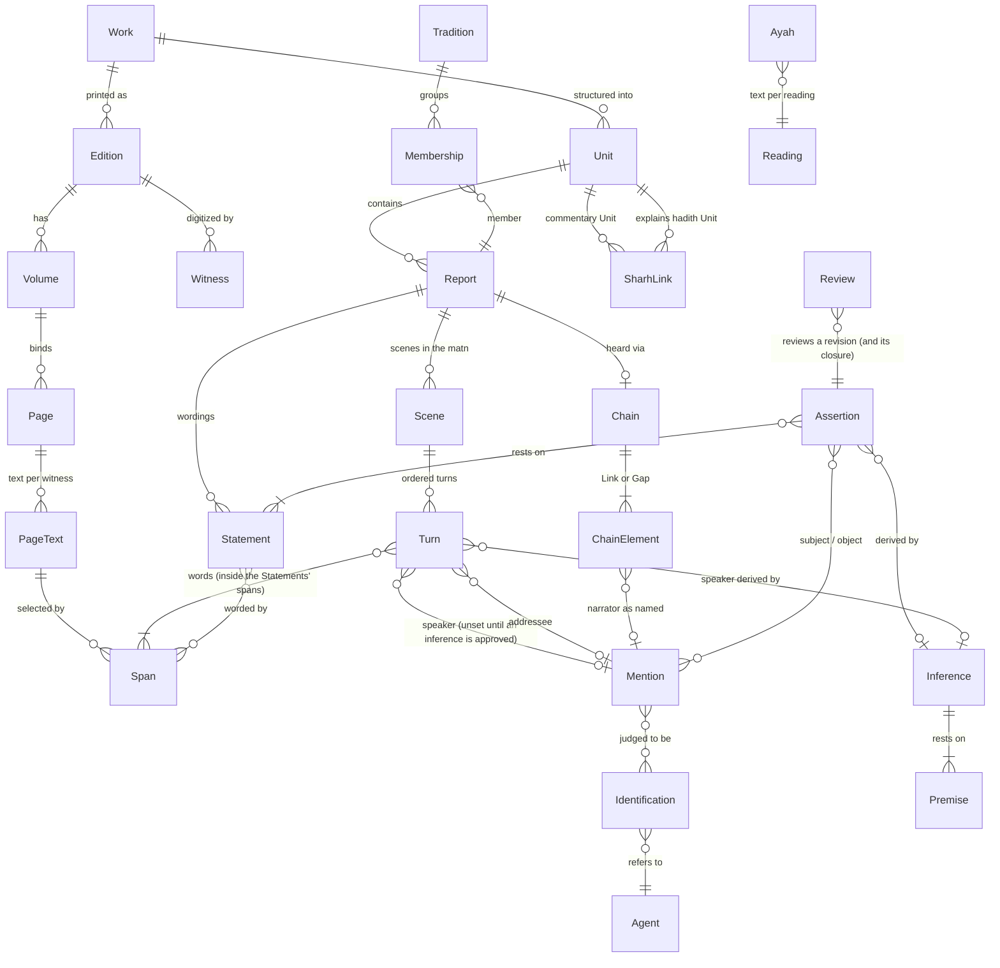
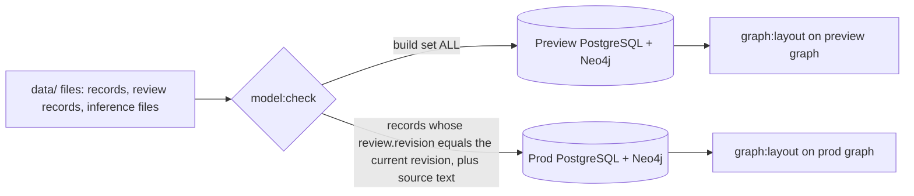
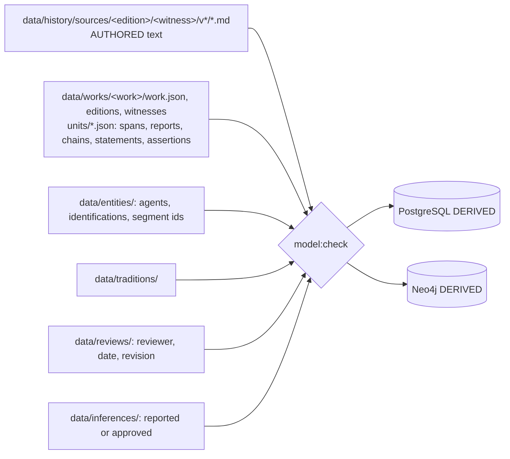
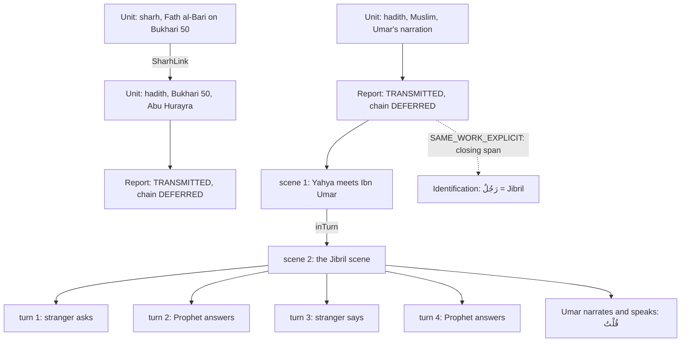
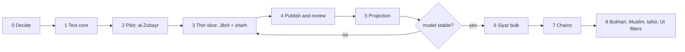

# The data model: attributed spans

Status: the group's plan (planner A, planner B, reviewer A, reviewer B), merged from `plan-a.md`, `plan-b.md`, their reviews and two discussion rounds, then revised to the owner's goals G1-G8 and rules R1-R5 in [owner-goals.md](owner-goals.md). Evidence: `00-evidence.md` and lesson 0004. Research on editions, rijal works and qira'at: [research.md](research.md).

## 1. Goals and principles

**The owner's goals.** An educational, Arabic-only app: the text itself, with interactive visualizations (graphs, timelines, fields, search) beside it, all backed by evidence, and quizzes built from the extracted knowledge. The model holds facts, not our opinion and not our words. Like a hadith narrator, it says exactly how something was heard and from whom. Everything shown has a reference and holds exactly as it was said. Logic and inference over the data are allowed; knowledge the text does not present is not (section 2.13). Hadith of the Prophet ﷺ is the standard the model is built for, because a mistake there is far graver than one in history. Scope: tarajem, history (Sira, companions), hadith (Sahih al-Bukhari and Sahih Muslim) with the isnad as data, sharh (commentary) on hadith, and tafsir. The app's Qur'an views read the Qur'an's text from `Ayah` only, never from a book, and `Ayah` holds all qira'at; a book's quotation of an ayah is shown as that book's text. Arabic is vowelled and exact. Editions are never merged by publisher. No Namaq grouping of works, hadith, ayat, utterances or poetry (R2).

| # | Principle | Mechanical consequence |
|---|---|---|
| P1 | Arabic text is written once, in the witness page file. | No schema outside `data/history/sources/**` has a free Arabic field. A displayed Arabic string is always `render(span)`. |
| P2 | Every displayed fact names its span and its speaker. | An Assertion without a Statement fails, except migration-only `LEGACY`. A Statement without a span fails. |
| P3 | Say how it was heard. | Every transmitted Statement has a Chain of Links and Gaps; each Link's mode is the printed formula as spans, with a key derived 1:1. |
| P4 | Identification is a judgment and is recorded as one, from a source. | Every entity reference is a Mention plus an Identification with a basis span other than the mention itself. No Namaq-authored basis. |
| P5 | Arabic we write ourselves is interface text only. It never describes a fact, person or source. | Navbar, footer, page titles, buttons and status labels may be our Arabic. Every description of a fact, person or source is a span (P1). Source pages (`/sources`) may show metadata such as author and volume; the reader and the source text are exact, with no renamed, regrouped or reordered chapters. No `Gloss` records, no English names (R4). |
| P6 | Editions are distinct; a host's digitization is a Witness of an edition. | Edition identity = publisher + editors + printing. Witness carries fidelity flags. |
| P7 | Publishing and review are separate acts, and review never hides source text (ADR 0008). | Preview shows every record with its status; prod holds and shows only reviewed records (2.10, 2.11). Our unreviewed judgments never become graph edges. |
| P8 | A review covers the evidence as displayed. | Revision hash includes the rendered text and witness of every span a record reaches; an edit lapses the review. |
| P9 | The Prophet's ﷺ words have a stricter reviewed-gate. | Prophetic statements publish unreviewed with a visible "not reviewed" status. They reach `reviewed` only with a complete chain record with explicit Gaps, no default speaker, no `LEGACY`, honorifics as printed, and a hadith-qualified scholar's review. |
| P10 | The Qur'an's text comes from `Ayah` only, and a book's quotation stays the book's. | A quoted ayah is rendered as the book printed it, with a link to `Ayah` (surah, ayah, reading); differences are flagged, never substituted. |
| P11 | Files under `data/` are the authority (ADR 0010's rule); the databases are rebuilt. | PostgreSQL and Neo4j are never edited. Review records live in the files too, so both databases rebuild from them. |
| P12 | Nothing is shown that the text does not present, and every shown element reaches its span in one step. | A value is quoted, or derived and labelled so with its premises (2.13). The citation rule is in 2.14. |

**Refused outright:** free-text `assertion`; summaries the source did not write; ellipsis-joined quotes (a multi-part value is a list of spans, each shown whole, with a visible break); unvowelled re-typings; `confidence` (a source's own grading is a Statement with a speaker); a graph node for a name with no sourced identification; a grade on a report that no grading Statement targets; an edition identified by publisher alone; ayah text substituted into a book's words; any grouping, tag or label of works, hadith, ayat, utterances or poetry that the work itself does not make; a value added because it is absent from the text.

## 2. The model

### 2.1 Overview



### 2.2 Works, editions, volumes, witnesses, pages

| Record | Key | Fields | Notes |
|---|---|---|---|
| `Work` | `siyar-alam-al-nubala`, `sahih-al-bukhari`, `sahih-muslim`, `fath-al-bari` | author (Agent), genre `TARAJEM\|SIRA\|HADITH\|SHARH\|TAFSIR\|HISTORY`, `titleSpan?`, `authorClaim?` | `authorClaim` = a span with a `scope` (2.9). `SHARH` is a commentary on a hadith work; Fath al-Bari is one sharh among any the owner adds, and nothing in the model is specific to it. |
| `Edition` | `siyar-risalah-1405-arnaut` | work, publisher, editors[], printing, volume scheme, `numbering` map, `riwayah?` (a Chain) | Two printings with different pagination are two editions. |
| `Volume` | `(edition, number)` | number (the key), `label` as printed (`السيرة ١`, `الجزء ٢`), printed page range | Ends today's double numbering: the label is display only. |
| `Witness` | `shamela-10906` | edition, host, url pattern, per volume range: `vowelled`, `hasFootnotes`, `insertsLigatures`, `checkedAgainstPrint` | Shamela's bare Sira v1-2 and vowelled v4-5 become flags. |
| `Page` | `(edition, volume, printedPage)` | host ids per witness | Identity from ADR 0018. |
| `PageText` | `(page, witness)` | `data/history/sources/<edition>/<witness>/v<n>/<page>.md` + `.notes.md`, sha256 | The one authored text store. |

### 2.3 Spans (X2, agreed 4/4)

```ts
type Span = {
  id: string;              // minted once ("sp_7f3c1a"); never a content hash
  edition: string;
  volume: number;
  pageFrom: string; pageTo?: string;   // a sentence may cross a page turn
  layer: 'MAIN' | 'NOTES';
  exact: string;           // locator in match form; checked, never displayed
  prefix?: string; suffix?: string;    // required when exact is not unique, or under 12 letters
};
type MentionSpan = { parent: SpanId; exact: string; occurrence: number }; // short names anchored inside their parent span
```

| Rule | Detail |
|---|---|
| Match form | One versioned module (`matchSpan`), used by validator, reader and projection: drops footnote markers, collapses whitespace. Harakat, hamza and punctuation are significant. Host ligature `ﷺ` and the spelled formula match each other for locating only. Ends the duplicate in `verifyExcerpts.ts` and `sectionHeadings.ts`. |
| Render | `render(span)` = page slice at the resolved position minus a closed, tested deletion list: footnote markers, and an intra-span paragraph break becomes one space. Sigla such as `(ع)` stay; a span that should not show one ends before it. Honorifics are shown as printed, never added. |
| Contiguity | A span is one contiguous run in reading order (page turns allowed, notes layer excluded). |
| Re-anchor | `span:reanchor` proposes a new selector only when the old rendered text appears verbatim exactly once in the new page text. The id is kept. Nothing re-points by similarity. |
| Failure | A span that does not resolve uniquely fails `model:check` and blocks the build. There is no runtime broken state. |
| Cache | `{paragraphIndex, charStart, charEnd, pageSha, normVersion}` is derived into PostgreSQL. A re-split page changes the cache, not the span. |
| Numbers | `parsed` values run on match form, so `لَهُ سِتَّ (٢) عَشْرَةَ سَنَةً` parses to 16 (pinned test). |

### 2.4 Units

A `Unit` is the work's own structure with its own numbering: `kitab`, `bab`, `hadith`, `tarjama`, `ayah-comment`, `chapter`. `Unit.numbers` is `{scheme: value}` (Bukhari: Fath al-Bari, Sultaniyya, al-Bugha; mapping table per edition). `Unit.title` is a span. Contents lists (ADR 0019) are derived from Units and follow the book's own contents, never our `account` records (which are fixed to match). Books and chapters are the work's own groupings; no other grouping exists (R2).

A `SharhLink {commentary: UnitId, explains: UnitId, basis: SpanRef[]}` joins a commentary Unit (genre `SHARH`) to the hadith Unit it explains. The basis is always a span: the commentary's own lemma or heading, or the hadith number printed in its heading. The edition's numbering map only proposes candidate links to an agent and is never evidence, so a link without such a span is refused (P2). A sharh Report is an `AUTHOR` or `TRANSMITTED` Report like any other, so its quoted hadith, its isnad remarks and its gradings reuse the same records. A new commentary needs a Work and its Units; no schema change.

### 2.5 Reports, statements, chains and modes (X4)

```ts
type Report = {
  id; unit: UnitId; ordinal: number;
  voice: 'AUTHOR' | 'TRANSMITTED' | 'EDITOR_NOTE' | 'REPORTED_ANONYMOUS';
  voiceBasis?: SpanRef;            // AUTHOR: heading, "قُلْتُ", a preceding frame; never a default
  frame: SpanRef[];                // the author's words around it: "وَرَوَى", "قَالَ ابْنُ سَعْدٍ"
  chain?: Chain; chainState: 'COMPLETE' | 'DEFERRED';
  enclosedBy?: ReportId;           // quotation of a book/author without transmission (Ibn Sa'd in the Siyar)
  origin: { mention: MentionId }   // final speaker as printed; for REPORTED_ANONYMOUS an unnamed-group mention ("آخَرُونَ", "قِيْلَ")
        | { workAuthor: true };     // AUTHOR voice only: the Work's author Agent, justified by voiceBasis; no invented Mention
  isnadSpan?: SpanRef;
  scenes?: { ordinal: number; inTurn?: TurnId; turns: Turn[] }[];   // each scene has its own ordered turns (2.5a)
};
type Turn = {
  ordinal: number;
  speaker?: MentionId;             // printed speaker, identified from the text like any Mention; unset until an inference is approved
  spans: SpanRef[];                // the words of this turn; plural, since narration can interrupt a turn
  addressee?: MentionId;
  speakerBasis?: SpanRef[];        // the printed "قَالَ فُلَانٌ"; never set together with `inference`
  inference?: InferenceId;         // a bare "قَالَ" whose speaker follows only from alternation (2.13)
};
type Statement = {                 // one wording
  id; report: ReportId; spans: SpanRef[];
  insertions?: { span: SpanRef; by: MentionId | 'UNKNOWN' }[];  // idraj, "أَوْ قَالَ", "أَحْسِبُهُ"
  role: 'AUTHOR_REPORT' | 'AUTHOR_SYNTHESIS' | 'TRANSMITTED' | 'EDITOR_ANALYSIS';   // ADR 0011
};
type Chain = { elements: (Link | Gap)[]; branches?: Chain[] };   // tahwil (ح) = branch sharing the tail
type Link = { narrator: MentionId; mode: SpanRef[]; modeKey: string };
type Gap  = { kind: 'GAP'; marker?: SpanRef[] };                  // ta'liq, mursal, balagha; length never inferred
```

**A Turn is not a Statement.** A Statement is one wording of the report and carries the words; a Turn is the ordered position and speaker inside it. Turn words are not a second copy: every span of a Turn must lie inside a span of the Report's Statements, which `model:check` verifies, so the two cannot disagree. A report with one speaker has no Turns.

**2.5a Conversation view.** `origin` is the final speaker; `scenes` carries who said what inside the report. A scene is something that happened inside the matn, with people speaking in it; each scene has its own ordered `turns`, which makes a conversation easy to trace. The narrators who hand the report down belong to the chain, not to turns. A scene quoted inside a turn of another scene records that turn in `inTurn`: in Muslim's version the Jibril scene sits inside a turn of Ibn Umar in the scene where Yahya meets him. A report with one scene, like Bukhari 50, has one list. A view can show "A said, B said, A said". A turn whose speaker is printed (`قَالَ رَسُولُ اللهِ ﷺ`, `قُلْتُ`) is recorded as it stands. A bare `قَالَ` whose speaker follows only from alternation is an inference special case (2.13): the agent reports it, the owner approves it, and the agent never writes the approval. Until approved, the turn has no speaker and the view shows it as "speaker not stated". The worked example is the hadith of Jibril (3.2).

- **modeKey** is 1:1 with the printed lemma plus person and number: `haddatha/1pl`, `haddatha/1sg`, `akhbara/1pl`, `akhbara/1sg`, `anba'a/1pl`, `samia/1sg`, `samia/3sg`, `an`, `anna`, `qala/3sg`, `qala-li`, `dhakara`, `balagha/1sg`, `yudhkaru`, `ruwiya`, `kataba-ilayya`, `qara'tu-ala`, `quri'a-ala`, `nawala`, `wijadah`. Abbreviations (`ثنا`, `نا`, `أنا`, `ثني`) map to the full key and keep their own span. An unmapped form fails the check and the table gains a row (documented under `docs/`); there is no `OTHER`.
- **Derived classes**, never replacing the key on an edge: `jazm` vs `tamrid` (`وَقَالَ اللَّيْثُ` vs `وَيُذْكَرُ عَنْ`), and "direct hearing" for filters.
- **Gaps.** A chain opening with the compiler's `وَقَالَ فُلَانٌ` starts with a Gap (ta'liq). A mursal ends `Link → Gap → origin`. Position decides: `قَالَ` after a narrator inside the chain is that link's mode; `وَقَالَ` opening a chain with no preceding `حَدَّثَنَا` is a ta'liq marker. No projected edge crosses a Gap.
- **Anonymous views.** `وَقَالَ آخَرُونَ` in al-Tabari and `وَقِيْلَ` in the Siyar are `REPORTED_ANONYMOUS`; the UI says "an unnamed view reported by al-Tabari", never "al-Tabari's view".
- **The book's own riwayah.** `Edition.riwayah` is a Chain from the edition's introduction or colophon (al-Bukhari: al-Firabri, then the line the edition follows). A marginal riwayah variant is a notes-layer span joined to the main span by a `Collation` record whose siglum is a span.
- **Voice and role.** `Statement.role` must agree with `Report.voice`: `AUTHOR` admits `AUTHOR_REPORT` or `AUTHOR_SYNTHESIS` (the only reviewed choice); `TRANSMITTED` and `REPORTED_ANONYMOUS` admit `TRANSMITTED`; `EDITOR_NOTE` admits `EDITOR_ANALYSIS`. Other pairs fail the check.
- **Check:** an `AUTHOR` report whose span opens with `رَوَى`, `قَالَ <name>`, `حَدَّثَ`, `عَنْ`, `قِيْلَ` or `وَقَالَ آخَرُونَ` fails.

### 2.6 Agents, mentions, identifications (X5)

| Record | Key | Fields |
|---|---|---|
| `Agent` | slug, global, one per real person/group/place/event/battle | kind; no Arabic name text; `displayMention` (a chosen Mention); no English name (R4) |
| `Mention` | minted id | `MentionSpan` (the name only, not its mode word), role `SPEAKER\|NARRATOR\|SUBJECT\|REFERENT` |
| `Identification` | minted id | mention, agent, `basis: {span, role}[]`, status `PROPOSED\|REVIEWED\|DISPUTED\|REJECTED`, reviews[] |
| `ChainSegmentIdentification` | minted id | work, ordered mention texts of a contiguous segment (e.g. `الحُمَيْدِيُّ → سُفْيَانُ`), identifications, basis; applied by reference to listed occurrences |

- **Admissible basis roles:** `EDITOR_NOTE` (a notes-layer span), `RIJAL_ENTRY` (a span in a rijal/tarajem work), `SAME_WORK_EXPLICIT` (the tarjama heading for its own subject; `يَعْنِي ابْنَ عُيَيْنَةَ`), `NASAB` (a span distinct from the mention that carries the following nasab links, e.g. `العَوَّامِ بنِ خُوَيْلِدِ بنِ أَسَدِ` identifying `العَوَّامِ` as al-Awwam ibn Khuwaylid ibn Asad), `COMMENTATOR_NOTE` (a span in a sharh, such as Fath al-Bari, that names a narrator in a hadith it explains; admissible, but a sharh is not a rijal work, so it identifies only the narrators it names and a rijal work is still needed generally). The mention's own span is never a basis. A heading span is the entry number plus the name line (`٣ - الزُّبَيْرُ ...`); it may serve as basis only for the entry's own subject. An ambiguous isnad name (`سُفْيَانُ`) never takes `SAME_WORK_EXPLICIT` from itself. **No Namaq-authored basis** for anyone, narrators included.
- No basis: the mention stays unidentified text (`عَنْ رَجُلٍ`, `سُفْيَانُ`), shown as printed, never a node.
- Competing sourced identifications are all `DISPUTED`; the graph draws one marked edge per candidate only once each is reviewed as disputed; the profile lists each with its source. Namaq never picks.
- Display name = render of `displayMention`. An agent with none renders "not yet named in a transcribed source" / `غير مسمى في المصادر المنقولة`, never a slug.
- Battles, events and titles are Agents/subjects reached the same way; cross-work event identity (`بَدْر` vs `غَزْوَةُ بَدْرٍ الكُبْرَى`) is an Identification with a basis.
- A check fails if two applications of one segment identification resolve differently.
- **Segment review.** A reviewer approves the segment once and then a listed sample of its applications (at least 10% or 5, whichever is more), each recorded. **Inside a P9 statement there is no sampling**: the hadith-qualified scholar confirms the segment, and every application in a gated chain is listed and confirmed.
- **Author display.** An author Agent's `displayMention` is the name span on the Work's title page; attribution labels ("al-Dhahabi, Siyar 4/41") use that span and the derived volume and page.
- **Unnamed speaker identified later.** `رَجُلٌ` in the hadith of Jibril takes an Identification only from a later span (`فَإِنَّهُ جِبْرِيلُ`), recorded as `SAME_WORK_EXPLICIT` or `COMMENTATOR_NOTE`; the turn stays unidentified without it.

### 2.7 Assertions: what the app shows (X3)

```ts
type Assertion = {
  id;
  subject: MentionId;                  // reached through Identification, never a bare slug
  predicate: Predicate;                // closed: name.full, name.kunya, name.laqab, appearance, virtue, born.year,
                                       // died.year, died.place, islam.age, CHILD_OF, MARRIED, PARTICIPATED_IN,
                                       // ABSENT_FROM, status-at, title, EXPLAINS_AYAH, is-sahabi ... (new predicate = ADR)
  value: { spans: SpanRef[] }                      // text-valued, rendered from spans
       | { object: MentionId }                     // relation-valued
       | { parsed: number; spans: SpanRef[] }      // machine re-derived ("سَنَةَ ثَمَانِ عَشْرَةَ" -> 18)
       | { classified: string; spans: SpanRef[] }  // our reading ("اسْتُشْهِدَ" -> KILLED): span always shown
       | { derived: DerivedValue; inference: InferenceId };  // an approved inference (2.13), shown as derived
  restsOn: StatementId[];              // >=1 except LEGACY and derived (a derived value cites its Inference record, which holds the premises)
  status: 'LEGACY' | 'PROPOSED' | 'DISPUTED' | 'REJECTED';   // publication-side state
  review?: { reviewer: string; qualification: string; date: string; revision: string };  // set only by a scholar; lives in the files (2.10)
};
```

Competing values are competing Assertions on the same subject and predicate, each resting on its own Statements; all are shown. A source's own preference (`وَالأَوَّلُ أَصَحُّ`) is itself a Statement and an Assertion of predicate `prefers`. The profile is derived from Assertions; `data/catalog/` is retired.

### 2.8 Traditions (X6)

`Tradition` groups unmerged Reports through `Membership {report, basis}`. Basis types: `EDITOR_TAKHRIJ` (span), `ATRAF_INDEX` (span), `SAME_WORK_EXPLICIT` (span: the work itself says the reports are one). There is no Namaq basis and no Namaq grouping of any report, Prophetic or not (R2). A grouping outside the work's own units exists only through one of these span bases, attributed to that work and scoped to it. Wordings are never merged; diffs are computed. Taqti and ikhtisar are separate Reports joined by membership, never reassembled.

### 2.9 Gradings (X7, agreed 4/4)

A grading is a Report whose Statement quotes the grader, with an Assertion of predicate `grading`: value = the term as a span (`صَحِيحٌ`, `حَسَنٌ`, `ثِقَةٌ`, `صَدُوقٌ`, `فِيهِ ضَعْفٌ`), target = a Report, a Tradition, or a narrator Mention (jarh wa ta'dil). Editor takhrij footnotes (al-Arna'ut) are gradings spoken by the editor Agent. `Work.authorClaim` is a span with a `scope` (`musnad-marfu` for al-Bukhari); it does not cover mu'allaqat, tarajim al-abwab or mawquf athar. No report shows a grade unless a grading Assertion targets it; the work banner shows the authorClaim text and scope.

### 2.10 Publication and review (X8, R1, R1a)

Two separate acts. The owner **publishes**; a qualified scholar **reviews**. Neither implies the other.

| Item | Rule |
|---|---|
| Unit | One record (Report, Statement, Assertion, Identification, Membership), minted id. `Scene` and `Turn` are part of their Report and have no revision of their own. An Inference has a status and an owner approval (2.13); it is not reviewed, but a derived Assertion built from it is reviewed like any Assertion. |
| Revision | hash(record fields + for each span reached: sha256(render(span)) + witness id). |
| Publish | Only the owner, on explicit instruction: `npm run model:publish -- <change set>` makes a PR's records visible on preview. Agents never publish. |
| Review | Only a qualified scholar, never the owner and never an agent. A review record holds reviewer, qualification, date and the revision reviewed, and is written into the files so PostgreSQL and Neo4j on both environments rebuild from them. "Mark reviewed" still needs the owner's explicit words to run the command, which records the scholar's decision and does not make it. |
| Lapse | Any change in a record or in the displayed text or witness of a span it reaches lapses that record's review, and the record leaves prod until a scholar reviews the new revision. `model:check` lists "published text moved". A re-anchor with identical rendered text lapses nothing. |
| Environments | See the data flow below. **Preview** accepts published records and shows all of them with status, reviewed or not. **Prod** holds and shows only reviewed records; its database never holds an unreviewed record. A record is reviewed on preview first, then marked reviewed in both. |
| Carried reviews | `reviewStatus` carried from today's batches is shown as "reviewed before the model" and never counts as a review, toward edge drawing or any requirement, and does not reach prod. |
| Prophetic reviewed-gate (P9) | Not a publication gate. A Prophetic statement publishes unreviewed with a visible "not reviewed" status. It can be marked reviewed only with a complete chain record with explicit Gaps, no default speaker, no LEGACY, honorifics as printed, a page-image comparison of the matn recorded on the review (or an explicit `noImage`, in which case the matn shows an "unchecked against print" mark), and a hadith-qualified scholar. Who the scholar is waits on Q1. |



One set of files, one review record per record id and revision. The prod build is a filtered file set: a record enters it only if a review record exists for its current revision. Preview builds from all files and shows the same record with or without its review. `graph:layout` runs on each environment's own graph, so prod ranks and layout are computed over reviewed edges only and may differ from preview; this is accepted, since ranks over unreviewed edges would be our own addition (R5).

**Prod closure rule.** A review of a record covers what it rests on (P8): the review record lists the closure, meaning the Statements and spans, the Mentions and Identifications, and for a derived value its approved Inference with its premises. The revision hash includes the closure. The prod build admits a reviewed record together with its whole closure, and a closure member is held in prod as reviewed through that review. A record whose closure contains something not covered by a review is not admitted, so prod holds no record that no review covers. An `Agent` is not reviewed on its own: prod holds an Agent node when an admitted record references it, and its display name is the render of a Mention that is itself in an admitted closure.

### 2.11 Visibility (X13)

| Thing | Preview | Prod |
|---|---|---|
| Source text, page by page | Always | Always |
| Unreviewed Statements and Assertions | Shown with status (ADR 0008) | Not held |
| Reviewed records | Shown | Shown |
| `LEGACY` values (today's `legacy-unreviewed`, unresolved citations) | "no source yet"; migration-only, never newly created, counted to zero. Never on Prophetic material. | Not held |
| Unreviewed identifications and `classified` or derived values | As labelled text only, never as graph edges | Not held |
| Derived values (2.13) | Shown as derived with premises, only once the owner approved the inference | Held only once reviewed |
| Prophetic material | Text always; status visible; no LEGACY; no edges or grade labels from unreviewed judgments | Reviewed records only |

Source text is not a record in this table and is never hidden on either environment. Recorded as a scoped ADR beside 0008.

**Per-source view filter (requirement, UI in phase 8).** On a profile, and later in quizzes, the user chooses all sources or one work. The default is all, and a filter never hides anything silently: the view says which works are filtered out and how many records that removes. It is a view over Assertion, Statement, Span and Work, so it needs no stored data beyond what exists.

### 2.12 Storage and projection (X9)



| Store | Holds | Authored? |
|---|---|---|
| `data/history/sources/...` | page text and notes, per witness | fetched by script, never hand-typed |
| `data/works/<work>/units/*.json` | one file per Unit (tarjama, hadith, ayah comment) | yes |
| `data/entities/`, `data/traditions/`, `data/reviews/`, `data/inferences/` | agents, identifications, memberships, review records, inference records | yes (reviews by scholars only; approvals by the owner only) |
| `data/archive/pre-model/` | today's batches, catalog modules, seeds, `excerptArabic`, `assertion` frozen at the migration tag | read-only, never projected |
| PostgreSQL | Work, Edition, Volume, Witness, Page, PageText, Span (+resolved cache), Unit, Report, Statement, ChainElement, Agent, Mention, Identification, Assertion, Tradition, Membership, Review, Scene, Turn, SharhLink, Premise; `Ayah` gains a reading dimension (2.15) | derived |
| Neo4j | Agent/Event/Battle nodes; edges from relation Assertions; `NARRATED_FROM {modeKey, modeSpanIds, reportId}` from adjacent Links whose identifications are REVIEWED (or REVIEWED-as-DISPUTED, drawn marked), never across a Gap, in a separate isnad view excluded from centrality | derived |

Derived, never authored: rendered text, span positions, display names, profiles, contents lists, edges, ranks and layout, mode classes, search index. A change set is a PR listing record ids; ADR 0023 supersedes ADR 0010's layout and keeps its authority rule.

**Ingestion is an adapter (ports and adapters).** The model's only input is the files under `data/`: page text per witness, and the records that point into it. It never asks where a page came from. A provider (Shamela, the sunnah.com API, a print scan checked by hand) is an adapter, a separate script that writes page files and a Witness record and does nothing else. Adding or replacing a provider changes no model code, and a Witness's fidelity flags (`vowelled`, `hasFootnotes`, `checkedAgainstPrint`) are the only thing the model knows about its quality. Tests and both pilots run on small hand-checked fixture files marked as test data, so the engine does not wait on any source. Choosing and ingesting real sources comes after the engine, and is planned then.

### 2.13 Inference and timelines (G4, R5)

The model is filled from the text. Three cases:

| Case | Rule |
|---|---|
| Value exactly in the text | Recorded as it stands, with its span. |
| Implied by the text but not holdable by the model | A **special case**. The agent writes an Inference file in `data/inferences/<id>.json` with `status: REPORTED` (passage span, proposed value, why the model cannot hold it, premises) and inserts nothing else. The approval is the owner's merge of the PR that sets `status: APPROVED`. `data/inferences/` is owner-only in `CODEOWNERS` with owner review required on the protected branch, so an agent can propose the change but cannot merge it. `model:check` in CI fails a derived value whose Inference is not `APPROVED`, and fails an `APPROVED` status that arrives in a PR the owner did not merge. The merge PR number is stored in `approvedInPr`. The Inference file is the derived record: the projection builds the Assertion or the Turn speaker from it. Shown as derived with its premises listed, never as a quotation. Example: a Companion martyred at Uhud, whom the text never says took part in it. |
| Absent | Never added. |

```ts
type InferenceId = string;                                   // minted, e.g. "inf_4a21"
type Premise = { assertion: AssertionId } | { span: SpanRef } | { turn: TurnRef } | { agent: AgentId };
type DerivedValue =                                          // closed; no free text (P1)
  | { kind: 'TURN_SPEAKER'; turn: TurnRef; speaker: MentionId }
  | { kind: 'RELATION'; predicate: Predicate; subject: MentionId; object: MentionId }
  | { kind: 'TIMELINE_BETWEEN'; event: AgentId; after: AgentId; before: AgentId };
type Inference = { id: InferenceId; passage: SpanRef[]; value: DerivedValue; premises: Premise[];
                   status: 'REPORTED' | 'APPROVED' | 'REJECTED'; approvedInPr?: string };
```

A new kind of derived value needs an ADR. An unapproved report has no effect on any view.

**Timelines.** The model needs a time layer (hijri dates, relative dating as in `docs/plans/relative-event-dating.md`, uncertainty, disagreement); its design is its own plan and is not decided here. One rule is fixed now: an event with no date that the text places between two dated events shows between them with no exact date, and the view names those two events as premises. That is the same special-case path: reported by the agent in `data/inferences/`, approved by the owner, stored as a `TIMELINE_BETWEEN` derived value whose premises are the two events (Agents) and the spans that date them. Without the approval the event stays at the end of the timeline as today.

### 2.14 Citations from visualizations (G3, G5, G8)

Every element a view shows reaches its cited span in one step.

| View element | Reaches the span by |
|---|---|
| Field or badge on a profile | A link from the value to its span in the source reader. The profile is the usual hub. |
| Graph edge or relation | The same link, shown on both ends of the relation. |
| Search hit | The hit lands on the span, not on a page. Search normalisation (E2) is on the index only. |
| Timeline point | The span of the date, or the premises of a derived placement. |
| Derived value | Its premises, each linked to its span. |
| Quiz answer | The reference revealed with the answer. |

A view that cannot give the link does not show the element.

### 2.15 The Qur'an and its readings (R3)

`Ayah` holds every qira'a, not one. The key becomes `(surah, ayah, reading)`, and the text per reading comes from a vetted source named by ADR (candidates in [research.md](research.md)). A citation of the Qur'an is by surah and ayah, never by printed page. A book's quotation links to the ayah in each reading where the printed quotation matches, and flags a difference. Which reading a quotation follows is never inferred by Namaq: it is shown only when the book says it or when the text matches exactly one reading.

## 3. Worked examples

### 3.1 Siyar: al-Zubayr (real; `az-zubayr-ibn-al-awwam/batch.json`, `v4/41.md`)

Today one name exists three times: `assertion` (unvowelled, ends `القرشي الأسدي`), `excerptArabic` (vowelled, with `* (ع)`), and a catalog value.

```yaml
unit:   { id: u_siyar_v4_3, work: siyar-alam-al-nubala, type: tarjama, numbers: {printed: "٣"}, volume: 4 }
spans:
  sp_zb1: { edition: siyar-risalah-1405-arnaut, volume: 4, pageFrom: "41", layer: MAIN,
            exact: "الزُّبَيْرُ بنُ العَوَّامِ بنِ خُوَيْلِدِ بنِ أَسَدِ بنِ عَبْدِ العُزَّى", prefix: "٣ - " }
  sp_zb_heading: { exact: "٣ - الزُّبَيْرُ بنُ العَوَّامِ" }          # entry number + name line; basis only for its own subject
  sp_zb_nasab_tail: { exact: "بنِ خُوَيْلِدِ بنِ أَسَدِ بنِ عَبْدِ العُزَّى", prefix: "العَوَّامِ " }   # distinct from the mention
  sp_zb2: { exact: "ابْنِ قُصَيِّ بنِ كِلاَبِ بنِ مُرَّةَ بنِ كَعْبِ بنِ لُؤَيِّ بنِ غَالِبٍ", prefix: "* (ع) " }   # across the paragraph break
mentions:
  m_zb:    { parent: sp_zb1, exact: "الزُّبَيْرُ", occurrence: 1, role: SUBJECT }
  m_awwam: { parent: sp_zb1, exact: "العَوَّامِ", occurrence: 1, role: REFERENT }
identifications:
  - { mention: m_zb, agent: az-zubayr-ibn-al-awwam, basis: [{span: sp_zb_heading, role: SAME_WORK_EXPLICIT}] }
  - { mention: m_awwam, agent: al-awwam-ibn-khuwaylid, basis: [{span: sp_zb_nasab_tail, role: NASAB}] }
report:  { id: r_zb0, unit: u_siyar_v4_3, voice: AUTHOR, voiceBasis: sp_zb_heading, origin: {workAuthor: true} }   # al-Dhahabi is not named on the page
statement: { id: st_zb0, report: r_zb0, spans: [sp_zb1, sp_zb2], role: AUTHOR_REPORT }
assertions:
  - { subject: m_zb, predicate: name.full, value: {spans: [sp_zb1, sp_zb2]}, restsOn: [st_zb0] }
  - { subject: m_zb, predicate: CHILD_OF, value: {object: m_awwam}, restsOn: [st_zb0] }
```

The same page has a transmitted report on his age at Islam, beside al-Dhahabi's own:

| | Report | Origin | Value |
|---|---|---|---|
| `أَسْلَمَ وَهُوَ حَدَثٌ، لَهُ سِتَّ (٢) عَشْرَةَ سَنَةً` | `AUTHOR` | work author (al-Dhahabi) | `islam.age` parsed 16 |
| `وَرَوَى: اللَّيْثُ، عَنْ أَبِي الأَسْوَدِ، عَنْ عُرْوَةَ، قَالَ: أَسْلَمَ الزُّبَيْرُ ابْنُ ثَمَانِ سِنِيْنَ` | `TRANSMITTED`, chain `DEFERRED` until Siyar chains phase, frame `وَرَوَى` | Mention `عُرْوَةَ` | `islam.age` parsed 8 |

Two Assertions, two speakers, both shown. The display reads "al-Dhahabi, Siyar 4/41" (labels derived from Work/Volume/Page) and the spans as printed.

### 3.2 Hadith: Jibril in Muslim (Umar) and Bukhari 50 (Abu Hurayra)

The first thin slice (phase 2) is this hadith in both books plus its sharh. It needs no chain and no narrator identification beyond the speakers inside the text. Only phrases quoted in [owner-goals.md](owner-goals.md) appear below; the full spans are authored from a verified witness (research.md Z1), never from a copy found elsewhere (a copy of Bukhari 50 had `بالعبث` for `بالبعث`).



| Turn | Speaker | Words (as quoted in the owner's notes) | Basis for the speaker |
|---|---|---|---|
| Umar, narration | Umar | `فَعَجِبْنَا لَهُ يَسْأَلُهُ وَيُصَدِّقُهُ`, `قُلْتُ` | first person in the text |
| Stranger | `رَجُلٌ`, later Jibril | `يَا مُحَمَّدُ أَخْبِرْنِي عَنِ الإِسْلاَمِ`, `صَدَقْتَ` | `رَجُلٌ` unidentified until `فَإِنَّهُ جِبْرِيلُ`; that later span is the Identification basis (`SAME_WORK_EXPLICIT`) |
| Prophet ﷺ | the Prophet | `قَالَ رَسُولُ اللهِ ﷺ: الإِسْلاَمُ أَنْ تَشْهَدَ...` | printed |
| Bare `قَالَ` turns | by alternation | | inference special case (2.13): reported, owner approves, never inserted by an agent |

- Each turn is a `Turn` in a scene of its Report, with its own spans, so the conversation view shows the order and the speakers, and each turn links to its span (2.14).
- The Prophet's turns are Prophetic material: published unreviewed with a visible status; review waits for a hadith-qualified scholar (P9).
- **The asker in Muslim's version.** He is `رَجُلٌ` through every turn, and the text itself calls him `السَّائِلُ` (`أَتَدْرِي مَنِ السَّائِلُ`), so the view can label him "the asker" with a word from the text. Only the Prophet's closing words (`فَإِنَّهُ جِبْرِيلُ`) identify him, after Umar's `قُلْتُ اللَّهُ وَرَسُولُهُ أَعْلَمُ`. One Mention is therefore identified by a span that comes after the turns it applies to; once identified, all his turns show Jibril. A teaching view may reveal the identification only at that point, as the hadith does; that is a display choice and needs no data change. In Bukhari 50 the narration names him at the start (`فَأَتَاهُ جِبْرِيلُ`).
- The same hadith in the two books is two Reports in two Units, never merged. They are grouped only if a work says so through a span basis (2.8).
- A sharh Unit in Fath al-Bari is joined by `SharhLink` to the Bukhari hadith Unit. A sharh note may serve as `COMMENTATOR_NOTE` basis for an identification, and the view labels the sharh as its source. In the hadith of Jibril the stranger needs no sharh: the hadith names him itself (`فَأَتَاهُ جِبْرِيلُ`, and the Prophet's closing `هَذَا جِبْرِيلُ`), so `SAME_WORK_EXPLICIT` is the basis.
- A mu'allaq `وَقَالَ اللَّيْثُ: ...` at a bab head: chain `[Gap{marker: "وَقَالَ"}, Link(اللَّيْثُ, ...)]`, class `jazm`; `وَيُذْكَرُ عَنْ ...` is `yudhkaru`, class `tamrid`. Neither carries a grade, since `authorClaim.scope` is `musnad-marfu`. Chains of a full isnad, drawn as `NARRATED_FROM` edges (2.12), start in phase 7.

### 3.3 Tafsir: Ibn Abbas on 2:255 (Tabari-style)

> حَدَّثَنِي مُحَمَّدُ بْنُ سَعْدٍ، قَالَ: حَدَّثَنِي أَبِي، ... عَنِ ابْنِ عَبَّاسٍ: ﴿وَسِعَ كُرْسِيُّهُ السَّمَاوَاتِ وَالأَرْضَ﴾ قَالَ: كُرْسِيُّهُ عِلْمُهُ

- Unit `ayah-comment`, ayah 2:255. Report `TRANSMITTED`, origin Mention `ابْنِ عَبَّاسٍ` (basis from a rijal entry or an editor note; until then unidentified), Links `haddatha/1sg` ...
- The quoted ayah `وَسِعَ كُرْسِيُّهُ السَّمَاوَاتِ وَالأَرْضَ` is a span rendered **as al-Tabari's edition prints it**, with a link to `Ayah` 2:255 beside it. Any difference from `Ayah` is flagged, never substituted.
- Assertion `EXPLAINS_AYAH`: subject = Mention `ابْنِ عَبَّاسٍ`, value spans `كُرْسِيُّهُ عِلْمُهُ`, target ayah 2:255.
- `وَقَالَ آخَرُونَ: ...` a few lines later is `REPORTED_ANONYMOUS`, origin span `آخَرُونَ`.

### 3.4 Tarjama with a disputed identification (realistic pattern)

Siyar entry on a mawla of the Prophet ﷺ whose name is disputed (`اسْمُهُ سُلَيْمٌ، وَقِيْلَ: ...`):

- Two `name.full` Assertions: one resting on an `AUTHOR` Statement (`اسْمُهُ سُلَيْمٌ`), one on a `REPORTED_ANONYMOUS` Statement with origin `قِيْلَ`. Both shown; neither is attributed to al-Dhahabi as his view beyond what he wrote.
- Where the dispute is who the entry *is* (one work says a companion, another a tabi'i of the same name), the heading Mention gets two Identifications, each with a `RIJAL_ENTRY` basis span from its work, both `DISPUTED`. After review, the graph draws two marked edges; the profile lists both with sources. An `is-sahabi` Assertion from each work stands side by side; a contested companion is kept, never dropped.

## 4. Decision table

| Axis | Decision | Alternatives considered and why each lost | Group |
|---|---|---|---|
| X1 Text and display | Page files are the only Arabic text; display = `render(span)` with a closed, tested deletion list; book's ayah quotations shown as printed, linked to `Ayah`. | Copy-and-check (today; 414/727 values failed, 25 PRs rewrote dead `assertion`). A's first draft rendering quoted ayat from `Ayah` (substitutes a reading into a commentator's words; dropped to meet reviewer A). Displaying `exact` (a second copy). | 4/4 |
| X2 Span identity | Minted ids; quote selector with prefix/suffix; mentions anchored inside parent span; re-anchor only on unique verbatim match; lapse on rendered-text change. | Character offsets (silently re-point after any whitespace fix). Paragraph anchors `4/41-p3` (today; 8 anchors past paragraph count). Content-hash ids (A's draft; one haraka cascades through every key). Similarity re-anchoring (re-points quietly). Page-anchored short selectors for mentions (a name like `سُفْيَانُ` is ambiguous on the page after a re-fetch; anchoring inside the parent span keeps it unique). | 4/4 |
| X3 Values | Statement (what was said) + Assertion (what is shown) with subject/object as Mentions through Identification; value = spans / object / parsed / classified. | Today's catalog values plus free `assertion`. A's single Statement doubling as value (conflated wording and value). B's Assertion with bare agent slugs (unrecorded identification). In round 1 planner B and reviewer B proposed A's Statement-with-about; in round 2 planner B proposed the split that was adopted, and reviewer B signed it. The split won because the shown value and the spoken wording change for different reasons. | 4/4 |
| X4 Chains | Report voice incl. `REPORTED_ANONYMOUS`; Chain of Link\|Gap; modeKey 1:1 with printed lemma+person/number; abbreviations kept; jazm/tamrid derived; `enclosedBy`; `Edition.riwayah`. | A's `muallaq` boolean + `gapBefore` (cannot express a mursal's missing tail). A's closed coarse vocabulary with `unspecified` (hides unmapped forms). B without tamrid class and riwayah. | 4/4 |
| X5 Identification | Global Agent; Mention everywhere; basis span other than the mention (`EDITOR_NOTE`, `RIJAL_ENTRY`, `SAME_WORK_EXPLICIT`, `NASAB`, `COMMENTATOR_NOTE`); no Namaq-authored basis; segment reuse; disputes all `DISPUTED`. | Narrators per work (graph useless across books). A's `namaq-authored` basis shown as labelled edges (our opinion on Prophetic chains; removed to meet reviewer A). One `asserted` in a dispute (choosing is our opinion). Identifying every occurrence separately (~37-50k blind reviews for Bukhari; segment reuse won). Treating a sharh as a rijal work (it names only the narrators it comments on). | 4/4, `COMMENTATOR_NOTE` added for the owner |
| X6 Traditions | Tradition + typed Membership over unmerged Reports; span basis only (takhrij, atraf, explicit statement in the same work). Changed by R2: the group allowed a labelled `NAMAQ` basis for non-Prophetic reports; the owner forbids every Namaq grouping. | Merged hadith record with diffs (loses which book said what). Namaq grouping, labelled (history, tafsir, athar; forbidden by R2). Namaq grouping of marfu' (judges sameness of the Prophet's words). | owner decision |
| X7 Gradings | A grading quotes its speaker; targets report, tradition or narrator; `authorClaim` scoped. | Our own `confidence` (opinion). Unscoped work-level "sahih" (mu'allaqat would inherit it). | 4/4 |
| X8 Publication and review | Per record, minted ids, revision includes rendered text + witness. Two acts: the owner publishes per change set, a scholar reviews, recorded in the files. Preview shows all with status; prod holds reviewed records only; an edit lapses review and removes the record from prod. | Batch-hash approval (today; one typo lapses 40 records). A's hash over `exact` only (misses a witness switch or render change). Agent publishing (AGENTS.md gives it to the owner). One environment with a hide flag (an unreviewed record would sit in prod's database). | 4/4, revised to R1/R1a |
| X9 Storage | Per-Unit files under `data/works`, entities/traditions/reviews separate; PG and Neo4j derived; isnad edges in a separate view from reviewed identifications only; old stores archived. | B's per-batch `data/records` (a work-process grouping, not the book's structure; recurs as batch folders). Inline TEI markup (edits the source text). Narrator edges in the main graph (swamps companion centrality). | 4/4 |
| X10 Phasing | Text core on the Siyar witness, then the one-companion pilot (al-Zubayr), which needs only phase 0 and the text core; then the thin hadith slice (Jibril in Bukhari and Muslim plus its sharh), whose witness check is its first step; publication and review, projection with rollback, and only then the Siyar bulk conversion once the model is stable; Siyar chains, a Bukhari kitab and a tafsir pilot follow. | Siyar bulk conversion first (the owner defers it until the model is stable). The slice before al-Zubayr (it waits on research the pilot does not need). Hadith first with chains (needs a rijal basis; the thin slice needs none). Big-bang cutover (no way back). | revised by owner |
| X11 Editions | Work/Edition/Volume/Witness with fidelity flags; Shamela only until the owner changes it (preview may use it; public release is blocked by E1 until re-hosting terms are settled, research Z2); numbering mapping table (also maps a hadith to its sharh entry); all qira'at, sources named by ADR; Bukhari and Muslim editions chosen after research. | Merge by publisher (forbidden by the owner). Volume label as key (today's double numbering). Second host now (against the Shamela-only rule; left to the owner). | 4/4 |
| X12 Review | Agents propose, never review; the owner publishes; only scholars review (see 2.10 for who runs the command); the Prophetic rule is a reviewed-gate (publish unreviewed with visible status; `reviewed` only with the P9 conditions and a hadith-qualified scholar); review surface before scale; segment-level review. | One regime for all genres (A's draft; ignores the owner's ranking of hadith error). Counting an agent as a reviewer. Two named humans required before Prophetic material publishes (conflicts with R1: publishing continues unreviewed). | 4/4, revised to R1 |
| X13 Visibility | Text never hidden; preview shows every record with status; prod shows reviewed records only; LEGACY "no source yet" on preview only; our unreviewed judgments never edges; Prophetic: no LEGACY, no unreviewed edges or grade labels. | Hide legacy (breaks ADR 0008, blanks seed-backed people). Show Namaq identifications as labelled edges (A's draft). Hide unreviewed hadith text (text is the source, never our judgment). Unreviewed records in prod's database. | 4/4, revised to R1a |

**Conditional dissents resolved, so all four sign:**

| Dissenter | Condition | How the plan meets it |
|---|---|---|
| Reviewer A, X1 | No ayah text rendered in place of a book's quotation | P10, 2.3 Render, 3.3: quoted ayat render from the page, linked to `Ayah`, differences flagged. |
| Reviewer A, X5 | No Namaq-authored basis for isnad narrators | P4, 2.6: no Namaq-authored basis exists for any identification; an unbased narrator stays text. |
| Reviewer B, X12 | An agent is never a Prophetic reviewer | 2.10: agents are never reviewers. The "two humans before publishing" part is superseded by R1: Prophetic statements publish unreviewed with visible status, and `reviewed` needs a hadith-qualified scholar. |

**Choices where proposals differed without dissent:** X3 (split over single Statement; reason above). E1 timing: before any public release rather than before phase 1, because the repo already holds the text and the preview databases are private; publishing to the public waits. E2: deferred to the search rewrite, because a derived index needs the projection in place.

## 5. Extra issues

| Id | Decision | Rule or trigger |
|---|---|---|
| E1 Shamela terms | include | Before any public (non-preview) release, an ADR records Shamela's terms for re-hosting and how the app attributes them; public release waits on it. |
| E2 Arabic search | defer | Trigger: the search rewrite after projection. Index derived from `render(span)` with one versioned search normalisation (harakat, hamza, tatweel folded); never displayed or authored. |
| E3 Quiz citations | defer | Quizzes (G6, G7: solo and party play, a difficulty scale, per-topic toggles) are **out of scope for this plan** and need their own plan. This plan fixes only the citation rule: a quiz question cites record ids and reveals the reference with its answer, and a lapsed or rejected cited record fails `quiz:validate` and removes the question from prod until re-reviewed. |
| E4 Reviewer identity | include | Each review stores reviewer identity and qualification; an agent is never a reviewer; a Prophetic record is marked reviewed only by a hadith-qualified scholar (P9). |
| E5 Transcription fidelity | include | Witness records `checkedAgainstPrint`; a suspected host typo is a Collation note, never a page edit; Prophetic matns are compared with a print image when available, recorded on the review. |
| E6 Re-fetch and normalisation bumps | include | Both re-resolve all spans; only records whose render changed lapse; a changed Prophetic matn loses its review and re-enters the P9 reviewed-gate. |
| E7 Abbreviations, idraj, doubt | include | Abbreviations map to the full modeKey, keeping their span; idraj and doubt words are Statement insertions with a speaker Mention or `UNKNOWN`. |
| E8 Taqti and ikhtisar | defer | Trigger: first cut report in the Bukhari pilot. Each piece is its own Report, joined by Tradition membership with basis; never reassembled. |
| E9 Editor footnotes and sigla | include | Editor footnotes are Reports with the editor as speaker; takhrij grades are gradings. Sigla like `(ع)` stay as text and become Statements only when a predicate needs them. |
| E10 Shared segments | include | Segment identification stored once, applied by reference; a check fails if two applications resolve differently. |
| E11 Qira'at and rijal work | defer | Trigger: phase 0 ADRs name the qira'at sources and the rijal work (research Z3, Z4); the rijal work is ingested before the chains phase. |
| E12 Performance and projection tests | include | Resolution batched per page, cached by page hash + normalisation version; budget measured in phase 2; Vitest covers disputed edges, Gap non-crossing, unidentified mentions and modeKey on edges. |

## 6. Migration

### 6.1 Mapping

| Today | Becomes | Fate |
|---|---|---|
| Page store `v4/41.md` | PageText under `<edition>/<witness>/` | kept, moved |
| Anchor `4/41-p3` | Span selector computed from excerpt within paragraph | dropped after conversion |
| `citation.excerptArabic` | Span `exact` if it resolves | archived |
| `citation.volume`, `pageReference`, `extractionUrl` | Volume number, Page, derived URL | label kept as display |
| `claim.assertion`, `confidence` | nothing; a source's preference becomes a `prefers` Assertion | archived |
| `claim.field` / relation | Assertion predicate | kept |
| `claim.reviewStatus` | Shown as "reviewed before the model"; not review records, not in prod | kept |
| batch `approval` | per-record publication (owner) and a separate review record (scholar) | replaced |
| `SourceAccount` | Unit; the reader's index follows the book's own contents, so accounts that disagree with them are fixed first | renamed |
| Catalog text values | Assertion spans | dropped as text |
| Catalog typed values, participations, titles, relations | Assertions (parsed/classified/object) | kept |
| `CatalogVirtue` (ADR 0020) | `virtue` Assertions, one per span | kept in spirit |
| `Utterance` (ADR 0015) | Report with origin Mention | merged |
| `legacy-unreviewed`, unresolved citations | `LEGACY` Assertions, shown "no source yet" | kept until zero |
| Seeds | archive; checklist only | retired |
| `HistoricalClaim`, `Citation`, `SourcePassage` tables | Assertion, Statement, Span | dropped after dual-run |

### 6.2 Phases

The Siyar bulk conversion waits until the model is stable. The model is proved first on a thin hadith slice and on one companion.



| Phase | Work | Acceptance | Rollback |
|---|---|---|---|
| 0 Decide | Owner answers section 8 (Q1 decided later; Q5 decided, publish unreviewed; Q2, Q3, Q6, Q7 after research). ADRs: 0021 span selector, 0022 attributed statements and assertions, 0023 layout (supersedes 0010's layout), publication versus review and the two environments (beside 0008), the `Ayah` readings, edition and numbering. Rewrite AGENTS.md (ellipsis rule, narrator rule, publish/review wording). Snapshot both preview databases, then apply the ADR 0020 migration. Freeze authoring; tag `pre-model`. | ADRs merged; `catalog:validate` state recorded; snapshot restore tested. | Restore the snapshots (`pg_restore` of the dump, `neo4j-admin database load` of the dump), recorded in the phase PR. |
| 1 Text core | Works/editions/witnesses files for the Siyar witness, `matchSpan`, `render`, `model:check` span checks, `namaq span` tool. Nothing here waits on the Bukhari or Muslim witness. | Siyar spans resolve; render test passes for every span. | Delete new files; old pipeline untouched. |
| 2 Pilot: al-Zubayr | The existing worked example (3.1) converted end to end: Units, Reports with voice, Statements, Mentions, Identifications, Assertions, and a review surface (page with highlighted spans, accept/reject/dispute). Old-vs-new profile diff. | Every profile value renders from spans or shows as LEGACY; the owner reviews the diff; voice check passes; resolution time measured; and the figures phase 7 and the storage estimate need are recorded: segment decisions and distinct segments per tarjama, owner minutes per decision, rendered bytes per span and the Span cache size. | Delete the pilot files; the catalog still holds him. |
| 3 Thin slice | First, the slice witness: a verified, print-checked text of the two hadith (research Z1) becomes a Witness and its spans resolve. Then one hadith, the hadith of Jibril, in Bukhari and Muslim, plus its sharh (Fath al-Bari): Units, Reports with `Turn`s, `SharhLink`, Identification of the stranger from a `COMMENTATOR_NOTE`, inference reports for bare `قَالَ` turns (owner approves), the conversation view. No chains, no narrator identification. | The witness is compared with print for the slice pages; the conversation view renders every turn from spans and links each to its span; unapproved inference turns show "speaker not stated"; the sharh link renders; the per-source filter requirement stays as recorded in 2.11. | Slice lives in its own work folders, unpublished. |
| 4 Publish and review | `model:publish`, per-record revisions, `data/reviews/` records, preview and prod environments as in 2.10. | Editing one Assertion lapses only its review and removes it from prod (test); a re-anchor lapses nothing (test); prod's database holds no unreviewed record (test). | Restore `batch.json` approval blocks from the `pre-model` tag; the old `history:import` path stays runnable until phase 5 acceptance. |
| 5 Projection | New PG tables and Neo4j labels beside the old ones for one release; per-profile diff report; `Ayah` reading dimension. | Rebuild from empty matches; unresolved list empty or each item retired by the owner; graph edge counts equal minus documented removals. | Redeploy `pre-model` tag and re-run the old projection on its preview DB. Criterion: any profile losing a value not on the reviewed diff. |
| 6 Siyar bulk | Entry criterion: the model is stable, meaning phases 3 to 5 passed and the owner says so. Convert the 105 batches and every citation (the 1,354 v4-5 citations first). | Every profile value renders from spans or shows as LEGACY; zero silent conversions; per-profile diff reviewed. | Per-batch: restore from the `pre-model` tag. |
| 7 Chains | A rijal work ingested (E11, research Z3); chains, segment identifications, isnad view. | 20 tarajem fully chained and reviewed; no edge across a Gap; no edge from an unreviewed identification. | Isnad view behind a flag. |
| 8 Bukhari, Muslim, tafsir, filters | One kitab of Bukhari and one of Muslim with go/no-go; a tafsir pilot (one surah); the per-source view filter on profiles. Entry criterion for review: scholars named by the owner (Q1); publishing does not wait on them. | Chain checks pass; minutes per decision measured; ayah-quotation flags pass; the filter never hides silently. | Pilot data in its own work folder, unpublished. |

**Blockers before the pilot phases start.**

Needing research or an owner answer:

1. A print-checked witness text for Bukhari 50 and for the Muslim hadith (the slice's first step, phase 3; research.md says none is checked).
2. The Muslim hadith's number, and which edition's numbering it is given in.
3. A Fath al-Bari passage on Bukhari 50, as the `SharhLink` fixture: Shamela book 1673, pages 600-610 (printed pages 114-124 of volume 1), unchecked against print. It is not needed to identify the stranger.
4. The owner's approval of each bare `قَالَ` turn inference, which can be requested only once the spans exist.
5. The owner's confirmation that a Turn may exist before its speaker is approved, showing "speaker not stated".

Phase 2 (al-Zubayr) has no research or owner blocker, but it waits on phase 0 (ADRs 0021-0023, the AGENTS.md rewrite, the snapshot and the `pre-model` tag) and phase 1 (`matchSpan`, `render`, `model:check`). Every blocker in the list above belongs to phase 3, which also waits on phases 0 to 2.

The implementing agent decides: the exact shapes of the 2.5 types beyond those written, the `data/reviews/` and `data/inferences/` file formats, the `matchSpan` module layout, file names for the slice, the inference report template, and whether the conversation view is a page or a panel.

### 6.3 Risks

| Risk | Mitigation |
|---|---|
| Formulaic text makes selectors ambiguous (`حَدَّثَنَا`) | Mentions anchor inside the parent span; prefix/suffix required when short or not unique. |
| Host re-transcribes a page, or carries a typo (Bukhari 50) | Page sha; re-anchor only on unique verbatim match; a witness is compared with print before spans rest on it; everything else lapses and is listed. |
| No scholar yet to review | Nothing is marked reviewed; preview shows everything with status; prod stays empty of unreviewed records, so prod waits. |
| Review load | Segment and bulk review for `SAME_WORK_EXPLICIT`; the pilot measures before scaling. |
| Build time | Per-page resolution cached by page sha + normalisation version. |
| Inference reports pile up | Agents report; nothing blocks on them; unapproved ones change no view. |
| Prod is empty until a scholar reviews | Accepted: R1a. Preview is the working site. |
| Shamela reuse terms unclear (research Z2) | E1: an ADR before any public release. |

## 7. Costs

| Item | Records | Human decisions |
|---|---|---|
| Plain Siyar value today | claim + citation (2) | 1 |
| Plain Siyar value here | Report (often shared) + 1-2 Spans + Statement + 1-3 Mentions + 1-3 Identifications + Assertion, about 6-8 | voice decision; heading/nasab identifications bulk-reviewed |
| Thin slice: Jibril in two books plus sharh | 2 hadith Units, 2 Reports, ~10-20 Turns and spans, a few Mentions, 1-2 Identifications, 1 SharhLink, 1 sharh Unit | a handful of inference approvals (bare `قَالَ` turns), 1 identification |
| One Bukhari report, 5 links | unit, report, statement, ~2 isnad/matn spans, 5 mentions, 5 mode spans, 5 links, memberships: about 20 | ~5 segment applications, each confirmed by the reviewer; Prophetic review by a hadith-qualified scholar |
| One kitab pilot (~75 reports) | ~1.5k | ~375 identification links, est. ~120 distinct pairs; 150 Prophetic reviews |
| All of Bukhari (~7.5k reports with repeats) | ~150k | ~37k identification links, est. ~2k distinct narrators; ~15k Prophetic reviews; none possible before a rijal work is transcribed |
| Sahih Muslim | not estimated; measured after the Bukhari kitab pilot | same method as Bukhari |
| Phase 7, 20 Siyar tarajem chained (inputs measured in phase 2) | per tarjama est. 5-15 reports with chains, 10-40 mentions, 5-20 distinct segments; ~200-400 segment decisions total, owner-reviewed; exact figures measured in phase 3 and recorded before phase 7 starts | owner hours estimated from the phase 3 measurement |
| Tafsir, one surah of al-Tabari | hundreds of reports | mostly recurring chains (segment reuse) |
| Qira'at | one `Ayah` row per reading per ayah (about 6,236 per reading) | one source comparison per reading |
| Storage | Span table with cached render under 200 MB for Siyar plus Bukhari (estimate; phase 2 records rendered bytes per span and the cache size); Muslim and the qira'at not estimated | |

Identifications are reviewed per distinct (mention text, neighbouring narrator) segment, approved once plus a listed sample of applications; inside Prophetic statements every application is confirmed by the reviewer. Full Bukhari is out of scope until the pilot's measured minutes per decision are known.

## 8. Open questions for the owner

The owner's answers are in [owner-goals.md](owner-goals.md); research is in [research.md](research.md).

1. Reviewers: **to be decided later.** Publishing continues without review; nothing carries `reviewed`.
2. Which rijal work is the identification basis: answered as follows. The owner's question is not how Bukhari identifies people; it is which rijal work is the basis, and which edition is the text. Fath al-Bari is one admissible basis for the narrators it names (`COMMENTATOR_NOTE`) but is not a rijal work, so a rijal work is still needed. Research (Z3) found Tahdhib al-Kamal on Shamela, but no comparison with other rijal works was done, so it is a lead and not a recommendation; the choice waits for the owner.
3. Which Bukhari and Muslim edition and witness, and which numbering is primary: **research task** (Z1, Z2). Shamela lists a Bukhari (described as the Sultaniyya text as reproduced in the Dar Tawq al-Najat edition) and a Muslim (Abd al-Baqi). Shamela's description names both the Bulaq (Sultaniyya) text and the Dar Tawq al-Najat edition; whether they are separate printings is my inference and unchecked. Which one the Shamela text follows, its fidelity to print, scholar review and the pilot kitab are open, so the Bukhari edition identity (P6) is not established.
4. Which mushaf and qira'a: **all qira'at.** A source is a research task (Z4).
5. Shamela's bare Sira volumes 1-2: **decided, publish them unreviewed (R1).**
6. Does Shamela-only extend to Bukhari, Muslim and tafsir: **research task** (Z2).
7. Shamela's terms for re-hosting before a public release (E1): **research task** (Z2); the terms page, read only through a summarizer, stated no permission to re-host; the legal reading is unverified.
8. English names: **answered, dropped** (R4).
9. Namaq groupings: **answered, none** (R2).
10. **Quiz plan (future).** Quizzes (G6, G7: difficulty scale, per-topic toggles, review field on questions) need their own plan. The existing rule in `docs/quiz-question-review.md` stays in force until then.

## 9. Sign-off notes and responses

| From | Item | Response |
|---|---|---|
| planner B | X3 vote note misstated round 2 | Fixed in the decision table. |
| planner B, reviewer A | `Report.origin` for AUTHOR voice had no printed mention | Fixed: origin may be `{workAuthor: true}` justified by `voiceBasis` (2.5, 3.1). |
| planner B | voice and role overlap | Fixed: compatibility check (2.5). |
| planner B | X2 missing page-anchored mention alternative | Fixed (decision table). |
| planner B | X5 missing per-occurrence alternative | Fixed (decision table). |
| planner B | segment review sampling unstated | Fixed: once plus listed sample, at least 10% or 5 (2.6). |
| reviewer B | sampling inside Prophetic chains | Fixed: no sampling in Prophetic statements; every application confirmed (2.6, 7). |
| reviewer A | `m_awwam` basis was its own parent span | Fixed: new `NASAB` role with a distinct span `sp_zb_nasab_tail` (2.6, 3.1). |
| reviewer A | `sp_zb_heading` undefined | Fixed: defined as entry number plus name line, basis only for its own subject (2.6, 3.1). |
| reviewer A | author display name | Fixed, then changed by R4: title-page span only; no Gloss (2.6). |
| reviewer A | "when an image is available" | Fixed: `noImage` recorded and an "unchecked against print" mark shown (2.10). |
| reviewer A | goal line vs P10 | Fixed: reworded in section 1. |
| reviewer B | carried `reviewStatus` could pass as review | Fixed: shown as "reviewed before the model", never counts, not in prod (2.10). |
| reviewer B | ADR 0020 migration had no rollback | Fixed: snapshot and restore commands (6.2 phase 0). |
| reviewer B | phase 3 rollback was not a procedure (old numbering) | Fixed in the new phase 4: restore approvals from tag, old import kept runnable until the new phase 5 (6.2). |
| reviewer B | phase 5 cost missing (old numbering) | Fixed: cost row for the chains phase (new phase 7), inputs measured in the new phase 2 (7). |
| reviewer B | phase 6 without named reviewers (old numbering) | Superseded: review waits on named scholars, publishing does not (new phase 8). |

**Decisions made by the planner in this revision, for the owner to confirm:**

| Decision | Reason |
|---|---|
| Review records live in `data/reviews/`, separate from the work files | A scholar's act should not require editing a work's unit file; both databases rebuild from the folder. |
| An agent's inference report is an Inference file in `data/inferences/`, approved only by the owner | The file is the derived record; a check fails an unapproved derived value (2.13). |
| Round 3: Inference approval is the owner's merge of a PR on owner-only `data/inferences/`, checked in CI | Gives approval a mechanism an agent cannot type. |
| Round 3: prod admits a reviewed record with its whole closure, and an Agent when an admitted record references it | A reviewed claim must not lack its evidence in prod. |
| Round 2: `Turn.spans` plural; a Turn is not a Statement | One copy of the words. |
| Round 2: prod layout runs on prod's reviewed-only graph | Ranks over unreviewed edges would be our addition. |
| `Turn` with an unapproved inference shows "speaker not stated" | Shows the gap without adding knowledge (R5). |
| `SharhLink` needs a basis span; the numbering map only proposes candidates | A link between two works is a judgment and needs evidence like any other. |
| Which ayah reading a book quotes is never inferred, except an exact match against exactly one reading | Keeps R2 and R5; the exception is mechanical. |
| The per-source filter lands in phase 8; only the requirement is recorded now | The owner asked for later UI. |
| Time layer is its own plan; only the between-two-events rule is fixed (2.13) | Hijri dating and uncertainty are larger than this revision. |
| Phases reordered: al-Zubayr is phase 2 and the thin slice phase 3 (it carries the slice witness check); publish and review is phase 4 | The pilot needs no Bukhari or Muslim research, so it goes first. |
| Sahih Muslim has no cost estimate yet | Measure after the Bukhari kitab pilot. |

No item was rejected.
