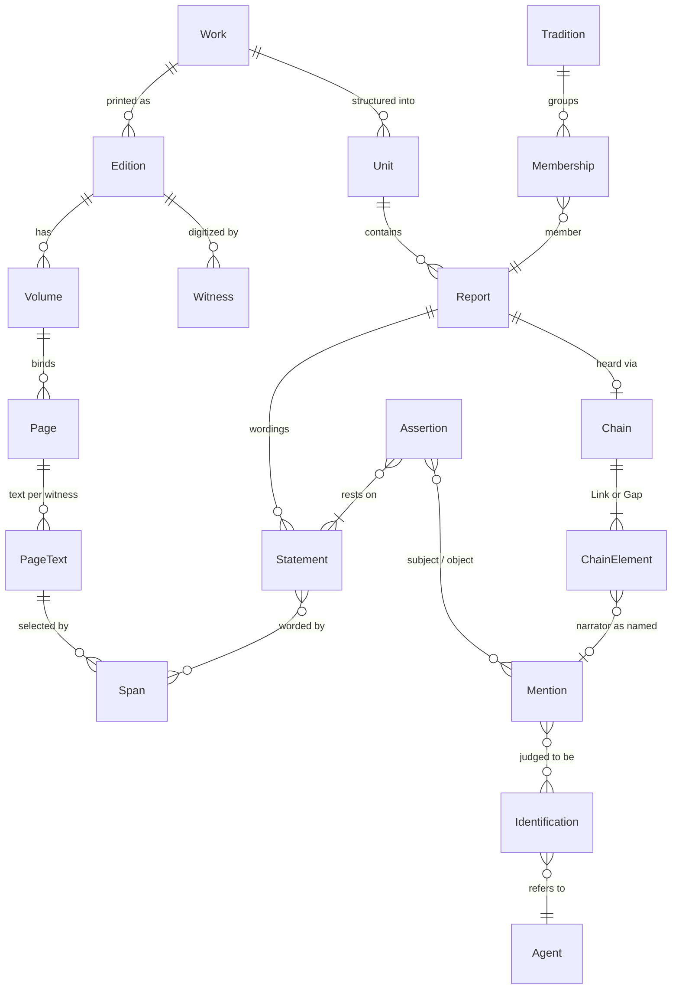
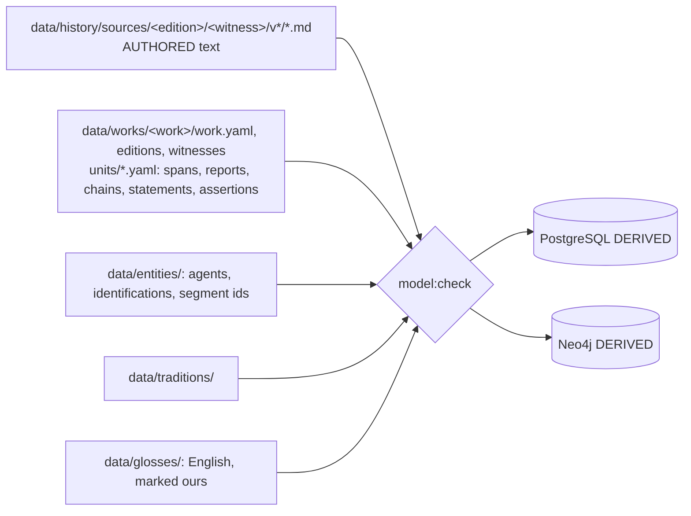
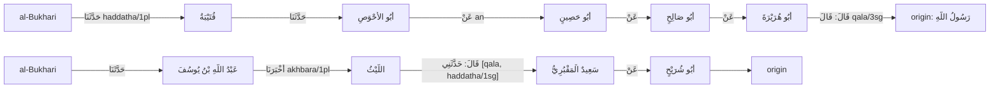

# The data model: attributed spans

Status: the group's plan (planner A, planner B, reviewer A, reviewer B), merged from `plan-a.md`, `plan-b.md`, their reviews and two discussion rounds. Evidence: `00-evidence.md` and lesson 0004.

## 1. Goals and principles

**The owner's goals.** The model holds facts, not our opinion and not our words. Like a hadith narrator, it says exactly how something was heard and from whom. Everything shown has a reference and holds exactly as it was said. Hadith of the Prophet ﷺ is the standard the model is built for, because a mistake there is far graver than one in history. Scope: tarajem, history (Sira, companions), hadith with the isnad as data, and tafsir. The app's Qur'an views read the Qur'an's text from `Ayah` only, never from a book; a book's quotation of an ayah is shown as that book's text. Arabic is vowelled and exact. Editions are never merged by publisher.

| # | Principle | Mechanical consequence |
|---|---|---|
| P1 | Arabic text is written once, in the witness page file. | No schema outside `data/history/sources/**` has a free Arabic field. A displayed Arabic string is always `render(span)`. |
| P2 | Every displayed fact names its span and its speaker. | An Assertion without a Statement fails, except migration-only `LEGACY`. A Statement without a span fails. |
| P3 | Say how it was heard. | Every transmitted Statement has a Chain of Links and Gaps; each Link's mode is the printed formula as spans, with a key derived 1:1. |
| P4 | Identification is a judgment and is recorded as one, from a source. | Every entity reference is a Mention plus an Identification with a basis span other than the mention itself. No Namaq-authored basis. |
| P5 | Our words are labels, never content, and are marked as ours. | Closed vocabularies, UI strings and `Gloss` records (English names, "grouped by Namaq"), rendered with a "Namaq's rendering" mark. Never Arabic. |
| P6 | Editions are distinct; a host's digitization is a Witness of an edition. | Edition identity = publisher + editors + printing. Witness carries fidelity flags. |
| P7 | Review is per record and never hides source text (ADR 0008). | Unreviewed records show their status. Our unreviewed judgments never become graph edges. |
| P8 | Approval covers the evidence as displayed. | Revision hash includes the rendered text and witness of every span a record reaches. |
| P9 | The Prophet's ﷺ words have a stricter gate. | Complete chain record with explicit Gaps, no default speaker, no `LEGACY`, honorifics as printed, two distinct human reviewers, one hadith-qualified. |
| P10 | The Qur'an's text comes from `Ayah` only, and a book's quotation stays the book's. | A quoted ayah is rendered as the book printed it, with a link to `Ayah`; differences are flagged, never substituted. |
| P11 | Files under `data/` are the authority (ADR 0010's rule); the databases are rebuilt. | PostgreSQL and Neo4j are never edited. |

**Refused outright:** free-text `assertion`; summaries the source did not write; ellipsis-joined quotes (a multi-part value is a list of spans, each shown whole, with a visible break); unvowelled re-typings; `confidence` (a source's own grading is a Statement with a speaker); a graph node for a name with no sourced identification; a grade on a report that no grading Statement targets; an edition identified by publisher alone; ayah text substituted into a book's words.

## 2. The model

### 2.1 Overview



### 2.2 Works, editions, volumes, witnesses, pages

| Record | Key | Fields | Notes |
|---|---|---|---|
| `Work` | `siyar-alam-al-nubala`, `sahih-al-bukhari` | author (Agent), genre `TARAJEM\|SIRA\|HADITH\|TAFSIR\|HISTORY`, `titleSpan?`, `authorClaim?` | `authorClaim` = a span with a `scope` (2.9). |
| `Edition` | `siyar-risalah-1405-arnaut` | work, publisher, editors[], printing, volume scheme, `numbering` map, `riwayah?` (a Chain) | Two printings with different pagination are two editions. |
| `Volume` | `(edition, number)` | number (the key), `label` as printed (`السيرة ١`, `الجزء ٢`), printed page range | Ends today's double numbering: the label is display only. |
| `Witness` | `shamela-10906` | edition, host, url pattern, per volume range: `vowelled`, `hasFootnotes`, `insertsLigatures`, `checkedAgainstPrint` | Shamela's bare Sira v1-2 and vowelled v4-5 become flags. |
| `Page` | `(edition, volume, printedPage)` | host ids per witness | Identity from ADR 0018. |
| `PageText` | `(page, witness)` | `data/history/sources/<edition>/<witness>/v<n>/<page>.md` + `.notes.md`, sha256 | The one authored text store. |

### 2.3 Spans (X2, agreed 4/4)

```ts
type Span = {
  id: string;              // minted once ("sp_7f3c1a"); never a content hash
  edition: string;
  volume: number;
  pageFrom: string; pageTo?: string;   // a sentence may cross a page turn
  layer: 'MAIN' | 'NOTES';
  exact: string;           // locator in match form; checked, never displayed
  prefix?: string; suffix?: string;    // required when exact is not unique, or under 12 letters
};
type MentionSpan = { parent: SpanId; exact: string; occurrence: number }; // short names anchored inside their parent span
```

| Rule | Detail |
|---|---|
| Match form | One versioned module (`matchSpan`), used by validator, reader and projection: drops footnote markers, collapses whitespace. Harakat, hamza and punctuation are significant. Host ligature `ﷺ` and the spelled formula match each other for locating only. Ends the duplicate in `verifyExcerpts.ts` and `sectionHeadings.ts`. |
| Render | `render(span)` = page slice at the resolved position minus a closed, tested deletion list: footnote markers, and an intra-span paragraph break becomes one space. Sigla such as `(ع)` stay; a span that should not show one ends before it. Honorifics are shown as printed, never added. |
| Contiguity | A span is one contiguous run in reading order (page turns allowed, notes layer excluded). |
| Re-anchor | `span:reanchor` proposes a new selector only when the old rendered text appears verbatim exactly once in the new page text. The id is kept. Nothing re-points by similarity. |
| Failure | A span that does not resolve uniquely fails `model:check` and blocks the build. There is no runtime broken state. |
| Cache | `{paragraphIndex, charStart, charEnd, pageSha, normVersion}` is derived into PostgreSQL. A re-split page changes the cache, not the span. |
| Numbers | `parsed` values run on match form, so `لَهُ سِتَّ (٢) عَشْرَةَ سَنَةً` parses to 16 (pinned test). |

### 2.4 Units

A `Unit` is the work's own structure with its own numbering: `kitab`, `bab`, `hadith`, `tarjama`, `ayah-comment`, `chapter`. `Unit.numbers` is `{scheme: value}` (Bukhari: Fath al-Bari, Sultaniyya, al-Bugha; mapping table per edition). `Unit.title` is a span. Contents lists (ADR 0019) are derived from Units.

### 2.5 Reports, statements, chains and modes (X4)

```ts
type Report = {
  id; unit: UnitId; ordinal: number;
  voice: 'AUTHOR' | 'TRANSMITTED' | 'EDITOR_NOTE' | 'REPORTED_ANONYMOUS';
  voiceBasis?: SpanRef;            // AUTHOR: heading, "قُلْتُ", a preceding frame; never a default
  frame: SpanRef[];                // the author's words around it: "وَرَوَى", "قَالَ ابْنُ سَعْدٍ"
  chain?: Chain; chainState: 'COMPLETE' | 'DEFERRED';
  enclosedBy?: ReportId;           // quotation of a book/author without transmission (Ibn Sa'd in the Siyar)
  origin: { mention: MentionId }   // final speaker as printed; for REPORTED_ANONYMOUS an unnamed-group mention ("آخَرُونَ", "قِيْلَ")
        | { workAuthor: true };     // AUTHOR voice only: the Work's author Agent, justified by voiceBasis; no invented Mention
  isnadSpan?: SpanRef;
};
type Statement = {                 // one wording
  id; report: ReportId; spans: SpanRef[];
  insertions?: { span: SpanRef; by: MentionId | 'UNKNOWN' }[];  // idraj, "أَوْ قَالَ", "أَحْسِبُهُ"
  role: 'AUTHOR_REPORT' | 'AUTHOR_SYNTHESIS' | 'TRANSMITTED' | 'EDITOR_ANALYSIS';   // ADR 0011
};
type Chain = { elements: (Link | Gap)[]; branches?: Chain[] };   // tahwil (ح) = branch sharing the tail
type Link = { narrator: MentionId; mode: SpanRef[]; modeKey: string };
type Gap  = { kind: 'GAP'; marker?: SpanRef[] };                  // ta'liq, mursal, balagha; length never inferred
```

- **modeKey** is 1:1 with the printed lemma plus person and number: `haddatha/1pl`, `haddatha/1sg`, `akhbara/1pl`, `akhbara/1sg`, `anba'a/1pl`, `samia/1sg`, `samia/3sg`, `an`, `anna`, `qala/3sg`, `qala-li`, `dhakara`, `balagha/1sg`, `yudhkaru`, `ruwiya`, `kataba-ilayya`, `qara'tu-ala`, `quri'a-ala`, `nawala`, `wijadah`. Abbreviations (`ثنا`, `نا`, `أنا`, `ثني`) map to the full key and keep their own span. An unmapped form fails the check and the table gains a row (documented under `docs/`); there is no `OTHER`.
- **Derived classes**, never replacing the key on an edge: `jazm` vs `tamrid` (`وَقَالَ اللَّيْثُ` vs `وَيُذْكَرُ عَنْ`), and "direct hearing" for filters.
- **Gaps.** A chain opening with the compiler's `وَقَالَ فُلَانٌ` starts with a Gap (ta'liq). A mursal ends `Link → Gap → origin`. Position decides: `قَالَ` after a narrator inside the chain is that link's mode; `وَقَالَ` opening a chain with no preceding `حَدَّثَنَا` is a ta'liq marker. No projected edge crosses a Gap.
- **Anonymous views.** `وَقَالَ آخَرُونَ` in al-Tabari and `وَقِيْلَ` in the Siyar are `REPORTED_ANONYMOUS`; the UI says "an unnamed view reported by al-Tabari", never "al-Tabari's view".
- **The book's own riwayah.** `Edition.riwayah` is a Chain from the edition's introduction or colophon (al-Bukhari: al-Firabri, then the line the edition follows). A marginal riwayah variant is a notes-layer span joined to the main span by a `Collation` record whose siglum is a span.
- **Voice and role.** `Statement.role` must agree with `Report.voice`: `AUTHOR` admits `AUTHOR_REPORT` or `AUTHOR_SYNTHESIS` (the only reviewed choice); `TRANSMITTED` and `REPORTED_ANONYMOUS` admit `TRANSMITTED`; `EDITOR_NOTE` admits `EDITOR_ANALYSIS`. Other pairs fail the check.
- **Check:** an `AUTHOR` report whose span opens with `رَوَى`, `قَالَ <name>`, `حَدَّثَ`, `عَنْ`, `قِيْلَ` or `وَقَالَ آخَرُونَ` fails.

### 2.6 Agents, mentions, identifications (X5)

| Record | Key | Fields |
|---|---|---|
| `Agent` | slug, global, one per real person/group/place/event/battle | kind; no Arabic name text; `displayMention` (a chosen Mention); English name is a `Gloss` |
| `Mention` | minted id | `MentionSpan` (the name only, not its mode word), role `SPEAKER\|NARRATOR\|SUBJECT\|REFERENT` |
| `Identification` | minted id | mention, agent, `basis: {span, role}[]`, status `PROPOSED\|REVIEWED\|DISPUTED\|REJECTED`, reviews[] |
| `ChainSegmentIdentification` | minted id | work, ordered mention texts of a contiguous segment (e.g. `الحُمَيْدِيُّ → سُفْيَانُ`), identifications, basis; applied by reference to listed occurrences |

- **Admissible basis roles:** `EDITOR_NOTE` (a notes-layer span), `RIJAL_ENTRY` (a span in a rijal/tarajem work), `SAME_WORK_EXPLICIT` (the tarjama heading for its own subject; `يَعْنِي ابْنَ عُيَيْنَةَ`), `NASAB` (a span distinct from the mention that carries the following nasab links, e.g. `العَوَّامِ بنِ خُوَيْلِدِ بنِ أَسَدِ` identifying `العَوَّامِ` as al-Awwam ibn Khuwaylid ibn Asad). The mention's own span is never a basis. A heading span is the entry number plus the name line (`٣ - الزُّبَيْرُ ...`); it may serve as basis only for the entry's own subject. An ambiguous isnad name (`سُفْيَانُ`) never takes `SAME_WORK_EXPLICIT` from itself. **No Namaq-authored basis** for anyone, narrators included.
- No basis: the mention stays unidentified text (`عَنْ رَجُلٍ`, `سُفْيَانُ`), shown as printed, never a node.
- Competing sourced identifications are all `DISPUTED`; the graph draws one marked edge per candidate only once each is reviewed as disputed; the profile lists each with its source. Namaq never picks.
- Display name = render of `displayMention`. An agent with none renders "not yet named in a transcribed source" / `غير مسمى في المصادر المنقولة`, never a slug.
- Battles, events and titles are Agents/subjects reached the same way; cross-work event identity (`بَدْر` vs `غَزْوَةُ بَدْرٍ الكُبْرَى`) is an Identification with a basis.
- A check fails if two applications of one segment identification resolve differently.
- **Segment review.** A reviewer approves the segment once and then a listed sample of its applications (at least 10% or 5, whichever is more), each recorded. **Inside a P9 statement there is no sampling**: two humans confirm the segment, and every application in a gated chain is listed and confirmed.
- **Author display.** An author Agent's `displayMention` may be the name span on the Work's title page; attribution labels ("al-Dhahabi, Siyar 4/41") use that span or the author's Gloss, marked as ours.

### 2.7 Assertions: what the app shows (X3)

```ts
type Assertion = {
  id;
  subject: MentionId;                  // reached through Identification, never a bare slug
  predicate: Predicate;                // closed: name.full, name.kunya, name.laqab, appearance, virtue, born.year,
                                       // died.year, died.place, islam.age, CHILD_OF, MARRIED, PARTICIPATED_IN,
                                       // ABSENT_FROM, status-at, title, EXPLAINS_AYAH, is-sahabi ... (new predicate = ADR)
  value: { spans: SpanRef[] }                      // text-valued, rendered from spans
       | { object: MentionId }                     // relation-valued
       | { parsed: number; spans: SpanRef[] }      // machine re-derived ("سَنَةَ ثَمَانِ عَشْرَةَ" -> 18)
       | { classified: string; spans: SpanRef[] }; // our reading ("اسْتُشْهِدَ" -> KILLED): reviewed, span always shown
  restsOn: StatementId[];              // >=1 except LEGACY
  status: 'LEGACY' | 'PROPOSED' | 'REVIEWED' | 'DISPUTED' | 'REJECTED';
};
```

Competing values are competing Assertions on the same subject and predicate, each resting on its own Statements; all are shown. A source's own preference (`وَالأَوَّلُ أَصَحُّ`) is itself a Statement and an Assertion of predicate `prefers`. The profile is derived from Assertions; `data/catalog/` is retired.

### 2.8 Traditions (X6)

`Tradition` groups unmerged Reports through `Membership {report, basis}`. Basis types: `EDITOR_TAKHRIJ` (span), `ATRAF_INDEX` (span), `SAME_WORK_EXPLICIT` (span), `NAMAQ`. `NAMAQ` is allowed for history, tafsir and athar, labelled "grouped by Namaq". Grouping a marfu' Prophetic report requires a span basis. Wordings are never merged; diffs are computed. Taqti and ikhtisar are separate Reports joined by membership, never reassembled.

### 2.9 Gradings (X7, agreed 4/4)

A grading is a Report whose Statement quotes the grader, with an Assertion of predicate `grading`: value = the term as a span (`صَحِيحٌ`, `حَسَنٌ`, `ثِقَةٌ`, `صَدُوقٌ`, `فِيهِ ضَعْفٌ`), target = a Report, a Tradition, or a narrator Mention (jarh wa ta'dil). Editor takhrij footnotes (al-Arna'ut) are gradings spoken by the editor Agent. `Work.authorClaim` is a span with a `scope` (`musnad-marfu` for al-Bukhari); it does not cover mu'allaqat, tarajim al-abwab or mawquf athar. No report shows a grade unless a grading Assertion targets it; the work banner shows the authorClaim text and scope.

### 2.10 Approval and publication (X8)

| Item | Rule |
|---|---|
| Unit | One record (Report, Statement, Assertion, Identification, Membership), minted id. |
| Revision | hash(record fields + for each span reached: sha256(render(span)) + witness id). |
| Lapse | Any change in a record or in the displayed text or witness of a span it reaches lapses that record only; `model:check` lists "published text moved". A re-anchor with identical rendered text lapses nothing. |
| Publish | Only the owner, on explicit instruction: `npm run model:publish -- <change set>` writes per-record revisions for a PR's records. Agents never publish. |
| Carried reviews | `reviewStatus` carried from today's batches is shown as "reviewed before the model" and never counts toward P9, edge drawing, or any review requirement. |
| Review | Separate act (ADR 0008). Each review records reviewer identity and qualification. **An agent is never a reviewer.** "Mark reviewed" still needs the owner's explicit words. |
| Prophetic gate (P9) | A Statement whose origin is identified as the Prophet ﷺ needs: complete chain record with explicit Gaps, no default speaker, no LEGACY, honorifics as printed, a page-image comparison of the matn recorded on the review, or an explicit `noImage` recorded, in which case the matn shows an "unchecked against print" mark, and two distinct human reviewers, at least one hadith-qualified, named by the owner. Without them it stays `PROPOSED`, text visible, no edges. The gate applies to the pilot. |

### 2.11 Visibility (X13)

| Thing | Shown? |
|---|---|
| Source text, page by page | Always. |
| Unreviewed Statements and Assertions | Yes, with status (ADR 0008). |
| `LEGACY` values (today's `legacy-unreviewed`, unresolved citations) | Yes, "no source yet"; migration-only, never newly created, counted to zero. Never on Prophetic material. |
| Unreviewed identifications, NAMAQ groupings, `classified` values | As labelled text only, never as graph edges. |
| Prophetic material | Text always; no LEGACY, no NAMAQ grouping of marfu', no edges or grade labels from unreviewed judgments. Recorded as a scoped ADR beside 0008. |

### 2.12 Storage and projection (X9)



| Store | Holds | Authored? |
|---|---|---|
| `data/history/sources/...` | page text and notes, per witness | fetched by script, never hand-typed |
| `data/works/<work>/units/*.yaml` | one file per Unit (tarjama, hadith, ayah comment) | yes |
| `data/entities/`, `data/traditions/`, `data/glosses/` | agents, identifications, memberships, glosses | yes |
| `data/archive/pre-model/` | today's batches, catalog modules, seeds, `excerptArabic`, `assertion` frozen at the migration tag | read-only, never projected |
| PostgreSQL | Work, Edition, Volume, Witness, Page, PageText, Span (+resolved cache), Unit, Report, Statement, ChainElement, Agent, Mention, Identification, Assertion, Tradition, Membership, Review; `Ayah` unchanged | derived |
| Neo4j | Agent/Event/Battle nodes; edges from relation Assertions; `NARRATED_FROM {modeKey, modeSpanIds, reportId}` from adjacent Links whose identifications are REVIEWED (or REVIEWED-as-DISPUTED, drawn marked), never across a Gap, in a separate isnad view excluded from centrality | derived |

Derived, never authored: rendered text, span positions, display names, profiles, contents lists, edges, ranks and layout, mode classes, search index. A change set is a PR listing record ids; ADR 0023 supersedes ADR 0010's layout and keeps its authority rule.

## 3. Worked examples

### 3.1 Siyar: al-Zubayr (real; `az-zubayr-ibn-al-awwam/batch.json`, `v4/41.md`)

Today one name exists three times: `assertion` (unvowelled, ends `القرشي الأسدي`), `excerptArabic` (vowelled, with `* (ع)`), and a catalog value.

```yaml
unit:   { id: u_siyar_v4_3, work: siyar-alam-al-nubala, type: tarjama, numbers: {printed: "٣"}, volume: 4 }
spans:
  sp_zb1: { edition: siyar-risalah-1405-arnaut, volume: 4, pageFrom: "41", layer: MAIN,
            exact: "الزُّبَيْرُ بنُ العَوَّامِ بنِ خُوَيْلِدِ بنِ أَسَدِ بنِ عَبْدِ العُزَّى", prefix: "٣ - " }
  sp_zb_heading: { exact: "٣ - الزُّبَيْرُ بنُ العَوَّامِ" }          # entry number + name line; basis only for its own subject
  sp_zb_nasab_tail: { exact: "بنِ خُوَيْلِدِ بنِ أَسَدِ بنِ عَبْدِ العُزَّى", prefix: "العَوَّامِ " }   # distinct from the mention
  sp_zb2: { exact: "ابْنِ قُصَيِّ بنِ كِلاَبِ بنِ مُرَّةَ بنِ كَعْبِ بنِ لُؤَيِّ بنِ غَالِبٍ", prefix: "* (ع) " }   # across the paragraph break
mentions:
  m_zb:    { parent: sp_zb1, exact: "الزُّبَيْرُ", occurrence: 1, role: SUBJECT }
  m_awwam: { parent: sp_zb1, exact: "العَوَّامِ", occurrence: 1, role: REFERENT }
identifications:
  - { mention: m_zb, agent: az-zubayr-ibn-al-awwam, basis: [{span: sp_zb_heading, role: SAME_WORK_EXPLICIT}] }
  - { mention: m_awwam, agent: al-awwam-ibn-khuwaylid, basis: [{span: sp_zb_nasab_tail, role: NASAB}] }
report:  { id: r_zb0, unit: u_siyar_v4_3, voice: AUTHOR, voiceBasis: sp_zb_heading, origin: {workAuthor: true} }   # al-Dhahabi is not named on the page
statement: { id: st_zb0, report: r_zb0, spans: [sp_zb1, sp_zb2], role: AUTHOR_REPORT }
assertions:
  - { subject: m_zb, predicate: name.full, value: {spans: [sp_zb1, sp_zb2]}, restsOn: [st_zb0] }
  - { subject: m_zb, predicate: CHILD_OF, value: {object: m_awwam}, restsOn: [st_zb0] }
```

The same page has a transmitted report on his age at Islam, beside al-Dhahabi's own:

| | Report | Origin | Value |
|---|---|---|---|
| `أَسْلَمَ وَهُوَ حَدَثٌ، لَهُ سِتَّ (٢) عَشْرَةَ سَنَةً` | `AUTHOR` | work author (al-Dhahabi) | `islam.age` parsed 16 |
| `وَرَوَى: اللَّيْثُ، عَنْ أَبِي الأَسْوَدِ، عَنْ عُرْوَةَ، قَالَ: أَسْلَمَ الزُّبَيْرُ ابْنُ ثَمَانِ سِنِيْنَ` | `TRANSMITTED`, chain `DEFERRED` until Siyar chains phase, frame `وَرَوَى` | Mention `عُرْوَةَ` | `islam.age` parsed 8 |

Two Assertions, two speakers, both shown. The display reads "al-Dhahabi, Siyar 4/41" (labels derived from Work/Volume/Page) and the spans as printed.

### 3.2 Bukhari: two chains (invented but realistic; numbering illustrative)

Unit `h:6018`, kitab al-adab:

> حَدَّثَنَا قُتَيْبَةُ بْنُ سَعِيدٍ، حَدَّثَنَا أَبُو الأَحْوَصِ، عَنْ أَبِي حَصِينٍ، عَنْ أَبِي صَالِحٍ، عَنْ أَبِي هُرَيْرَةَ، قَالَ: قَالَ رَسُولُ اللَّهِ صَلَّى اللهُ عَلَيْهِ وَسَلَّمَ: «مَنْ كَانَ يُؤْمِنُ بِاللَّهِ وَالْيَوْمِ الآخِرِ فَلاَ يُؤْذِ جَارَهُ»

Unit `h:6475`, kitab al-riqaq:

> حَدَّثَنَا عَبْدُ اللَّهِ بْنُ يُوسُفَ، أَخْبَرَنَا اللَّيْثُ، قَالَ: حَدَّثَنِي سَعِيدٌ الْمَقْبُرِيُّ، عَنْ أَبِي شُرَيْحٍ الْعَدَوِيِّ، قَالَ: ... «مَنْ كَانَ يُؤْمِنُ بِاللَّهِ وَالْيَوْمِ الآخِرِ فَلْيُكْرِمْ جَارَهُ»



- Two Reports, two Chains, two Statements (`فَلاَ يُؤْذِ` vs `فَلْيُكْرِمْ`), never merged. The honorific is shown as the page prints it.
- `أَبُو حَصِينٍ` has no basis until a rijal work is transcribed, so it is unidentified text and no edge is drawn through it. With a `RIJAL_ENTRY` span from that work it gets an Identification, then review.
- Grouping both into one Tradition needs a span basis (takhrij or atraf), because both are marfu'. They come from different companions, which is exactly why grouping is never our call here.
- Both stay `PROPOSED` until two human reviewers (one hadith-qualified) pass them.
- A mu'allaq `وَقَالَ اللَّيْثُ: ...` at a bab head: chain `[Gap{marker: "وَقَالَ"}, Link(اللَّيْثُ, ...)]`, class `jazm`; `وَيُذْكَرُ عَنْ ...` is `yudhkaru`, class `tamrid`. Neither carries a grade, since `authorClaim.scope` is `musnad-marfu`.

### 3.3 Tafsir: Ibn Abbas on 2:255 (Tabari-style)

> حَدَّثَنِي مُحَمَّدُ بْنُ سَعْدٍ، قَالَ: حَدَّثَنِي أَبِي، ... عَنِ ابْنِ عَبَّاسٍ: ﴿وَسِعَ كُرْسِيُّهُ السَّمَاوَاتِ وَالأَرْضَ﴾ قَالَ: كُرْسِيُّهُ عِلْمُهُ

- Unit `ayah-comment`, ayah 2:255. Report `TRANSMITTED`, origin Mention `ابْنِ عَبَّاسٍ` (basis from a rijal entry or an editor note; until then unidentified), Links `haddatha/1sg` ...
- The quoted ayah `وَسِعَ كُرْسِيُّهُ السَّمَاوَاتِ وَالأَرْضَ` is a span rendered **as al-Tabari's edition prints it**, with a link to `Ayah` 2:255 beside it. Any difference from `Ayah` is flagged, never substituted.
- Assertion `EXPLAINS_AYAH`: subject = Mention `ابْنِ عَبَّاسٍ`, value spans `كُرْسِيُّهُ عِلْمُهُ`, target ayah 2:255.
- `وَقَالَ آخَرُونَ: ...` a few lines later is `REPORTED_ANONYMOUS`, origin span `آخَرُونَ`.

### 3.4 Tarjama with a disputed identification (realistic pattern)

Siyar entry on a mawla of the Prophet ﷺ whose name is disputed (`اسْمُهُ سُلَيْمٌ، وَقِيْلَ: ...`):

- Two `name.full` Assertions: one resting on an `AUTHOR` Statement (`اسْمُهُ سُلَيْمٌ`), one on a `REPORTED_ANONYMOUS` Statement with origin `قِيْلَ`. Both shown; neither is attributed to al-Dhahabi as his view beyond what he wrote.
- Where the dispute is who the entry *is* (one work says a companion, another a tabi'i of the same name), the heading Mention gets two Identifications, each with a `RIJAL_ENTRY` basis span from its work, both `DISPUTED`. After review, the graph draws two marked edges; the profile lists both with sources. An `is-sahabi` Assertion from each work stands side by side; a contested companion is kept, never dropped.

## 4. Decision table

| Axis | Decision | Alternatives considered and why each lost | Group |
|---|---|---|---|
| X1 Text and display | Page files are the only Arabic text; display = `render(span)` with a closed, tested deletion list; book's ayah quotations shown as printed, linked to `Ayah`. | Copy-and-check (today; 414/727 values failed, 25 PRs rewrote dead `assertion`). A's first draft rendering quoted ayat from `Ayah` (substitutes a reading into a commentator's words; dropped to meet reviewer A). Displaying `exact` (a second copy). | 4/4 |
| X2 Span identity | Minted ids; quote selector with prefix/suffix; mentions anchored inside parent span; re-anchor only on unique verbatim match; lapse on rendered-text change. | Character offsets (silently re-point after any whitespace fix). Paragraph anchors `4/41-p3` (today; 8 anchors past paragraph count). Content-hash ids (A's draft; one haraka cascades through every key). Similarity re-anchoring (re-points quietly). Page-anchored short selectors for mentions (a name like `سُفْيَانُ` is ambiguous on the page after a re-fetch; anchoring inside the parent span keeps it unique). | 4/4 |
| X3 Values | Statement (what was said) + Assertion (what is shown) with subject/object as Mentions through Identification; value = spans / object / parsed / classified. | Today's catalog values plus free `assertion`. A's single Statement doubling as value (conflated wording and value). B's Assertion with bare agent slugs (unrecorded identification). In round 1 planner B and reviewer B proposed A's Statement-with-about; in round 2 planner B proposed the split that was adopted, and reviewer B signed it. The split won because the shown value and the spoken wording change for different reasons. | 4/4 |
| X4 Chains | Report voice incl. `REPORTED_ANONYMOUS`; Chain of Link\|Gap; modeKey 1:1 with printed lemma+person/number; abbreviations kept; jazm/tamrid derived; `enclosedBy`; `Edition.riwayah`. | A's `muallaq` boolean + `gapBefore` (cannot express a mursal's missing tail). A's closed coarse vocabulary with `unspecified` (hides unmapped forms). B without tamrid class and riwayah. | 4/4 |
| X5 Identification | Global Agent; Mention everywhere; basis span other than the mention (`EDITOR_NOTE`, `RIJAL_ENTRY`, `SAME_WORK_EXPLICIT`); no Namaq-authored basis; segment reuse; disputes all `DISPUTED`. | Narrators per work (graph useless across books). A's `namaq-authored` basis shown as labelled edges (our opinion on Prophetic chains; removed to meet reviewer A). One `asserted` in a dispute (choosing is our opinion). Identifying every occurrence separately (~37-50k blind reviews for Bukhari; segment reuse won). | 4/4 |
| X6 Traditions | Tradition + typed Membership over unmerged Reports; `NAMAQ` allowed and labelled except for marfu' Prophetic reports, which need a span basis. | Merged hadith record with diffs (loses which book said what). Forbidding Namaq grouping outright (useful for history; labelled honestly). Allowing Namaq grouping of marfu' (judges sameness of the Prophet's words). | 4/4 |
| X7 Gradings | A grading quotes its speaker; targets report, tradition or narrator; `authorClaim` scoped. | Our own `confidence` (opinion). Unscoped work-level "sahih" (mu'allaqat would inherit it). | 4/4 |
| X8 Publication | Per record, minted ids, revision includes rendered text + witness; owner-run publish per change set. | Batch-hash approval (today; one typo lapses 40 records). A's hash over `exact` only (misses a witness switch or render change). Agent publishing (AGENTS.md gives it to the owner). | 4/4 |
| X9 Storage | Per-Unit files under `data/works`, entities/traditions/glosses separate; PG and Neo4j derived; isnad edges in a separate view from reviewed identifications only; old stores archived. | B's per-batch `data/records` (a work-process grouping, not the book's structure; recurs as batch folders). Inline TEI markup (edits the source text). Narrator edges in the main graph (swamps companion centrality). | 4/4 |
| X10 Phasing | Text core, Siyar conversion, publish, projection with rollback, Siyar chains, one Bukhari kitab with go/no-go, tafsir pilot. | Hadith first (pilots on unchecked infrastructure, no rijal basis). Big-bang cutover (no way back). | 4/4 |
| X11 Editions | Work/Edition/Volume/Witness with fidelity flags; Shamela only until the owner changes it; numbering mapping table; mushaf and qira'a named by ADR. | Merge by publisher (forbidden by the owner). Volume label as key (today's double numbering). Second host now (against the Shamela-only rule; left to the owner). | 4/4 |
| X12 Review | Agents propose, never review; owner publishes; Prophetic gate with two distinct humans, one hadith-qualified, applies from the pilot; review surface before scale; segment-level review. | One regime for all genres (A's draft; ignores the owner's ranking of hadith error). Counting an agent as a reviewer, or waiving the gate for the pilot (rejected to meet reviewer B). | 4/4 |
| X13 Visibility | Text never hidden; unreviewed shown with status; LEGACY "no source yet"; our unreviewed judgments never edges; Prophetic: no LEGACY, no Namaq grouping, no unreviewed edges or grade labels. | Hide legacy (breaks ADR 0008, blanks seed-backed people). Show Namaq identifications as labelled edges (A's draft). Hide unreviewed hadith text (text is the source, never our judgment). | 4/4 |

**Conditional dissents resolved, so all four sign:**

| Dissenter | Condition | How the plan meets it |
|---|---|---|
| Reviewer A, X1 | No ayah text rendered in place of a book's quotation | P10, 2.3 Render, 3.3: quoted ayat render from the page, linked to `Ayah`, differences flagged. |
| Reviewer A, X5 | No Namaq-authored basis for isnad narrators | P4, 2.6: no `NAMAQ` basis exists for any identification; an unbased narrator stays text. |
| Reviewer B, X12 | An agent is never one of the two Prophetic reviewers, and the gate holds for the pilot | 2.10: agents are never reviewers; two distinct humans, one hadith-qualified; gate applies to the pilot. |

**Choices where proposals differed without dissent:** X3 (split over single Statement; reason above). E1 timing: before any public release rather than before phase 1, because the repo already holds the text and the preview databases are private; publishing to the public waits. E2: deferred to the search rewrite, because a derived index needs the projection in place.

## 5. Extra issues

| Id | Decision | Rule or trigger |
|---|---|---|
| E1 Shamela terms | include | Before any public (non-preview) release, an ADR records Shamela's terms for re-hosting and how the app attributes them; public release waits on it. |
| E2 Arabic search | defer | Trigger: the search rewrite after projection. Index derived from `render(span)` with one versioned search normalisation (harakat, hamza, tatweel folded); never displayed or authored. |
| E3 Quiz citations | include | Quiz questions cite record ids; a lapsed or rejected cited record fails `quiz:validate` and unpublishes the question until re-reviewed. |
| E4 Reviewer identity | include | Each review stores reviewer identity and qualification; an agent is never a reviewer; P9 needs two distinct humans, one hadith-qualified, named by the owner. |
| E5 Transcription fidelity | include | Witness records `checkedAgainstPrint`; a suspected host typo is a Collation note, never a page edit; Prophetic matns are compared with a print image when available, recorded on the review. |
| E6 Re-fetch and normalisation bumps | include | Both re-resolve all spans; only records whose render changed lapse; a changed Prophetic matn re-enters the P9 gate. |
| E7 Abbreviations, idraj, doubt | include | Abbreviations map to the full modeKey, keeping their span; idraj and doubt words are Statement insertions with a speaker Mention or `UNKNOWN`. |
| E8 Taqti and ikhtisar | defer | Trigger: first cut report in the Bukhari pilot. Each piece is its own Report, joined by Tradition membership with basis; never reassembled. |
| E9 Editor footnotes and sigla | include | Editor footnotes are Reports with the editor as speaker; takhrij grades are gradings. Sigla like `(ع)` stay as text and become Statements only when a predicate needs them. |
| E10 Shared segments | include | Segment identification stored once, applied by reference; a check fails if two applications resolve differently. |
| E11 Qira'at and rijal work | defer | Trigger: phase 0 ADRs name the `Ayah` mushaf and qira'a and the rijal work; the rijal work is ingested before the Siyar chains phase. |
| E12 Performance and projection tests | include | Resolution batched per page, cached by page hash + normalisation version; budget measured in phase 2; Vitest covers disputed edges, Gap non-crossing, unidentified mentions and modeKey on edges. |

## 6. Migration

### 6.1 Mapping

| Today | Becomes | Fate |
|---|---|---|
| Page store `v4/41.md` | PageText under `<edition>/<witness>/` | kept, moved |
| Anchor `4/41-p3` | Span selector computed from excerpt within paragraph | dropped after conversion |
| `citation.excerptArabic` | Span `exact` if it resolves | archived |
| `citation.volume`, `pageReference`, `extractionUrl` | Volume number, Page, derived URL | label kept as display |
| `claim.assertion`, `confidence` | nothing; a source's preference becomes a `prefers` Assertion | archived |
| `claim.field` / relation | Assertion predicate | kept |
| `claim.reviewStatus` | Review records (status carried, reviewer "pre-model") | kept |
| batch `approval` | per-record publication | replaced |
| `SourceAccount` | Unit | renamed |
| Catalog text values | Assertion spans | dropped as text |
| Catalog typed values, participations, titles, relations | Assertions (parsed/classified/object) | kept |
| `CatalogVirtue` (ADR 0020) | `virtue` Assertions, one per span | kept in spirit |
| `Utterance` (ADR 0015) | Report with origin Mention | merged |
| `legacy-unreviewed`, unresolved citations | `LEGACY` Assertions, shown "no source yet" | kept until zero |
| Seeds | archive; checklist only | retired |
| `HistoricalClaim`, `Citation`, `SourcePassage` tables | Assertion, Statement, Span | dropped after dual-run |

### 6.2 Phases

| Phase | Work | Acceptance | Rollback |
|---|---|---|---|
| 0 Decide | Owner answers section 8. ADRs: 0021 span selector, 0022 attributed statements and assertions, 0023 layout (supersedes 0010's layout), Prophetic scope beside 0008, mushaf/qira'a, rijal work, Bukhari edition and numbering. Rewrite AGENTS.md (ellipsis rule, narrator rule, publish/review wording). Snapshot both preview databases, then apply the ADR 0020 migration. Freeze authoring; tag `pre-model`. | ADRs merged; `catalog:validate` state recorded; snapshot restore tested. | Restore the snapshots (`pg_restore` of the dump, `neo4j-admin database load` of the dump), recorded in the phase PR. |
| 1 Text core | Works/editions/witnesses files, `matchSpan`, `render`, `model:check` span checks, `namaq span` tool, conversion of every citation to a span. | All 1,354 v4-5 citations, then all, are spans or listed with a reason; zero silent conversions; render test passes for every span. | Delete new files; old pipeline untouched. |
| 2 Siyar conversion | Units, Reports with voice per report (author with basis; transmitted with chain `DEFERRED` and named origin; anonymous), Statements, Mentions, Identifications, Assertions; review surface (page with highlighted spans, chain row, accept/reject/dispute). | Every profile value of the 105 batches renders from spans or shows as LEGACY; a per-profile old-vs-new diff is reviewed by the owner; voice check passes; resolution time measured. | Same. |
| 3 Publication | `model:publish`, per-record revisions, Review records. | Editing one Assertion lapses only it (test); a re-anchor lapses nothing (test). | Restore `batch.json` approval blocks from the `pre-model` tag; the old `history:import` path stays runnable until phase 4 acceptance. |
| 4 Projection | New PG tables and Neo4j labels beside the old ones for one release; per-profile diff report. | Rebuild from empty matches; unresolved list empty or each item retired by the owner; graph edge counts equal minus documented removals. | Redeploy `pre-model` tag and re-run the old projection on its preview DB. Criterion: any profile losing a value not on the reviewed diff. |
| 5 Siyar chains | Rijal work ingested (E11); chains, segment identifications, isnad view. | 20 tarajem fully chained and reviewed; no edge across a Gap; no edge from unreviewed identification. | Isnad view behind a flag. |
| 6 Bukhari pilot | **Entry criterion: Q1 answered, two named human reviewers, one hadith-qualified; otherwise the phase waits.** One kitab (owner picks, e.g. بدء الوحي or العلم), one edition, one witness. | All chain checks pass; P9 gate exercised with two named humans; minutes per decision measured; go/no-go for more. | Pilot data in its own work folder, unpublished. |
| 7 Tafsir pilot | One surah of one tafsir. | Ayah-quotation flags pass; anonymous views attributed correctly. | Same. |

### 6.3 Risks

| Risk | Mitigation |
|---|---|
| Formulaic text makes selectors ambiguous (`حَدَّثَنَا`) | Mentions anchor inside the parent span; prefix/suffix required when short or not unique. |
| Host re-transcribes a page | Page sha; re-anchor only on unique verbatim match; everything else lapses and is listed. |
| No second hadith-qualified reviewer | Prophetic material stays `PROPOSED`, visible as text; no edges. |
| Review load | Segment and bulk review for `SAME_WORK_EXPLICIT`; pilot measures before scaling. |
| Build time | Per-page resolution cached by page sha + normalisation version. |

## 7. Costs

| Item | Records | Human decisions |
|---|---|---|
| Plain Siyar value today | claim + citation (2) | 1 |
| Plain Siyar value here | Report (often shared) + 1-2 Spans + Statement + 1-3 Mentions + 1-3 Identifications + Assertion, about 6-8 | voice decision; heading/nasab identifications bulk-reviewed |
| One Bukhari report, 5 links | unit, report, statement, ~2 isnad/matn spans, 5 mentions, 5 mode spans, 5 links, memberships: about 20 | ~5 segment applications, each confirmed by both reviewers + 2 Prophetic reviews |
| One kitab pilot (~75 reports) | ~1.5k | ~375 identification links, est. ~120 distinct pairs; 150 Prophetic reviews |
| All of Bukhari (~7.5k reports with repeats) | ~150k | ~37k identification links, est. ~2k distinct narrators; ~15k Prophetic reviews; none possible before a rijal work is transcribed |
| Phase 5, 20 Siyar tarajem chained | per tarjama est. 5-15 reports with chains, 10-40 mentions, 5-20 distinct segments; ~200-400 segment decisions total, owner-reviewed; exact figures measured in phase 2 and recorded before phase 5 starts | owner hours estimated from the phase 2 measurement |
| Tafsir, one surah of al-Tabari | hundreds of reports | mostly recurring chains (segment reuse) |
| Storage | Span table with cached render under 200 MB for Siyar plus Bukhari (estimate, measured in phase 2) | |

Identifications are reviewed per distinct (mention text, neighbouring narrator) segment, approved once plus a listed sample of applications; inside Prophetic statements every application is confirmed by both reviewers. Full Bukhari is out of scope until the pilot's measured minutes per decision are known.

## 8. Open questions for the owner

The owner's answers and the plan's gaps and conflicts with their goals are in [owner-goals.md](owner-goals.md). Questions 1, 4, 5, 8 and 9 are answered there; 2, 3, 6 and 7 need research.

1. Who are the human reviewers, and who is the hadith-qualified second reviewer for P9?
2. Which rijal work is the identification basis (Tahdhib al-Kamal, Taqrib, al-Isabah for companions), and in what order is it ingested?
3. Which Bukhari edition and witness, and which numbering scheme is primary for display? Which kitab for the pilot?
4. Which mushaf and qira'a is the `Ayah` table's text?
5. Shamela's bare Sira volumes 1-2: accept with the fidelity flag, or block until a vowelled witness exists (which needs a second host)?
6. Does Shamela-only extend to Bukhari and tafsir, given host-inserted honorifics and uneven vowelling?
7. Shamela's terms for re-hosting before a public release (E1).
8. English names: keep as Glosses marked as Namaq's, or drop?
9. May `NAMAQ` groupings of non-Prophetic reports be published at all?

## 9. Sign-off notes and responses

| From | Item | Response |
|---|---|---|
| planner B | X3 vote note misstated round 2 | Fixed in the decision table. |
| planner B, reviewer A | `Report.origin` for AUTHOR voice had no printed mention | Fixed: origin may be `{workAuthor: true}` justified by `voiceBasis` (2.5, 3.1). |
| planner B | voice and role overlap | Fixed: compatibility check (2.5). |
| planner B | X2 missing page-anchored mention alternative | Fixed (decision table). |
| planner B | X5 missing per-occurrence alternative | Fixed (decision table). |
| planner B | segment review sampling unstated | Fixed: once plus listed sample, at least 10% or 5 (2.6). |
| reviewer B | sampling inside Prophetic chains | Fixed: no sampling in P9 statements; every application confirmed (2.6, 7). |
| reviewer A | `m_awwam` basis was its own parent span | Fixed: new `NASAB` role with a distinct span `sp_zb_nasab_tail` (2.6, 3.1). |
| reviewer A | `sp_zb_heading` undefined | Fixed: defined as entry number plus name line, basis only for its own subject (2.6, 3.1). |
| reviewer A | author display name | Fixed: title-page span or a Gloss marked as ours (2.6). |
| reviewer A | "when an image is available" | Fixed: `noImage` recorded and an "unchecked against print" mark shown (2.10). |
| reviewer A | goal line vs P10 | Fixed: reworded in section 1. |
| reviewer B | carried `reviewStatus` could pass as review | Fixed: shown as "reviewed before the model", never counts (2.10). |
| reviewer B | ADR 0020 migration had no rollback | Fixed: snapshot and restore commands (6.2 phase 0). |
| reviewer B | phase 3 rollback was not a procedure | Fixed: restore approvals from tag, old import kept runnable until phase 4 (6.2). |
| reviewer B | phase 5 cost missing | Fixed: cost row, measured in phase 2 (7). |
| reviewer B | phase 6 without named reviewers | Fixed: Q1 answered is the entry criterion (6.2). |

No item was rejected.
