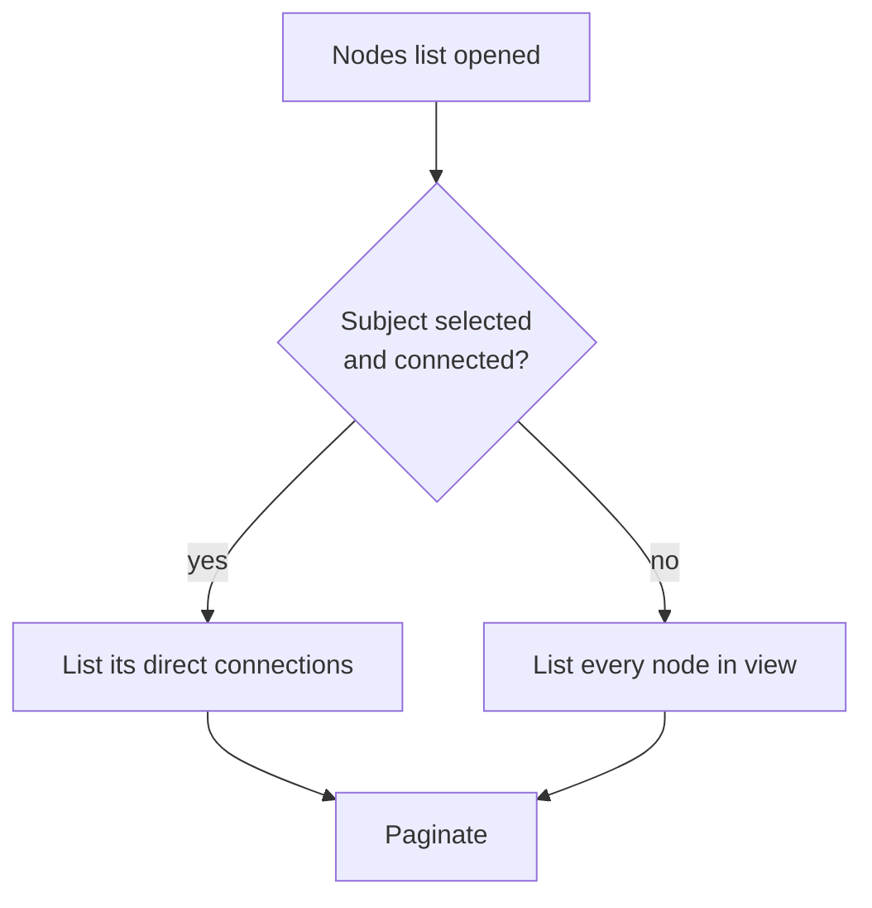

# Nodes list in the graph pane: future plan

Status: not built. The list today shows every node in view, ranked by
`graphRank`, with no paging (`src/components/graph/GraphCanvas.tsx`, the
"Nodes list" section of the fullscreen pane).

## Problem

On the full graph the list holds about 720 rows in a narrow pane. Search already
finds a named person, so the list's remaining job is choosing among nodes the
reader can see but cannot easily click, and reaching a node by keyboard without
searching.

## Proposal

Show the direct connections of the selected subject, and page the result.

- Direct connections mean the nodes one edge away from the selected subject in
  the current exploration, whatever the relation type. The set comes from the
  edges the exploration already holds (`exploration.edges`), so it needs no
  new fetch.
- With no subject selected, or a subject with no visible connections, fall back
  to every node in view. The order stays `graphRank` then label.
- Both cases page, about 20 rows a page, with the shared
  `src/components/common/Pagination.tsx`.
- Selecting a row keeps today's behavior: it selects that node, so the list then
  shows that node's connections.

## Open questions

- Whether each row should say which relation connects it to the selected
  subject, since that is what the list would now be for.
- Whether the fallback "every node" case earns its place or should read as an
  empty state that points to search.
- Page size on a phone, where the pane is a bottom sheet.

## Tests when built

Cover the connection set (both edge directions, a subject with none, the
fallback), the page boundaries, and selecting a row. See
`src/components/graph/GraphCanvas.test.tsx` for the navigation mock.
