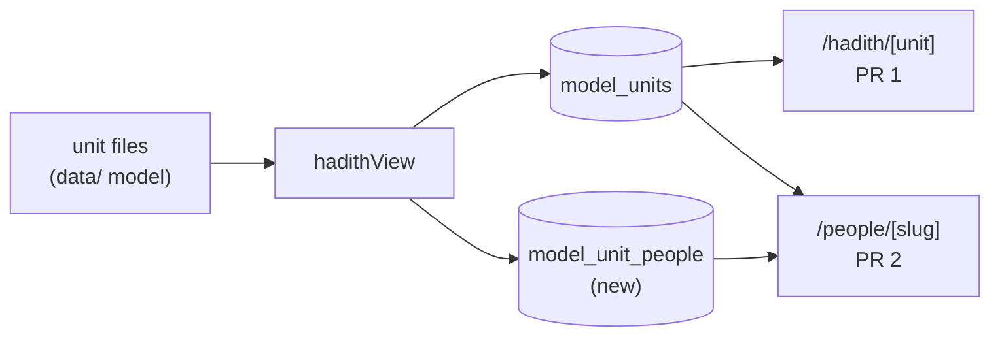

# Hadith on profiles

Status: ready to implement once the owner confirms the plan. No blockers.

A person's profile will list the hadith they have a role in, one hadith per page, in
one of two modes. The hadith page changes first, because the profile reuses its
parts. Terms are in [CONTEXT.md](../../CONTEXT.md). Data comes from the model's
units ([hadith-in-the-database.md](hadith-in-the-database.md)). The app is
unreleased, so the old page layout is replaced and nothing keeps it alive.

## Agreed behavior and scope

### Phase 1: the hadith page

- The page has a two-option toggle, **Full text** and **Isnad and bubbles**. Bubbles is
  the default. The choice is per page and is not saved.
- **Full text** shows the book's text of the hadith, from the start of its isnad to the
  end of its matn, with nothing extracted from it.
- **Isnad and bubbles** shows the isnad diagram and then the conversation as bubbles.
  A hadith with no conversation shows the matn as one bubble when its speaker is known,
  and as plain text otherwise. The diagram shows either way.
- The "extracted text" view (the scene lines without bubbles) and the bubbles checkbox
  are removed from the page. So are the separate Chain card and the Scenes card; the
  isnad lives in the diagram.
- The **compiler's remark** is not part of the hadith or its isnad, so it appears in
  neither mode. The page keeps it as a separate labelled note under the toggle, because
  removing it from the page would hide data
  ([ADR 0008](../adr/0008-separate-review-from-visibility.md)). It stays in the printed
  reader too.
- The **isnad diagram** takes one input shape, `{ nodes, edges }`, built from the chain:
  - Nodes are the narrators as the book prints them, the Companion at the head, and the
    collector. The collector is the first node, at the top, and the head is the last.
    The collector node shows the compiler's name (`البخاري`, `مسلم`), taken from a small
    table in `hadithView.ts` that is temporary for the fixture works. A real work should
    carry the name in its own data.
  - Edges point from the one who told to the one who heard, labelled with the mode wording
    (`حَدَّثَنَا`, `أَخْبَرَنَا`, `عَنْ`), so with the collector on top they point up. The
    chain is stored collector first, which is the order the diagram reads.
  - Two chains join only at the report's origin mention. No other narrators merge, since a
    merge needs an identification.
  - A node links to a profile only when its mention is identified to a person who has a
    profile page. Every other node is plain. No narrator becomes a Neo4j node in this plan.
  - A visually hidden ordered list sits beside the diagram as its text alternative.
- The diagram is static SVG: a layered layout computed from the edges, with no physics
  and no dragging. A force-graph rendering (`react-force-graph-2d` with `dagMode`) was
  built and compared on the two fixtures, and the owner dropped it: the two Muslim chains
  overlapped and the canvas opened zoomed in.

### Phase 2: the profile

- A person's profile gets a hadith section when they have a role in at least one hadith.
- A person has a role when a mention in the unit is identified to them, with these roles:
  **in the isnad** (a chain narrator, including the head), **speaks** (a turn speaker), or
  **mentioned** (any other mention in the matn). One person can have several roles in one
  hadith, and each is shown as a badge.
- The section shows **one hadith per page** with the shared `Pagination` (`showSelect` on),
  and each page is labelled with the book, kitab and bab. The page index is component state.
- The section has one toggle, **Full text** and **Isnad and bubbles**, default bubbles,
  shared by every page of the section. It is the page's toggle component.
- Bubbles show the whole conversation with the person's own bubbles highlighted. The
  isnad diagram shows with it, as on the page.
- Hadith are listed in the work's own order (work, kitab, bab, number as the unit records
  them), and the unit id when a unit has none. Nothing is ranked by role or by how much
  the person says ([owner rule R2](data-model/owner-goals.md)).
- Only hadith units appear. The compiler's remark and commentary units never do.
- Each hadith title links to `/hadith/<unit>`.

### Excluded

- Jibril. He is not a person in the app and has no profile.
- Ibn Umar's profile. The catalog and the seeds hold no `abdullah-ibn-umar-ibn-al-khattab`,
  and a stub with no cited values would break the rule that values rest on a source. His
  hadith appears the day his entry is added and his mention is identified to it. This is
  a known gap in the first acceptance run, not a blocker.
- Narrators as Neo4j nodes, and queries such as who heard from whom. That reverses the
  standing rule in [hadith.md](hadith.md) and needs its own ADR and plan. The diagram's
  input shape is chosen so a graph query can feed it later.
- A saved default mode per user. It waits for user accounts.
- A page number in the URL, and the real Bukhari and Muslim data.

## Acceptance criteria

Phase 1:

1. `/hadith/bukhari-jibril` and `/hadith/muslim-jibril` open in bubbles mode, and the
   toggle switches to Full text and back.
2. Full text mode shows the pasted Bukhari hadith text, from `حَدَّثَنَا مُسَدَّدٌ` to
   `دِينَهُمْ`, and the page has no extracted-text view and no bubbles checkbox.
3. The Bukhari diagram shows the collector first, then Musaddad, Ismail, Abu Hayyan,
   Abu Zur'a and Abu Huraira, with five arrows from each teller to the one who heard.
   Each arrow has its mode wording.
4. The Muslim diagram has the collector first and two paths that meet at the same Yahya
   node at the bottom.
5. Neither mode shows the compiler's remark; the page shows it once, as a note.
6. A node whose mention is identified to a person with a profile links to it; every other
   node is plain text. The hidden list has one item per node.
7. A hadith with no scenes still shows the diagram and its matn.

Phase 2:

8. `unitRows` writes one `model_unit_people` row per identified mention and role.
9. The Prophet's profile lists both hadith, one per page, and Previous and Next move
    between them.
10. Umar's profile lists the Muslim hadith and Abu Huraira's lists the Bukhari one, each
    with the role badge its mentions give. (The roles for Umar's mention are checked
    against the fixture when the code is written.)
11. The section toggle changes every page, and bubbles mode highlights the profile owner's
    own bubbles.
12. A profile with no hadith shows no section. The remark never appears.

## Affected components

Verified paths:

| Component | Change |
| --- | --- |
| `src/components/hadith/HadithUnit.tsx` | Replace the Chain, Scenes and extracted-text sections with the toggle, the diagram and the bubbles. Keep the remark as a note. |
| `src/lib/model/hadithView.ts` | Carry each chain link's mention and agent, and each scene line's agent, in the view. Expose the collector. |
| `src/components/graph/SlideSwitch.tsx` | Not reused: the toggle names two modes, so it is two `Button`s with `active`, per `AGENTS.md`. |
| `src/components/common/Pagination.tsx`, `Button.tsx`, `Badge.tsx` | Reused as they are. |
| `src/lib/model/unitRows.ts`, `scripts/model/project.ts` | Write people rows with `--units`. |
| `prisma/schema.prisma` | New `ModelUnitPerson` model. |
| `src/app/people/[slug]/page.tsx`, `src/components/people/ModelEntries.tsx` | Render the new section beside the existing entries. |
| `src/lib/model/fixtures/jibril/data/works/test-bukhari/units/jibril.json`, `test-muslim/units/jibril.json` | Add `PROPOSED` identifications for Abu Huraira (`abu-hurayrah`) and Umar (`umar-ibn-al-khattab`). |

Proposed new paths, not yet created:

- `src/lib/model/isnadGraph.ts`: builds `{ nodes, edges, collector }` from the chain view,
  and the layer layout for the SVG.
- `src/components/hadith/IsnadSvg.tsx`: the diagram.
- `src/components/hadith/HadithModeToggle.tsx` and a shared `HadithBody.tsx`, so the page
  and the profile use one body.
- `src/components/people/ProfileHadith.tsx`: the paged section.
- `src/lib/modelUnitPeople.ts`: loads a person's hadith, database first, files as the
  fallback, like `modelUnits.ts`.
- `prisma/migrations/<timestamp>_model_unit_people/`.

Order: view changes, `isnadGraph`, the diagram, page and toggle (PR 1); then the
migration, `unitRows`, the loader, the fixture identifications, and the profile section
(PR 2). PR 2 depends on PR 1's body and toggle.

Unverified assumptions, to check when the code is written:

- How `m_umar`, `m_ibn_umar` and `m_abu_hurayra` are used in the Muslim and Bukhari
  turns. The Muslim turns `o2` and `o3` have no speaker, so Umar may come out as
  "mentioned" and not "speaks".

## Validation

Automated, colocated with the code, search and graph first:

- `isnadGraph.test.ts`: edge direction runs from teller to collector; the Bukhari path has
  five arrows; the collector is first and the Muslim chains join at the origin and nowhere else; a hadith with a gap
  link still lays out; identical input gives identical layout. (criteria 3, 4, 7)
- `HadithUnit.test.tsx`: default mode, toggle both ways, no extracted-text view, the remark
  shown once and in neither mode, linked and plain nodes, the hidden list. (1, 2, 5, 6)
- `hadithView.test.ts` and `unitRows.test.ts`: agents on links and lines; one people row
  per identified mention and role. (8)
- `ProfileHadith.test.tsx`: pagination, order, the shared toggle, role badges, highlighted
  bubbles, no section when empty. (9, 10, 11, 12)
- The `next/navigation` mock pattern in `GraphSearch.test.tsx` applies if the section reads
  search params; it does not read any now.

Repository checks: `npm run lint`, `npx tsc --noEmit`, `npm test`.

Visual verification in the browser, because layout and RTL are what tests cannot see:
the diagram on both fixtures in light and dark, in Arabic and English, and at phone
width.

## Data and operational consequences

- PR 2 adds one table. The owner applies it (`npx prisma migrate deploy`); merging does
  not, since the build has no migrate step.
- After that, rerun the projection against preview:
  `npm run model:project -- --units --root src/lib/model/fixtures/jibril --apply --env preview`.
  Until both are done the profile section is empty. Rerun it whenever a unit's files change.
- The fixtures stay preview only, and `--units` keeps refusing `--env prod`, so prod
  profiles show no hadith section.
- No Neo4j change, so `npm run graph:layout` is not rerun.
- The README gains a line under "What is implemented" for each phase.

## Open issues

Blockers: none.

Nonblocking:

- **The compiler's remark** is planned as a labelled note on the hadith page and absent
  from both modes and the profile. This was proposed to the owner and awaits a yes.
- **Ibn Umar's profile** is a known gap until his entry is extracted.
- **Narrators in Neo4j**, queries over who heard from whom, and a saved mode default are
  separate plans.
- **A hadith with a very long isnad** may need a horizontal scroll in the diagram. Decide
  when a real collection is imported.
