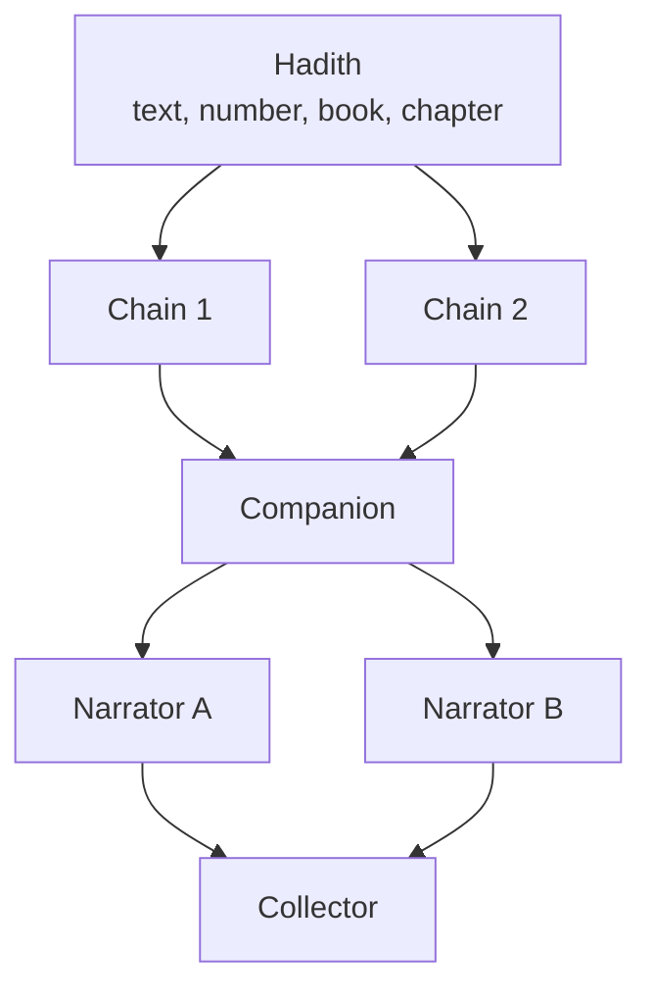

# Hadith and transmission chains: future plan

Status: not built. The plan is to bring in Sahih al-Bukhari with its chains of
narration, and to show in the graph when one hadith comes by more than one chain.
The sequence agreed so far is in
[data-quality-references.md](../data-quality-references.md), which puts ayat
revealed about people first, then hadith, and names al-Nawawi's Forty Hadith and
Sahih al-Bukhari as candidate first collections.

## This reverses a standing rule

Today, complete chains stay in the source text, and a person named only as a
narrator does not become a graph node or an edge
([data-quality-references.md](../data-quality-references.md), "Transmission
chains", and `AGENTS.md`). That rule was written for the biographical entries.
For hadith the chain is the content, so this plan needs its own decision before
any code:

- Write an ADR that scopes the change to hadith. Biographical entries keep the
  old rule, and only hadith chains produce narrator nodes and edges.
- Revisit the subject scope. Only Companions are in scope today, and most
  narrators after the Companion at the head of a chain are not Companions.
  Either widen the scope for narrators, or give narrators their own kind of node
  that never becomes a full profile unless someone chooses it.

## Model

- **Hadith.** One record per hadith: its text (the matn), its number in the
  collection, its book and chapter, and the edition it is read from. Where a
  collection repeats a hadith in several chapters with different chains, that is
  one hadith with several chains, not several hadiths. How to tell the two apart
  is a scholarly call to make with the source, not to guess.
- **Chain.** An ordered list of narrators from the Companion to the collector,
  with the mode of transmission at each link where the text states it.
- **Narrator.** A reference to a person. Where the person is already in the
  catalog, reuse that record. Where not, a stub with a name and no profile.
  Identifying the same name across chains is the hard part: several narrators
  share names, and a wrong merge corrupts the graph.
- **Evidence.** The chain and its links are claims with citations to the page of
  the edition, like every other value, and follow the same review statuses
  ([adr/0008](../adr/0008-separate-review-from-visibility.md)).
- **Grading.** Record a grading only where the source gives one, and attribute
  it. Sahih al-Bukhari's status as a collection is not a per-hadith claim to
  invent.

## Showing chains in the graph

The point is to make it visible when the same hadith arrives by different routes.

- A hadith is a node. Its chains fan out as paths from the Companion at the root
  to the collector, and paths that share a narrator merge at that node, so
  differing chains show as branches that split and rejoin.
- A reader can select a hadith and see all its chains, or select a narrator and
  see every hadith through them.
- Chains are long, so the relation caps and expansion controls
  ([graph-expansion-controls.md](../graph-expansion-controls.md)) need a rule for
  a chain: expanding a hadith reveals its chains, not the narrator's whole
  network.
- Layout is precomputed over every edge
  ([adr/0005](../adr/0005-use-a-precomputed-global-graph-map.md)), and
  `npm run graph:layout` computes centrality over all relation types. Adding
  thousands of narrator edges shifts every rank and position, so the layout
  needs a decision on whether hadith live in the same map or in their own view.
- A new node kind means new filters, colours and legend entries in the graph
  panel and the relation vocabulary.

## Source and reading

- Choose the edition and its digital host, and check the terms of use before
  copying text ([README](../../README.md), License). Not decided.
- Read it in the reader ([book-reader-design.md](../book-reader-design.md)),
  paged like other sources, with a hadith as the unit and its number as the
  anchor. Check whether the reader's paragraph model fits a chain plus a matn.
- Extraction follows the same batch workflow: files under `data/`, validation,
  approval, then import.

## Open questions

- The scope decision above, and the ADR that records it.
- Whether to start with a small collection to prove the model, such as the Forty
  Hadith, before Bukhari.
- How to represent a link the text leaves ambiguous, such as a name with more
  than one possible narrator.
- Whether narrations by the same Companion should surface on that Companion's
  profile.
- Search: finding a hadith by text, by narrator or by number.

## Tests when built

Cover chain validation (order, a broken link, a repeated narrator), the merge of
two chains at a shared narrator, the rule that biographical entries still create
no narrator nodes, and the graph query for one hadith's chains. Search and graph
features come first, per `AGENTS.md`.
