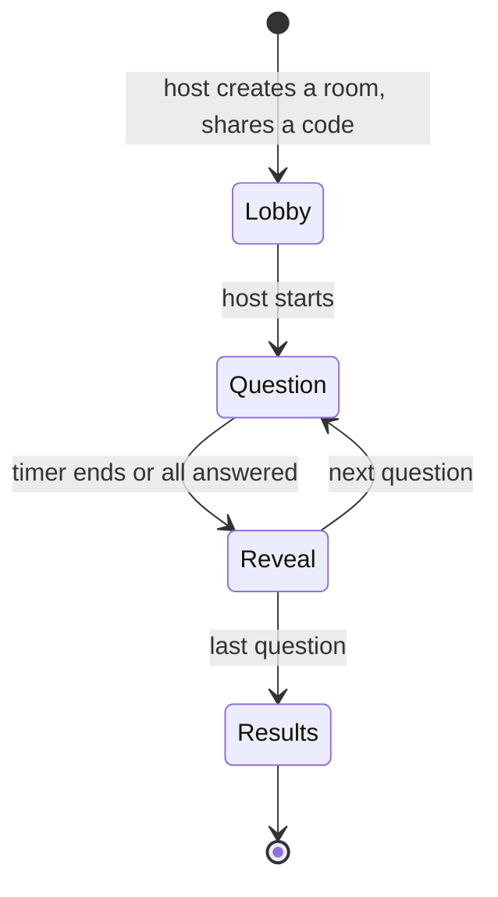

# Quizzes and party games: future plan

Status: not built. Two modes: a solo quiz, and a party game where several people
play the same game at the same time, receiving the same questions and competing
on score. The party mode is in the spirit of Sporcle's party trivia.

The question-generation engine and the solo quiz described below are both
built — see [quiz-question-engine.md](quiz-question-engine.md) (a seventh
family, `TITLE_HOLDER`, and the exact eligibility rule) and
[solo-quiz.md](solo-quiz.md) (topic/length picking, free navigation, batch
feedback) for what they actually do and how they differ in detail. Party
mode is still not built. The reviewed-bank quality redesign is planned in
[reviewed-quiz-bank.md](reviewed-quiz-bank.md).

## Principle: questions come from the claims

A question is not new data. It is a view of a value the model already holds and
cites, so every answer can show the passage it came from. Nothing enters a quiz
that the catalog cannot back.

Question families, each tied to something the model holds today
([data-pipelines.md](../data-pipelines.md)):

| Family | Example | Backed by |
| --- | --- | --- |
| Relation | Who was the father of X? | A person relation claim |
| Participation | Which of these battles did X attend? | A participation |
| Title | Which title did X hold? | A title assignment |
| Name | Whose kunya is Abu X? | A profile field claim |
| Event | In which year did X happen? | An event year |
| Qur'an link | Which ayah was revealed about X? | A Qur'an link |

## Generation

Deterministic templates first, with no language model in the loop. A template
takes a claim and a distractor rule and produces one question.

- **Answer:** the value the claim backs.
- **Distractors:** other values of the same kind, chosen to be plausible: another
  companion of the same clan for a relation, a nearby year for a date. A
  distractor must never itself be true for the subject, so check it against the
  catalog.
- **Evidence:** the claim and citation ids, shown after the answer so the reader
  can open the page it came from.
- **Eligibility:** only values with a cited claim. A value marked
  `legacy-unreviewed` is excluded, since its evidence is still owed. Whether
  claims that are *Not reviewed* qualify, or only *Reviewed* ones, is a decision
  for the owner.
- **Never authoritative:** a question is derived and regenerated from the
  catalog. It is not stored as a source of truth, so a corrected claim fixes its
  questions with no separate edit.

A language model could later write extra phrasings or hints, but that output
would need review before it shipped, like any other batch, and is out of scope
here.

## Solo quiz

- Pick a topic (people, battles, titles, events, or a person's own circle) and a
  length.
- No timer. Free navigation: jump to any question, skip one and return to it
  later, in any order.
- Feedback is batched, not per question: answers are revealed together, with
  evidence links, only after the whole quiz is submitted -- unlike the party
  game below, which reveals each round live. See
  [solo-quiz.md](solo-quiz.md) for why the two modes differ here.
- Result page with the questions missed.
- Works without an account. With one ([user-accounts.md](user-accounts.md)), keep
  history and per-topic progress.

## Party game

Everyone in a room gets the same questions in the same order, and the score
depends on correctness and speed.

- **Rooms:** a short code to join, a nickname without an account, and a host who
  starts the game.
- **Authority:** the server owns the question timer and the scoring. A client
  only sends an answer, so a player cannot fake a fast one. The answer key stays
  server-side until the reveal.
- **Scoring:** points for a correct answer, more for a faster one, with a fixed
  cap. Ties share a rank.
- **Disconnects:** a player who drops can rejoin the room and keeps their score;
  a missed question scores zero.
- **Arabic first:** questions and answers in both languages, right-to-left
  layout, and answer matching that treats vocalisation differences fairly if any
  free-text mode is ever added. Start with multiple choice only.

## Decision needed: realtime transport

Vercel's serverless functions cannot hold a WebSocket open, so the party mode
needs a realtime service or a small stateful server. Options to compare: a
hosted realtime service (Ably, Pusher, Supabase Realtime), PartyKit or a
Cloudflare Durable Object per room, or Server-Sent Events for
server-to-client with ordinary requests for answers. Score them on the free
tier, room size, latency, and how much room state lives outside PostgreSQL.

## Open questions

- Whether a question set is generated when the room is created, so it is fixed
  and reviewable, or generated per game from a seed.
- Difficulty: whether to derive it from a subject's graph rank, so famous people
  are easier.
- Content moderation: none needed for generated questions, but nicknames in a
  party room are user text.
- Whether a quiz result can be shared, and what it may reveal about the player.

## Tests when built

Cover each template's answer and distractor rules, the exclusion of unqualified
claims, the server-side scoring and tie handling, and the room state machine,
including a rejoin. Templates live in `src/lib` so they test without a
component.
