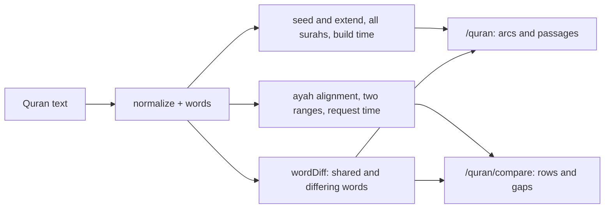

# Notes on unifying the /quran and /quran/compare engines

Status: exploration only. Nothing here is decided or built. Revisit when more Quran
features exist and the pages' real needs are clearer.

The owner's idea: the two Quran pages might share one engine, and a comparison such as
Ar-Rahman 46-61 against 62-77 might also surface on `/quran`. This note records what the
two engines do, challenges the idea, and lists suggestions in the order they cost.

## What each page does today

| | `/quran` | `/quran/compare` |
|---|---|---|
| Question | Which surahs share a passage? | How do these two ranges line up? |
| Input | All 6,236 ayat | Two different surahs today. Ayah ranges and a surah against itself are requested and being built in PR #362 |
| When it runs | Build time (`npm run quran:demo`), output in `runs.json` | At request time |
| Unit | Words, across ayah boundaries, at least 10 | Whole ayat, runs of at least 2 words |
| Method | Seed and extend with a few skipped words allowed (`passages.ts`) | Order-preserving alignment scored by run length squared (`compare.ts`) |
| Within one surah | Skipped on purpose | Not yet; requested in PR #362 |
| Output | Arcs and passage pairs | Aligned rows, gaps and a count-based tail |

Both share `normalize.ts` and `wordDiff.ts`. They do not share the run finder.
`longestRun` in `compare.ts` finds exact contiguous runs, and the extend step in
`passages.ts` also tolerates up to four skipped words, so the two overlap without being
the same.

## Challenges to the idea

1. **The pages answer different questions.** `/quran` is for discovery, when the reader
   does not know what to compare. `/quran/compare` is for inspection, when they do.
   One engine behind both can still keep two pages, but one page doing both would blur
   them.
2. **One algorithm cannot do both jobs.** The global scan cannot produce ayah rows, gaps
   and a tail. The ayah alignment cannot scan every pair of surahs: that is 114 x 113 / 2
   pairs, and the live cost on large pairs such as 2 and 3 is still unmeasured. A single
   engine would be a shared lower layer with two callers, not one algorithm.
3. **Two thresholds already share one label.** `/quran` calls ten consecutive words
   "نص مشترك". Compare also labels runs of two or more words "نص مشترك" and uses
   "كلمات مشتركة" for scattered words. Showing one passage on both pages, under one
   label with two meanings, will confuse a reader. The wording needs to separate them.
4. **Within-surah passages are noisy.** `/quran` skips them on purpose. Surahs built on
   a refrain (Ar-Rahman, Al-Mursalat, Al-Qamar) would produce many trivially repeating
   passages. Adding them needs a refrain filter first.
5. **Passages start mid-ayah, compare works on whole ayat.** A deep link from a passage
   to compare would show the whole boundary ayat with the passage words colored and the
   rest plain. That is honest, but the reader should be told.
6. **Early unification locks the shape.** Prophet stories (the next planned feature) and
   other relations may need runs, ranges and diffs in ways neither page needs now. A
   shared engine built before then is a guess.

## Suggestions, cheapest first

1. **Link the pages.** A button on each passage on `/quran` opens `/quran/compare` with
   that passage's surahs and ayah ranges. This needs compare to accept ranges, which PR
   #362 is adding. No engine change.
2. **Write the vocabulary down.** One short glossary: shared passage (a run of ten or
   more consecutive words), shared words (any), aligned pair, gap, count-based tail.
3. **Share one run finder, when a third caller exists.** Move the run finding and the
   word diff into one module, and keep two callers. Wait for the prophet-stories feature
   so the shared layer is shaped by three users, not two.
4. **Measure gap tolerance before adopting it.** Allowing one skipped word in compare
   would catch near-repeats. Compare before and after on 56/69, 57/64, 7/26 and 55/55,
   and keep it only if false pairs do not grow.
5. **Within-surah passages, behind a flag.** Add them to `/quran` only with a refrain
   filter, and only if the owner wants them.
6. **Measure the live engine.** Time compare on 2 against 3 and on a range-by-range
   pair, and decide whether to precompute or cache.
7. **Leave the all-pairs search at build time.** It is the cheapest place for it, unless a
   later feature needs it live.

## Options

| Option | What it is | Cost | Leaning |
|---|---|---|---|
| A | Keep two engines, link the pages | Low | First |
| B | Share the run finder and diff, two callers | Medium | After a third caller exists |
| C | One algorithm for both | High, and it loses ayah rows or all-pairs scale | Unlikely to fit |

## Open questions

- Should `/quran` show within-surah repetition such as Ar-Rahman at all?
- Should compare accept a passage from `/quran` as a starting point, or only ranges?
- When prophet stories arrive, do they need ayah ranges, word runs or both?
