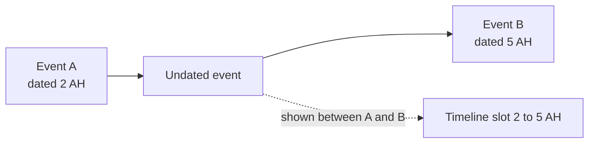

# Placing undated events on the timeline: future plan

Status: not built, and superseded by [time-layer.md](time-layer.md) and
[ADR 0028](../adr/0028-a-stated-ordering-is-recorded-and-its-placement-is-derived.md).
Where they differ they win: a constraint is a catalog record with `BEFORE` only, and a
cross-source cycle is a dispute, not a data error. This file keeps the problem statement.

An event or battle with no `hijriYear` is shown as "Unknown"
and sorted last, on the events page and on a profile's timeline
(`compareHijriYear` in `src/lib/hijriYear.ts`). That is honest, but it throws
away what the sources often do say: that the event fell after one dated event
and before another.

## Problem

`Event` and `Battle` carry `hijriYear` and a free-text `hijriPeriod`, and
nothing else that orders them. An event known only to sit between two dated
ones has no way to say so, so it lands at the end of the timeline, far from
where a reader would look for it.

## Proposal

Record ordering constraints between events, and sort an undated event by the
dated events around it. Ordering is relative, so it is stored as claims about
pairs, not as a made-up year.

- **Constraint.** An undated event can be `AFTER` one event and `BEFORE` another.
  Each constraint is a cited claim from a source, like any other value the model
  holds, following the rules in `AGENTS.md` for authoring claims. The value it
  backs is the event's place in the order.
- **Resolution.** For an undated event, take the latest dated event it comes
  after and the earliest dated event it comes before, and place it inside that
  interval. Constraints between two undated events chain, so the order is a
  partial order sorted topologically, then by any dated bounds.
- **Display.** Show the interval instead of "Unknown", for example "between 2
  and 5 AH", and mark the slot as approximate so it is never read as a date.
  Undated events with no constraint stay last, as today.
- **Ties.** Events sharing the same interval keep a stable order (name, then
  slug) until a finer constraint separates them.
- **Contradictions.** A cycle, or a bound that puts an event outside its own
  interval, is a data error. Report it in `history:validate` rather than
  guessing.

## Open questions

- Where the constraint lives: a relation between two events in Neo4j, a field on
  `Event`, or a claim type on `HistoricalClaim`. The claim route fits the
  evidence model best, since the constraint needs a citation.
- Whether `hijriPeriod` (free text such as a season or month) should feed the
  same ordering when it is precise enough.
- How the interval reads for years before the hijra, where there is no year
  zero (`formatHijriYear`).
- Whether the profile timeline, which lays events out in snake rows, shows the
  interval or only the position.

## Tests when built

Cover the interval for a chain of undated events, an event with only one bound,
one with none, a cycle, years before the hijra, and the tie order. The sort
belongs in `src/lib`, beside `hijriYear.ts` and its test, so it is tested
without a component.
