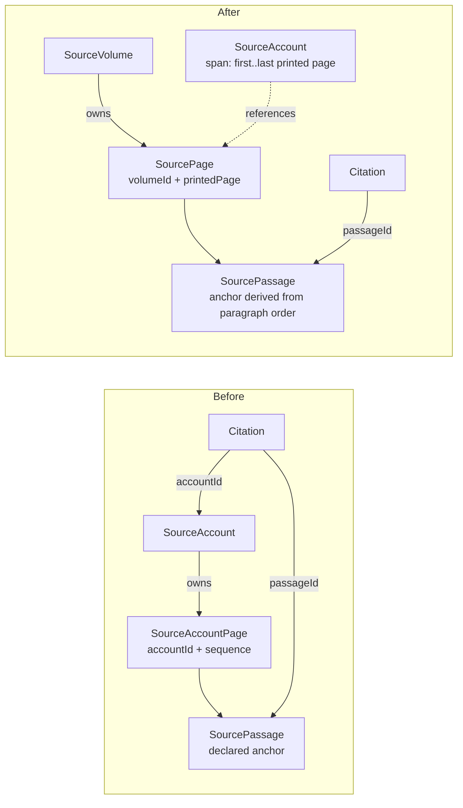

# Source page store

Status: **ready**. The prerequisite under [Blockers](#blockers) has landed.
Nothing below is implemented yet.

Move the authored source text out of review batches into a per-source page
store, make a page belong to its volume rather than to an entry, and let
`/sources` read a volume continuously and say where it has not been read. The
decision behind it is
[ADR 0018](../adr/0018-a-page-belongs-to-the-edition.md); the terms are in
[CONTEXT.md](../../CONTEXT.md).

## Why

`/sources` was built to show the evidence behind a claim and now presents the
work as a book: it lists all 28 volumes of the Siyar and marks the unread ones.
Inside a volume that has been read it says nothing. Volume 5 holds 128 printed
pages in five runs, and a reader who opens every entry listed passes a 21-page
hole after Aisha without a sign. There is also no continuous reading: the unit
is the account, so the last page of an entry does not turn into the next.

## What changes

## Agreed behavior and scope

### Authored files

- **A source manifest** at `data/history/sources/<source>/source.json` holds the
  edition, editor, publisher, digital host and the volume list, once. Each
  volume declares its **first and last printed page**, which is what gives
  coverage a denominator. Today the same edition is declared in 87 batch files
  in six diverging variants, and import upserts, so the last batch written wins.
- **A page store** at `data/history/sources/<source>/v<N>/<printedPage>.md`,
  with `<printedPage>.notes.md` beside it for that page's editorial footnotes.
  One file per printed page of the edition, holding the whole page.
- **A batch** keeps `summary.md`, its claims and its citations, and names the
  source slug plus the span of its entry. It no longer contains page text and
  no longer repeats the source block.
- **Anchors are derived, never declared.** Paragraph *n* of a page file is
  `<volume>/<printedPage>-p<n>`. The `passages` array disappears from the
  authored format, and with it the positional pairing in `passageExcerpts`.

### Stored model

- `SourcePage` replaces `SourceAccountPage`: `volumeId`, `printedPage`,
  `bodyMarkdown`, `notesMarkdown`, `extractionUrl`, `accessedAt`, unique on
  `(volumeId, printedPage)`. `printedPage` becomes required and numerically
  ordered; all 1,496 existing records already carry a numeric value.
- `sequence` is dropped. Order within a volume is by printed page, and the
  edition's own skipped numbers (volume 1 has no 296 or 442, volume 2 no 298)
  stop being a special case because navigation walks existing rows.
- `SourceAccount` keeps `subjectKind`, `subjectSlug`, `entryIdentifier`,
  `titleArabic`, `notInSource` and `@@unique([sourceId, subjectKind,
  subjectSlug])`, and gains a span: volume plus first and last printed page. It
  holds no pages.
- `SourceVolume` gains `firstPrintedPage` and `lastPrintedPage`.
- `Citation.accountId` is dropped. Every `accountId` read in the codebase is
  `SourceAccountPage.accountId`; `Citation.accountId` is written at
  `src/lib/history/importBatch.ts:207` and read nowhere.

### Reading

- A page shows **the whole printed page**, including on a boundary page where
  one entry ends and the next begins. Trimming to the entry's portion would
  reintroduce text whose content depends on who is reading it.
- The reader pages through a **volume**, not an account. The address becomes the
  volume and the printed page. Old `?book=<accountId>&page=<sequence>` links are
  not translated: the app is unreleased and no back-compatibility layer is kept.
- The entry index stays: an account's span is how a reader jumps to a subject's
  entry and how the contents list is built.

### Coverage and gaps

- The contents view lists, per read volume, the stretches not read, alongside
  the unread-volume marking it already does.
- The reader shows a seam marker where one read stretch ends and the next
  begins.
- **"Not printed" and "not read" are different states.** The edition skips page
  numbers; the Shamela id in `extractionUrl` is monotonic across the book, so
  consecutive ids either side of a missing number mean the edition skipped it,
  while a jump in ids means pages nobody has read. Volume extent covers the
  remaining case, an unread stretch at a volume's end.

### Publication

- **A page is published independently of a batch.** The page store gets its own
  approval; a batch approves its claims and citations. A page is referenced by
  every batch whose entry touches it and cannot be governed by one subject's
  review, and transcription stays distinct from review
  ([ADR 0008](../adr/0008-separate-review-from-visibility.md)).
- Marking a batch reviewed is unchanged and still needs the user's explicit
  instruction.

### Out of scope

- Fixing the five misfiled accounts; that is the prerequisite below.
- Any change to claims, confidence, review status, the catalog, Neo4j
  projection, or the quiz bank.
- A shelf-level coverage indicator. Cheap once the contents view has gap data;
  deliberately deferred.
- Filling any of the coverage gaps this work makes visible.

## Acceptance criteria

1. `data/history/sources/siyar-alam-al-nubala-risalah/source.json` is the only
   place the edition and its 28 volumes are declared, and each volume carries a
   first and last printed page.
2. Every printed page in the store exists exactly once. The 41 pages currently
   split across two or three batches are single files whose text is the union of
   the halves in printed order, and the 3 held twice in full collapse to one
   file each.
3. No authored file declares a passage anchor. A citation naming
   `<volume>/<printedPage>-p<n>` resolves to the *n*-th paragraph of that page
   file, and `history:validate` fails a citation whose anchor names a paragraph
   that does not exist.
4. `SourcePage` is unique on `(volumeId, printedPage)`, and importing the full
   corpus produces 1,449 page rows from 1,496 page records.
5. Re-importing an unchanged batch twice leaves `Citation.passageId` values
   unchanged.
6. Opening a volume in `/sources` pages from its first read page to its last
   across entry boundaries, without switching entries by hand.
7. A boundary page renders identically whichever entry was used to reach it.
8. The contents view names every unread stretch inside a read volume — including
   volume 5's 202–222 — and does not report volume 1's missing 296, 442 or
   volume 2's missing 298, which the edition skips.
9. A batch can be published without publishing a page it references, and a page
   can be published without any batch being published.
10. `npm run lint`, `npx tsc --noEmit` and `npm test` pass.

## Affected components

Paths below were read during design unless marked proposed.

### Authored data

| Path | Change |
| --- | --- |
| `data/history/batches/*/batch.json` | All 88 rewritten: source block and `pages` removed, span added |
| `data/history/batches/*/accounts/**` | Removed; text moves to the store |
| `data/history/sources/<source>/source.json` | **Proposed, new** |
| `data/history/sources/<source>/v<N>/<printedPage>.md` | **Proposed, new** |

### Schema and import

| Path | Change |
| --- | --- |
| `prisma/schema.prisma` | `SourceAccountPage` → `SourcePage` keyed by volume; `SourceAccount` span; `SourceVolume` extent; drop `Citation.accountId` |
| `prisma/migrations/` | **Proposed, new** migration |
| `src/lib/history/loadBatch.ts` | Load the manifest and the page store, not a batch's own files |
| `src/lib/history/batchSchema.ts` | Drop the dense-`sequence` rule (`:265-276`) and `passageExcerpts` (`:325`); validate spans and derived anchors |
| `src/lib/history/importBatch.ts` | Pages written per volume, not per account (`:75` wholesale delete, `:83-93` create, `:96-100` id map, `:104-119` passages, `:207` citation `accountId`) |
| `scripts/history/extractShamelaEntry.ts` | Emit page files into the store; stop emitting `sequence` and anchor lists |
| `scripts/history/verifyExcerpts.ts` | Resolve anchors against the store |
| `scripts/history/approveBatch.ts`, `reviewBatch.ts` | Page approval separate from batch approval |

### Read path and UI

| Path | Change |
| --- | --- |
| `src/lib/history/sourceAccounts.ts` | Rewritten: volume-scoped reads, gap computation. `readPage`/`readPages`/`sectionIndex`/`accountsPayload` all key off accounts today |
| `src/app/api/sources/[slug]/accounts/route.ts` and `.../sections/route.ts` | Volume and printed page instead of `account` and `sequence` |
| `src/app/api/people/[slug]/accounts/route.ts` and `.../sections/route.ts` | Same |
| `src/components/people/SourceAccountReader.tsx` | Address, prefetch cache key (`accountId:sequence`), prev/next bounds, page strip |
| `src/components/sources/SourceContents.tsx` | Gap rows; entry links by span |
| `src/app/sources/[slug]/page.tsx` | `?book=` replaced |
| `src/lib/provenance/citationReaderUrl.ts` | New address |
| `src/lib/quiz/quizReference.ts`, `src/components/common/ClaimEvidence.tsx` | Build links from the new address |
| `src/types/provenance.ts` | `AccountPage`, `AccountSummary`, `VolumeSpan` |
| `src/app/api/quiz/route.ts`, `src/app/api/quiz/questions/route.ts` | Select the new page fields |

### Order

Manifest and page store → schema and migration → import → validation scripts →
read path → UI. The files are authority, so they move first.

## Validation

- **Unit.** `batchSchema.test.ts`: anchor derivation, a citation naming a
  paragraph past the page's end, a span that does not resolve.
  `importBatch.test.ts`: pages written once per volume, passage ids stable
  across two imports of an unchanged batch. New `sourceAccounts.test.ts` — none
  exists today — for volume reads and gap computation, covering criteria 6 and 8
  and the not-printed versus not-read distinction.
- **Component.** `SourceAccountReader.test.tsx` for paging across an entry
  boundary and for the seam marker; a new test for `SourceContents`, which has
  none. `next/navigation` needs the reactive mock described in `AGENTS.md`.
- **Corpus.** A full `npm run history:import -- ... ` dry run over all 88
  batches: 1,441 pages, no duplicate key, every citation resolving.
- **Repository checks.** `npm run lint`, `npx tsc --noEmit`, `npm test`.
- **Visual.** The reader is force-layout-free but page rendering and RTL are not
  covered by the above; check a boundary page and a seam marker in the browser.

### Tests needing rewrite

`src/app/api/people/[slug]/accounts/route.test.ts` (asserts the
`accountId_sequence` compound key), `.../sections/route.test.ts`,
`src/lib/provenance/citationReaderUrl.test.ts`, `src/lib/quiz/quizReference.test.ts`,
`src/app/api/quiz/route.test.ts`, `src/components/common/ClaimEvidence.test.tsx`,
`src/components/common/QuizReferenceDialog.test.tsx`,
`src/components/common/Pagination.test.tsx`, `src/app/quizzes/page.test.tsx`,
`src/app/quizzes/questions/QuestionBankReview.test.tsx`,
`src/components/graph/SubjectEvidenceAccess.test.tsx`.

## Data and operational consequences

- **One change, not staged.** No adapter is kept for the old file shape.
- **The whole corpus is re-imported.** Import is already destructive per
  account; it becomes destructive per volume.
- **Nothing outside PostgreSQL is affected.** Neo4j sync, `catalog:project`,
  `catalog:project-graph`, `people:sync`, `graph:layout` and quiz projection
  were each checked and touch no page, passage or citation. Quiz evidence stores
  `claimKeys`, and reader URLs are computed per request, never stored.
- **`Citation` keeps its denormalised `volume`, `pageReference`,
  `extractionUrl` and `excerptArabic`**, so a citation remains readable while
  links are rebuilt.
- **Published links break.** Accepted: the app is unreleased.
- **Approval state.** Every batch file changes, so every published batch needs
  publishing again at its new revision.

## Open issues

### Blockers

None outstanding. The prerequisite — four accounts filed against the wrong
volume or the wrong edition — was corrected and verified against Shamela before
this plan was unblocked. `abu-bardah-ibn-niyar` was published at an earlier
revision and needs publishing again; that is the user's call and does not block
the work below.

### Nonblocking

- **Merging the 38 split pages needs the full printed page**, which the halves
  may not reconstruct if either omitted text at the seam. Assumption: the union
  in printed order is the page. Check each against its Shamela id while merging.
- **Two batches still hold text read from a host other than Shamela**, which is
  now the only host this project extracts from. Both entries are located and the
  work is planned in [reextract-from-shamela.md](reextract-from-shamela.md).
  Until it lands the second source stays in the manifest, and its pagination is
  not this edition's.
- **Contents ordering currently derives from the Shamela id** in the first
  page's `extractionUrl` (`src/lib/history/sourceAccounts.ts:121-138`), which
  makes the digital host structural, against the spirit of
  [ADR 0011](../adr/0011-classify-the-role-of-cited-evidence.md). Volume and
  printed page replace it here; the host id stays a validation aid only.
- **A volume-level ordinal may still be wanted** for a page-number strip.
  Derivable from printed page order; add only if the UI needs it.
