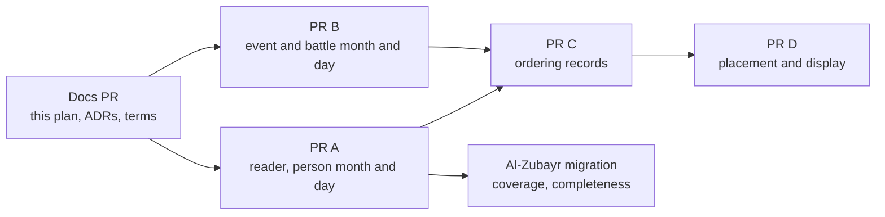

# Time layer: printed dates and relative order

Status: ready to implement. No blockers. The design decisions are in
[ADR 0027](../adr/0027-a-date-is-read-from-its-quote-and-the-number-is-checked.md) (how a
printed date is read and checked) and
[ADR 0028](../adr/0028-a-stated-ordering-is-recorded-and-its-placement-is-derived.md) (how
a stated ordering is recorded and an undated event is placed). Both ADRs are accepted on the owner's delegation, and the owner's comments on a pull
request amend them.

The Siyar plan lists every date sentence as not modeled until this layer exists
([siyar-parsing.md](siyar-parsing.md)), and `office` waits on it too
([ADR 0025](../adr/0025-title-status-and-office-are-separate-predicates.md), still
proposed, which this plan does not depend on). Terms are in
[CONTEXT.md](../../CONTEXT.md). [relative-event-dating.md](relative-event-dating.md) is
superseded and keeps only the problem statement.

## Agreed behavior and scope

Decided by the owner:

- The layer records dates the book prints and orders undated events relative to dated
  ones. It derives nothing: no age to year, no Hijri to Gregorian. A printed year stays
  as printed.
- An ordering constraint is its own cited record between two events, not part of a
  person's statement.
- Dates go down to year, month and day. Named eras and seasons are in scope.
- A person's dates (born, died, age at Islam) stay in the person's unit. Event and battle
  dates and ordering constraints stay in the catalog.
- A reader of Arabic number words and Hijri month names makes `model:check` fail when a
  stored `parsed` number differs from what its quote says.
- Competing dates stay as separate competing statements.

Decided in the ADRs:

- **The reader.** A registry maps each predicate that carries `parsed` to a reader.
  `model:check` fails a `parsed` whose predicate has no reader, so the next numeric
  predicate cannot skip the check. A `parsed` value always has spans
  (`src/lib/model/types.ts`), so the check sits where the spans are checked. A reader
  takes the one number phrase in the quote and ignores the other words, so the quote can
  be the natural clause (`أَسْلَمَ الزُّبَيْرُ ابْنُ ثَمَانِ سِنِيْنَ`). It reads units before
  tens (`ثمان وخمسين`), hundreds, Arabic-Indic digits and `قبل الهجرة بسنة` as -1, the
  sign convention in `src/lib/hijriYear.ts`.
- **What it will not read.** An indefinite count (`بضع وخمسون`), two number phrases in one
  quote (`ست أو سبع`), and any relative form other than before the hijra (`قبل المبعث
  بعشر سنين`, which would be a derivation) give no reading. The sentence is listed as not
  modeled with the tag `time-layer:unreadable`. A sentence that waits for a later part of
  this plan carries `time-layer:waiting`. The two tags replace the bare `time-layer` in
  `data/works/siyar-alam-al-nubala/summary.md`. Competing readings are authored only as
  separate statements.
- **Month and day.** New predicates `died.month`, `died.day`, `born.month`, `born.day`
  rest on the same statement as the year. A day needs a month on the same statement, and
  a month needs a year on the same statement. Competing parts sit on different
  statements. Only an explicit ordinal day or a number is read as a day. `لعشر خلون`,
  `لعشر بقين`, `النصف`, `أول` and `آخر` are `time-layer:unreadable`, because turning a
  count of nights into a day is a convention the reader would have to choose. Weekdays
  and time of day are not recorded.
- **Eras.** A named era (`عام الفيل`, `عام الفتح`) is a plain span with no computed year,
  and a predicate such as `born.era` is used only where the text says the person was born
  in it. `بعد عام الفيل` is an ordering statement and not an era. Seasons get no
  predicate until a real case appears.
- **Ordering.** A top-level catalog record, `CatalogOrdering { earlier, later, claims }`,
  with only `BEFORE` (`AFTER` is the same pair reversed). Two events in the same year do
  not contradict it. An offset (`بخمس عشرة سنة`) stays in the quote and is not computed.
  A cycle within one source is a data error. A cycle, or a contradiction with an event's
  year, across sources is a dispute: both are kept, the event is flagged order disputed,
  and it is left unplaced. The flag is computed from the records. It is not an assertion
  status.
- **Citing the Siyar from the catalog.** A `CatalogOrdering` may cite a batch claim key or
  a model span reference `unit#span`. `catalog:validate` resolves the span and fails when
  it does not exist. A cited span whose rendered text changes lapses the ordering's
  review: `catalog:validate` stores the rendered text of every cited span in the
  ordering's revision, the way a model assertion's revision hashes its spans, so a
  changed text changes the revision.
- **Placement.** A pure function places an undated event between the latest dated event it
  follows and the earliest dated event it precedes. The display names both premise
  events with their quotes, links them, marks the interval as derived and never as a
  date, and orders ties by slug. An undated event with no constraint stays last. There is
  no year zero, so the pre-hijra year -1 is followed by 1: an interval from -1 to 2 reads
  "from 1 BH to 2 AH" and each bound is formatted with `formatHijriYear`. An event whose
  `hijriYear` carries a disputed claim is not placed by that year, and its readings are
  listed.
- **No column added to a table the app already reads.** Prisma selects every column of a
  model, so a new column on `Event` or `Battle` breaks every query until the owner applies
  the migration. Month and day for events and battles go in a new table
  `catalog_date_parts (kind, slug, month, day)`, and orderings in `catalog_orderings`.
  The pages read them with the file or empty fallback that `src/lib/modelUnits.ts` uses
  when a table is missing, so a merge never waits for a migration.
- **`يوم X`.** Beside `شهد` or `حضر` it is participation evidence and carries no tag.
  Beside `قتل`, `مات`, `ولد` or `أسلم` it dates a person's own event by naming an event,
  and is tagged `time-layer:waiting`.

### Out of the first version

- Age against year consistency warnings: they compute a year from an age, and sources
  count years in different ways.
- A constraint between a person's own event and a catalog event, such as `أسلم قبل دخول
  دار الأرقم`.
- Gregorian years printed in the editor's footnotes. The legacy Gregorian catalog fields
  stay `legacy-unreviewed`.
- Reigns and offices as eras, and same-time markers (`فيها`, `ثم`).
- Day-of-month idioms, weekdays and time of day.

## Acceptance criteria

1. The reader gives these readings, and each is a test case: `سَنَةَ سِتٍّ وَثَلاَثِيْنَ`
   36; `ثَمَانَ عَشْرَةَ` 18; `ثمان وخمسين` 58; `أَرْبَعٌ وَسِتُّوْنَ` 64; `مِائَةٍ` 100;
   `مِائَتَيْنِ` 200; `وَمِائَةٍ وَعَشْرٍ` 110; `٣٦` 36; `قبل الهجرة بسنة` -1; `قبل الهجرة
   بثلاث سنين` -3. It gives no reading for `بِضْعٌ وَخَمْسُوْنَ`, for `ست أو سبع` and for
   `قبل المبعث بعشر سنين`.
2. `model:check` fails an assertion whose `parsed` differs from the reader's result, and
   fails one whose predicate has no reader.
3. The al-Zubayr unit holds `died.month` 7 (`رَجَبٍ`) beside `died.year` 36 on one
   statement and `model:check` passes. In `summary.md` the death month and year are listed
   as covered, and the competing death ages on p64 carry `time-layer:waiting`.
4. A `died.day` without a `died.month`, or a `died.month` without a `died.year`, on the
   same statement fails `model:check`.
5. The twelve Hijri months read to 1 through 12 including the alternate forms (`ذي
   الحجة`, `ربيع الآخر`, `ربيع الثاني`, `جمادى الآخرة`, `جمادى الثانية`), and a quote that
   names no month or two months gives no reading.
6. The day reader reads `13`, `الثالث عشر`, `العاشر` and `الحادي والعشرين`, and gives no
   reading for `لعشر خلون`, `لعشر بقين`, `النصف` and `أول`.
7. `CatalogEvent` and `CatalogBattle` accept `hijriMonth` and `hijriDay`, cited like
   `hijriYear`. `catalog:validate` rejects a month outside 1 to 12 and a day outside 1 to
   30 (no per-month limit, since the sources count the days of the month differently).
   `catalog:project` writes them to `catalog_date_parts`. No existing table gains a
   column.
8. A `CatalogOrdering` is rejected when it forms a cycle within one source, or cites a
   span that does not exist. Across sources a cycle or a contradiction with an event's
   year is kept and the event is flagged order disputed. Changing a cited span's text
   changes the ordering's revision.
9. The placement function puts an undated event in the right interval for a chain of
   undated events, an event with one bound, an event with none, a cycle, an interval
   crossing the hijra (-1 to 2 reads "from 1 BH to 2 AH"), a tie, and an event with a
   disputed year, which stays unplaced.
10. The timeline card of an undated event with a derived interval shows the interval text, a
    "derived" label and the premise event names, and no date. The event's own page shows the
    same with the two premise events as links. Pass condition: with an event that has two
    constraints, the card and the page show the interval text and the label, the page has two
    links, and neither shows a date.
11. The al-Zubayr entry's `يوم X` sentences, found by searching pages 41 to 67, are each
    classified under the verb rule in this plan, and `summary.md` lists the ones that are
    date expressions with `time-layer:waiting`. Participation ones carry no tag.
12. Decisions with no criterion of their own, on purpose: eras are plain spans, so
    `model:check` only requires that the span resolves; competing dates are separate
    statements, which the existing assertion rules already allow; weekdays and time of day
    are not recorded, so nothing reads them.

## Affected components

Verified:

| Component | Change |
| --- | --- |
| `src/lib/model/types.ts` | New predicates in `predicates`. |
| `src/lib/model/check.ts` (line 384) | The reader check and the same-statement rules replace the finiteness test. |
| `src/lib/model/diff.ts`, `profile.ts`, `project.ts`, `src/lib/modelView.ts` | Read and show month and day. |
| `src/lib/model/inference.ts`, `inference.test.ts` | Remove the `TIMELINE_BETWEEN` kind in PR C, since ADR 0028 replaces it. |
| `src/lib/hijriYear.ts` | Interval formatting across the hijra. |
| `src/lib/catalog/types.ts` | `hijriMonth`, `hijriDay` on `CatalogEventFields` and `CatalogBattleFields`; `CatalogOrdering`. |
| `src/lib/catalog/validateCatalog.ts` | Range, cycle, span and revision checks. |
| `prisma/schema.prisma`, `scripts/data/projectCatalog.ts` | Two new tables, `catalog_date_parts` and `catalog_orderings`. |
| `data/works/siyar-alam-al-nubala/units/siyar-v4-3-az-zubayr.json`, `summary.md` | The `p64` month; the two tags. |
| `docs/extraction-checklist.md` | A line on date shapes, so agents stop tagging readable dates. |
| `docs/plans/siyar-parsing.md`, `CONTEXT.md` ("Not modeled") | The two tags in place of `time-layer`. |

Proposed, not yet created: `src/lib/model/dateReader.ts` (number words, months, days and the
registry) and its test, `src/lib/placement.ts` beside `hijriYear.ts`, and its test.

Order: this docs PR, then A and B in either order, then C, then D. The al-Zubayr
migration (the coverage command and the completeness test from
[siyar-parsing.md](siyar-parsing.md)) follows A. The month and day fields stay empty until
a batch cites a month or day; PR B names the first batch that does.

## Validation

- `dateReader.test.ts` holds the table of criterion 1, 5 and 6 and the phrases of the
  al-Zubayr entry and three sampled entries (Abd al-Rahman ibn Awf, Sa'd ibn Abi Waqqas,
  Sa'id ibn Zayd), each with its expected number or no reading.
- `check.test.ts` for the registry rule and the same-statement rules.
- `validateCatalog` tests for ranges, cycles, span resolution, revision change and the
  dispute flag.
- `placement.test.ts` for the cases in criterion 9, including the interval across the
  hijra.
- A component test for the derived interval and its links (criterion 10).
- `npm run lint`, `npx tsc --noEmit`, `npm test`, `npm run model:check`, and
  `npm run model:diff -- az-zubayr-ibn-al-awwam`, whose output is clean when every line is
  `same`, `model-only`, or `different` with its reason recorded in `summary.md`.
- A visual check of the timeline on a profile and on the events page against the pass
  condition in criterion 10.

## Data and operational consequences

- PR B and PR C add tables, never columns on a table the app reads, so a merge does not
  wait for a migration. **The owner applies each migration** (`npx prisma migrate
  deploy`); until then the pages find no rows and show what they show today.
- After PR A, rebuild the model's read tables with `npm run model:project` run from the
  checkout that holds the change
  ([lesson 0009](../lessons/learning-records/0009-a-fix-in-the-code-does-not-fix-the-rows-built-before-it.md)).
  After PR B and PR C, run `catalog:project`. If orderings are written to Neo4j, rerun
  `npm run graph:layout`, dry run first.
- No existing value changes meaning.
- Until the al-Zubayr migration PR retags them, `summary.md` files written before this
  plan use the bare `time-layer`, which means `time-layer:waiting`.

## Open issues

No blockers.

Nonblocking:

- **Named eras as standing referents.** Whether `عام الفتح`, `عام الفيل` or `عام أذرح`
  names a catalog event is left to the owner, one name at a time. Nothing here depends on
  it.
- **Which batch fills the month and day fields**, named in PR B.
- **Seasons, weekdays, reigns, Gregorian footnotes** wait for a real case.
