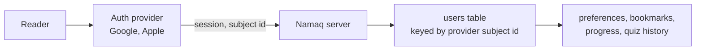

# User profiles and login: future plan

Status: not built. The database has a `User` and a `UserPreferences` model, and
nothing uses them: no session, no login screen, no provider. Reader settings and
the language and theme choices live in the browser only.

## Goal

Let a reader sign in to keep things across devices: reader settings, bookmarks
and reading progress ([book-reader-design.md](../book-reader-design.md) lists
both as missing), and quiz history ([quizzes.md](quizzes.md)). Sign-in stays
optional. Everything that works today keeps working without an account.

## Decision: use a provider, do not build auth

Passwords, sessions, account recovery and social login are easy to get wrong and
add nothing to a historical-learning app. Use a hosted provider. Sign in with
Google and Apple are both required.

Candidates to compare, in the order to look at them:

| Provider | Note |
| --- | --- |
| WorkOS AuthKit | Recalled as free up to 1M monthly active users. Verify the current free tier and its limits before relying on it. |
| Auth.js | Library, not a service: no vendor and no user cap, but sessions, provider setup and account linking are ours to run. |
| Clerk | Polished Next.js support and hosted UI, with a free tier and per-user pricing above it. |
| Supabase Auth | Fits if the database ever moves to Supabase; otherwise it adds a second backend. |
| Firebase Auth | Free social login at large scale, at the cost of a Google-owned dependency. |

Criteria to score each on:

- Google and Apple sign-in on the free tier.
- Next.js App Router support, with the session readable in server components and
  route handlers.
- What it costs after the free tier, and the cap on users.
- Whether user data can be exported, so leaving does not mean losing accounts.
- Arabic and right-to-left support in any hosted screens.
- Lock-in: how much of the app touches provider-specific calls.

## Shape of the integration

- Keep the `User` table as a mirror of the provider's user, keyed by the
  provider's stable subject id, not by email alone. Never store a password.
- Wrap the provider behind one small module, so a change of provider touches one
  file.
- Anonymous first: pages, the graph and solo quizzes need no account. A signed-in
  reader gains saved state. On first sign-in, offer to carry over the settings
  already in `localStorage`.
- Party games ([quizzes.md](quizzes.md)) allow a nickname without an account, and
  link the result to the account when there is one.

## Privacy

Accounts change what the app stores, so `src/app/privacy/page.tsx` and the
cookie banner change in the same PR as the feature: what is kept, why, how
to delete an account, and the contact route.

## Open questions

- Whether `UserPreferences.analyticsEnabled` and `cookieConsent` stay as fields
  or move, given they were written for analytics the app does not run.
- Whether a display name and avatar come from the provider or are chosen in the
  app.
- Account deletion: what happens to quiz history and party results.
- Rate limits and abuse controls on sign-in and on creating party rooms.

## Tests when built

Cover the session helper for signed-in and anonymous requests, the mirror write
on first sign-in, and the localStorage carry-over. Keep the provider behind a
fake in tests.
